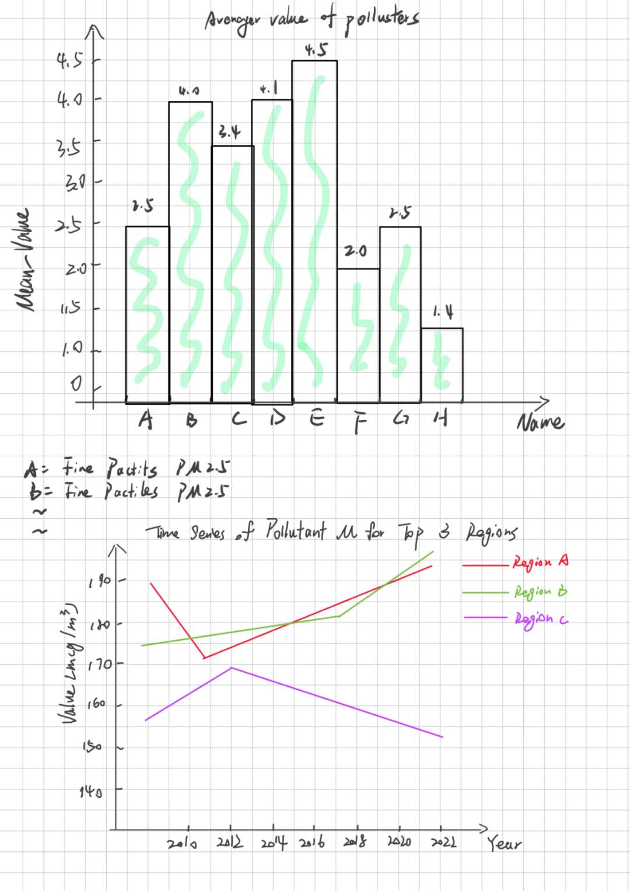

# General Topic

The dataset provides information on air quality surveillance in New York
City. Air pollution is a significant environmental threat to urban
populations. While everyone is exposed to air pollutants, the levels of
emissions, exposure, and population vulnerability differ across
neighborhoods. These indicators offer insights over time and across
NYC’s geographic areas, helping to better understand and characterize
the city’s air quality.

# The Dataset

The dataset is already available in the project folder under
“Air\_Quality.csv”. The
[Dataset](https://catalog.data.gov/dataset/air-quality/resource/f3ed1638-92da-4f88-bb6b-7d3940514574)
has been published by Department of Health and Mental Hygiene (DOHMH) on
the Open-Data. The dataset consists of csv/rdf/json/xml file with 12
attributes. Name/Geo Type Name/Start\_Date/Data Value are relevant for
my project. Under [landing
page](https://data.cityofnewyork.us/Environment/Air-Quality/c3uy-2p5r/about_data)
you can find more information.

# Manipulation Goals

The variety of data types can lead to a number of different analytical
directions, such as temporal changes of a pollutant in different
regions, or comparing mean values of different pollutants.

# Visualization Goals

I want to compare the mean values of different pollutants and give the
time variation of the pollutant with the highest pollution value in top3
regions. For the first task I would use a geom\_bar for comparison and
then a geom\_linie to analyze the second situation. 
