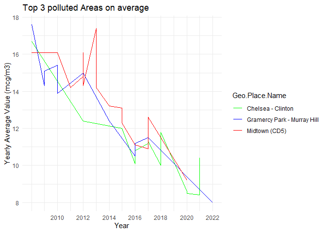

  

#### importing the data

    airquality <- read.csv("air_quality.csv")

------------------------------------------------------------------------

# Task 1

#### Grouping the different pollutants in “Name” and calculating the mean value for each one

     airquality %>%
      select(Name,Measure,Measure.Info,Data.Value)%>% 
      group_by(Name) %>%
      mutate(Measure.Info = gsub("\\?", "", Measure.Info)) %>%
    #joining the Name and Measure.Info columns to display the units  
      mutate(Name = paste(Name, Measure.Info, sep = " || ")) %>%         
    #using "summarise" instead of "mutate" here, so the values in the chart are displayed correctly.
      summarise(mean_value =as.numeric(round(mean(Data.Value, na.rm = TRUE), digits = 1))) %>% 
      ungroup() %>% 
       
    #Visualization of the Plot using "geom_bar()"
      
      ggplot(aes(x = Name, y = mean_value)) +
      geom_bar(stat = "identity") +         # adding "identity" so the graph displays at all
      labs(title = "Mean Value of Pollutants",y= "Mean Value", x= NULL) +
      geom_text(aes(label = mean_value, ), hjust = -0.5)+ 
      geom_segment(aes(x = 0.5, y = 0.5, xend = 0.5, yend = 125), arrow = arrow(length = unit(0.1, "inches")) ) +
      expand_limits(y = c(0, 120)) +              #adding a limit to the y axis so the text fits in
      coord_flip()                                # flipping the chart to fit in the names with the values

    - Since the Legend wouldn't build up like I intended to, I've decided to flip the chart in Order to make it more readable.

    - The units for each observation are displayed together with its Name and separated by "||".

------------------------------------------------------------------------

  

# Task 2

#### finding out which regions have the highest pollution on average for $\frac{\mu g}{m^3}$ measurements

    top3_pollution <- airquality %>% 
      arrange(Name, Geo.Place.Name, Start_Date, Time.Period) %>%
      filter(Measure.Info == "mcg/m3") %>% 
      group_by(Geo.Place.Name) %>%
      summarise(mean_value = mean(Data.Value, na.rm = TRUE)) %>%
      arrange(desc(mean_value)) %>% 
      head(3) %>%
      ungroup() %>% 
      print() 

    ## # A tibble: 3 × 2
    ##   Geo.Place.Name              mean_value
    ##   <chr>                            <dbl>
    ## 1 Midtown (CD5)                     13.1
    ## 2 Gramercy Park - Murray Hill       12.1
    ## 3 Chelsea - Clinton                 11.8

##### Results show that the top 3 regions with the highest pollution on average are:

-   Midtown (CD5)
-   Gramercy Park - Murray Hill
-   Chelsea - Clinton

### creating the time series for the top 3 areas mentioned above

    airquality %>% 
      filter(Measure.Info == "mcg/m3") %>% 
      inner_join(top3_pollution, by = c("Geo.Place.Name" = "Geo.Place.Name")) %>%
      
      mutate(year = as.numeric(format(as.Date(Start_Date, format="%d/%m/%Y"), "%Y"))) %>%
      arrange(year, Geo.Place.Name) %>% 
      group_by(Geo.Place.Name) %>%
      
      # time series visualization using "geom_line()"

    ggplot(aes(x = year, y = Data.Value, color = Geo.Place.Name)) +
      geom_line() +
      labs(title = "Top 3 polluted Areas on average", x = "Year", y = "Yearly Value (mcg/m3)") +
      theme_minimal() +
      scale_color_manual(values = c("Midtown (CD5)" = "red", "Gramercy Park - Murray Hill" = "blue", "Chelsea - Clinton" = "green")) +
      theme(legend.position = "right") +
      labs(color = "Regions") +
      scale_x_continuous(breaks = seq(2010, 2022, by = 2)) +
      scale_y_continuous(breaks = seq(0, 25, by = 2)) 

