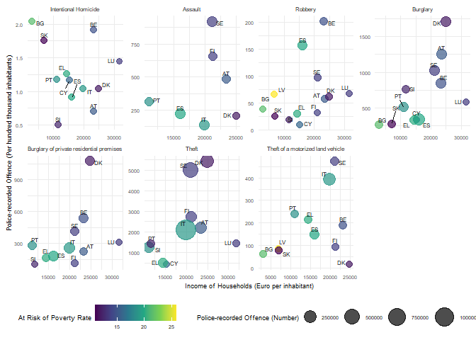

# Tim’s take on Yunji’s project

Installs pacman (“packagemanager”) if needed

    if (!require("pacman")) install.packages("pacman")

    ## Lade nötiges Paket: pacman

Use pacman to load add-on packages as desired

    pacman::p_load(pacman,
                   readr,
                   maps,
                   ggplot2,
                   dplyr,
                   viridis,
                   eurostat,
                   ggrepel,
                   tidyverse)

## Data

#### First, load the datasets

    Poverty_rate <- read_csv("At-risk-of-poverty rate.gz", show_col_types = FALSE, 
                             col_select = c("freq", "unit", "geo", "TIME_PERIOD", "OBS_VALUE"))

    Household_Income <- read_csv("Income of households.gz", show_col_types = FALSE, 
                                 col_select = c("freq", "unit", "direct", "na_item", "geo", "TIME_PERIOD", "OBS_VALUE"))

    Crime_data_1 <- read_csv("Crime_data_for_Task1.gz", show_col_types = FALSE, 
                             col_select = c("freq", "unit", "iccs", "geo", "TIME_PERIOD", "OBS_VALUE"))

    Crime_data_2 <- read_csv("Crime_data_for_Task2.gz", show_col_types = FALSE, 
                             col_select = c("freq", "unit", "iccs", "geo", "TIME_PERIOD", "OBS_VALUE"))

## Task 1

    #Only keep the data for 2019

    Crime_data_1.2 <- filter(Crime_data_1, TIME_PERIOD == "2019" )

#### Plotting

still under construction 🤔

## Task2

Splitting the unit variable by NR and P\_HTHAB. Creating a new data set
with the observed values from NR and P\_HTHAB in the same row, so we can
use for y the P\_HTHAB observed values and for the size the NR observed
value. (before I created this new data set, I tried using a ifelse
function for “y” and the “size” in the aes function, but it wasn’t
working. So, there is prob a more elegant way to do it :)

#### The Plot

I only did it for 2008

    ggplot(Crime_merged, 
           aes(x = Household_Income_EUR_HAB, 
               y = OBS_VALUE_P_HTHAB, 
               size = OBS_VALUE_NR, 
               color = Poverty_rate_PC)) +
      geom_point(alpha = 0.7) +
      geom_text_repel(aes(label = geo), vjust = 1.5, size = 2, color = "black") +
      scale_size_continuous(range = c(3, 10)) +
      scale_color_viridis_c() +
      facet_wrap(~iccs, scales = "free", ncol = 4, 
                 labeller = labeller(iccs = c(ICCS0101 = "Intentional Homicide", ICCS02011 = "Assault",
                                              ICCS0401 = "Robbery", ICCS0501 = "Burglary", 
                                              ICCS05012 = "Burglary of private residential premises",
                                              ICCS0502 = "Theft", 
                                              ICCS050211 = "Theft of a motorized land vehicle"))) +
      labs(x = "Income of Households (Euro per inhabitant)",
           y = "Police-recorded Offence (Per hundred thousand inhabitants)",
           size = "Police-recorded Offence (Number)",
           color = "At Risk of Poverty Rate") +
      theme_minimal() +
      theme(legend.position = "bottom", 
            strip.text = element_text(size = 6.3, margin = margin(0, 0, 5, 0)),
            #axis.text.x = element_text(angle = 45, hjust = 1))
            text = element_text(size = 7))

