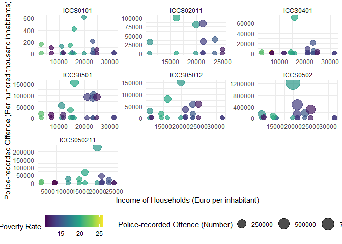

## Data

# First, load the datasets

    library(readr)
    Poverty_rate <- read_csv("At-risk-of-poverty rate.gz", show_col_types = FALSE, 
                             col_select = c("freq", "unit", "geo", "TIME_PERIOD", "OBS_VALUE"))

    Household_Income <- read_csv("Income of households.gz", show_col_types = FALSE, 
                                 col_select = c("freq", "unit", "direct", "na_item", "geo", "TIME_PERIOD", "OBS_VALUE"))

    Crime_data_1 <- read_csv("Crime_data_for_Task1.gz", show_col_types = FALSE, 
                             col_select = c("freq", "unit", "iccs", "geo", "TIME_PERIOD", "OBS_VALUE"))

    Crime_data_2 <- read_csv("Crime_data_for_Task2.gz", show_col_types = FALSE, 
                             col_select = c("freq", "unit", "iccs", "geo", "TIME_PERIOD", "OBS_VALUE"))

## Task 1

Only keep the data for 2019

    Crime_data_1.2 <- subset(Crime_data_1, TIME_PERIOD == "2019",
                             c("freq", "unit", "iccs", "geo", "TIME_PERIOD", "OBS_VALUE"))

Plotting

    library(maps)

    ## Warning: Paket 'maps' wurde unter R Version 4.3.2 erstellt

    library(viridis)

    ## Warning: Paket 'viridis' wurde unter R Version 4.3.2 erstellt

    ## Lade nötiges Paket: viridisLite

    ## 
    ## Attache Paket: 'viridis'

    ## Das folgende Objekt ist maskiert 'package:maps':
    ## 
    ##     unemp

    library(ggplot2)
    library(dplyr)

    ## 
    ## Attache Paket: 'dplyr'

    ## Die folgenden Objekte sind maskiert von 'package:stats':
    ## 
    ##     filter, lag

    ## Die folgenden Objekte sind maskiert von 'package:base':
    ## 
    ##     intersect, setdiff, setequal, union

    Ger <- map_data("world") |>  
      filter(region =="Germany")

    #ggplot() +
    #  geom_polygon(data = Ger, aes(x=long, y = lat, #group = group), fill="grey", alpha=0.3) +
    #  geom_point( data= Crime_data_1.2, aes(x=long, #y=lat, size= OBS_VALUE, color= OBS_VALUE)) +
    #  scale_size_continuous(range=c(1,12)) +
    #  scale_color_viridis(trans="log") +
    #  theme_void() + 
    #  ylim(50,59) + 
    #  coord_map() 

## Task2

lets only look at data from 2008

    Crime_data_2.1 <- subset(Crime_data_2, TIME_PERIOD == "2008",
                             c("freq", "unit", "iccs", "geo", "TIME_PERIOD", "OBS_VALUE"))
    Household_Income2 <-subset(Household_Income, TIME_PERIOD == "2008",
                             c("freq", "unit", "direct", "na_item", "geo", "TIME_PERIOD", "OBS_VALUE"))
    Poverty_rate2 <- subset(Poverty_rate, TIME_PERIOD == "2008",
                             c("freq", "unit", "geo", "TIME_PERIOD", "OBS_VALUE"))

merge the datasets together by countries

    Household_Income2$Household_Income_EUR_HAB <- Household_Income2$OBS_VALUE
    Household_Income2 <- subset(Household_Income2, 
                                select = - c(OBS_VALUE, freq, unit, direct, na_item, TIME_PERIOD))

    Poverty_rate2$Poverty_rate_PC <- Poverty_rate2$OBS_VALUE
    Poverty_rate2 <- subset(Poverty_rate2, 
                                select = - c(OBS_VALUE, freq, unit, TIME_PERIOD))

    Crime_data_finito <- merge(merge(Crime_data_2.1, Household_Income2, by = "geo", all = FALSE), 
                               Poverty_rate2, by = "geo", all = FALSE)

Trying to do the Plot

    ggplot(Crime_data_finito, 
           aes(x = Household_Income_EUR_HAB, y = OBS_VALUE, size = OBS_VALUE, color = Poverty_rate_PC)) +
      geom_point(alpha = 0.7) +
      scale_size_continuous(range = c(3, 10)) +
      scale_color_viridis_c() +
      facet_wrap(~iccs, scales = "free", ncol = 3) +
      labs(x = "Income of Households (Euro per inhabitant)",
           y = "Police-recorded Offence (Per hundred thousand inhabitants)",
           size = "Police-recorded Offence (Number)",
           color = "At Risk of Poverty Rate") +
      theme_minimal() +
      theme(legend.position = "bottom")

