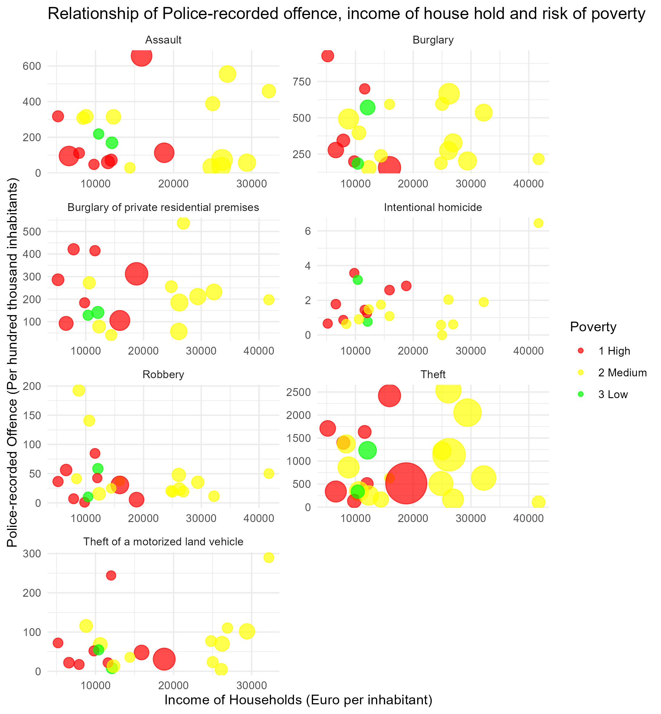
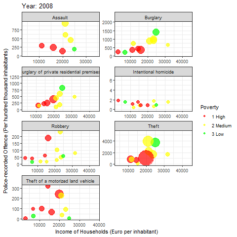

# Crime Project

## Task 1

*Plot a bubble map of Crime data for Task1 with ggplot 2 to visualize the number of Police-recorded offence in Germany. Use facet_wrap() to visualize all of the different crimes ( Intentional homicide, Assault, Robbery... Theft)*

I spent many hours on this task and finally decided to give up before I had a mental breakdown. Sorry! :D

```{r, include=TRUE, eval=FALSE}
libs <- c(
  "tidyverse", "sf", "classInt", 
  "cartogram", "rayshader",
  "giscoR", "eurostat", "knitr"
)
invisible(lapply(libs, library, character.only = T))

toc <- get_eurostat_toc()
kable(head(search_eurostat("Police-recorded offences by NUTS 3 regions")))

id <- search_eurostat("Police-recorded offences by NUTS 3 regions")$code[1]
print(id)

pop_df <- eurostat::get_eurostat(id,
                                 time_format = "num"
) |>
  dplyr::filter(
    grepl("DE", geo)
  ) |>
  dplyr::select(geo, values, unit, iccs)

names(pop_df)[1] <- "NUTS_ID"

deu_nuts3 <- giscoR::gisco_get_nuts(
  year = "2021",
  epsg = "4326",
  resolution = "3",
  nuts_level = "3",
  country = "DE"
)

df <- deu_nuts3 |>
  left_join(pop_df, by = "NUTS_ID")

vmin <- min(df$values, na.rm = T)
vmax <- max(df$values, na.rm = T)

# bins
brk <- round(classIntervals(df$values,
                            n = 6,
                            style = "equal"
)$brks, 0) |>
  head(-1) |>
  tail(-1) |>
  append(vmax)

# breaks
breaks <- c(vmin, brk)

deu_points <- df |>
  sf::st_centroid()

get_polygon <- function() {
  # st_area returns square meters so we get square km by dividing the result by 1000
  df$area_sqkm <- as.numeric(sf::st_area(df) / 1000000)
  
  deu_polygon <- df |>
    dplyr::mutate(pop_per_sqr_km = values / area_sqkm)
  
  return(deu_polygon)
}

deu_polygon <- get_polygon()

deu_coords <- deu_points |>
  dplyr::mutate(
    long = unlist(map(geometry, 1)),
    lat = unlist(map(geometry, 2))
  ) |>
  dplyr::select(NAME_LATN, long, lat, values) |>
  sf::st_drop_geometry() |>
  dplyr::as_tibble() |>
  dplyr::arrange(desc(values))

label_regions <- function() {
  ggrepel::geom_text_repel(deu_coords[1:5, ],
                           mapping = aes(x = long, y = lat, label = NAME_LATN),
                           colour = "grey20",
                           family = "Montserrat",
                           size = 20,
                           segment.colour = "grey20",
                           segment.alpha = .9,
                           segment.linetype = 3,
                           segment.size = .25,
                           nudge_x = .95,
                           nudge_y = .15,
                           direction = "x"
  )
}

make_point_map <- function() {
  p2 <-
    ggplot() +
    geom_sf(
      data = deu_polygon,
      fill = "transparent",
      color = "grey20",
      size = .1
    ) +
    geom_sf(
      data = deu_points,
      mapping = aes(
        size = values,
        geometry = geometry
      ), color = cols[5],
      alpha = .5
    ) +
    label_regions() +
    scale_size(
      breaks = breaks,
      range = c(1, 10),
      labels = round(breaks, 0),
      limits = c(vmin, vmax),
      name = ""
    ) +
    guides(
      color = "none",
      size = guide_legend(
        direction = "horizontal",
        title.position = "top",
        title.hjust = 0.5,
        label.hjust = 0,
        nrow = 1,
        byrow = F,
        reverse = F,
        label.position = "bottom"
      )
    ) +
    theme_for_the_win() +
    labs(
      y = "",
      subtitle = "",
      x = "",
      title = "",
      caption = ""
    )
  return(p2)
}

map2 <- make_point_map()

```


## Task 2

*Plot a bubble chart (with animation) to visualize the relationship of Police-recorded offence, income of house hold and at risk of poverty in each EU country. Use facet_wrap() to visualize all of the different crimes ( Intentional homicide, Assault, Robbery... Theft) If there is some data missing to plot a certain bubble, you can exclude it.*

After failing at task 1, however, I can present something for task 2, which I am very happy with.

```{r, include=FALSE, eval=TRUE}
library(tidyverse)

crimedata2 <- data.table::fread("Crime_data_for_Task2.gz")
incomedata <- data.table::fread("Income of households.gz")
povertydata <- data.table::fread("At-risk-of-poverty rate.gz")

# reshape crimedata2 because of unit and value
crimedata2_reshaped <- crimedata2 |> 
  select(c(unit, OBS_VALUE, geo, TIME_PERIOD, iccs)) |> 
  mutate(counter = ave(seq_along(unit), unit, FUN = seq_along)) |> 
  reshape(idvar = "counter", timevar = "unit", direction = "wide") |> 
  rename(crime_phthab = OBS_VALUE.P_HTHAB, 
         crime_nr = OBS_VALUE.NR,
         geo = geo.NR,
         TIME_PERIOD = TIME_PERIOD.NR,
         iccs = iccs.NR) |> 
  select(c( geo, crime_phthab, crime_nr, TIME_PERIOD, iccs))

data <- merge(merge(crimedata2_reshaped, 
  select(rename(incomedata, income = OBS_VALUE), geo, TIME_PERIOD, income), 
  by = c("geo", "TIME_PERIOD")), 
  select(rename(povertydata, poverty = OBS_VALUE), geo, TIME_PERIOD, poverty),
  by = c("geo", "TIME_PERIOD"))

str(data)
rm(list = setdiff(ls(), "data"))

data <- data |> 
  left_join(read.csv("https://pkgstore.datahub.io/core/country-list/data_csv/data/d7c9d7cfb42cb69f4422dec222dbbaa8/data_csv.csv"), by = c("geo" = "Code"))


crime_codes <- tibble(
  Codes = c("ICCS0101", "ICCS02011", "ICCS0401", "ICCS0501", "ICCS05012", 
            "ICCS0502", "ICCS050211"),
  Crimes = c("Intentional homicide", "Assault", "Robbery", "Burglary", 
             "Burglary of private residential premises", "Theft", 
             "Theft of a motorized land vehicle"))

data <- data |> 
  left_join(crime_codes, by = c("iccs" = "Codes"))

```


## Bubble Chart without animation:

```{r, include=TRUE, eval=FALSE}
# i do it for year 2020
library(ggplot2)

data |> filter(TIME_PERIOD == 2020) |> 
  mutate(poverty_category = case_when(
    poverty < 12 ~ "3 Low",
    poverty >= 12 & poverty < 18 ~ "2 Medium",
    poverty >= 18 ~ "1 High"
  )) |> 
  ggplot(aes(x = income, y = crime_phthab, size = crime_nr, color = poverty_category)) +
  geom_point(alpha = 0.7) +
  scale_size_continuous(range = c(3, 15), name = "Police-recorded Offence (Number)") + 
  scale_color_manual(name = "At Risk of Poverty Rate", values = c("3 Low" = "green", "2 Medium" = "yellow", "1 High" = "red")) +
  facet_wrap(~Crimes, scales = "free", ncol = 2) +
  labs(title = "Relationship of Police-recorded offence, income of house hold and risk of poverty",
       x = "Income of Households (Euro per inhabitant)",
       y = "Police-recorded Offence (Per hundred thousand inhabitants)") +
  theme_minimal() +
  guides(size = "none", color = guide_legend(title = "Poverty"))

```



## Bubble Chart with animation

```{r, include=TRUE, eval=FALSE}
library(gganimate)

animation <- data |> 
  mutate(poverty_category = case_when(
    poverty < 12 ~ "3 Low",
    poverty >= 12 & poverty < 18 ~ "2 Medium",
    poverty >= 18 ~ "1 High"
  )) |> 
  ggplot(aes(x = income, y = crime_phthab, size = crime_nr, color = poverty_category)) +
  geom_point(alpha = 0.7) +
  scale_size_continuous(range = c(3, 15), name = "Police-recorded Offence (Number)") + 
  scale_color_manual(name = "At Risk of Poverty Rate", values = c("3 Low" = "green", "2 Medium" = "yellow", "1 High" = "red")) +
  facet_wrap(~Crimes, scales = "free", ncol = 2) +
  theme_bw() +
  labs(title = "Year: {frame_time}",
       x = "Income of Households (Euro per inhabitant)",
       y = "Police-recorded Offence (Per hundred thousand inhabitants)") +
  guides(size = "none", color = guide_legend(title = "Poverty")) +
  transition_time(TIME_PERIOD) +
  ease_aes("linear")

# GIF speichern
anim_save("Projects/YunjiKang/plotTask2.gif", animation)
```




