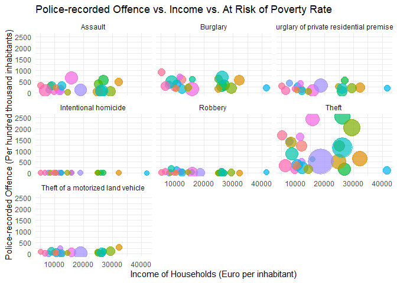

# Crime Project

## Task 1

*Plot a bubble map of Crime data for Task1 with ggplot 2 to visualize
the number of Police-recorded offence in Germany. Use facet\_wrap() to
visualize all of the different crimes ( Intentional homicide, Assault,
Robbery… Theft)*

    library(maps)
    library(tidyverse)

    ## ── Attaching core tidyverse packages ──────────────────────── tidyverse 2.0.0 ──
    ## ✔ dplyr     1.1.3     ✔ readr     2.1.4
    ## ✔ forcats   1.0.0     ✔ stringr   1.5.1
    ## ✔ ggplot2   3.4.4     ✔ tibble    3.2.1
    ## ✔ lubridate 1.9.3     ✔ tidyr     1.3.0
    ## ✔ purrr     1.0.2     
    ## ── Conflicts ────────────────────────────────────────── tidyverse_conflicts() ──
    ## ✖ dplyr::filter() masks stats::filter()
    ## ✖ dplyr::lag()    masks stats::lag()
    ## ✖ purrr::map()    masks maps::map()
    ## ℹ Use the conflicted package (<http://conflicted.r-lib.org/>) to force all conflicts to become errors

    crimedata1 <- data.table::fread("Crime_data_for_Task1.gz")

    ## Warning in grep(pattern, bfr, value = TRUE): unable to translate '
    ## Datentr<84>ger in Laufwerk C: ist Windows' to a wide string

    ## Warning in grep(pattern, bfr, value = TRUE): input string 1 is invalid

    ## Warning in grep(pattern, bfr, value = TRUE): unable to translate '
    ## Datentr<84>ger in Laufwerk C: ist Windows' to a wide string

    ## Warning in grep(pattern, bfr, value = TRUE): input string 1 is invalid

    ## Warning in grep(pattern, bfr, value = TRUE): unable to translate '
    ## Datentr<84>ger in Laufwerk C: ist Windows' to a wide string

    ## Warning in grep(pattern, bfr, value = TRUE): input string 1 is invalid

    Germany <- map_data("world", region = "Germany")

    # NUTS Data
    #shape <- sf::read_sf(dsn = "Projects/YunjiKang/", layer = "NUTS_LB_2021_3035")

    # Plotting (would probably work if i got the translation from NUTS to Coordinates)
    #ggplot() +
    #  geom_polygon(data = Germany, aes(x=long, y = lat, group = group), fill="grey", alpha=0.3) +
    #  geom_point( data=data, aes(x=long, y=lat)) +
    #  theme_void() + ylim(50,59) + coord_map() 

I really failed at this task. The challenge I can’t cope with is to
translate the names in the variable “geo” into coordinates using the
NUTS-3 system. I urgently need help with this. The code for the plot
should work in theory as soon as I have the coordinates.

## Task 2

*Plot a bubble chart (with animation) to visualize the relationship of
Police-recorded offence, income of house hold and at risk of poverty in
each EU country. Use facet\_wrap() to visualize all of the different
crimes ( Intentional homicide, Assault, Robbery… Theft) If there is some
data missing to plot a certain bubble, you can exclude it.*

### Preparation:

    # data
    rm(list = ls())
    crimedata2 <- data.table::fread("Crime_data_for_Task2.gz")
    incomedata <- data.table::fread("Income of households.gz")
    povertydata <- data.table::fread("At-risk-of-poverty rate.gz")

    # reshape crimedata2 because of unit and value
    crimedata2_reshaped <- crimedata2 |> 
      select(c(unit, OBS_VALUE, geo, TIME_PERIOD, iccs)) |> 
      mutate(counter = ave(seq_along(unit), unit, FUN = seq_along)) |> 
      reshape(idvar = "counter", timevar = "unit", direction = "wide") |> 
      rename(crime_phthab = OBS_VALUE.P_HTHAB, 
             crime_nr = OBS_VALUE.NR,
             geo = geo.NR,
             TIME_PERIOD = TIME_PERIOD.NR,
             iccs = iccs.NR) |> 
      select(c( geo, crime_phthab, crime_nr, TIME_PERIOD, iccs))

    data <- merge(merge(crimedata2_reshaped, 
      select(rename(incomedata, income = OBS_VALUE), geo, TIME_PERIOD, income), 
      by = c("geo", "TIME_PERIOD")), 
      select(rename(povertydata, poverty = OBS_VALUE), geo, TIME_PERIOD, poverty),
      by = c("geo", "TIME_PERIOD"))

    #str(data)
    rm(list = setdiff(ls(), "data"))

    data <- data %>% 
      mutate(geo = recode(geo,
                          "AT" = "Austria", "BE" = "Belgium", "BG" = "Bulgaria", 
                          "CY" = "Cyprus", "CZ" = "Czech Republic", "DE" = "Germany", 
                          "DK" = "Denmark", "EE" = "Estonia", "ES" = "Spain", 
                          "FI" = "Finland", "FR" = "France", "GR" = "Greece", 
                          "HR" = "Croatia", "HU" = "Hungary", "IE" = "Ireland", 
                          "IT" = "Italy", "LT" = "Lithuania", "LU" = "Luxembourg", 
                          "LV" = "Latvia", "MT" = "Malta", "NL" = "Netherlands", 
                          "PL" = "Poland", "PT" = "Portugal", "RO" = "Romania", 
                          "SE" = "Sweden", "SI" = "Slovenia", "SK" = "Slovakia"))

    data <- data %>% 
      mutate(iccs = recode(iccs,
                          "ICCS0101" = "Intentional homicide", "ICCS02011" = "Assault", 
                          "ICCS0401" = "Robbery ", "ICCS0501" = "Burglary", 
                          "ICCS05012" = "Burglary of private residential premises", "ICCS0502" = "Theft ",
                          "ICCS050211" = "Theft of a motorized land vehicle"
                          ))

The challenge here was the combination of the three data sets and the
so-called “reshaping” of the data from “Crime\_data\_for\_Task2.gz”.
That took me a lot of time. I hope I succeeded.

    head(data)

    ##        geo TIME_PERIOD crime_phthab crime_nr
    ## 1: Austria        2008         0.70       58
    ## 2: Austria        2008       455.23    40394
    ## 3: Austria        2008        51.62     4779
    ## 4: Austria        2008      1006.31   104126
    ## 5: Austria        2008       188.11    18454
    ## 6: Austria        2008      1715.97   183160
    ##                                        iccs income poverty
    ## 1:                     Intentional homicide  23400    15.2
    ## 2:                                  Assault  23400    15.2
    ## 3:                                 Robbery   23400    15.2
    ## 4:                                 Burglary  23400    15.2
    ## 5: Burglary of private residential premises  23400    15.2
    ## 6:                                   Theft   23400    15.2

### Plots:

Bubble Chart without animation:

    # i do it for year 2020
    library(ggplot2)

    data |> filter(TIME_PERIOD == 2020) |> 
      ggplot(aes(x = income, y = crime_phthab, size = crime_nr, color = as.factor(poverty))) +
      geom_point(alpha = 0.7) +
      scale_size_continuous(range = c(3, 15)) + 
      facet_wrap(~iccs) +
      labs(title = "Police-recorded Offence vs. Income vs. At Risk of Poverty Rate",
           x = "Income of Households (Euro per inhabitant)",
           y = "Police-recorded Offence (Per hundred thousand inhabitants)",
           size = "Police-recorded Offence (Number)",
           color = "At Risk of Poverty Rate") +
      theme_minimal() +
      guides(size = "none", color = "none")

Bubble Chart with animation (doesn’t work!)

    library(gganimate)

    # Make a ggplot, but add frame=year: one image per year
    #data |> ggplot(aes(x = income, y = crime_phthab, size = crime_nr, 
    #                   color = as.factor(poverty))) +
    #  geom_point() +
    #  scale_x_log10() +
    #  theme_bw() +
    #  # gganimate specific bits:
    #  labs(title = 'Year: {frame_time}', x = 'GDP per capita', y = 'life expectancy') +
    #  transition_time(TIME_PERIOD) +
    #  ease_aes('linear')

    # Save at gif:
    #anim_save("271-ggplot2-animated-gif-chart-with-gganimate1.gif")

    # "Error: The animation object does not specify a save_animation method"
    # This is a Error cause of package version (?)
