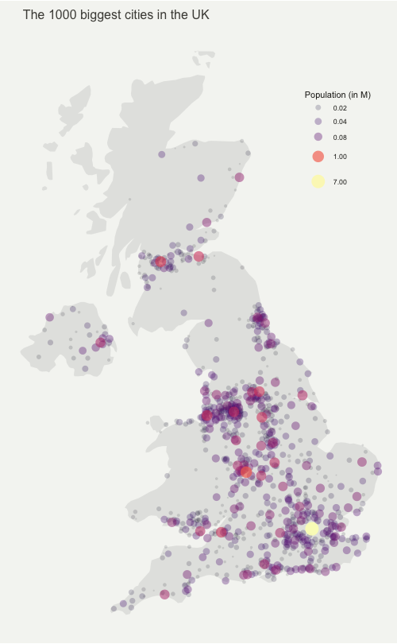
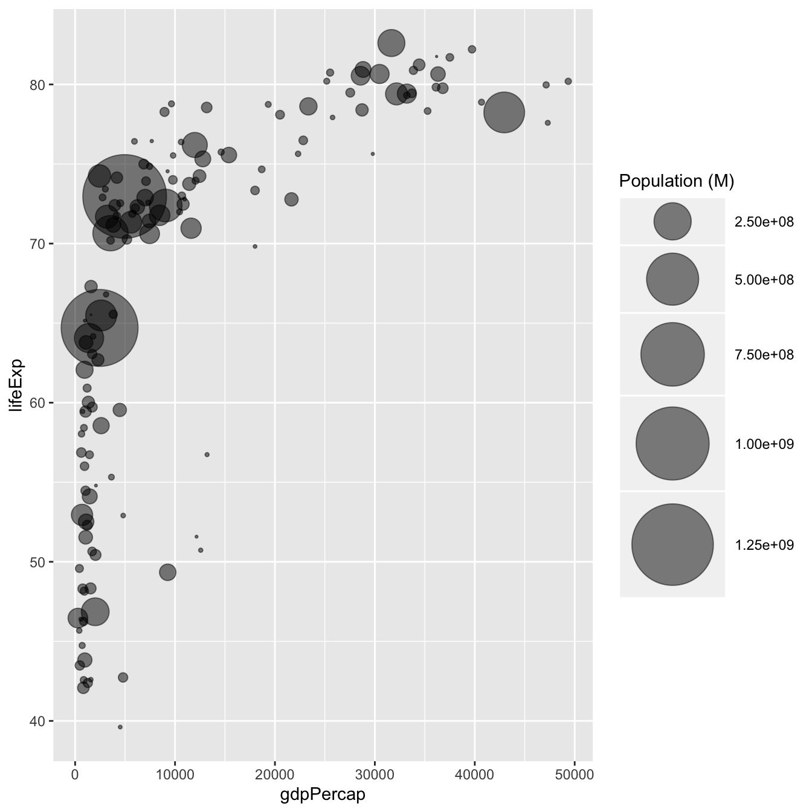

# Project description

## crime project

------------------------------------------------------------------------

In this project, we will look into the number of Police-recorded offences, Income of households, and at-risk-of-poverty rate by region and time. We will use bubble map and bubble graph for visualisation. All of the dataset are from Eurostat, which has various data on EU countries.

### Dataset

------------------------------------------------------------------------

[***[1] Police-recorded offences by NUTS 3 regions by age, sex and NUTS 2 region***](https://ec.europa.eu/eurostat/databrowser/view/crim_gen_reg/default/table?lang=en)

-   **file_name : Crime_data_for_Task1, Crime_data_for_Task2**

**Metadata**: <https://ec.europa.eu/eurostat/cache/metadata/en/crim_gen_reg_esms.htm>

**freg** : A = annual

**unit** : NR = number, P_HTHAB = per hundred thousand inhabitants

**iccs** (type of crime)

Intentional homicide = ICCS0101

Assault = ICCS02011

Robbery = ICCS0401

Burglary = ICCS0501

Burglary of private residential premises = ICCS05012

Theft = ICCS0502

Theft of a motorized land vehicle = ICCS050211

**geo** (code of the location according to NUTS)

[***[2] Income of households by NUTS 2 regions***](https://ec.europa.eu/eurostat/databrowser/view/nama_10r_2hhinc/default/table?lang=en)

-   **file_name : Income of households**

    **unit**: Euro per inhabitant

[***[3] At-risk-of-poverty rate by NUTS regions***](https://ec.europa.eu/eurostat/databrowser/view/ilc_li41/default/table?lang=en)

-   **file_name : At-risk-of-poverty rate**

    **unit** : PC = percentage

### Task 1

------------------------------------------------------------------------

Plot **a bubble map of Crime data for Task1** with ggplot 2 to visualize the number of Police-recorded offence in Germany. Use facet_wrap() to visualize all of the different crimes ( Intentional homicide, Assault, Robbery... Theft)

***bubble map : <https://r-graph-gallery.com/330-bubble-map-with-ggplot2.html>***

Other links that could be helpful(?)

<https://search.r-project.org/CRAN/refmans/R2BayesX/html/GermanyBnd.html>

<https://www.tillt.net/post/2016-10-31-r-plotting-germany-map-with-ggplot2/>

-   Each points : NUTS3 regions of Germany

    -   Information about NUTS

        <https://www.destatis.de/Europa/EN/Methods/Classifications/OverviewClassification_NUTS.html> <https://en.wikipedia.org/wiki/NUTS_statistical_regions_of_Germany>

    -   [For bubble map] you can down load the geographic cordination of NUT3 here: <https://gdz.bkg.bund.de/index.php/default/digitale-geodaten/verwaltungsgebiete/nuts-gebiete-1-5-000-000-stand-31-12-nuts5000-31-12.html>

-   size: Police-recorded offence *(unit : Per hundred thousand inhabitants)*

-   color: Police-recorded offence *(unit Number)*

-   time : 2019

*-You can see data in different units by changing Unit of measure section.*

*-You can see different types of offence by changing International classification of crime for statistical purposes.*

*-If this is too easy for you, add an animation according to the years(Markdown output does not support interactive/animated graphics formats like SVG or GIF, so HTML output might be necessary for the animated/interactive components this task) Image example*

### Task 2

------------------------------------------------------------------------

Plot **a bubble chart (with animation)** to visualize the relationship of Police-recorded offence, income of house hold and at risk of poverty in each EU country. Use facet_wrap() to visualize all of the different crimes ( Intentional homicide, Assault, Robbery... Theft) If there is some data missing to plot a certain bubble, you can exclude it.

***bubble chart: <https://r-graph-gallery.com/bubble-chart.html>***

***animation: <https://r-graph-gallery.com/271-ggplot2-animated-gif-chart-with-gganimate.html>***

-   Each points : EU country ( you can find which code means which country [here](https://en.wikipedia.org/wiki/Nomenclature_of_Territorial_Units_for_Statistics))

-   x : Income of households (unit: Euro per inhabitant, **Data : Income of households**)

-   y : Police-recorded offence (unit : Per hundred thousand inhabitants, **Data: Crime_data_for_Task 2**)

-   size : Police-recorded offence (unit: Number, **Data: Crime_data_for_Task 2**)

-   color : At risk of poverty rate ()

-   animation : earliset year possible to latest

*-Use text label (or interactive components) to distinguish the countries of each bubbles.*

*-You can see data in different years by changing time section. You can see different types of offence by changing International classification of crime for statistical purposes.*

*-If this is too easy for you, add an interactive component to each bubbles(Markdown output does not support interactive/animated graphics formats like SVG or GIF, so HTML output might be necessary for the animated/interactive components this task)*

## Send me an email when you need something :)

