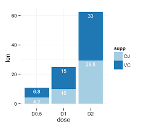

```{r raw_data}
raw_data <- readr::read_csv("project data.csv", show_col_types = FALSE)

ggplot(data=animal_data, mapping = aes (x=Common name of species, y=Average relative change in abundance)) + 
geom_point ("grey", scale_y_continuous(breaks=c(1%, 10%, 100%, 1000%, 10000%))) 
```


# introduction of data base and project 
The data base is collected through a phone survey, of over 1,500 high school students aged 14 to 18 in Ecuador to learn how students spend their time during the period of quarantine resulting from Covid-19, examine their access to remote learning, and measure their mental health status.The informations can be found on the website
https://microdata.worldbank.org/index.php/catalog/3772/study-description 
and you can also find the explanation of the data on this website.

In this project, I would like to create a plot to describe the time spent on housework and the access to electric devices of the students.

# Data explanation
I will focus on the data collected from the questions of P4 and S8 in the questionnaire.(whic you can also find in the website)

P4: Which of the following do you have in your home? 

1.	A computer or tablet? 1 = Yes 

2.	Internet connection? 1 = Yes 

3.	Smartphone (WhatsApp) 1 = Yes 

4.	Television 1 = Yes 

5.	Radio 1=Yes 2=No

I will only include the first three options in the plot, i.e. the access to computer/tablet, internet and smartphone 

The meaning of the answers in the csv datei:

* P4_1: Do you have a computer/tablet at home?

“1” means “yes” and “2” means “no”

* P4_2: Do you have internet connection at home?

“1” means “yes” and “2” means “no”

* P4_3: Do you have a smartphone at home?

“1” means “yes” and “2” means “no”

* S8. How long did you study/do homework yesterday [if it is Monday, the past Friday] _____hours _______ minutes 

The meaning of the answers:

* S8_1: The hours they spent on the homework

* S8_2: The minutes they spent on the homework

The data of S8B_1 won’t be included

PS: In some questionnaires these questions are not answered (i.e. blamk in the data set). In this case, we can delete these rows. 

# Design of the plot
I would like to create a plot with bars. 

* x-axis: the time spent on homework

* y-axis: the number of students who spend a certain amount of time on homework

* the color of the bars: the access to electric devices. 

There will be four colors representing the following four situations:

1. have all three of them: computer/tablet, internet and smartphone

2. have computer/tablet/smart phone but no internet

3. have internet but no computer/tablet/smart phone

4. have none of them 

I would also like to label the concrete numbers on the bar

# Data preparation
In order to create the plot, we may need to figure out the the time for homework, the access to internet and devices and the amount of students in the according situations. 

Based on the existing data set we may creat a new csv datei with three columns:

1. the time spent on homework

2. the number of the students

3. the access to internet and devices


# possible result of the visualization

```{r images,echo=FALSE}

``` 


# Alternative
If you find it too complicated to deal with the data, you can reduce the third column into only two situations instead of four, i.e.:

1. students who have internet/tablet/smart phone and internet

2. students who don't have internet


