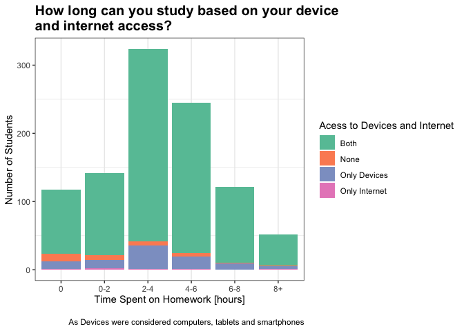

## Data Transformation

    final_df <- 
    df %>%
      select(P4_1, P4_2, P4_3, S8_1, S8_2) %>%
      drop_na() %>%
      mutate(time_spent = S8_1 * 60 + S8_2) %>%
      mutate(time_spent = as.numeric(time_spent)) %>%
      select(-(S8_1:S8_2)) %>% 
      mutate( code_type =  str_c(P4_1, P4_2, P4_3, sep="_")) %>%
      mutate(type_of_four = case_when(
                 code_type == "1_1_1" ~ "Both",
                 code_type == "1_2_1" ~ "Only Devices",
                 code_type == "2_1_2" ~ "Only Internet",
                 code_type == "2_2_2" ~ "None",
               )) %>%
      mutate(time_group = case_when(
                 time_spent == 0 ~ "0",
                 time_spent <= 120 ~ "0-2",
                 time_spent <= 240 ~ "2-4",
                 time_spent <= 360 ~ "4-6",
                 time_spent <= 480 ~ "6-8",
                 TRUE ~ "8+",
               )) %>%
      drop_na() 

## The Plot

