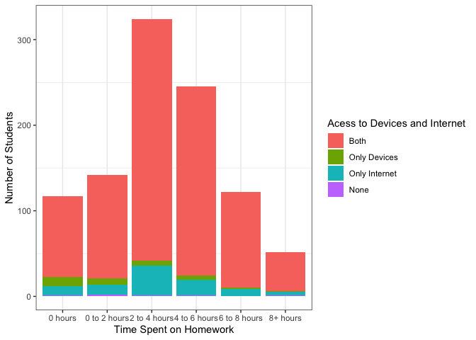

    ## ── Attaching packages ─────────────────────────────────────── tidyverse 1.3.2 ──
    ## ✔ ggplot2 3.3.6      ✔ dplyr   1.0.10
    ## ✔ tibble  3.1.8      ✔ stringr 1.4.1 
    ## ✔ tidyr   1.2.1      ✔ forcats 0.5.2 
    ## ✔ purrr   0.3.5      
    ## ── Conflicts ────────────────────────────────────────── tidyverse_conflicts() ──
    ## ✖ dplyr::filter() masks stats::filter()
    ## ✖ dplyr::lag()    masks stats::lag()
    ## 
    ## Attaching package: 'scales'
    ## 
    ## 
    ## The following object is masked from 'package:purrr':
    ## 
    ##     discard
    ## 
    ## 
    ## The following object is masked from 'package:readr':
    ## 
    ##     col_factor

    ## Warning: One or more parsing issues, call `problems()` on your data frame for details,
    ## e.g.:
    ##   dat <- vroom(...)
    ##   problems(dat)

    ## Rows: 2412 Columns: 318
    ## ── Column specification ────────────────────────────────────────────────────────
    ## Delimiter: ","
    ## chr  (31): startdate, datestamp, A1_other, A2, P3B, S1B_11_3, S1B_13_3, S1B_...
    ## dbl (235): id, A1, A3, A4, P1, P2, P3, P4_1, P4_2, P4_3, P4_4, P4_5, P6, S1_...
    ## lgl  (52): A1B_1, A1B_2, S1_1_2, S1_1_3, S1_2_2, S1_2_3, S1_3_2, S1_3_3, S1_...
    ## 
    ## ℹ Use `spec()` to retrieve the full column specification for this data.
    ## ℹ Specify the column types or set `show_col_types = FALSE` to quiet this message.

