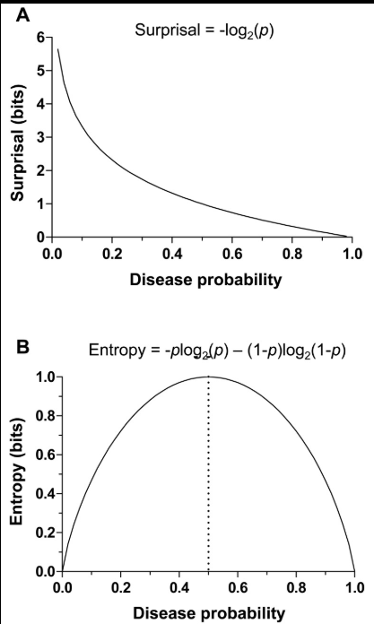
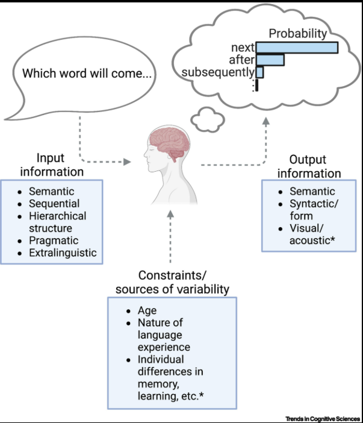
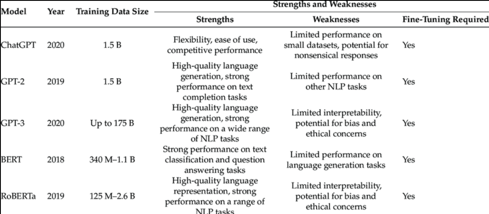

# Project Description

## 1. Background

Recent research in psycholinguistics suggests that language
comprehension is strongly influenced by **prediction**. When reading or
listening to a sentence, humans continuously generate expectations about
upcoming words.

A key concept used to model this process is **surprisal**. Surprisal
measures how unexpected a word is given its context. It is defined as:

*S**u**r**p**r**i**s**a**l* = −*l**o**g*(*P*(*w**o**r**d*|*c**o**n**t**e**x**t*))

<figure>

<figcaption aria-hidden="true">Surprisal concept</figcaption>
</figure>

This means that words that are highly predictable have **low
surprisal**, while unexpected words have **high surprisal**.

The surprisal theory of sentence processing was formalized by Levy
(2008), who proposed that the difficulty of processing a word in a
sentence is proportional to its surprisal value. Later work by Smith &
Levy (2013) further demonstrated that reading time increases linearly
with surprisal.

<figure>

<figcaption aria-hidden="true">Predictive processing</figcaption>
</figure>

In recent years, **Large Language Models (LLMs)** such as GPT models
have become powerful tools for generating language. However, it is still
an open research question whether the statistical properties of language
generated by LLMs resemble those of human language production.

<figure>

<figcaption aria-hidden="true">GPT vs human</figcaption>
</figure>

This project explores this question by comparing **surprisal values of
human-generated and LLM-generated sentence continuations under
controlled contexts.**

------------------------------------------------------------------------

## 2. Research Question

The main research question of this project is:

**Do human speakers and Large Language Models generate language with
similar surprisal patterns under the same contextual conditions?**

More specifically, the project investigates:

-   whether different generators (human vs LLMs) produce different
    surprisal values
-   how surprisal values change across different contextual conditions
-   whether LLM-generated continuations resemble human language in terms
    of predictability

------------------------------------------------------------------------

## 3. Dataset

The dataset used in this project was collected in the course
**“Verarbeitung kreativer Sprache mit ChatGPT”** in the previous
semester.

The data contains sentence continuations generated by:

-   GPT-3.5-turbo-16k (under 3 different generate conditions)
-   GPT-5.2-chat-latest (under 3 different generate conditions)
-   4 Human participants

For this project there is in total 10 generators (2 LLMs both with 3
conditions each + 4 humans) and 34 items(contexts x conditions).

Each continuation was produced under specific **context conditions**,
designed to manipulate the predictability of upcoming words.

After the continuations were generated, **surprisal values were computed
for each continuation using language models.**

The dataset includes several CSV files containing surprisal values for
different generators.

Example files: - 3.5\_T1S0\_surprisal.csv - 3.5\_T1S1\_surprisal.csv -
5.2\_T1S0\_surprisal.csv - HumanI\_surprisal.csv -
HumanII\_surprisal.csv

These files contain surprisal values for individual **items**,
**conditions**, and **generators**.

Example structure of the dataset:

<table>
<thead>
<tr>
<th>item</th>
<th>context</th>
<th>condition</th>
<th>generator</th>
<th>surprisal</th>
</tr>
</thead>
<tbody>
<tr>
<td>1</td>
<td>high</td>
<td>RA</td>
<td>GPT-3.5</td>
<td>6.32</td>
</tr>
<tr>
<td>2</td>
<td>high</td>
<td>EW</td>
<td>human</td>
<td>5.12</td>
</tr>
<tr>
<td>3</td>
<td>medium</td>
<td>OH</td>
<td>GPT-5.2</td>
<td>7.41</td>
</tr>
</tbody>
</table>

------------------------------------------------------------------------

## 4. Data Processing Plan

Before the analysis, the dataset will be cleaned and standardized.

The main preprocessing steps include:

### 1. Handling missing data

Some items may contain missing surprisal values.  
These items will be removed to ensure that each generator is compared
under the same conditions.

### 2. Aggregating surprisal values

For each generator (human or LLM), the **mean surprisal value per
subject and condition** will be calculated.

This step ensures that the analysis is based on comparable aggregated
statistics.

Example R workflow:

    library(dplyr)

    data_clean <- data %>%
      filter(!is.na(surprisal)) %>%
      group_by(generator, subject, condition) %>%
      summarise(mean_surprisal = mean(surprisal))

## 5. Visualization Plan

To compare surprisal patterns across generators, the results will be
visualized using line plots.

The visualization will show:

x-axis: context condition

y-axis: mean surprisal value

lines: different generators (human vs LLMs)

Example visualization:

    library(ggplot2)

    ggplot(data_clean, aes(x = condition, y = mean_surprisal, color = generator)) +
      stat_summary(fun = mean, geom = "line") +
      stat_summary(fun = mean, geom = "point") +
      theme_minimal()

This plot will allow us to observe whether human-generated language and
LLM-generated language show similar or different surprisal patterns
across contexts.

## 6. Expected Contribution

This project contributes to the comparison between human language
production and machine-generated language from an information-theoretic
perspective.

By analyzing surprisal values across different generators, the project
aims to provide insights into whether LLMs produce language with
statistical properties similar to human language.

Such comparisons are relevant both for psycholinguistics and for
evaluating the linguistic realism of modern language models.

## References

Levy, R. (2008). Expectation-based syntactic comprehension. Cognition,
106(3), 1126–1177.

Smith, N. J., & Levy, R. (2013). The effect of word predictability on
reading time is logarithmic. Cognition, 128(3), 302–319.

Lu, Jeuring, Gatt (2025). Evaluating LLM-Generated Versus Human-Authored
Responses in Role-Play Dialogues.
