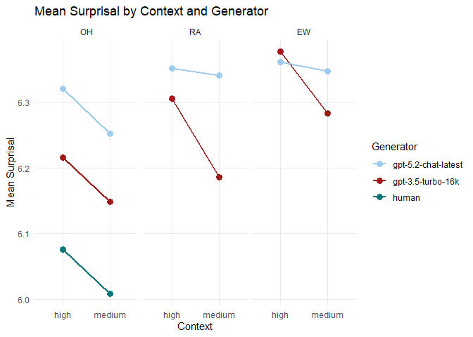
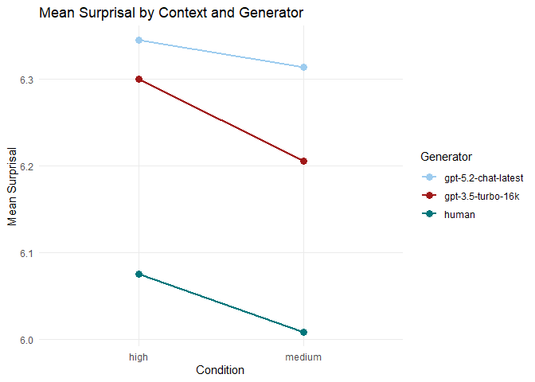
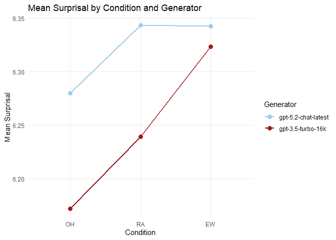

## Project Solution for: Surprisal-Based Comparison of Human and LLM Language Generation

By Jakob

#### Loading the data set and checking the first few rows

<table style="width:100%;">
<colgroup>
<col style="width: 11%" />
<col style="width: 7%" />
<col style="width: 14%" />
<col style="width: 25%" />
<col style="width: 11%" />
<col style="width: 14%" />
<col style="width: 15%" />
</colgroup>
<thead>
<tr>
<th style="text-align: left;">subject</th>
<th style="text-align: right;">item</th>
<th style="text-align: right;">surprisal</th>
<th style="text-align: left;">generator</th>
<th style="text-align: left;">context</th>
<th style="text-align: left;">condition</th>
<th style="text-align: right;">subject_id</th>
</tr>
</thead>
<tbody>
<tr>
<td style="text-align: left;">3.5T1S0</td>
<td style="text-align: right;">1</td>
<td style="text-align: right;">6.051825</td>
<td style="text-align: left;">gpt-3.5-turbo-16k</td>
<td style="text-align: left;">high</td>
<td style="text-align: left;">RA</td>
<td style="text-align: right;">1</td>
</tr>
<tr>
<td style="text-align: left;">3.5T1S0</td>
<td style="text-align: right;">1</td>
<td style="text-align: right;">5.945893</td>
<td style="text-align: left;">gpt-3.5-turbo-16k</td>
<td style="text-align: left;">high</td>
<td style="text-align: left;">EW</td>
<td style="text-align: right;">1</td>
</tr>
<tr>
<td style="text-align: left;">3.5T1S0</td>
<td style="text-align: right;">1</td>
<td style="text-align: right;">5.852230</td>
<td style="text-align: left;">gpt-3.5-turbo-16k</td>
<td style="text-align: left;">high</td>
<td style="text-align: left;">OH</td>
<td style="text-align: right;">1</td>
</tr>
<tr>
<td style="text-align: left;">3.5T1S0</td>
<td style="text-align: right;">1</td>
<td style="text-align: right;">5.793107</td>
<td style="text-align: left;">gpt-3.5-turbo-16k</td>
<td style="text-align: left;">medium</td>
<td style="text-align: left;">RA</td>
<td style="text-align: right;">1</td>
</tr>
<tr>
<td style="text-align: left;">3.5T1S0</td>
<td style="text-align: right;">1</td>
<td style="text-align: right;">5.919891</td>
<td style="text-align: left;">gpt-3.5-turbo-16k</td>
<td style="text-align: left;">medium</td>
<td style="text-align: left;">EW</td>
<td style="text-align: right;">1</td>
</tr>
<tr>
<td style="text-align: left;">3.5T1S0</td>
<td style="text-align: right;">1</td>
<td style="text-align: right;">5.985550</td>
<td style="text-align: left;">gpt-3.5-turbo-16k</td>
<td style="text-align: left;">medium</td>
<td style="text-align: left;">OH</td>
<td style="text-align: right;">1</td>
</tr>
</tbody>
</table>

## Data Visualizations

As dependent variable we use the mean surprisal value, which is
aggregated by generator and context/condition. To compare surprisal
patterns across generators, the results will be visualized using line
plots.

For the visualizations including human participants (I & II), Items 13 &
28 have been removed, for the visualization comparing only LLMs (II),
all items are included.

### Visualization I

**Interpretation:**

### Visualization II

**Interpretation:**

In a highly predictable preceeding context the mean surprisal value of
the two GPT generators is closest and both have a considerable
difference to the human participants, who in general have lower
surprisal values. In a medium predictable preceeding context, the GPT
3.5 still is closer to the GPT 5.2, but its surprisal value approaches
more that of the human participants.

### Visualization III

**Interpretation:**

The difference between both GPT generators is highest in the OH
condition (when no specific particles are present?). I would conclude
from this that when no specific particles are present, the two models
are less specificly trained and therefore less restricted in their
generation leading to the largest differences in output.
