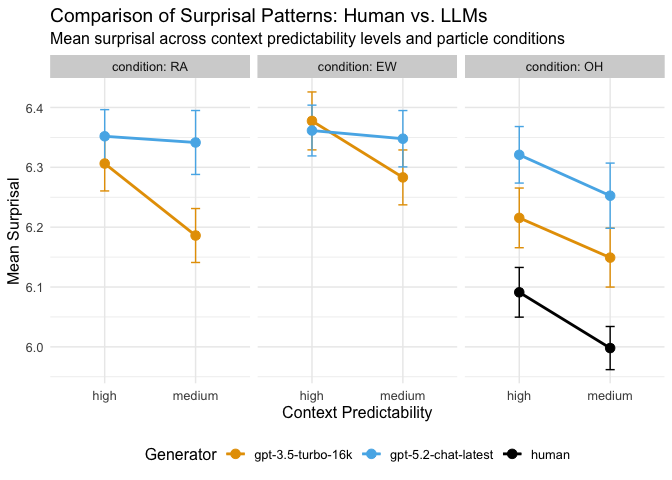
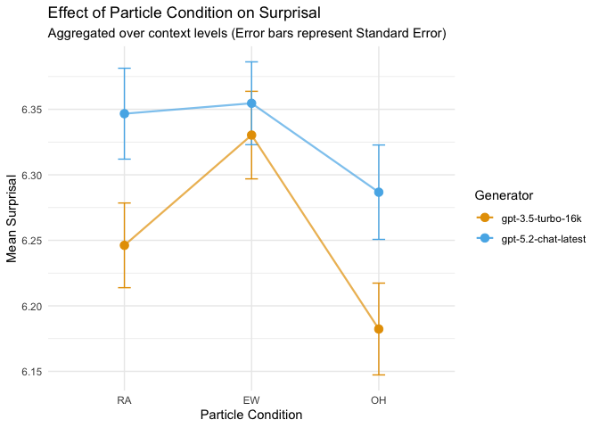

# Surprisal-Based Comparison of Human and LLM Language Generation

## Research Question

The main research question of this project is:

Do human speakers and Large Language Models generate language with
similar surprisal patterns under the same contextual conditions?

More specifically, the project investigates:

whether different generators (human vs LLMs) produce different surprisal
values how surprisal values change across different contextual
conditions whether LLM-generated continuations resemble human language
in terms of predictability

## 3. Dataset

<table style="width:100%;">
<caption>Preview of Raw Data</caption>
<colgroup>
<col style="width: 11%" />
<col style="width: 7%" />
<col style="width: 14%" />
<col style="width: 25%" />
<col style="width: 11%" />
<col style="width: 14%" />
<col style="width: 15%" />
</colgroup>
<thead>
<tr>
<th style="text-align: left;">subject</th>
<th style="text-align: right;">item</th>
<th style="text-align: right;">surprisal</th>
<th style="text-align: left;">generator</th>
<th style="text-align: left;">context</th>
<th style="text-align: left;">condition</th>
<th style="text-align: right;">subject_id</th>
</tr>
</thead>
<tbody>
<tr>
<td style="text-align: left;">3.5T1S0</td>
<td style="text-align: right;">1</td>
<td style="text-align: right;">6.051825</td>
<td style="text-align: left;">gpt-3.5-turbo-16k</td>
<td style="text-align: left;">high</td>
<td style="text-align: left;">RA</td>
<td style="text-align: right;">1</td>
</tr>
<tr>
<td style="text-align: left;">3.5T1S0</td>
<td style="text-align: right;">1</td>
<td style="text-align: right;">5.945893</td>
<td style="text-align: left;">gpt-3.5-turbo-16k</td>
<td style="text-align: left;">high</td>
<td style="text-align: left;">EW</td>
<td style="text-align: right;">1</td>
</tr>
<tr>
<td style="text-align: left;">3.5T1S0</td>
<td style="text-align: right;">1</td>
<td style="text-align: right;">5.852230</td>
<td style="text-align: left;">gpt-3.5-turbo-16k</td>
<td style="text-align: left;">high</td>
<td style="text-align: left;">OH</td>
<td style="text-align: right;">1</td>
</tr>
<tr>
<td style="text-align: left;">3.5T1S0</td>
<td style="text-align: right;">1</td>
<td style="text-align: right;">5.793107</td>
<td style="text-align: left;">gpt-3.5-turbo-16k</td>
<td style="text-align: left;">medium</td>
<td style="text-align: left;">RA</td>
<td style="text-align: right;">1</td>
</tr>
<tr>
<td style="text-align: left;">3.5T1S0</td>
<td style="text-align: right;">1</td>
<td style="text-align: right;">5.919891</td>
<td style="text-align: left;">gpt-3.5-turbo-16k</td>
<td style="text-align: left;">medium</td>
<td style="text-align: left;">EW</td>
<td style="text-align: right;">1</td>
</tr>
<tr>
<td style="text-align: left;">3.5T1S0</td>
<td style="text-align: right;">1</td>
<td style="text-align: right;">5.985550</td>
<td style="text-align: left;">gpt-3.5-turbo-16k</td>
<td style="text-align: left;">medium</td>
<td style="text-align: left;">OH</td>
<td style="text-align: right;">1</td>
</tr>
</tbody>
</table>

## 4. Data Processing Plan

Before the analysis, the dataset will be cleaned and standardized.

### 4.1 Handling missing data

It is evident that the human participants were only tasked with
formulating responses to the 34 items. Consequently, in order to
facilitate a more robust comparison between human performance and that
of LLMs, it is recommended that the values for items 13 and 28 be
removed from the analysis.

### 4.2 Aggregating surprisal values

For each generator (human or LLM), the **mean surprisal value per
subject and condition** will be calculated.

<table>
<caption>Aggregated Surprisal Values</caption>
<colgroup>
<col style="width: 23%" />
<col style="width: 10%" />
<col style="width: 12%" />
<col style="width: 19%" />
<col style="width: 16%" />
<col style="width: 5%" />
<col style="width: 12%" />
</colgroup>
<thead>
<tr>
<th style="text-align: left;">generator</th>
<th style="text-align: left;">context</th>
<th style="text-align: left;">condition</th>
<th style="text-align: right;">mean_surprisal</th>
<th style="text-align: right;">sd_surprisal</th>
<th style="text-align: right;">n</th>
<th style="text-align: right;">se</th>
</tr>
</thead>
<tbody>
<tr>
<td style="text-align: left;">gpt-3.5-turbo-16k</td>
<td style="text-align: left;">high</td>
<td style="text-align: left;">RA</td>
<td style="text-align: right;">6.306301</td>
<td style="text-align: right;">0.4624776</td>
<td style="text-align: right;">102</td>
<td style="text-align: right;">0.0457921</td>
</tr>
<tr>
<td style="text-align: left;">gpt-3.5-turbo-16k</td>
<td style="text-align: left;">high</td>
<td style="text-align: left;">EW</td>
<td style="text-align: right;">6.377505</td>
<td style="text-align: right;">0.4887934</td>
<td style="text-align: right;">102</td>
<td style="text-align: right;">0.0483978</td>
</tr>
<tr>
<td style="text-align: left;">gpt-3.5-turbo-16k</td>
<td style="text-align: left;">high</td>
<td style="text-align: left;">OH</td>
<td style="text-align: right;">6.215501</td>
<td style="text-align: right;">0.5036432</td>
<td style="text-align: right;">102</td>
<td style="text-align: right;">0.0498681</td>
</tr>
<tr>
<td style="text-align: left;">gpt-3.5-turbo-16k</td>
<td style="text-align: left;">medium</td>
<td style="text-align: left;">RA</td>
<td style="text-align: right;">6.186042</td>
<td style="text-align: right;">0.4551185</td>
<td style="text-align: right;">102</td>
<td style="text-align: right;">0.0450634</td>
</tr>
<tr>
<td style="text-align: left;">gpt-3.5-turbo-16k</td>
<td style="text-align: left;">medium</td>
<td style="text-align: left;">EW</td>
<td style="text-align: right;">6.283132</td>
<td style="text-align: right;">0.4631723</td>
<td style="text-align: right;">102</td>
<td style="text-align: right;">0.0458609</td>
</tr>
<tr>
<td style="text-align: left;">gpt-3.5-turbo-16k</td>
<td style="text-align: left;">medium</td>
<td style="text-align: left;">OH</td>
<td style="text-align: right;">6.149127</td>
<td style="text-align: right;">0.4972432</td>
<td style="text-align: right;">102</td>
<td style="text-align: right;">0.0492344</td>
</tr>
</tbody>
</table>

## 5. Visualization Plan

### 5.1 main plot

To compare surprisal patterns across generators, the results will be
visualized using line plots.

The visualization will show: x-axis: context condition y-axis: mean
surprisal value lines: different generators (human vs LLMs)

This plot allows us to observe whether human-generated language and
LLM-generated language show similar or different surprisal patterns
across contexts.

### 5.2 particles plot

#### Effect of Particle Condition

This visualization focuses on how the specific particles (EW, RA, etc.)
influence surprisal, aggregating over the context.

## 

## 6. Expected Contribution

-   Please compare under which context the difference in surprisal
    values between different generators is greatest, and under which
    context it is smallest.

-   Under which conditions is the difference in surprisal values between
    different LLMs-generators greatest?

To answer the research questions regarding the differences between
generators, we calculate the absolute differences in mean surprisal.

<table>
<caption>Average difference between Human and LLMs by Context</caption>
<thead>
<tr>
<th style="text-align: left;">context</th>
<th style="text-align: right;">avg_diff_human_gpt35</th>
<th style="text-align: right;">avg_diff_human_gpt52</th>
</tr>
</thead>
<tbody>
<tr>
<td style="text-align: left;">high</td>
<td style="text-align: right;">0.1243348</td>
<td style="text-align: right;">0.2297217</td>
</tr>
<tr>
<td style="text-align: left;">medium</td>
<td style="text-align: right;">0.1511418</td>
<td style="text-align: right;">0.2545811</td>
</tr>
</tbody>
</table>

<table>
<caption>Differences between LLMs by Particle Condition:</caption>
<thead>
<tr>
<th style="text-align: left;">condition</th>
<th style="text-align: right;">max_llm_diff</th>
<th style="text-align: right;">mean_llm_diff</th>
</tr>
</thead>
<tbody>
<tr>
<td style="text-align: left;">OH</td>
<td style="text-align: right;">0.1053869</td>
<td style="text-align: right;">0.1044131</td>
</tr>
<tr>
<td style="text-align: left;">RA</td>
<td style="text-align: right;">0.1554340</td>
<td style="text-align: right;">0.1004826</td>
</tr>
<tr>
<td style="text-align: left;">EW</td>
<td style="text-align: right;">0.0646419</td>
<td style="text-align: right;">0.0403544</td>
</tr>
</tbody>
</table>

*1. Please compare under which context the difference in surprisal
values between different generators is greatest, and under which context
it is smallest.*

-   The data shows that the difference in surprisal values between human
    and LLM generators is greatest in the medium predictability context
    (avg. diff ~0.15 for GPT-3.5 and ~0.25 for GPT-5.2). Conversely, the
    difference is smallest in the high predictability context (avg. diff
    ~0.12 for GPT-3.5 and ~0.23 for GPT-5.2).

-   Interpretation: This suggests that in highly constrained contexts
    (“high”), where the next word is obvious, LLMs and humans align more
    closely. In less constrained contexts (“medium”), where there is
    more creative freedom, the statistical properties of LLM-generated
    language diverge more strongly from human language.

*2. Under which conditions is the difference in surprisal values between
different LLMs-generators greatest?*

-   Comparing the two LLMs (GPT-3.5 vs. GPT-5.2), the difference in
    surprisal values is greatest in the ‘OH’ condition (mean difference
    of 0.104), closely followed by the ‘RA’ condition. The models show
    the smallest difference in the ‘EW’ condition (mean difference of
    0.040).

-   Interpretation: The particles “OH” and “RA” seem to lead to more
    divergent processing or generation strategies between the two model
    versions compared to the “EW” particle.
