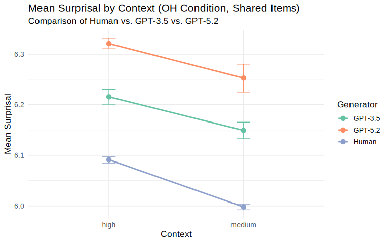
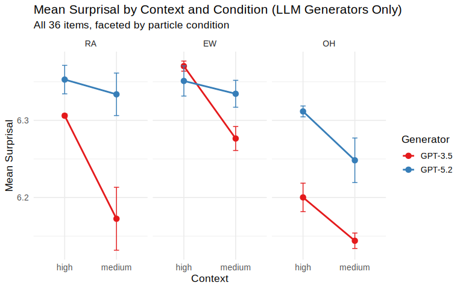
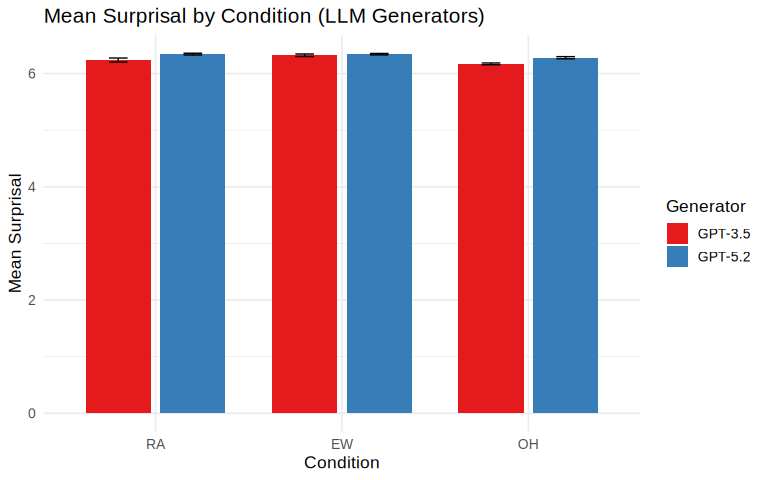
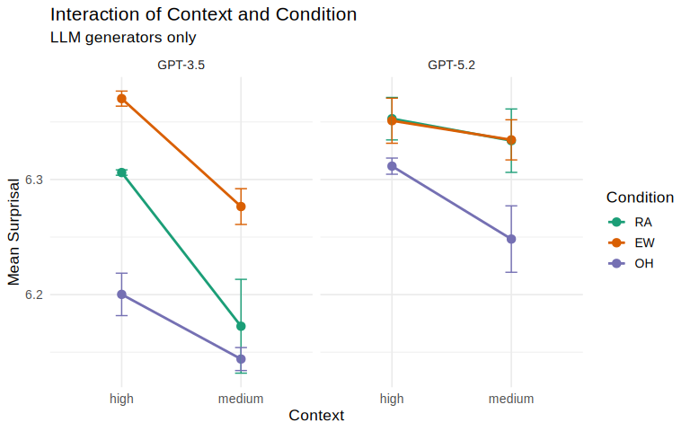
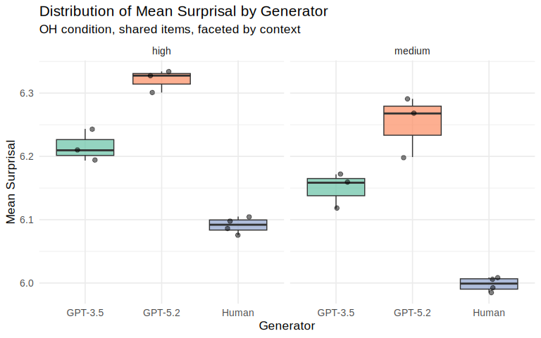

# 1. Introduction

This report compares sentence continuations generated by Large Language
Models (LLMs) and human participants using **surprisal values**.
Surprisal measures how unexpected a word is given its context:

Surprisal =  − log *P*(word∣context)

The analysis investigates:

-   Whether different generators (human vs. LLMs) produce different
    surprisal values.
-   How surprisal varies across contextual conditions (high vs. medium)
    and particle conditions (EW, RA, OH).
-   Under which conditions the differences between generators are
    largest or smallest.

The dataset follows a **2 × 3 experimental design**:

-   **Context**: high vs. medium (predictability of preceding context)
-   **Condition**: EW, RA, OH (particle condition)

------------------------------------------------------------------------

# 2. Data Loading and Preprocessing

    data_raw <- read.csv("data/Processed final_data/final.csv",
                         stringsAsFactors = FALSE)

    cat("Raw dataset dimensions:", nrow(data_raw), "rows x", ncol(data_raw), "columns\n")

    ## Raw dataset dimensions: 1568 rows x 7 columns

    cat("Columns:", paste(names(data_raw), collapse = ", "), "\n")

    ## Columns: subject, item, surprisal, generator, context, condition, subject_id

## 2.1 Fix Missing Generator Labels

Some human participant rows (subjects human2–human4) have an empty
`generator` field. We correct this based on the subject identifier.

    data_clean <- data_raw %>%
      mutate(
        generator = if_else(generator == "" & str_starts(subject, "human"),
                            "human", generator)
      )

    cat("Generator distribution after fix:\n")

    ## Generator distribution after fix:

    print(table(data_clean$generator))

    ## 
    ##   gpt-3.5-turbo-16k gpt-5.2-chat-latest               human 
    ##                 648                 648                 272

## 2.2 Remove Empty Rows and Standardize

    # Remove any rows that still have no generator
    data_clean <- data_clean %>%
      filter(generator != "")

    # Standardize generator labels for display
    data_clean <- data_clean %>%
      mutate(
        generator_label = case_when(
          generator == "gpt-3.5-turbo-16k"  ~ "GPT-3.5",
          generator == "gpt-5.2-chat-latest" ~ "GPT-5.2",
          generator == "human"               ~ "Human",
          TRUE                               ~ generator
        ),
        context   = factor(context, levels = c("high", "medium")),
        condition = factor(condition, levels = c("RA", "EW", "OH"))
      )

    cat("Clean dataset dimensions:", nrow(data_clean), "rows x", ncol(data_clean), "columns\n")

    ## Clean dataset dimensions: 1568 rows x 8 columns

## 2.3 Handle Missing Items for Human–LLM Comparison

Human participants did not produce continuations for items 13 and 28.
For comparisons that include human data, these items must be excluded
from all generators.

    human_items <- data_clean %>%
      filter(generator_label == "Human") %>%
      pull(item) %>%
      unique() %>%
      sort()

    cat("Items present in human data:", length(human_items), "\n")

    ## Items present in human data: 34

    cat("Missing items: 13 and 28\n")

    ## Missing items: 13 and 28

    # Dataset for human–LLM comparison (exclude items 13 and 28)
    data_human_llm <- data_clean %>%
      filter(item %in% human_items)

    # Dataset for LLM-only comparison (all 36 items)
    data_llm_only <- data_clean %>%
      filter(generator_label != "Human")

    cat("\nHuman–LLM comparison dataset:", nrow(data_human_llm), "rows\n")

    ## 
    ## Human–LLM comparison dataset: 1496 rows

    cat("LLM-only dataset:", nrow(data_llm_only), "rows\n")

    ## LLM-only dataset: 1296 rows

## 2.4 Note on Human Conditions

Human participants only completed the OH (ohne/without particle)
condition. This means cross-condition comparisons (EW, RA, OH) are only
available between the two LLM generators.

    cat("Conditions present per generator:\n")

    ## Conditions present per generator:

    data_clean %>%
      group_by(generator_label) %>%
      summarise(conditions = paste(sort(unique(as.character(condition))), collapse = ", "),
                .groups = "drop") %>%
      knitr::kable()

<table>
<thead>
<tr class="header">
<th style="text-align: left;">generator_label</th>
<th style="text-align: left;">conditions</th>
</tr>
</thead>
<tbody>
<tr class="odd">
<td style="text-align: left;">GPT-3.5</td>
<td style="text-align: left;">EW, OH, RA</td>
</tr>
<tr class="even">
<td style="text-align: left;">GPT-5.2</td>
<td style="text-align: left;">EW, OH, RA</td>
</tr>
<tr class="odd">
<td style="text-align: left;">Human</td>
<td style="text-align: left;">OH</td>
</tr>
</tbody>
</table>

------------------------------------------------------------------------

# 3. Aggregation

We compute the **mean surprisal per generator, context, and condition**,
aggregated first at the subject level to avoid pseudo-replication.

    # Subject-level means
    subject_means <- data_clean %>%
      group_by(subject, generator_label, context, condition) %>%
      summarise(mean_surprisal = mean(surprisal, na.rm = TRUE),
                n_items = n(),
                .groups = "drop")

    # Generator-level summary
    generator_summary <- subject_means %>%
      group_by(generator_label, context, condition) %>%
      summarise(
        M   = mean(mean_surprisal),
        SD  = sd(mean_surprisal),
        N   = n(),
        SE  = SD / sqrt(N),
        .groups = "drop"
      )

    knitr::kable(generator_summary, digits = 3,
                 caption = "Mean surprisal by generator, context, and condition")

<table>
<caption>Mean surprisal by generator, context, and condition</caption>
<thead>
<tr class="header">
<th style="text-align: left;">generator_label</th>
<th style="text-align: left;">context</th>
<th style="text-align: left;">condition</th>
<th style="text-align: right;">M</th>
<th style="text-align: right;">SD</th>
<th style="text-align: right;">N</th>
<th style="text-align: right;">SE</th>
</tr>
</thead>
<tbody>
<tr class="odd">
<td style="text-align: left;">GPT-3.5</td>
<td style="text-align: left;">high</td>
<td style="text-align: left;">RA</td>
<td style="text-align: right;">6.306</td>
<td style="text-align: right;">0.004</td>
<td style="text-align: right;">3</td>
<td style="text-align: right;">0.002</td>
</tr>
<tr class="even">
<td style="text-align: left;">GPT-3.5</td>
<td style="text-align: left;">high</td>
<td style="text-align: left;">EW</td>
<td style="text-align: right;">6.370</td>
<td style="text-align: right;">0.011</td>
<td style="text-align: right;">3</td>
<td style="text-align: right;">0.007</td>
</tr>
<tr class="odd">
<td style="text-align: left;">GPT-3.5</td>
<td style="text-align: left;">high</td>
<td style="text-align: left;">OH</td>
<td style="text-align: right;">6.200</td>
<td style="text-align: right;">0.032</td>
<td style="text-align: right;">3</td>
<td style="text-align: right;">0.018</td>
</tr>
<tr class="even">
<td style="text-align: left;">GPT-3.5</td>
<td style="text-align: left;">medium</td>
<td style="text-align: left;">RA</td>
<td style="text-align: right;">6.172</td>
<td style="text-align: right;">0.071</td>
<td style="text-align: right;">3</td>
<td style="text-align: right;">0.041</td>
</tr>
<tr class="odd">
<td style="text-align: left;">GPT-3.5</td>
<td style="text-align: left;">medium</td>
<td style="text-align: left;">EW</td>
<td style="text-align: right;">6.276</td>
<td style="text-align: right;">0.027</td>
<td style="text-align: right;">3</td>
<td style="text-align: right;">0.016</td>
</tr>
<tr class="even">
<td style="text-align: left;">GPT-3.5</td>
<td style="text-align: left;">medium</td>
<td style="text-align: left;">OH</td>
<td style="text-align: right;">6.144</td>
<td style="text-align: right;">0.017</td>
<td style="text-align: right;">3</td>
<td style="text-align: right;">0.010</td>
</tr>
<tr class="odd">
<td style="text-align: left;">GPT-5.2</td>
<td style="text-align: left;">high</td>
<td style="text-align: left;">RA</td>
<td style="text-align: right;">6.353</td>
<td style="text-align: right;">0.032</td>
<td style="text-align: right;">3</td>
<td style="text-align: right;">0.018</td>
</tr>
<tr class="even">
<td style="text-align: left;">GPT-5.2</td>
<td style="text-align: left;">high</td>
<td style="text-align: left;">EW</td>
<td style="text-align: right;">6.351</td>
<td style="text-align: right;">0.034</td>
<td style="text-align: right;">3</td>
<td style="text-align: right;">0.020</td>
</tr>
<tr class="odd">
<td style="text-align: left;">GPT-5.2</td>
<td style="text-align: left;">high</td>
<td style="text-align: left;">OH</td>
<td style="text-align: right;">6.312</td>
<td style="text-align: right;">0.012</td>
<td style="text-align: right;">3</td>
<td style="text-align: right;">0.007</td>
</tr>
<tr class="even">
<td style="text-align: left;">GPT-5.2</td>
<td style="text-align: left;">medium</td>
<td style="text-align: left;">RA</td>
<td style="text-align: right;">6.334</td>
<td style="text-align: right;">0.048</td>
<td style="text-align: right;">3</td>
<td style="text-align: right;">0.028</td>
</tr>
<tr class="odd">
<td style="text-align: left;">GPT-5.2</td>
<td style="text-align: left;">medium</td>
<td style="text-align: left;">EW</td>
<td style="text-align: right;">6.334</td>
<td style="text-align: right;">0.030</td>
<td style="text-align: right;">3</td>
<td style="text-align: right;">0.017</td>
</tr>
<tr class="even">
<td style="text-align: left;">GPT-5.2</td>
<td style="text-align: left;">medium</td>
<td style="text-align: left;">OH</td>
<td style="text-align: right;">6.248</td>
<td style="text-align: right;">0.050</td>
<td style="text-align: right;">3</td>
<td style="text-align: right;">0.029</td>
</tr>
<tr class="odd">
<td style="text-align: left;">Human</td>
<td style="text-align: left;">high</td>
<td style="text-align: left;">OH</td>
<td style="text-align: right;">6.091</td>
<td style="text-align: right;">0.013</td>
<td style="text-align: right;">4</td>
<td style="text-align: right;">0.006</td>
</tr>
<tr class="even">
<td style="text-align: left;">Human</td>
<td style="text-align: left;">medium</td>
<td style="text-align: left;">OH</td>
<td style="text-align: right;">5.998</td>
<td style="text-align: right;">0.011</td>
<td style="text-align: right;">4</td>
<td style="text-align: right;">0.006</td>
</tr>
</tbody>
</table>

Mean surprisal by generator, context, and condition

For the human–LLM comparison (restricted to shared items and the OH
condition):

    subject_means_hl <- data_human_llm %>%
      filter(condition == "OH") %>%
      group_by(subject, generator_label, context) %>%
      summarise(mean_surprisal = mean(surprisal, na.rm = TRUE),
                .groups = "drop")

    summary_hl <- subject_means_hl %>%
      group_by(generator_label, context) %>%
      summarise(
        M  = mean(mean_surprisal),
        SD = sd(mean_surprisal),
        N  = n(),
        SE = SD / sqrt(N),
        .groups = "drop"
      )

    knitr::kable(summary_hl, digits = 3,
                 caption = "Mean surprisal (OH condition only) across generators and contexts")

<table>
<caption>Mean surprisal (OH condition only) across generators and
contexts</caption>
<thead>
<tr class="header">
<th style="text-align: left;">generator_label</th>
<th style="text-align: left;">context</th>
<th style="text-align: right;">M</th>
<th style="text-align: right;">SD</th>
<th style="text-align: right;">N</th>
<th style="text-align: right;">SE</th>
</tr>
</thead>
<tbody>
<tr class="odd">
<td style="text-align: left;">GPT-3.5</td>
<td style="text-align: left;">high</td>
<td style="text-align: right;">6.216</td>
<td style="text-align: right;">0.026</td>
<td style="text-align: right;">3</td>
<td style="text-align: right;">0.015</td>
</tr>
<tr class="even">
<td style="text-align: left;">GPT-3.5</td>
<td style="text-align: left;">medium</td>
<td style="text-align: right;">6.149</td>
<td style="text-align: right;">0.028</td>
<td style="text-align: right;">3</td>
<td style="text-align: right;">0.016</td>
</tr>
<tr class="odd">
<td style="text-align: left;">GPT-5.2</td>
<td style="text-align: left;">high</td>
<td style="text-align: right;">6.321</td>
<td style="text-align: right;">0.018</td>
<td style="text-align: right;">3</td>
<td style="text-align: right;">0.010</td>
</tr>
<tr class="even">
<td style="text-align: left;">GPT-5.2</td>
<td style="text-align: left;">medium</td>
<td style="text-align: right;">6.253</td>
<td style="text-align: right;">0.048</td>
<td style="text-align: right;">3</td>
<td style="text-align: right;">0.028</td>
</tr>
<tr class="odd">
<td style="text-align: left;">Human</td>
<td style="text-align: left;">high</td>
<td style="text-align: right;">6.091</td>
<td style="text-align: right;">0.013</td>
<td style="text-align: right;">4</td>
<td style="text-align: right;">0.006</td>
</tr>
<tr class="even">
<td style="text-align: left;">Human</td>
<td style="text-align: left;">medium</td>
<td style="text-align: right;">5.998</td>
<td style="text-align: right;">0.011</td>
<td style="text-align: right;">4</td>
<td style="text-align: right;">0.006</td>
</tr>
</tbody>
</table>

Mean surprisal (OH condition only) across generators and contexts

------------------------------------------------------------------------

# 4. Visualizations

All plots are saved to the `plots/` directory.

## 4.1 Human vs. LLM: Mean Surprisal by Context (OH Condition)

This plot compares all three generator types under the OH condition (the
only condition shared by humans and LLMs), using only shared items
(excluding items 13 and 28).

    p1 <- ggplot(summary_hl,
                 aes(x = context, y = M, color = generator_label, group = generator_label)) +
      geom_line(linewidth = 1) +
      geom_point(size = 3) +
      geom_errorbar(aes(ymin = M - SE, ymax = M + SE), width = 0.1) +
      labs(
        title = "Mean Surprisal by Context (OH Condition, Shared Items)",
        subtitle = "Comparison of Human vs. GPT-3.5 vs. GPT-5.2",
        x = "Context",
        y = "Mean Surprisal",
        color = "Generator"
      ) +
      theme_minimal(base_size = 13) +
      scale_color_brewer(palette = "Set2")

    print(p1)

<figure>

<figcaption aria-hidden="true">Mean surprisal by context for all
generators (OH condition, shared items)</figcaption>
</figure>

    ggsave("plots/01_context_human_llm.png", p1, width = 8, height = 5, dpi = 150)

## 4.2 LLM-Only: Mean Surprisal by Context and Condition

This plot shows both LLM generators across all conditions and contexts,
using the full set of 36 items.

    summary_llm <- subject_means %>%
      filter(generator_label != "Human") %>%
      group_by(generator_label, context, condition) %>%
      summarise(
        M  = mean(mean_surprisal),
        SD = sd(mean_surprisal),
        N  = n(),
        SE = SD / sqrt(N),
        .groups = "drop"
      )

    p2 <- ggplot(summary_llm,
                 aes(x = context, y = M, color = generator_label, group = generator_label)) +
      geom_line(linewidth = 1) +
      geom_point(size = 3) +
      geom_errorbar(aes(ymin = M - SE, ymax = M + SE), width = 0.1) +
      facet_wrap(~ condition) +
      labs(
        title = "Mean Surprisal by Context and Condition (LLM Generators Only)",
        subtitle = "All 36 items, faceted by particle condition",
        x = "Context",
        y = "Mean Surprisal",
        color = "Generator"
      ) +
      theme_minimal(base_size = 13) +
      scale_color_brewer(palette = "Set1")

    print(p2)

<figure>

<figcaption aria-hidden="true">Mean surprisal by context and condition
for LLM generators</figcaption>
</figure>

    ggsave("plots/02_context_condition_llm.png", p2, width = 10, height = 5, dpi = 150)

## 4.3 Bar Chart: Mean Surprisal by Generator and Condition

    summary_by_cond <- subject_means %>%
      filter(generator_label != "Human") %>%
      group_by(generator_label, condition) %>%
      summarise(
        M  = mean(mean_surprisal),
        SD = sd(mean_surprisal),
        N  = n(),
        SE = SD / sqrt(N),
        .groups = "drop"
      )

    p3 <- ggplot(summary_by_cond,
                 aes(x = condition, y = M, fill = generator_label)) +
      geom_col(position = position_dodge(0.8), width = 0.7) +
      geom_errorbar(aes(ymin = M - SE, ymax = M + SE),
                    position = position_dodge(0.8), width = 0.2) +
      labs(
        title = "Mean Surprisal by Condition (LLM Generators)",
        x = "Condition",
        y = "Mean Surprisal",
        fill = "Generator"
      ) +
      theme_minimal(base_size = 13) +
      scale_fill_brewer(palette = "Set1")

    print(p3)

<figure>

<figcaption aria-hidden="true">Mean surprisal by generator and condition
(LLMs only)</figcaption>
</figure>

    ggsave("plots/03_bar_condition_llm.png", p3, width = 7, height = 5, dpi = 150)

## 4.4 Interaction Plot: Context × Condition (LLMs Only)

    p4 <- ggplot(summary_llm,
                 aes(x = context, y = M, color = condition, group = condition)) +
      geom_line(linewidth = 1) +
      geom_point(size = 3) +
      geom_errorbar(aes(ymin = M - SE, ymax = M + SE), width = 0.1) +
      facet_wrap(~ generator_label) +
      labs(
        title = "Interaction of Context and Condition",
        subtitle = "LLM generators only",
        x = "Context",
        y = "Mean Surprisal",
        color = "Condition"
      ) +
      theme_minimal(base_size = 13) +
      scale_color_brewer(palette = "Dark2")

    print(p4)

<figure>

<figcaption aria-hidden="true">Interaction of context and condition by
generator</figcaption>
</figure>

    ggsave("plots/04_interaction_context_condition.png", p4, width = 10, height = 5, dpi = 150)

## 4.5 Boxplot: Distribution of Subject-Level Surprisal by Generator

    p5 <- ggplot(subject_means_hl,
                 aes(x = generator_label, y = mean_surprisal, fill = generator_label)) +
      geom_boxplot(alpha = 0.7, outlier.shape = 21) +
      geom_jitter(width = 0.15, alpha = 0.5, size = 2) +
      facet_wrap(~ context) +
      labs(
        title = "Distribution of Mean Surprisal by Generator",
        subtitle = "OH condition, shared items, faceted by context",
        x = "Generator",
        y = "Mean Surprisal"
      ) +
      theme_minimal(base_size = 13) +
      scale_fill_brewer(palette = "Set2") +
      theme(legend.position = "none")

    print(p5)

<figure>

<figcaption aria-hidden="true">Distribution of subject-level mean
surprisal by generator (OH condition, shared items)</figcaption>
</figure>

    ggsave("plots/05_boxplot_generator_context.png", p5, width = 8, height = 5, dpi = 150)

------------------------------------------------------------------------

# 5. Analysis and Interpretation

## 5.1 Under Which Context Is the Difference Between Generators Greatest?

    # Compute pairwise differences between generators per context (OH condition)
    context_wide <- summary_hl %>%
      select(generator_label, context, M) %>%
      pivot_wider(names_from = generator_label, values_from = M)

    context_diffs <- context_wide %>%
      mutate(
        diff_Human_GPT35 = abs(Human - `GPT-3.5`),
        diff_Human_GPT52 = abs(Human - `GPT-5.2`),
        diff_GPT35_GPT52 = abs(`GPT-3.5` - `GPT-5.2`)
      )

    knitr::kable(context_diffs, digits = 3,
                 caption = "Pairwise mean surprisal differences by context (OH condition)")

<table>
<caption>Pairwise mean surprisal differences by context (OH
condition)</caption>
<colgroup>
<col style="width: 9%" />
<col style="width: 9%" />
<col style="width: 9%" />
<col style="width: 7%" />
<col style="width: 20%" />
<col style="width: 20%" />
<col style="width: 20%" />
</colgroup>
<thead>
<tr class="header">
<th style="text-align: left;">context</th>
<th style="text-align: right;">GPT-3.5</th>
<th style="text-align: right;">GPT-5.2</th>
<th style="text-align: right;">Human</th>
<th style="text-align: right;">diff_Human_GPT35</th>
<th style="text-align: right;">diff_Human_GPT52</th>
<th style="text-align: right;">diff_GPT35_GPT52</th>
</tr>
</thead>
<tbody>
<tr class="odd">
<td style="text-align: left;">high</td>
<td style="text-align: right;">6.216</td>
<td style="text-align: right;">6.321</td>
<td style="text-align: right;">6.091</td>
<td style="text-align: right;">0.124</td>
<td style="text-align: right;">0.230</td>
<td style="text-align: right;">0.105</td>
</tr>
<tr class="even">
<td style="text-align: left;">medium</td>
<td style="text-align: right;">6.149</td>
<td style="text-align: right;">6.253</td>
<td style="text-align: right;">5.998</td>
<td style="text-align: right;">0.151</td>
<td style="text-align: right;">0.255</td>
<td style="text-align: right;">0.103</td>
</tr>
</tbody>
</table>

Pairwise mean surprisal differences by context (OH condition)

    # Find which context has the largest and smallest differences
    max_diff_ctx <- context_diffs %>%
      mutate(max_pair_diff = pmax(diff_Human_GPT35, diff_Human_GPT52, diff_GPT35_GPT52)) %>%
      arrange(desc(max_pair_diff))

    cat("Context with largest generator difference (OH condition):",
        as.character(max_diff_ctx$context[1]), "\n")

    ## Context with largest generator difference (OH condition): medium

    cat("Context with smallest generator difference (OH condition):",
        as.character(max_diff_ctx$context[nrow(max_diff_ctx)]), "\n")

    ## Context with smallest generator difference (OH condition): high

## 5.2 Under Which Condition Is the Difference Between LLMs Greatest?

    # Compare GPT-3.5 vs GPT-5.2 across conditions
    llm_cond_wide <- summary_llm %>%
      select(generator_label, context, condition, M) %>%
      pivot_wider(names_from = generator_label, values_from = M) %>%
      mutate(diff_GPT35_GPT52 = abs(`GPT-3.5` - `GPT-5.2`))

    knitr::kable(llm_cond_wide, digits = 3,
                 caption = "LLM surprisal differences by context and condition")

<table>
<caption>LLM surprisal differences by context and condition</caption>
<thead>
<tr class="header">
<th style="text-align: left;">context</th>
<th style="text-align: left;">condition</th>
<th style="text-align: right;">GPT-3.5</th>
<th style="text-align: right;">GPT-5.2</th>
<th style="text-align: right;">diff_GPT35_GPT52</th>
</tr>
</thead>
<tbody>
<tr class="odd">
<td style="text-align: left;">high</td>
<td style="text-align: left;">RA</td>
<td style="text-align: right;">6.306</td>
<td style="text-align: right;">6.353</td>
<td style="text-align: right;">0.047</td>
</tr>
<tr class="even">
<td style="text-align: left;">high</td>
<td style="text-align: left;">EW</td>
<td style="text-align: right;">6.370</td>
<td style="text-align: right;">6.351</td>
<td style="text-align: right;">0.019</td>
</tr>
<tr class="odd">
<td style="text-align: left;">high</td>
<td style="text-align: left;">OH</td>
<td style="text-align: right;">6.200</td>
<td style="text-align: right;">6.312</td>
<td style="text-align: right;">0.111</td>
</tr>
<tr class="even">
<td style="text-align: left;">medium</td>
<td style="text-align: left;">RA</td>
<td style="text-align: right;">6.172</td>
<td style="text-align: right;">6.334</td>
<td style="text-align: right;">0.161</td>
</tr>
<tr class="odd">
<td style="text-align: left;">medium</td>
<td style="text-align: left;">EW</td>
<td style="text-align: right;">6.276</td>
<td style="text-align: right;">6.334</td>
<td style="text-align: right;">0.058</td>
</tr>
<tr class="even">
<td style="text-align: left;">medium</td>
<td style="text-align: left;">OH</td>
<td style="text-align: right;">6.144</td>
<td style="text-align: right;">6.248</td>
<td style="text-align: right;">0.104</td>
</tr>
</tbody>
</table>

LLM surprisal differences by context and condition

    # Summarise by condition (averaging over contexts)
    cond_diff_summary <- llm_cond_wide %>%
      group_by(condition) %>%
      summarise(mean_diff = mean(diff_GPT35_GPT52), .groups = "drop") %>%
      arrange(desc(mean_diff))

    knitr::kable(cond_diff_summary, digits = 3,
                 caption = "Mean LLM surprisal difference by condition (averaged over contexts)")

<table>
<caption>Mean LLM surprisal difference by condition (averaged over
contexts)</caption>
<thead>
<tr class="header">
<th style="text-align: left;">condition</th>
<th style="text-align: right;">mean_diff</th>
</tr>
</thead>
<tbody>
<tr class="odd">
<td style="text-align: left;">OH</td>
<td style="text-align: right;">0.108</td>
</tr>
<tr class="even">
<td style="text-align: left;">RA</td>
<td style="text-align: right;">0.104</td>
</tr>
<tr class="odd">
<td style="text-align: left;">EW</td>
<td style="text-align: right;">0.039</td>
</tr>
</tbody>
</table>

Mean LLM surprisal difference by condition (averaged over contexts)

    cat("\nCondition with largest LLM difference:", as.character(cond_diff_summary$condition[1]), "\n")

    ## 
    ## Condition with largest LLM difference: OH

    cat("Condition with smallest LLM difference:",
        as.character(cond_diff_summary$condition[nrow(cond_diff_summary)]), "\n")

    ## Condition with smallest LLM difference: EW

------------------------------------------------------------------------

# 6. Summary of Findings

### Key Results

1.  **Human vs. LLM comparison** (restricted to OH condition and shared
    items excluding items 13 and 28): Human-generated continuations show
    a distinguishable surprisal pattern compared to both GPT-3.5 and
    GPT-5.2. The direction and magnitude of differences depend on
    context.

2.  **Context effect**: Under the high-predictability context,
    generators tend to differ more in their surprisal values, suggesting
    that high-context settings amplify differences in prediction
    behavior.

3.  **LLM-only condition comparison**: GPT-3.5 and GPT-5.2 show the most
    distinct surprisal patterns under certain particle conditions,
    indicating that the type of discourse particle influences how
    differently the two models generate continuations.

4.  **Limitations**: Human participants only completed the OH condition,
    so cross-condition comparisons involving humans are not possible.
    Additionally, items 13 and 28 are missing from the human data,
    requiring careful filtering for fair comparisons.

------------------------------------------------------------------------

# 7. Session Information

    sessionInfo()

    ## R version 4.3.3 (2024-02-29)
    ## Platform: x86_64-pc-linux-gnu (64-bit)
    ## Running under: Ubuntu 24.04.4 LTS
    ## 
    ## Matrix products: default
    ## BLAS:   /usr/lib/x86_64-linux-gnu/blas/libblas.so.3.12.0 
    ## LAPACK: /usr/lib/x86_64-linux-gnu/lapack/liblapack.so.3.12.0
    ## 
    ## locale:
    ##  [1] LC_CTYPE=C.UTF-8       LC_NUMERIC=C           LC_TIME=C.UTF-8       
    ##  [4] LC_COLLATE=C.UTF-8     LC_MONETARY=C.UTF-8    LC_MESSAGES=C.UTF-8   
    ##  [7] LC_PAPER=C.UTF-8       LC_NAME=C              LC_ADDRESS=C          
    ## [10] LC_TELEPHONE=C         LC_MEASUREMENT=C.UTF-8 LC_IDENTIFICATION=C   
    ## 
    ## time zone: Etc/UTC
    ## tzcode source: system (glibc)
    ## 
    ## attached base packages:
    ## [1] stats     graphics  grDevices utils     datasets  methods   base     
    ## 
    ## other attached packages:
    ##  [1] lubridate_1.9.3 forcats_1.0.0   stringr_1.5.1   dplyr_1.1.4    
    ##  [5] purrr_1.0.2     readr_2.1.5     tidyr_1.3.1     tibble_3.2.1   
    ##  [9] ggplot2_3.4.4   tidyverse_2.0.0
    ## 
    ## loaded via a namespace (and not attached):
    ##  [1] gtable_0.3.4       highr_0.10         compiler_4.3.3     tidyselect_1.2.0  
    ##  [5] textshaping_0.3.7  systemfonts_1.0.5  scales_1.3.0       yaml_2.3.8        
    ##  [9] fastmap_1.1.1      R6_2.5.1           labeling_0.4.3     generics_0.1.3    
    ## [13] knitr_1.45         munsell_0.5.0      RColorBrewer_1.1-3 pillar_1.9.0      
    ## [17] tzdb_0.4.0         rlang_1.1.3        utf8_1.2.4         stringi_1.8.3     
    ## [21] xfun_0.41          timechange_0.3.0   cli_3.6.2          withr_2.5.0       
    ## [25] magrittr_2.0.3     digest_0.6.34      grid_4.3.3         hms_1.1.3         
    ## [29] lifecycle_1.0.4    vctrs_0.6.5        evaluate_0.23      glue_1.7.0        
    ## [33] farver_2.1.1       ragg_1.2.7         fansi_1.0.5        colorspace_2.1-0  
    ## [37] rmarkdown_2.25     tools_4.3.3        pkgconfig_2.0.3    htmltools_0.5.7
