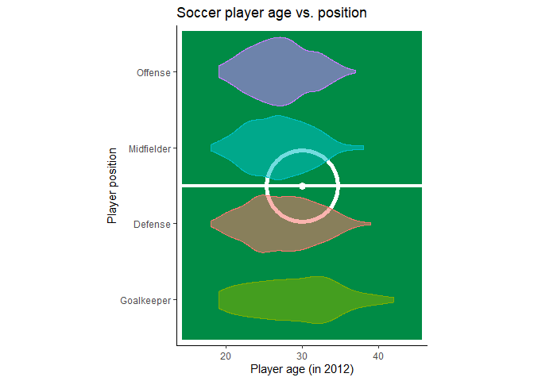
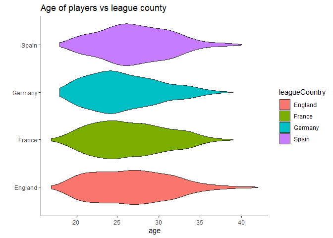
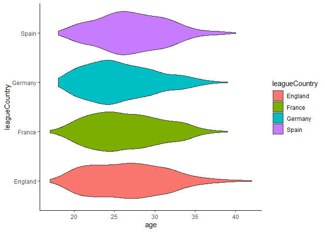
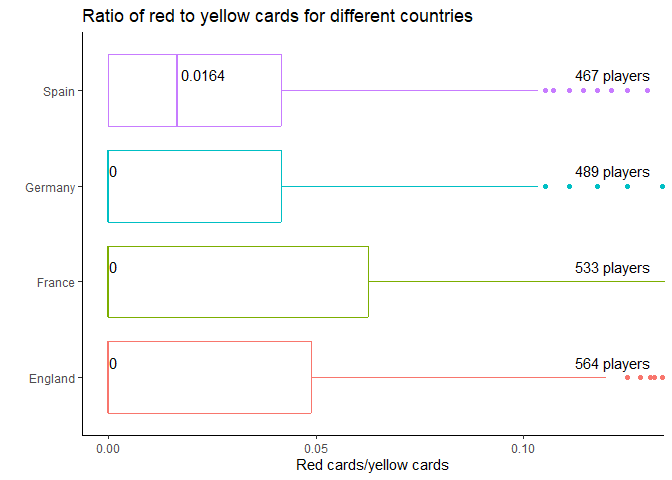

## Soccer-Project

### Data Cleaning

    library(readr)
    soccer_referee_data <- read_csv("soccer_referee_data.csv")

    ## Rows: 146028 Columns: 28
    ## ── Column specification ────────────────────────────────────────────────────────
    ## Delimiter: ","
    ## chr  (8): playerShort, player, club, leagueCountry, birthday, position, phot...
    ## dbl (20): height, weight, games, victories, ties, defeats, goals, yellowCard...
    ## 
    ## ℹ Use `spec()` to retrieve the full column specification for this data.
    ## ℹ Specify the column types or set `show_col_types = FALSE` to quiet this message.

    #soccer_referee_data <- read_csv("C:/users/danie/Documents/Aktuelles/R_Kurs/R_Kurs_Git/Projects/alexanderwinterstetter/soccer_referee_data.csv")
    View(soccer_referee_data)

Create a new table with just the personal info of the players:

    unique_players<-unique(soccer_referee_data$playerShort)
    unique_players_df <- data.frame(matrix(ncol = 28, nrow =0 ))
    colnames(unique_players_df)<-colnames(soccer_referee_data)
    for (player in unique_players){
      unique_player<-soccer_referee_data[which(soccer_referee_data$playerShort==player),][1,]
      unique_players_df<-rbind(unique_players_df,unique_player)
    }

-   Create a new variable, which contains information on whether the
    player is “Goalkeeper”, “Defense”, “Midfielder” or “Offense” (4
    possible values the variables can take on)

<!-- -->

    library("stringr")

    #included to remove mistakes in classification due to whitespaces
    unique_players_df$position<-str_squish(unique_players_df$position)

    unique_players_df$pos<-ifelse(is.na(unique_players_df$position),NA, 
                                   ifelse(unique_players_df$position %in% c("Attacking Midfielder","Right Midfielder","Defensive Midfielder","Left Midfielder"), "Midfielder", 
                                          ifelse(unique_players_df$position %in% c("Right Winger","Center Forward","Left Winger"), "Offense", 
                                                 ifelse(unique_players_df$position %in% c("Goalkeeper"),"Goalkeeper", "Defense"))))

# Create a new column with the age of the players

    library("lubridate")

    ## 
    ## Attache Paket: 'lubridate'

    ## Die folgenden Objekte sind maskiert von 'package:base':
    ## 
    ##     date, intersect, setdiff, union

    unique_players_df$birthday<-gsub("[[:punct:]]","-",unique_players_df$birthday) %>% dmy()

    unique_players_df$age<-0
    for (i in 1:dim(unique_players_df)[1]){
      unique_players_df$age[i]<-seq(from=as.Date(unique_players_df$birthday[i]), to=as.Date("2012/12/31"),by="year") %>% length()
    }

Change the unique\_players\_df to only contain data that remains the
same for all games. To also include some data regarding the outcome of
games, aggregate over Red and Yellow Cards, as well as Losses, Ties and
Wins. I will use ratios for this, to be able to better compare the
values between players.

    unchanged_cols<-c("playerShort","player","club","leagueCountry","birthday","height","weight","position","photoID", "pos", "age")
    #"games",   
    aggregate_col_names<-c("victories","ties","defeats","goals","yellowCards","yellowReds","redCards" )

    aggregate_cols<-aggregate(cbind(games,victories,ties,defeats,goals,yellowCards,yellowReds,redCards)  ~ playerShort, data = soccer_referee_data, sum)

    aggregate_cols[aggregate_col_names]<-aggregate_cols[aggregate_col_names]/aggregate_cols$games

    unique_players_df<-merge(unique_players_df[unchanged_cols],aggregate_cols, by.x="playerShort",by.y = "playerShort")

-   calculate a variable “points” per club: each win means 3 points,
    draw 1 point, lose 0 points (I will have to further look into it
    whether it is possible - it may be rather tricky)

*This is impossible, there is no way to get to the number of games in a
league from this data. The Bundeliga does have ~34 games for each club
(but there are other countries teams here too!), but a some players meet
over 60 referees in this time period, which is probably not all from
league game play, but also friendly or national matches, making it
impossible to find the number of points for each club.*

    ##          playerShort          player                club leagueCountry
    ## 1581           pique           Piqué        FC Barcelona         Spain
    ## 430    dani-carvajal   Dani Carvajal    Bayer Leverkusen       Germany
    ## 1553         pedro_7           Pedro        FC Barcelona         Spain
    ## 1195    lukas-raeder    Lukas Raeder      Bayern München       Germany
    ## 301       busquets_2        Busquets        FC Barcelona         Spain
    ## 1902       thiago_17          Thiago        FC Barcelona         Spain
    ## 1414          morata          Morata         Real Madrid         Spain
    ## 148  andy-robinson_2   Andy Robinson      Southampton FC       England
    ## 220    baptiste-aloe   Baptiste Aloe Olympique Marseille        France
    ## 401      corby-moore     Corby Moore      Southampton FC       England
    ## 629    florent-andre   Florent André           SC Bastia        France
    ## 921  jerome-sinclair Jerome Sinclair        Liverpool FC       England
    ## 1059        jurado_3          Jurado           Málaga CF         Spain
    ## 1518     papa-camara     Papa Camara          FC Sochaux        France
    ## 1520  pape-coulibaly  Pape Coulibaly    AS Saint-Étienne        France
    ##        birthday height weight             position    photoID        pos age
    ## 1581 1987-02-02    192     85          Center Back  27798.jpg    Defense  26
    ## 430  1992-01-11    171     73       Right Fullback 191377.jpg    Defense  21
    ## 1553 1987-07-28    169     64         Right Winger 103634.jpg    Offense  26
    ## 1195 1993-12-30    194     86           Goalkeeper 174201.jpg Goalkeeper  20
    ## 301  1988-07-16    189     73 Defensive Midfielder 124973.jpg Midfielder  25
    ## 1902 1991-04-11    172     71 Attacking Midfielder 142540.jpg Midfielder  22
    ## 1414 1992-10-23    190     82       Center Forward 178382.jpg    Offense  21
    ## 148  1992-10-16     NA     NA                 <NA>       <NA>       <NA>  21
    ## 220  1994-06-29    184     77          Center Back 211139.jpg    Defense  19
    ## 401  1993-11-21     NA     NA                 <NA>       <NA>       <NA>  20
    ## 629  1991-06-06    175     61                 <NA>       <NA>       <NA>  22
    ## 921  1996-09-20     NA     NA                 <NA> 222257.jpg       <NA>  17
    ## 1059 1990-03-14    173     61                 <NA>       <NA>       <NA>  23
    ## 1518 1993-01-16    195     74           Goalkeeper       <NA> Goalkeeper  20
    ## 1520 1988-03-02    194     92           Goalkeeper       <NA> Goalkeeper  25
    ##      games victories      ties    defeats      goals yellowCards  yellowReds
    ## 1581   381 0.7060367 0.1863517 0.10761155 0.07611549  0.20209974 0.010498688
    ## 430     90 0.7111111 0.1555556 0.13333333 0.04444444  0.20000000 0.000000000
    ## 1553   303 0.7359736 0.1518152 0.11221122 0.33333333  0.07590759 0.000000000
    ## 1195    77 0.7402597 0.1168831 0.14285714 0.00000000  0.03896104 0.000000000
    ## 301    340 0.7411765 0.1588235 0.10000000 0.03529412  0.22058824 0.002941176
    ## 1902   164 0.7621951 0.1280488 0.10975610 0.12195122  0.09756098 0.006097561
    ## 1414    83 0.7710843 0.1325301 0.09638554 0.48192771  0.16867470 0.000000000
    ## 148      1 1.0000000 0.0000000 0.00000000 0.00000000  0.00000000 0.000000000
    ## 220      1 1.0000000 0.0000000 0.00000000 0.00000000  1.00000000 0.000000000
    ## 401      1 1.0000000 0.0000000 0.00000000 0.00000000  0.00000000 0.000000000
    ## 629      2 1.0000000 0.0000000 0.00000000 0.00000000  0.00000000 0.000000000
    ## 921      1 1.0000000 0.0000000 0.00000000 0.00000000  0.00000000 0.000000000
    ## 1059     1 1.0000000 0.0000000 0.00000000 0.00000000  0.00000000 0.000000000
    ## 1518     1 1.0000000 0.0000000 0.00000000 0.00000000  0.00000000 0.000000000
    ## 1520     1 1.0000000 0.0000000 0.00000000 0.00000000  0.00000000 0.000000000
    ##         redCards
    ## 1581 0.010498688
    ## 430  0.000000000
    ## 1553 0.000000000
    ## 1195 0.000000000
    ## 301  0.002941176
    ## 1902 0.000000000
    ## 1414 0.000000000
    ## 148  0.000000000
    ## 220  0.000000000
    ## 401  0.000000000
    ## 629  0.000000000
    ## 921  0.000000000
    ## 1059 0.000000000
    ## 1518 0.000000000
    ## 1520 0.000000000

    ##              playerShort              player                club leagueCountry
    ## 1742     sascha-moelders      Sascha Mölders         FC Augsburg       Germany
    ## 1655  robert-lewandowski  Robert Lewandowski   Borussia Dortmund       Germany
    ## 1530      patrick-helmes      Patrick Helmes       VfL Wolfsburg       Germany
    ## 549           edin-dzeko          Edin Džeko     Manchester City       England
    ## 485          david-villa         David Villa        FC Barcelona         Spain
    ## 2046  zlatan-ibrahimovic  Zlatan Ibrahimović Paris Saint-Germain        France
    ## 962        john-guidetti       John Guidetti     Manchester City       England
    ## 1266         mario-gomez         Mario Gómez      Bayern München       Germany
    ## 1642      rickie-lambert      Rickie Lambert      Southampton FC       England
    ## 1191       luis-suarez_5         Luis Suárez        Liverpool FC       England
    ## 1593      radamel-falcao      Radamel Falcao     Atlético Madrid         Spain
    ## 1114 klaas-jan-huntelaar Klaas-Jan Huntelaar       FC Schalke 04       Germany
    ## 1729         samed-yesil         Samed Yesil        Liverpool FC       England
    ## 413    cristiano-ronaldo   Cristiano Ronaldo         Real Madrid         Spain
    ## 1162        lionel-messi        Lionel Messi        FC Barcelona         Spain
    ##        birthday height weight       position    photoID     pos age games
    ## 1742 1985-03-20    185     79 Center Forward  56073.jpg Offense  28   247
    ## 1655 1988-08-21    184     78 Center Forward 119750.jpg Offense  25   318
    ## 1530 1984-03-01    182     81 Center Forward  13512.jpg Offense  29   282
    ## 549  1986-03-17    193     84 Center Forward  16090.jpg Offense  27   360
    ## 485  1981-12-03    175     69 Center Forward  11669.jpg Offense  32   554
    ## 2046 1981-10-03    192     84 Center Forward   1274.jpg Offense  32   607
    ## 962  1992-04-15    185     79 Center Forward 125671.jpg Offense  21    53
    ## 1266 1985-07-10    189     88 Center Forward  12470.jpg Offense  28   453
    ## 1642 1982-02-16    188     77 Center Forward       <NA> Offense  31   249
    ## 1191 1987-01-24    182     81   Right Winger  43635.jpg Offense  26   398
    ## 1593 1986-02-10    177     72 Center Forward  69147.jpg Offense  27   344
    ## 1114 1983-08-12    186     78 Center Forward  11075.jpg Offense  30   449
    ## 1729 1994-05-25    178     NA Center Forward 175220.jpg Offense  19    55
    ## 413  1985-02-05    185     80    Left Winger  13029.jpg Offense  28   650
    ## 1162 1987-06-24    169     67   Right Winger  26622.jpg Offense  26   498
    ##      victories      ties   defeats     goals yellowCards  yellowReds
    ## 1742 0.3603239 0.2348178 0.4048583 0.4898785  0.06882591 0.000000000
    ## 1655 0.5660377 0.2264151 0.2075472 0.4937107  0.09748428 0.000000000
    ## 1530 0.4503546 0.2446809 0.3049645 0.4964539  0.07446809 0.000000000
    ## 549  0.5222222 0.1944444 0.2833333 0.5055556  0.11388889 0.000000000
    ## 485  0.6137184 0.1931408 0.1931408 0.5072202  0.11191336 0.003610108
    ## 2046 0.6210873 0.2224053 0.1565074 0.5436573  0.15485997 0.006589786
    ## 962  0.5849057 0.1509434 0.2641509 0.5471698  0.15094340 0.018867925
    ## 1266 0.5607064 0.1898455 0.2494481 0.5540839  0.07947020 0.002207506
    ## 1642 0.4899598 0.2329317 0.2771084 0.5823293  0.04819277 0.000000000
    ## 1191 0.5251256 0.2185930 0.2562814 0.5879397  0.21105528 0.000000000
    ## 1593 0.5581395 0.2180233 0.2238372 0.6104651  0.15697674 0.000000000
    ## 1114 0.5545657 0.1915367 0.2538976 0.6169265  0.09576837 0.004454343
    ## 1729 0.6181818 0.1454545 0.2363636 0.6363636  0.21818182 0.000000000
    ## 413  0.6692308 0.1815385 0.1492308 0.6461538  0.14307692 0.004615385
    ## 1162 0.6787149 0.1927711 0.1285141 0.7771084  0.08232932 0.000000000
    ##         redCards
    ## 1742 0.000000000
    ## 1655 0.003144654
    ## 1530 0.003546099
    ## 549  0.000000000
    ## 485  0.009025271
    ## 2046 0.009884679
    ## 962  0.000000000
    ## 1266 0.000000000
    ## 1642 0.004016064
    ## 1191 0.005025126
    ## 1593 0.005813953
    ## 1114 0.004454343
    ## 1729 0.000000000
    ## 413  0.007692308
    ## 1162 0.002008032

    ##           playerShort           player                 club leagueCountry
    ## 1307 mathieu-deplagne Mathieu Deplagne      Montpellier HSC        France
    ## 2022  yassine-jebbour  Yassine Jebbour         Stade Rennes        France
    ## 1247        marcelo_5          Marcelo          CF Badalona         Spain
    ## 2052        zubikarai        Zubikarai        Real Sociedad         Spain
    ## 18        abel-khaled      Abel Khaled          Stade Brest        France
    ## 1250 marco-da-silva_2   Marco da Silva      Valenciennes FC        France
    ## 1508       pablo-mari       Pablo Marí         RCD Mallorca         Spain
    ## 1161   lionel-cappone   Lionel Cappone          Stade Brest        France
    ## 1463    niklas-bolten    Niklas Bolten Bor. Mönchengladbach       Germany
    ## 1158     leyti-ndiaye    Leyti N'Diaye  Olympique Marseille        France
    ## 261     billel-omrani    Billel Omrani  Olympique Marseille        France
    ## 1136     larry-azouni     Larry Azouni  Olympique Marseille        France
    ## 1343   maxime-poundje   Maxime Poundje   Girondins Bordeaux        France
    ## 1804        sidy-kone        Sidy Koné       Olympique Lyon        France
    ## 544    dylan-tombides   Dylan Tombides      West Ham United       England
    ##        birthday height weight             position    photoID        pos age
    ## 1307 1991-10-01    182     76                 <NA> 174904.jpg       <NA>  22
    ## 2022 1991-08-24    181     70        Left Fullback 169660.jpg    Defense  22
    ## 1247 1993-10-08    192     81          Center Back  52947.jpg    Defense  20
    ## 2052 1984-02-26    185     84           Goalkeeper 125889.jpg Goalkeeper  29
    ## 18   1992-11-09    179     NA                 <NA>       <NA>       <NA>  21
    ## 1250 1992-04-10    182     72 Defensive Midfielder       <NA> Midfielder  21
    ## 1508 1993-08-31    191     87          Center Back       <NA>    Defense  20
    ## 1161 1979-02-08    182     74           Goalkeeper  52329.jpg Goalkeeper  34
    ## 1463 1994-03-29    191     NA           Goalkeeper       <NA> Goalkeeper  19
    ## 1158 1985-08-19    188     84                 <NA>  24117.jpg       <NA>  28
    ## 261  1993-06-02    187     70                 <NA> 192456.jpg       <NA>  20
    ## 1136 1994-03-23    175     65 Defensive Midfielder       <NA> Midfielder  19
    ## 1343 1992-08-16    179     71                 <NA> 216697.jpg       <NA>  21
    ## 1804 1992-06-06    185     73                 <NA> 193495.jpg       <NA>  21
    ## 544  1994-03-08    180     NA       Center Forward       <NA>    Offense  19
    ##      games victories      ties   defeats      goals yellowCards yellowReds
    ## 1307    28 0.3571429 0.3571429 0.2857143 0.03571429  0.25000000 0.00000000
    ## 2022    54 0.2962963 0.2777778 0.4259259 0.00000000  0.03703704 0.01851852
    ## 1247    25 0.4800000 0.2000000 0.3200000 0.00000000  0.28000000 0.00000000
    ## 2052    47 0.2978723 0.3191489 0.3829787 0.00000000  0.04255319 0.00000000
    ## 18      23 0.3043478 0.2173913 0.4782609 0.00000000  0.08695652 0.00000000
    ## 1250    23 0.2608696 0.2608696 0.4782609 0.04347826  0.17391304 0.00000000
    ## 1508    23 0.4347826 0.4347826 0.1304348 0.08695652  0.26086957 0.04347826
    ## 1161    45 0.3111111 0.3333333 0.3555556 0.00000000  0.02222222 0.00000000
    ## 1463    22 0.5909091 0.2272727 0.1818182 0.00000000  0.00000000 0.00000000
    ## 1158    63 0.3650794 0.2222222 0.4126984 0.03174603  0.28571429 0.01587302
    ## 261     16 0.1875000 0.5000000 0.3125000 0.00000000  0.00000000 0.00000000
    ## 1136    13 0.4615385 0.1538462 0.3846154 0.00000000  0.30769231 0.00000000
    ## 1343    29 0.3448276 0.2413793 0.4137931 0.00000000  0.17241379 0.00000000
    ## 1804     7 0.4285714 0.4285714 0.1428571 0.00000000  0.00000000 0.00000000
    ## 544      5 0.2000000 0.2000000 0.6000000 0.20000000  0.00000000 0.00000000
    ##        redCards
    ## 1307 0.03571429
    ## 2022 0.03703704
    ## 1247 0.04000000
    ## 2052 0.04255319
    ## 18   0.04347826
    ## 1250 0.04347826
    ## 1508 0.04347826
    ## 1161 0.04444444
    ## 1463 0.04545455
    ## 1158 0.04761905
    ## 261  0.06250000
    ## 1136 0.07692308
    ## 1343 0.10344828
    ## 1804 0.14285714
    ## 544  0.20000000

    ##            playerShort            player                 club leagueCountry
    ## 2015   yannick-cahuzac   Yannick Cahuzac            SC Bastia        France
    ## 55             albelda           Albelda          Valencia CF         Spain
    ## 1396   milorad-pekovic   Milorad Peković SpVgg Greuther Fürth       Germany
    ## 303               cala              Cala           Sevilla FC         Spain
    ## 156    anthony-lippini   Anthony Lippini           AC Ajaccio        France
    ## 104  alvaro-gonzalez_3   Álvaro González        Real Zaragoza         Spain
    ## 327           casado_3            Casado       Rayo Vallecano         Spain
    ## 1588          pulido_4            Pulido      Atlético Madrid         Spain
    ## 57       alberto-botia     Alberto Botía           Sevilla FC         Spain
    ## 1699     ruben-perez_2       Rubén Pérez           Real Betis         Spain
    ## 643       fran-miranda      Fran Miranda   Espanyol Barcelona         Spain
    ## 1990    wakaso-mubarak    Wakaso Mubarak   Espanyol Barcelona         Spain
    ## 676           galvez_2            Gálvez       Rayo Vallecano         Spain
    ## 220      baptiste-aloe     Baptiste Aloe  Olympique Marseille        France
    ## 603  fabrice-apruzesse Fabrice Apruzesse  Olympique Marseille        France
    ##        birthday height weight             position    photoID        pos age
    ## 2015 1985-01-18    178     70                 <NA>       <NA>       <NA>  28
    ## 55   1977-09-01    181     77 Defensive Midfielder   1395.jpg Midfielder  36
    ## 1396 1977-08-05    189     88 Defensive Midfielder   2225.jpg Midfielder  36
    ## 303  1989-11-26    187     84          Center Back 123996.jpg    Defense  24
    ## 156  1988-11-07    175     68                 <NA>       <NA>       <NA>  25
    ## 104  1990-01-08    183     76          Center Back 183944.jpg    Defense  23
    ## 327  1986-08-09    173     76        Left Fullback  94780.jpg    Defense  27
    ## 1588 1991-04-08    181     72                 <NA> 148649.jpg       <NA>  22
    ## 57   1989-01-27    186     82          Center Back 143593.jpg    Defense  24
    ## 1699 1989-04-26    178     72 Defensive Midfielder 156797.jpg Midfielder  24
    ## 643  1988-03-27    189     84 Defensive Midfielder       <NA> Midfielder  25
    ## 1990 1990-07-25    171     72      Left Midfielder 125171.jpg Midfielder  23
    ## 676  1989-06-06    188     79          Center Back 203536.jpg    Defense  24
    ## 220  1994-06-29    184     77          Center Back 211139.jpg    Defense  19
    ## 603  1985-05-08    169     65       Center Forward       <NA>    Offense  28
    ##      games victories       ties   defeats       goals yellowCards  yellowReds
    ## 2015   137 0.3576642 0.23357664 0.4087591 0.000000000   0.3503650 0.021897810
    ## 55     561 0.5204991 0.24777184 0.2317291 0.019607843   0.3511586 0.005347594
    ## 1396   377 0.3793103 0.28116711 0.3395225 0.045092838   0.3580902 0.015915119
    ## 303    111 0.3423423 0.23423423 0.4234234 0.108108108   0.3693694 0.018018018
    ## 156     80 0.3375000 0.37500000 0.2875000 0.000000000   0.3750000 0.012500000
    ## 104    114 0.2631579 0.29824561 0.4385965 0.026315789   0.3771930 0.000000000
    ## 327    148 0.3581081 0.18918919 0.4527027 0.006756757   0.3918919 0.013513514
    ## 1588    53 0.4528302 0.09433962 0.4528302 0.000000000   0.3962264 0.000000000
    ## 57     171 0.2982456 0.29239766 0.4093567 0.023391813   0.4035088 0.000000000
    ## 1699   111 0.3333333 0.30630631 0.3603604 0.009009009   0.4144144 0.009009009
    ## 643     63 0.3174603 0.26984127 0.4126984 0.031746032   0.4444444 0.000000000
    ## 1990   144 0.3402778 0.28472222 0.3750000 0.076388889   0.4444444 0.027777778
    ## 676     73 0.4246575 0.12328767 0.4520548 0.054794521   0.4794521 0.027397260
    ## 220      1 1.0000000 0.00000000 0.0000000 0.000000000   1.0000000 0.000000000
    ## 603      1 0.0000000 0.00000000 1.0000000 0.000000000   1.0000000 0.000000000
    ##         redCards
    ## 2015 0.021897810
    ## 55   0.010695187
    ## 1396 0.005305040
    ## 303  0.027027027
    ## 156  0.025000000
    ## 104  0.017543860
    ## 327  0.006756757
    ## 1588 0.000000000
    ## 57   0.017543860
    ## 1699 0.000000000
    ## 643  0.000000000
    ## 1990 0.020833333
    ## 676  0.000000000
    ## 220  0.000000000
    ## 603  0.000000000

    ##                 playerShort                 player               club
    ## 675                 galan_5                  Galán Espanyol Barcelona
    ## 5    abdelhamid-el-kaoutari Abdelhamid El-Kaoutari    Montpellier HSC
    ## 115              amorebieta             Amorebieta    Athletic Bilbao
    ## 1817               siqueira               Siqueira         Granada CF
    ## 1970         victor-alvarez         Víctor Álvarez Espanyol Barcelona
    ## 2009                   ximo                   Ximo       RCD Mallorca
    ## 1219                 manu_5                   Manu   Sevilla Atlético
    ## 1329               mattioni               Mattioni Espanyol Barcelona
    ## 1015            jose-mari_5              José Mari      Real Zaragoza
    ## 1677         roman-golobart         Román Golobart     Wigan Athletic
    ## 1508             pablo-mari             Pablo Marí       RCD Mallorca
    ## 1731       samir-carruthers       Samir Carruthers        Aston Villa
    ## 1753           sean-mcginty           Sean McGinty    Carlisle United
    ## 119      anderson-conceicao     Anderson Conceição       RCD Mallorca
    ## 1567          petrus-boumal          Petrus Boumal         FC Sochaux
    ##      leagueCountry   birthday height weight          position    photoID
    ## 675          Spain 1986-06-17    182     75    Right Fullback 152906.jpg
    ## 5           France 1990-03-17    180     73       Center Back 124913.jpg
    ## 115          Spain 1985-03-29    192     85       Center Back  34979.jpg
    ## 1817         Spain 1986-04-28    184     76   Left Midfielder  58906.jpg
    ## 1970         Spain 1993-03-14    178     69     Left Fullback 180703.jpg
    ## 2009         Spain 1990-01-23    177     70              <NA> 184988.jpg
    ## 1219         Spain 1992-05-20    174     72    Right Fullback       <NA>
    ## 1329         Spain 1988-10-15    180     75    Right Fullback       <NA>
    ## 1015         Spain 1987-12-06    181     65              <NA> 218685.jpg
    ## 1677       England 1992-03-21    193     89       Center Back       <NA>
    ## 1508         Spain 1993-08-31    191     87       Center Back       <NA>
    ## 1731       England 1993-04-04    173     70              <NA>       <NA>
    ## 1753       England 1993-08-11    185     NA       Center Back       <NA>
    ## 119          Spain 1989-10-24    188     81       Center Back 189051.jpg
    ## 1567        France 1993-04-20    175     75 Center Midfielder       <NA>
    ##             pos age games victories      ties   defeats       goals yellowCards
    ## 675     Defense  27    94 0.2659574 0.2446809 0.4893617 0.021276596  0.31914894
    ## 5       Defense  23   124 0.3306452 0.3225806 0.3467742 0.008064516  0.06451613
    ## 115     Defense  28   274 0.3576642 0.2372263 0.4051095 0.018248175  0.33941606
    ## 1817 Midfielder  27   180 0.3944444 0.2444444 0.3611111 0.083333333  0.17777778
    ## 1970    Defense  20    30 0.3000000 0.3000000 0.4000000 0.033333333  0.10000000
    ## 2009       <NA>  23    84 0.3214286 0.2976190 0.3809524 0.011904762  0.23809524
    ## 1219    Defense  21    24 0.2500000 0.1666667 0.5833333 0.000000000  0.33333333
    ## 1329    Defense  25    48 0.5416667 0.2083333 0.2500000 0.020833333  0.16666667
    ## 1015       <NA>  26    47 0.3404255 0.2340426 0.4255319 0.063829787  0.31914894
    ## 1677    Defense  21    47 0.4468085 0.2340426 0.3191489 0.085106383  0.29787234
    ## 1508    Defense  20    23 0.4347826 0.4347826 0.1304348 0.086956522  0.26086957
    ## 1731       <NA>  20    44 0.3181818 0.2272727 0.4545455 0.113636364  0.15909091
    ## 1753    Defense  20    21 0.2380952 0.1428571 0.6190476 0.000000000  0.14285714
    ## 119     Defense  24    32 0.1562500 0.2187500 0.6250000 0.031250000  0.09375000
    ## 1567    Defense  20    10 0.1000000 0.5000000 0.4000000 0.000000000  0.10000000
    ##      yellowReds    redCards
    ## 675  0.03191489 0.010638298
    ## 5    0.03225806 0.016129032
    ## 115  0.03284672 0.014598540
    ## 1817 0.03333333 0.005555556
    ## 1970 0.03333333 0.033333333
    ## 2009 0.03571429 0.011904762
    ## 1219 0.04166667 0.000000000
    ## 1329 0.04166667 0.000000000
    ## 1015 0.04255319 0.000000000
    ## 1677 0.04255319 0.000000000
    ## 1508 0.04347826 0.043478261
    ## 1731 0.04545455 0.000000000
    ## 1753 0.04761905 0.000000000
    ## 119  0.06250000 0.000000000
    ## 1567 0.10000000 0.000000000

### Data Visualization

\- visualize per league how many points a club gets

*This is impossible given the provided data, as we don’t have the data
to know which games are in the league*

\- visualize a distribution of the age of the players per league (maybe
with facet\\\_grid from ggplot2)#

    library("plotly")

    ## Lade nötiges Paket: ggplot2

    ## 
    ## Attache Paket: 'plotly'

    ## Das folgende Objekt ist maskiert 'package:ggplot2':
    ## 
    ##     last_plot

    ## Das folgende Objekt ist maskiert 'package:stats':
    ## 
    ##     filter

    ## Das folgende Objekt ist maskiert 'package:graphics':
    ## 
    ##     layout

    level_order<-c("Goalkeeper","Defense","Midfielder","Offense")

    plot<-ggplot(data=unique_players_df[complete.cases(unique_players_df),] )+
      theme_classic()+
      geom_point(x=30,y=2.5, color="white",size=3)+
      geom_point(x=30,y=2.5, color="white",shape=1,size=30, fill="springgreen4", stroke=3)+
        geom_violin(aes(x=age,alpha=0.6, y=factor(pos, levels = level_order), col=pos, fill=pos))+

      theme(panel.background = element_rect(fill = "springgreen4"),
            panel.border = element_rect(colour = "white", fill=NA, size=5),
            legend.position="none")+
      geom_hline(yintercept=2.5, color = "white", size=1.5)+
      coord_fixed(ratio=10,xlim=c(15,45))+
      labs(title="Soccer player age vs. position",x="Player age (in 2012)", y="Player position")

    ## Warning: The `size` argument of `element_rect()` is deprecated as of ggplot2 3.4.0.
    ## ℹ Please use the `linewidth` argument instead.
    ## This warning is displayed once every 8 hours.
    ## Call `lifecycle::last_lifecycle_warnings()` to see where this warning was
    ## generated.

    ## Warning: Using `size` aesthetic for lines was deprecated in ggplot2 3.4.0.
    ## ℹ Please use `linewidth` instead.
    ## This warning is displayed once every 8 hours.
    ## Call `lifecycle::last_lifecycle_warnings()` to see where this warning was
    ## generated.

    plot  

\- visualize the ratio in the league: redcards // yellow cards

Preprocessing, define a column ratio of Red/Yellow for all players where
not yellow and red =0, here I’d default to 0.

    unique_players_df$ratioRedYellow<-ifelse(unique_players_df$redCards==0|                                    unique_players_df$yellowCards==0, 
                                             yes = 0, 
                                             no =                        unique_players_df$redCards/unique_players_df$yellowCards
                                               )

    limits<-boxplot.stats(unique_players_df$ratioRedYellow)$stats[c(1, 5)]

Plotting it

    unique_players_df$ratioRedYellow<-ifelse(unique_players_df$redCards==0|
                                               unique_players_df$yellowCards==0, 
                                             yes = 0, 
                                             no =                          unique_players_df$redCards/unique_players_df$yellowCards)

    limits<-boxplot.stats(unique_players_df$ratioRedYellow)$stats[c(1, 5)]

    ggplot(data=unique_players_df, aes(x=ratioRedYellow, y=leagueCountry))+
      theme_classic()+
      theme(legend.position="none")+
      geom_boxplot(aes(color=leagueCountry))+
      coord_cartesian(xlim = limits*1.3)+
      coord_cartesian(xlim = limits*1.05)+
      labs(title="Ratio of red to yellow cards for different countries", x= "Red cards/yellow cards",y="")+
      annotate("text",
               y = 1:length(table(unique_players_df$leagueCountry)),
               x = limits[ 2],
               label = paste(table(unique_players_df$leagueCountry), "players"),
               vjust= -0.8)+

      annotate("text",
               y = 1:length(table(unique_players_df$leagueCountry)),
               x = aggregate(ratioRedYellow~leagueCountry,unique_players_df,median)[,2],
               label = signif(aggregate(ratioRedYellow~leagueCountry,unique_players_df,median)[,2],digits=3),
               hjust = -0.1,
               vjust = -0.8)

    ## Coordinate system already present. Adding new coordinate system, which will
    ## replace the existing one.

