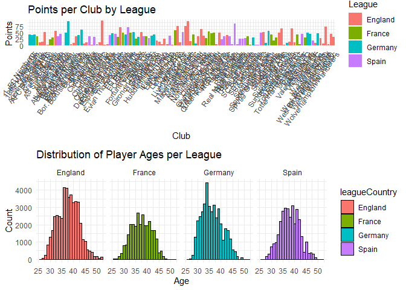

    ## [1] "Player with the most wins: Philipp Lahm"

    ## [1] "Player with the most goals: Lionel Messi"

    ## [1] "Player with the most red cards:  Bodipo"

    ## [1] ""

    ## [1] "Position with the most wins: Defense"

    ## [1] "Position with the most goals: Offense"

    ## [1] "Position with the most red cards: Offense"

    ## [1] ""

    ## [1] "League with the most wins: Germany"

    ## [1] "League with the most goals: Spain"

    ## [1] "League with the most red cards: Spain"

    ## [1] ""

    ## [1] "Club with the most wins: Bayern München"

