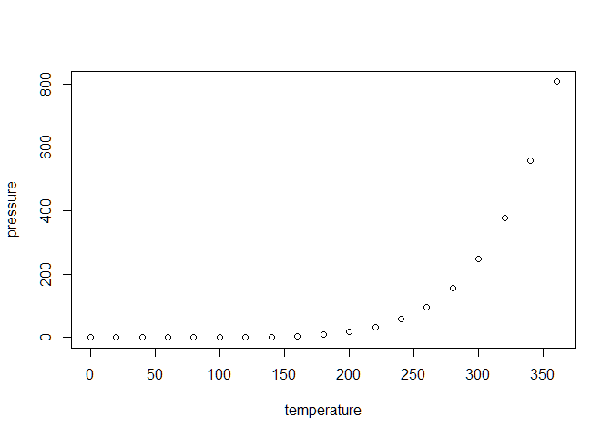

library(tidyverse) library(ggplot2) library(rio)

# Set working directory

setwd(“~/STUDIUM/Programming/R2 Data
projects/Data-projects-with-R-and-GitHub/Projects/baptistesolard”)

# Import datasets

import(‘Inventory\_Glassworkshop.csv’, setclass = ‘tibble’) -&gt;
inventory import(‘GlassBeads.csv’, setclass = ‘tibble’) -&gt; GlassBeads

# Table 1 Modification

# 1. Add a column SampleID after Number

inventory &lt;- inventory %&gt;% mutate(SampleID = paste(Context,
Number, sep = “.”)) %&gt;% relocate(SampleID, .after = “Number”)

# 2. Create a new dataframe “Rods” with selected columns

Rods &lt;- inventory\[, c(6, 20:23)\] inventory &lt;- inventory\[,
-c(20:23)\]

# 3. Transpose the table and extract color information

inventory2 &lt;- inventory %&gt;% pivot\_longer(cols =
HollowGlass:Miscellaneous, names\_to = “Type”, values\_to = “Presence”)
%&gt;% mutate(Colour = if\_else(Presence == 1 & grepl(“\_“, Type),
sub(”.\**“,”“, Type), NA\_character*)) %&gt;% filter(!is.na(Presence))
%&gt;% select(-Presence)

# Extract base object type

inventory2 &lt;- inventory2 %&gt;% mutate(Type = sub(“\_.\*“,”“, Type))
%&gt;% mutate(Colour = if\_else(Colour %in% c(”HollowGlass”,
“FlatGlass”, “Splitter”, “GlassChunk”, “Droplet”, “Slag”, “Tessera”,
“Bead”, “RV”, “OvenPiece”, “Miscellaneous”), NA\_character\_, Colour))

# 4. Join with Beads dataset

Beads\_select &lt;- select(GlassBeads, SampleID, Colour) Beads\_select
&lt;- Beads\_select %&gt;% mutate(Type = “Bead”) merged\_BI &lt;-
full\_join(Beads\_select, inventory2)

# Table 2 Modification (Beads)

# 1. Add a column SampleID after Number

GlassBeads &lt;- GlassBeads %&gt;% mutate(SampleID = paste(Context,
Number, sep = “.”)) %&gt;% relocate(SampleID, .after = “Number”)

# 2. Separate colour and decor

GlassBeads &lt;- separate(GlassBeads, col = “Colour”, into = c(“Colour”,
“Decor”), sep = “,”)
GlassBeads$Decor &lt;- gsub("decor ", "", GlassBeads$Decor, ignore.case
= TRUE)

# 3. Convert yes/no columns to boolean

GlassBeads &lt;- GlassBeads %&gt;% mutate( IronOxide = case\_when(
IronOxide == “y” ~ TRUE, IronOxide == “n” ~ FALSE, TRUE ~ NA ), Broken =
case\_when( Broken == “y” ~ TRUE, Broken == “n” ~ FALSE, TRUE ~ NA ) )

# 4. Join with previous dataframe

inventory2\_filtered &lt;- inventory2 %&gt;% filter(Type == “Bead”)
%&gt;% select(SampleID, Colour)

merged\_BI &lt;- full\_join(inventory2\_filtered, merged\_BI)

# Rod Table Modification

Rods &lt;- Rods %&gt;% rename\_with(~sub(“Rod\_”, ““, .),
starts\_with(”Rod\_“)) Rods &lt;- Rods%&gt;% mutate( Molten =
case\_when( Molten ==”y” ~ TRUE, Molten == “n” ~ FALSE, TRUE ~ NA ),
Plychrome = case\_when( Plychrome == “y” ~ TRUE, Plychrome == “n” ~
FALSE, TRUE ~ NA ) )

# Data Visualisation

# Fix typos in Colour column

merged\_BI &lt;- merged\_BI %&gt;% mutate(Colour = ifelse(Colour ==
“bluee”, “blue”, Colour)) merged\_BI &lt;- merged\_BI %&gt;%
mutate(Colour = ifelse(Colour == “Dm”, NA, Colour))

# Define custom color palette based on unique values in the “Colour” column

custom\_palette &lt;- unique(merged\_BI$Colour)

# Filter dataframes and remove NA values in “Colour” column

rods\_data &lt;- merged\_BI %&gt;% filter(Type == “Rod” &
!is.na(Colour)) beads\_data &lt;- merged\_BI %&gt;% filter(Type ==
“Bead” & !is.na(Colour)) ogws\_data &lt;- merged\_BI %&gt;% filter(Type
== “OGW” & !is.na(Colour)) all\_data &lt;- merged\_BI %&gt;%
filter(!is.na(Colour))

# Create histograms for each object type

hist\_rods &lt;- ggplot(rods\_data, aes(x = Colour, fill = Colour)) +
geom\_histogram(color = “black”, stat = “count”) +
scale\_fill\_manual(values = custom\_palette) + labs(title = “Colour
Distribution for Rods”, x = “Colour”, y = “Frequency”)

hist\_beads &lt;- ggplot(beads\_data, aes(x = Colour, fill = Colour)) +
geom\_histogram(color = “black”, stat = “count”) +
scale\_fill\_manual(values = custom\_palette) + labs(title = “Colour
Distribution for Beads”, x = “Colour”, y = “Frequency”)

hist\_ogws &lt;- ggplot(ogws\_data, aes(x = Colour, fill = Colour)) +
geom\_histogram(color = “black”, stat = “count”) +
scale\_fill\_manual(values = custom\_palette) + labs(title = “Colour
Distribution for OGWs”, x = “Colour”, y = “Frequency”)

# Combine histograms for all types

hist\_combined &lt;- ggplot(all\_data, aes(x = Colour, fill = Colour)) +
geom\_histogram(color = “black”, stat = “count”) +
scale\_fill\_manual(values = custom\_palette) + labs(title = “Colour
Distribution for All Object Types”, x = “Colour”, y = “Frequency”)

 
 

