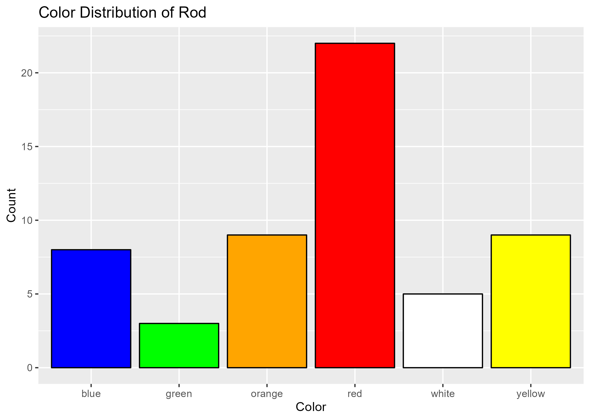
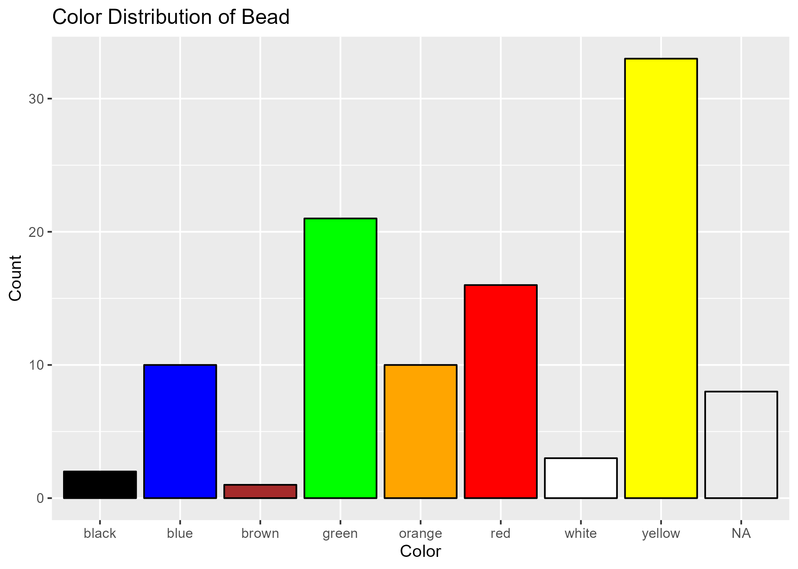
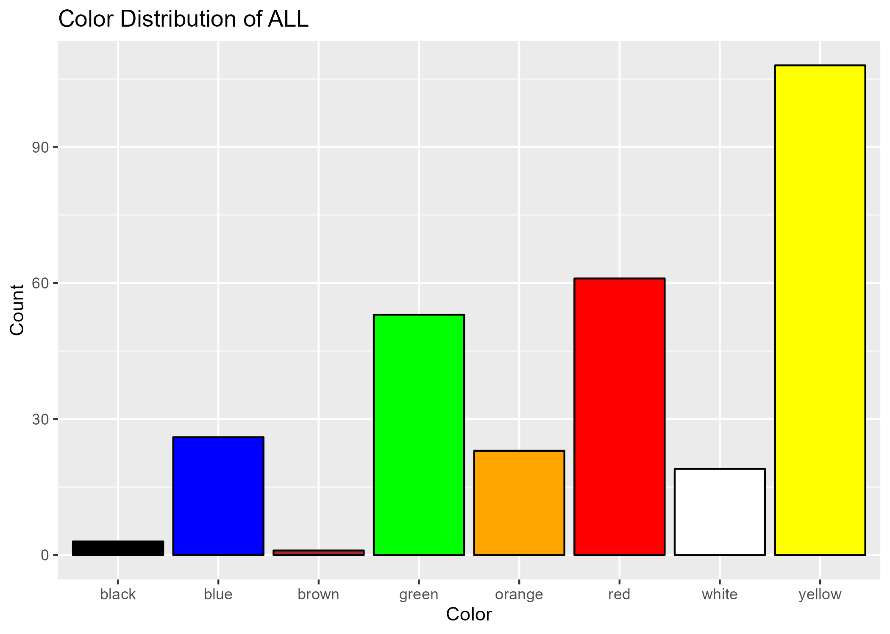

```{r setup, include=FALSE}
knitr::opts_chunk$set(echo = TRUE)
```

```{r}
#'Clear workspace
rm(list = ls())

##################################### Importing Packages #####################################

if (!require("tidyverse")) install.packages("tidyverse")
if (!require("dplyr")) install.packages("dplyr")
if (!require("ggplot2")) install.packages("ggplot2")

library("tidyverse")
library("dplyr")
library("ggplot2")

##################################### Setting Working Directory #####################################

inventory_csv_url <- "https://dr-eberle-zentrum.github.io/Data-projects-with-R-and-GitHub/Projects/baptistesolard/Inventory_Glassworkshop.csv"
glass_beads_csv_url <- "https://dr-eberle-zentrum.github.io/Data-projects-with-R-and-GitHub/Projects/baptistesolard/GlassBeads.csv"

inventory_original <- read.csv(inventory_csv_url, sep=";")
glass_beads_original <- read.csv(glass_beads_csv_url, sep=";")
```

# Objectives: Modification of the data tables
## (1) Inventory Table Modifications - Steps 1 - 2

```{r}
#'I add a new column called SampleID as unique identifier for each observation
inventory_original <- inventory_original %>% 
  mutate(SampleID = paste0(Context, ".", Number))
```


###Issues with Data

Later during the data transformation process, I realized that your inventory dataframe contains duplicate values.
A similar issue came up when merging the data between the glass_beads table and the inventory below (See code below).

Here I provide you with the SampleIDs that are duplicates in the data. 
You should investigate your data source regarding the reason for the duplicates and how to prevent this from happening in the future. 

```{r}
inventory_duplicates <- inventory_original[duplicated(inventory_original$SampleID) | duplicated(inventory_original$SampleID, fromLast = TRUE), ]
print(unique(inventory_duplicates$SampleID))
```

I will delete those duplicate values from the inventory for which there is no conflicting information provided.
Some of the observations provide conflicting data tho which will be addressed later down below. 
For that reason only 3 of the 5 duplicate SampleIDs will be omitted at this point. 

I create a new table called rods that contains these columns of the inventory_original table:

- SampleID
- Rod_Molten
- Rod_Plychrome (Typo in original data!)
- Rod_Length
- Rod_Dm

```{r}
inventory_original <- unique(inventory_original)

rods_original <- inventory_original[, c("SampleID", "Rod_Molten", "Rod_Plychrome", "Rod_Length", "Rod_Dm")]

#'I removed the Rod_ columns that I added to the rods table from the inventory_original table. SampleID, I keep. 
inventory_original <- select(inventory_original, -c("Rod_Molten", "Rod_Plychrome", "Rod_Length", "Rod_Dm"))
```

## (2) Inventory Table Modifications - Step 3

### Transposing Inventory Table
```{r}
inventory_edited <- inventory_original %>% pivot_longer(HollowGlass:Miscellaneous, #Transposing all columns between HollowGlass:Miscellaneous
                                            names_to="Type", #New column name of names is called Type
                                            values_to="Indicator") %>% #New column name of values is called Indicator because it indicates if an object is something
  filter(!is.na(Indicator)) %>% #I keep only those observations for which there is a value in the Indicator column
  separate(col = Type, into = c("Type", "Color"), sep = "_") %>%  #I split the observation names of the column Type as the names contain both information about the object and about the color
  subset(select = -Indicator) #I remove the indicator column as it is no longer needed

#Printing the new table
head(inventory_edited)
```

### Transposing Rods Table

```{r}
rods <- rods_original %>% pivot_longer(Rod_Molten:Rod_Plychrome, #Transposing all columns between Rod_Molten:Rod_Plychrome
                                             names_to="Characteristic", #New column name of names is called Characteristic
                                             values_to="Indicator") %>% #New column name of values is called Indicator because it indicates if an object is something
  filter(!is.na(Rod_Length) & !is.na(Rod_Dm) & !is.na(Indicator)) %>%  #Keeping only relevant observations
  separate(col = Characteristic, into = c("temp_column", "Characteristic"), sep = "_") %>%  #Splitting Characteristic column to remove "Rod" 
  rename(DM = Rod_Dm, #Renaming columns to remove "Rod" of the column names
         Length = Rod_Length) %>% 
  subset(select = -c(Indicator, temp_column)) #Removing column Indicator and temp_column

#Printing new table
head(rods)

```

## (3) Glass Beads Table Modifications - Steps 1 - 3 

```{r}
glass_beads_edited <- glass_beads_original %>% 
  mutate(SampleID = paste0(Context, ".", Number)) %>% #Creating the SampleID column
  rename(Color = Colour) %>%  #Changing the name of the column Color to US English [I like it better :) ]
  separate(col = Color, into = c("Color", "Decor"), sep = ",") %>% #Splitting the column Color into Color and Decor
  mutate(Decor = trimws(gsub("decor", "", Decor))) %>%  #Removing the word decor
  mutate(IronOxide= ifelse(IronOxide=="n", FALSE, TRUE)) %>%  #Replacing values to Boolean Format for column IronOxide
  mutate(Broken = ifelse(Broken=="n", FALSE, TRUE)) #Replacing values to Boolean Format for column Broken

#Printing new table
head(glass_beads_edited)

```

## (4) Inventory Table Modifications - Step 4

###Issues with Data

The Inventory & Glass Beads tables contain conflicting data.
I found two SampleIDs that are contained in both tables but are assigned to different object types.

- SampleID: 2897.203 = RV in Inventory Table but also contained in Beads Table
- SampleID: 3159.203 = HollowGlass in Inventory Table but also contained in Beads Table

This issue is addressed below:

```{r}

#'I create a new dataframe used for merging 
glass_beads_merge <- glass_beads_edited %>% 
  select(c(Color, SampleID)) %>% #I select the columns Color and SampleID
  mutate(Type="Bead") #I create a new column called Type that contains the value Bead

#'I use a full join to merge the inventory table and the newly created glass_beads_merge table.
#'I use the variable SampleID to merge the data
inventory <- full_join(inventory_edited, glass_beads_merge, by = "SampleID")

#'To show the above explained problem with the conflicting data in the two tables, I print the relevant lines:
#'As you can tell the two columns Type.x (Inventory Table) and Type.y (Beads Table) have different values.
bead_duplicates <- inventory %>% 
  filter(Type.x == "Bead" | Type.y == "Bead") %>% 
  filter(Type.x != Type.y) %>% 
  print()
```

For the purpose of this project, I will for now override the Type information coming from the inventory table.
Assuming that the beads table was most likely handled with more care, I assume the two objects to actually be beads.
For that reason, I will disregard the information provided by the inventory table.

However, you should definitely address this issue when you continue to work with this data!

```{r}
inventory <- inventory %>% 
  rename(Type = Type.x) %>% #I rename the Type.x Column from the inventory table
  mutate(Type = ifelse(!is.na(Type.y) & Type != "Bead", Type.y, Type)) %>%  #I override the object information that conflicts with the beads table
  subset(select = -Type.y) %>%  #I drop the Type column from the beads table
  rename(Color = Color.x) %>%  #I rename the Color.x Column from the inventory table
  mutate(Color = ifelse(is.na(Color) & !is.na(Color.y), Color.y, Color)) %>%  #I add the color information from the beads table to the color column of the inventory table
  subset(select = -Color.y) #I drop the Color column from the beads table

head(inventory)

```

## (5) Glass Beads Table Modifications - Steps 4

```{r}
#'I create a new table that contains only the releant rows that need to be appended
glass_beads_append <- inventory %>% 
  filter(Type=="Bead") %>% 
  filter(SampleID %in% setdiff(SampleID, glass_beads_edited$SampleID))

#Maybe not the nicest solution here but due to compatability issues when merging, I had to change the column types of some columns to character
glass_beads_edited <- glass_beads_edited %>% 
  mutate(Field = as.character(Field),
         POS = as.character(POS),
         Number = as.character(Number))

#I used all these columns to join to prevent the .x and .y suffix creation of the tables.
#There are probably nicer solutions but thats as good as it gets for now. 
glass_beads <- full_join(glass_beads_edited, glass_beads_append, by = c("SampleID", "Obj", "Field", "POS", "Context", "Number", "Phase", "Type", "Color"))

```

There are now 3 final tables of the original data

1. inventory
2. rods
3. glass_beads

Please take a closer look at these tables to understand the duplicates issues:

1. bead_duplicates
2. inventory_duplicates

## (6) Visualization

```{r, echo=T}
#As you can see, some colors are written incorreclty
print(unique(inventory$Color))

#Quick fix for names of colors
inventory <- inventory %>% 
  mutate(Color = ifelse(Color == "greeen", "green", Color),
         Color = ifelse(Color == "bluee", "blue", Color)) 


#I add all the objects I want to create a histogram for to a vector
typesOfObjects <- c("Rod", "Bead", "OGW")

plotColorHistogram <- function(typeOfObject) {
  subsetted_temp_data <- inventory
  
  if  (typeOfObject == "ALL") {
    subsetted_temp_data <- inventory %>% 
      filter(!is.na(Color))
  } else {
    subsetted_temp_data <- inventory %>% filter(Type == typeOfObject)
  }
  
  histogramGraph <- subsetted_temp_data %>%  ggplot(aes(x = Color, fill = Color)) +
    geom_bar(color = "black") + 
    theme_minimal() + #I like this theme!
    labs(title = paste("Color Distribution of", typeOfObject), x = "Color", y = "Count")
  
  return(histogramGraph)
}

ggsave("Plots/Rod_Histogram.png", plot = plotColorHistogram("Rod"))
ggsave("Plots/Bead_Histogram.png", plot = plotColorHistogram("Bead"))
ggsave("Plots/OGW_Histogram.png", plot = plotColorHistogram("OGW"))
ggsave("Plots/ALL_Histogram.png", plot = plotColorHistogram("ALL"))
```







