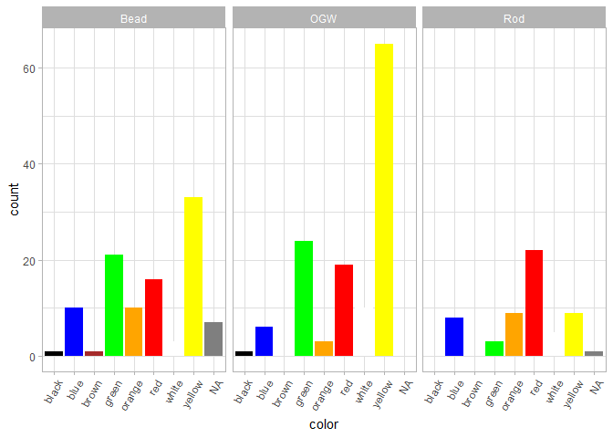
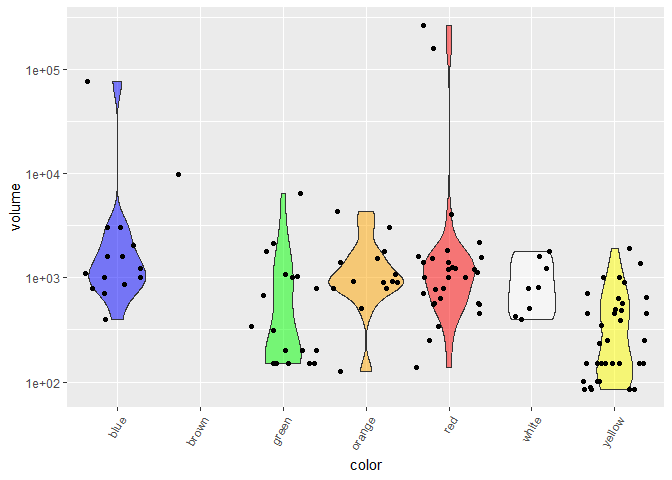

# Loading and Wrangling data

    data<-
      read_csv2("Inventory_Glassworkshop.csv", show_col_types = F) |>
      # (1)
      unite( SampleID,Context,Number, sep=".") |>
      relocate(SampleID,.before=Phase)

    ## ℹ Using "','" as decimal and "'.'" as grouping mark. Use `read_delim()` for more control.

    checkIfValueInVector <- function(x) {
      ifelse(sum(!is.na(x),na.rm=T)>0,1,NA)
    }

    # extraction of rod data + color annotation
    Rods <-
      select(data,
             SampleID,
             starts_with("Rod")) |>
      # correct spelling mistake
      rename(Rod_green = Rod_greeen) |>
      # get color of rod
      pivot_longer(`Rod_yellow`:`Rod_green`, names_to = "color", values_to = "colVal") |>
      drop_na(colVal) |>
      select(-colVal) |>
      mutate(color = str_remove(color,"^.*_") ) |>
      rename_with(~str_replace(., "Rod_", ""))
    OGW <-
      select(data,
             SampleID,
             starts_with("OGW")) |>
      # get color of rod
      pivot_longer(-SampleID, names_to = "color", values_to = "colVal") |>
      drop_na(colVal) |>
      select(-colVal) |>
      mutate(color = str_remove(color,"^.*_") )
    Pontil <-
      select(data,
             SampleID,
             starts_with("Pontil")) |>
      # get color of rod
      pivot_longer(-SampleID, names_to = "color", values_to = "colVal") |>
      drop_na(colVal) |>
      select(-colVal) |>
      mutate(color = str_remove(color,"^.*_") )

    # get type annotation for each piece
    typeAnnotation <-
      data |>
      # aggregate rod/ogw/pontil information
      rowwise() |>
      mutate(
        across(matches("^(Rod|OGW|Pontil).+"), as.character),
        Rod = ifelse(sum(!is.na(c_across(matches("^Rod.+"))),na.rm=T)>0,1,NA),
        OGW = ifelse(sum(!is.na(c_across(matches("^OGW.+"))),na.rm=T)>0,1,NA),
        Pontil = ifelse(sum(!is.na(c_across(matches("^Pontil.+"))),na.rm=T)>0,1,NA)
      ) |>
      ungroup() |>
      # drop rod/ogw/pontil data
      select( !matches("^(Rod|OGW|Pontil).+")) |>
      distinct() |>
      # get type
      pivot_longer(cols = -c(Obj,Field,POS,SampleID,Phase), names_to = "type", values_to = "value")|>
      drop_na(value) |>
      select(-value)
      # group_by(SampleID) |>
      # summarize(n=sum(value,na.rm=T)) |>
      # filter(n>1)

    # add color information

    Beads <-
      read_csv2("GlassBeads.csv", show_col_types = F) |>
      separate(Colour, into = c("Colour","Decor"), sep=",", fill = "right") |>
      mutate(Decor = str_remove(Decor,"^\\s*decor\\s*")) |>
      mutate( SampleID = str_c(Context,".",Number)) |>
      rename(color = Colour)

    ## ℹ Using "','" as decimal and "'.'" as grouping mark. Use `read_delim()` for more control.

    Beads |> 
      slice_head(n=5) |> 
      knitr::kable()

<table style="width:100%;">
<colgroup>
<col style="width: 2%" />
<col style="width: 3%" />
<col style="width: 2%" />
<col style="width: 4%" />
<col style="width: 3%" />
<col style="width: 12%" />
<col style="width: 5%" />
<col style="width: 11%" />
<col style="width: 3%" />
<col style="width: 12%" />
<col style="width: 16%" />
<col style="width: 3%" />
<col style="width: 1%" />
<col style="width: 4%" />
<col style="width: 5%" />
<col style="width: 3%" />
<col style="width: 4%" />
</colgroup>
<thead>
<tr class="header">
<th style="text-align: right;">Obj</th>
<th style="text-align: right;">Field</th>
<th style="text-align: right;">POS</th>
<th style="text-align: right;">Context</th>
<th style="text-align: right;">Number</th>
<th style="text-align: left;">Phase</th>
<th style="text-align: right;">TypeNumber</th>
<th style="text-align: left;">Type</th>
<th style="text-align: left;">color</th>
<th style="text-align: left;">Decor</th>
<th style="text-align: left;">Form</th>
<th style="text-align: right;">Length</th>
<th style="text-align: right;">Dm</th>
<th style="text-align: right;">HoleSize</th>
<th style="text-align: left;">IronOxide</th>
<th style="text-align: left;">Broken</th>
<th style="text-align: left;">SampleID</th>
</tr>
</thead>
<tbody>
<tr class="odd">
<td style="text-align: right;">1052</td>
<td style="text-align: right;">12</td>
<td style="text-align: right;">458</td>
<td style="text-align: right;">312</td>
<td style="text-align: right;">201</td>
<td style="text-align: left;">Pit house - Backfilling</td>
<td style="text-align: right;">3</td>
<td style="text-align: left;">double-conical, small</td>
<td style="text-align: left;">green</td>
<td style="text-align: left;">NA</td>
<td style="text-align: left;">double-conical</td>
<td style="text-align: right;">6</td>
<td style="text-align: right;">6</td>
<td style="text-align: right;">2</td>
<td style="text-align: left;">NA</td>
<td style="text-align: left;">n</td>
<td style="text-align: left;">312.201</td>
</tr>
<tr class="even">
<td style="text-align: right;">1052</td>
<td style="text-align: right;">12</td>
<td style="text-align: right;">458</td>
<td style="text-align: right;">312</td>
<td style="text-align: right;">202</td>
<td style="text-align: left;">Pit house - Backfilling</td>
<td style="text-align: right;">15</td>
<td style="text-align: left;">winding marks</td>
<td style="text-align: left;">red</td>
<td style="text-align: left;">NA</td>
<td style="text-align: left;">asymmetrically pressed spherical</td>
<td style="text-align: right;">5</td>
<td style="text-align: right;">7</td>
<td style="text-align: right;">25</td>
<td style="text-align: left;">NA</td>
<td style="text-align: left;">n</td>
<td style="text-align: left;">312.202</td>
</tr>
<tr class="odd">
<td style="text-align: right;">1052</td>
<td style="text-align: right;">18</td>
<td style="text-align: right;">1460</td>
<td style="text-align: right;">858</td>
<td style="text-align: right;">201</td>
<td style="text-align: left;">Upper silt</td>
<td style="text-align: right;">3</td>
<td style="text-align: left;">double-conical, big</td>
<td style="text-align: left;">blue</td>
<td style="text-align: left;">NA</td>
<td style="text-align: left;">double-conical</td>
<td style="text-align: right;">8</td>
<td style="text-align: right;">8</td>
<td style="text-align: right;">3</td>
<td style="text-align: left;">NA</td>
<td style="text-align: left;">n</td>
<td style="text-align: left;">858.201</td>
</tr>
<tr class="even">
<td style="text-align: right;">1052</td>
<td style="text-align: right;">20</td>
<td style="text-align: right;">1072</td>
<td style="text-align: right;">1000</td>
<td style="text-align: right;">202</td>
<td style="text-align: left;">Pink - layer in situ</td>
<td style="text-align: right;">4</td>
<td style="text-align: left;">ring-shaped</td>
<td style="text-align: left;">green</td>
<td style="text-align: left;">NA</td>
<td style="text-align: left;">pressed barrel-shaped/ring</td>
<td style="text-align: right;">8</td>
<td style="text-align: right;">16</td>
<td style="text-align: right;">6</td>
<td style="text-align: left;">n</td>
<td style="text-align: left;">y</td>
<td style="text-align: left;">1000.202</td>
</tr>
<tr class="odd">
<td style="text-align: right;">1052</td>
<td style="text-align: right;">19</td>
<td style="text-align: right;">1724</td>
<td style="text-align: right;">1056</td>
<td style="text-align: right;">201</td>
<td style="text-align: left;">Pink - layer in situ</td>
<td style="text-align: right;">10</td>
<td style="text-align: left;">polychrome</td>
<td style="text-align: left;">yellow</td>
<td style="text-align: left;">slightly translucent red</td>
<td style="text-align: left;">ring-shaped</td>
<td style="text-align: right;">5</td>
<td style="text-align: right;">8</td>
<td style="text-align: right;">4</td>
<td style="text-align: left;">NA</td>
<td style="text-align: left;">n</td>
<td style="text-align: left;">1056.201</td>
</tr>
</tbody>
</table>

# Color Annotation

    colorAnnotation <-
      typeAnnotation |>
      # rod colors
      left_join(select(Rods, SampleID,color)
                ,by="SampleID") |>
      # ogw colors
      left_join(select(OGW, SampleID,color)
                ,by="SampleID") |>
      # ogw colors
      left_join(select(Pontil, SampleID,color)
                ,by="SampleID") |>
      # bead colors
      left_join(select(Beads, SampleID,color)
                ,by="SampleID") |>
      # join color columns into one
      unite(color,starts_with("color"),sep=", ", na.rm = T) |>
      mutate(color = ifelse(color=="",NA,color)) |>
      mutate(color = ifelse(color=="bluee","blue",color))

    # show first rows of color annotation
    colorAnnotation |> 
      slice_head(n=10) |> 
      knitr::kable()

<table style="width:100%;">
<colgroup>
<col style="width: 5%" />
<col style="width: 13%" />
<col style="width: 23%" />
<col style="width: 10%" />
<col style="width: 24%" />
<col style="width: 15%" />
<col style="width: 6%" />
</colgroup>
<thead>
<tr class="header">
<th style="text-align: right;">Obj</th>
<th style="text-align: left;">Field</th>
<th style="text-align: left;">POS</th>
<th style="text-align: left;">SampleID</th>
<th style="text-align: left;">Phase</th>
<th style="text-align: left;">type</th>
<th style="text-align: left;">color</th>
</tr>
</thead>
<tbody>
<tr class="odd">
<td style="text-align: right;">44</td>
<td style="text-align: left;">J</td>
<td style="text-align: left;">17-19 und Gräberfeld</td>
<td style="text-align: left;">249.xx1</td>
<td style="text-align: left;">NA</td>
<td style="text-align: left;">OvenPiece</td>
<td style="text-align: left;">NA</td>
</tr>
<tr class="even">
<td style="text-align: right;">851</td>
<td style="text-align: left;">Pl.Fl 43-46</td>
<td style="text-align: left;">557</td>
<td style="text-align: left;">466.201</td>
<td style="text-align: left;">Pink - R</td>
<td style="text-align: left;">HollowGlass</td>
<td style="text-align: left;">NA</td>
</tr>
<tr class="odd">
<td style="text-align: right;">1030</td>
<td style="text-align: left;">14</td>
<td style="text-align: left;">335</td>
<td style="text-align: left;">297.xx1</td>
<td style="text-align: left;">Oberer Silt</td>
<td style="text-align: left;">Miscellaneous</td>
<td style="text-align: left;">NA</td>
</tr>
<tr class="even">
<td style="text-align: right;">1030</td>
<td style="text-align: left;">8</td>
<td style="text-align: left;">655</td>
<td style="text-align: left;">359.xx1</td>
<td style="text-align: left;">Pink - R</td>
<td style="text-align: left;">GlassChunk</td>
<td style="text-align: left;">NA</td>
</tr>
<tr class="odd">
<td style="text-align: right;">1030</td>
<td style="text-align: left;">13</td>
<td style="text-align: left;">365</td>
<td style="text-align: left;">399.201</td>
<td style="text-align: left;">Pink - R</td>
<td style="text-align: left;">HollowGlass</td>
<td style="text-align: left;">NA</td>
</tr>
<tr class="even">
<td style="text-align: right;">1030</td>
<td style="text-align: left;">10</td>
<td style="text-align: left;">633</td>
<td style="text-align: left;">441.201</td>
<td style="text-align: left;">Pink - R</td>
<td style="text-align: left;">HollowGlass</td>
<td style="text-align: left;">NA</td>
</tr>
<tr class="odd">
<td style="text-align: right;">1030</td>
<td style="text-align: left;">10</td>
<td style="text-align: left;">633</td>
<td style="text-align: left;">441.202</td>
<td style="text-align: left;">Pink - R</td>
<td style="text-align: left;">HollowGlass</td>
<td style="text-align: left;">NA</td>
</tr>
<tr class="even">
<td style="text-align: right;">1052</td>
<td style="text-align: left;">12</td>
<td style="text-align: left;">458</td>
<td style="text-align: left;">312.201</td>
<td style="text-align: left;">Verfüllung Grubenhaus</td>
<td style="text-align: left;">Bead</td>
<td style="text-align: left;">green</td>
</tr>
<tr class="odd">
<td style="text-align: right;">1052</td>
<td style="text-align: left;">12</td>
<td style="text-align: left;">458</td>
<td style="text-align: left;">312.202</td>
<td style="text-align: left;">Verfüllung Grubenhaus</td>
<td style="text-align: left;">Bead</td>
<td style="text-align: left;">red</td>
</tr>
<tr class="even">
<td style="text-align: right;">1052</td>
<td style="text-align: left;">12</td>
<td style="text-align: left;">602</td>
<td style="text-align: left;">622.xx1</td>
<td style="text-align: left;">Verfüllung Grubenhaus</td>
<td style="text-align: left;">Rod</td>
<td style="text-align: left;">blue</td>
</tr>
</tbody>
</table>

# Color Histogram

    colorAnnotation |>
      filter(type %in% c("Rod","Bead","OGW")) |>
      ggplot(aes(x=color, fill=color)) +
      geom_bar(stat="count") +
      # set fill colors from data
      scale_fill_manual(values = colorAnnotation$color |> unique() |> str_sort()) +
      facet_wrap(~type
                 # , scales = "free"
                 ) +
      # rotate x-axis labels
      theme_light() +
      theme(legend.position="none") +
      theme(axis.text.x = element_text(angle = 60, hjust = 1))

# Distribution vs. Volume

    colDat <-
      colorAnnotation |>
      filter(type %in% c("Rod","Bead")) |>
      left_join(select(Beads,SampleID,Dm, Length), by="SampleID") |>
      left_join(select(Rods,SampleID,Dm, Length), by="SampleID") |>
      unite(Dm,starts_with("Dm"),sep=", ", na.rm = T) |>
      unite(Length,starts_with("Length"),sep=", ", na.rm = T) |>
      mutate(across(c(Dm,Length),as.numeric)) |>
      mutate(volume = (Dm^2)*Length*pi) |>
      drop_na(volume)
    colDat |>
      ggplot(aes(x=color, y=volume, fill=color)) +
      geom_violin( alpha=0.5)+
      geom_jitter() +
      scale_fill_manual(values = colDat$color |> unique() |> str_sort()) +
      theme(axis.text.x = element_text(angle = 60, hjust = 1)) +
      # disable fill legend
      theme(legend.position="none") +
      scale_y_log10()

    ## Warning: Groups with fewer than two data points have been dropped.

