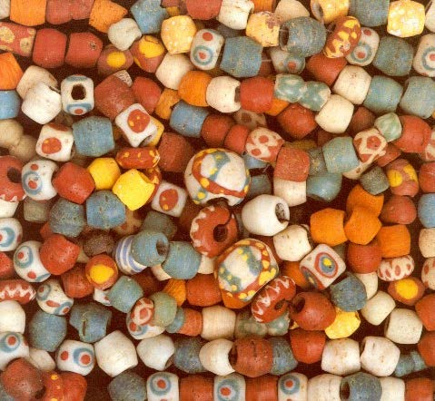
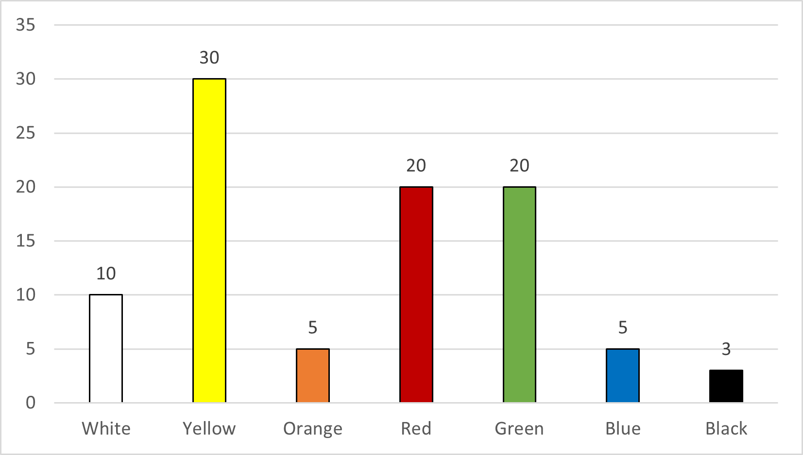

```{r setup, include = F}
library(tidyverse)
```

# Coloured Glass Beads in the Early Middle Ages

## Project description

In the early Middle Ages, coloured glass beads were a very common type of female ornament.  

{#id .class width=40% height=40%}  
*Example of early Medieval glass beads (from Sasse 1998).*

Up until today, many of these glass beads were found in female grave of the early Middle Ages all over Europe. However, very few locations of production sites were discovered unitl now. One of them is Zürich, Switzerland, where not only coloured glass beads can be found, but also ceramic vessels with coloured glassy attachments in them, suggesting a local production of the pigments destined for beadmaking.  

{#id .class width=40% height=40%}  
*Example of ceramic with a yellow glassy attachment inside found in Schleitheim, Switzerland (from Heck 2000).*

---

## Data sets

The archaeologists who excavated the site gave me two CSV files containing information about the all finds associated with glassmaking.  
The main `Inventory` table is... let's say quite hard to navigate without modifications.

```{r table import, include = F}
Inventory <- read_delim("Inventory_Glassworkshop.csv", 
                        col_names = T, delim = ";")

Beads <- read_delim("GlassBeads.csv", 
                        col_names = T, delim = ";")
```

### Table 1: Inventory

The first CSV table ([Inventory_Glassworkshop.csv](https://github.com/Dr-Eberle-Zentrum/Data-projects-with-R-and-GitHub/blob/main/Projects/baptistesolard/Inventory_Glassworkshop.csv)) is the inventory of the archaeological finds associated with glassmaking.  
Here is an extract of the `Inventory` table:

```{r extract Inventory, echo = F}
knitr::kable(Inventory[1:6, 1:10])
```

* The first 4 columns contain the serial number of each object

  * `Obj`, `Field`, `POS`, and `Context` refer to the exact localisation of the finds and is connected with the map of the excavation site.

  * `Number` is the actual number of the object. The numbers are always reintialised for each context, meaning that the unique identifier of each object can be obtained by combining `Context.Number`. For instance, in row 2, the unique identifier would be "`r str_c(Inventory$Context[2], Inventory$Number[2], sep = ".")`".  
    When the object number was missing, I filled it with `xx1`, `xx2`, etc. to at least have something.

* The `Phase` column gives the name of the soil layer in which the objects were found.

* All the other column represent the different object types. If individual objects belong to one type, there is a 1 in the corresponding column (except columns 20–23, see below). In some case, the colours of the glass objects are also indicated.

  * `HollowGlass`, `FlatGlass`, `Splitter`s, `GlassChunk`s, and  `Droplet`s are remains made of transparent glass.

  * `Slag`s are by-product of glassmaking.

  * `Tessera`e are square pieces of mosaic, usually made of glass.

  * Glass `Rod`s small pieces of cane or stick made of glass. `Rod_molten`, `Rod_polychrome`, `Rod_length`, and `Rod_dm` are the characteristics of the said rods: if they are molten or polychrome (those are yes/no columns), and their length and diameter (in cm).

  * `Pontil` are pontil glass. A pontil glass is a piece of glass which bears marks of tool use (very interesting when studying the production process of said glass objects!).

  * `OGW` = opaque glass waste are piece of coloured glass, probably fallen off during the production of the objects, or which shapes are unrecognisable.

  * The colour of the `Bead`s are not given in this table. They can be found in Table 2.

  * `RV` = reaction vessels. These are ceramic fragments, which have some glassy attachment on them. The pigments and glass were produced in these vessels, so they are of very interesting for studying the production process. The glassy attachments in these RVs are also coloured, but unfortunately the information was not recorded in the inventory data tables...

  * `OvenPiece` are ... oven pieces, in which the glass was made. Or at least they remains of some pyrotechnological installation, which should be connected to glassmaking.

  * `Miscellaneous` is self-explanatory: these are objects that do not belong to any of the above-mentioned categories.

### Table 2: Glass beads

The second CSV table ([GlassBeads.csv](https://github.com/Dr-Eberle-Zentrum/Data-projects-with-R-and-GitHub/blob/main/Projects/baptistesolard/GlassBeads.csv)) records the characteristics of each glass bead, including their colour.  
Here is an extract of the table:

```{r extract Beads, echo = F}
knitr::kable(Beads[1:6, ])
```

* The first 5 columns again contain the serial number and phase of each object, as in Table 1.

* `TypeNumber` represent the type of the beads. These numbers correspond to specific types described in the literature.

* `Type` describes the type of each bead in words.

* `Colour` gives the colour of each bead. Some of them are polychrome and the secondary/decoration colour(s) are given here as well, which make a categorisation in R (via `group_by()` for instance) hard to make.

* `Form` describes in words the shape/form of the beads.

* `Length`, `Dm`, and `HoleSize` give the metric characteristics of each bead (in cm): length, diameter, and size of the tread hole. Some beads have missing parameters because they could not be measured (brocken beads) or simply were not measured yet.

* `IronOxide` is a yes/no column giving the presence or not of traces of iron oxide attached to the beads. These traces of iron oxide are remains of the metal rod/stick used to produce the beads.

* `Broken` is another yes/no column indicating if the bead is broken or not.

---

## Objectives: Modification of the data tables

### Table 1

Table 1 (`Inventory`) should be modified:

1. Add a column `SampleID` which gives an unique identifiers for each object and place this column after `Number`.  
This should be done by combining `Context` and `Number` with `.` as separator to obtain `Context.Number`.
  
2. Remove the extra characteristics from the glass rods (columns 20–23) and store them in a new table dedicated to rods called `Rods` (like the one with beads). Be careful to keep at least `SampleID` with it, so we can still use the information later.
  
3. Transpose the table so that the object type and colour information are given in 2 new columns: `Type` and `Colour`. If no colour information was given, simply leave it as `NA`.  
According to Martin, this could be done with `pivot_longer()`. 
  
4. The colour information for the beads can be taken from `Beads` (after `SampleID` is added to that table) using a `join()` function (see the different `join()` functions [here](https://github.com/Dr-Eberle-Zentrum/Data-projects-with-R-and-GitHub/issues/212)).  
⚠️ One problem here: not all the beads in `Beads` are in `Inventory`, and vice versa. To tackle this, I would suggest this method:
    a. first do the modification on `Beads` as described below (Table 2, point 1 and 2)
    b. `select()` only the columns `SampleID` and `Colour`
    c. create a column `Type` with `"bead"` as value for all rows
    d. `full_join()` with `Inventory`
This should ensure that all beads in `Beads` are added to `Inventory` with their respective colour and with always `"bead"` as value in `Type`.
  
  
### Table 2

Table 2 (`Beads`) should also be modified:

1. Like in the `Inventory` table, add a column `SampleID` which gives an unique identifiers for each object. Place this column after `Number`.

2. Since `Colour` also gives additional colours for the polychrome beads, this column needs to be separated into 2: `Colour` and `Decor` (probably using the `separate()` function). At best, the word `"decor"` should also be removed from the description in column `Decor`.  
Example: in row 5, we would get `Colour[5] = "yellow"` and `Decor[5] = "slightly translucent red"`.

3. The yes/no columns (`IronOxide` and `Broken`) could be modified to contain actual booleans instead, by replacing `y` by `TRUE` and `n` by `FALSE`.

4. As mentioned above, not all beads recorded in `Inventory` are in `Beads`. To add them, we need to do another `full_join()` with the following steps:
    a. first do the `full_join()` described above (Table 1, point 4)
    b. using `Inventory`, `filter()` for beads and `select()` the columns `SampleID` and `Colour`
    c. `full_join()` with `Beads`

### New table: Rods

In the new table `Rods` extracted from the `Inventory` table recording the characteristics of the rods, the names for the columns can be changed to remove `Rod_` in them since this is not needed anymore. The columns should be called `Molten`, `Polychrome`, `Length`, and `Dm`.

The colours of the rods could also be added to this table by extracting the information from the `Inventory` table.

The yes/no columns (`Molten` and `Polychrome`) could be modified to contain actual booleans instead, by replacing `y` by `TRUE` and `n` by `FALSE`.

---

## Visualisation

### Colour distribution

From the `Inventory` table, an histogram of the `Colour` distribution for the `Rod`s, `Bead`s, and `OGW`s can be created. One histogram per object type, and one combining all types.  

Here is an example of how it should look like:  
{#id .class width=40% height=40%}


### Distribution vs. Volume

It is interesting to know how many beads and rods there is per colours, but I already observed with the pictures taken from the samples that yellow beads for instance tend to be smaller than the red ones, although there are more yellow beads than red.  
Therefore, it would also be interesting to plot an histogram of the volume represented by each colour for the `Beads` and `Rods` since we have the information for most of them. Obviously, not all beads and rods have the same shape, so it is hard to calculate their volume, but we can make a rough approximation, considering them as cylinders.  
After creating a new column `Volume = pi * (Dm)^2 * Length` in both `Beads` and `Rods`, we can now plot a new histogram of `Volume` per `Colour` for both.  
As an additional information, the number of beads and rods excluded from the volume calculation because of missing information could be given.