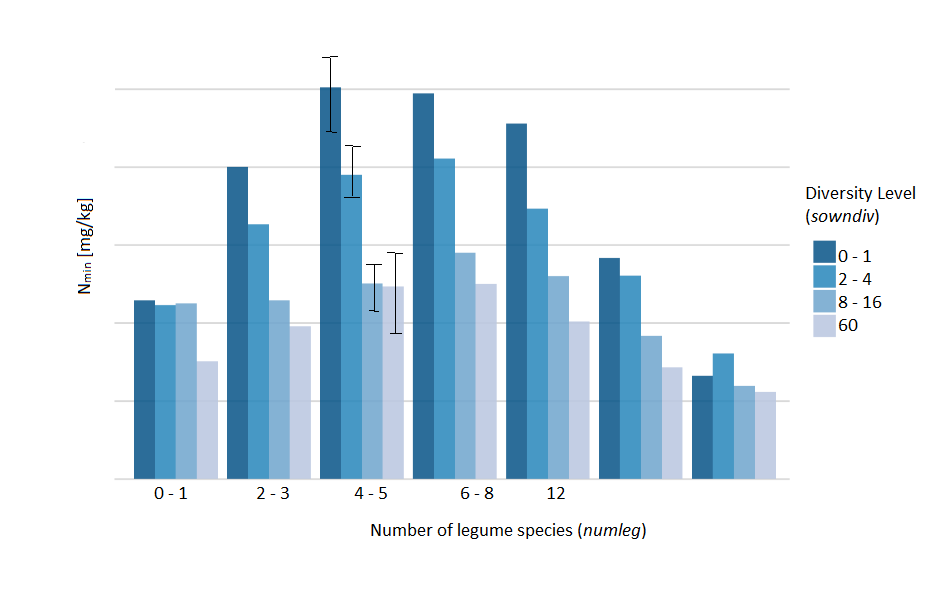

# Biodiversity and Nmin visualization

### The Description

#### The Jena Experiment
The Jena Experiment was established in 2002 with the aim to link biodiversity and the population processes in ecological communities to ecosystem fluxes. Sixty plant species were used to assemble experimental plant communities of different diversities. Different plots with different diversity levels were created.     

[Visit the homepage for more information](http://the-jena-experiment.de/)

#### Nmin
Nitrogen is one of the most common nutrient in plant substance and part of a large number of vital compounds like amino acids, DNA, vitamines and chlorophyll. Plants can mainly recieve N in form of mineralic N, in short Nmin. In agriculture Nmin is an important factor to determine the need of fertilization.

#### Legumes
Legumes belong to the plant family of Fabaceae. In german they are called Hülsenfrüchte. Most legumes can enter into a symbiosis with the N-fixing Rhizobiaceae bacteria (Knöllchenbakterien) on their roots, giving legumes an important role in crop rotation.

***

### The data
The [CSV](nmin_jena_2022.csv) contains many information taken from different plots (rows of the CSV) at the Jena Experiment field in September 2022. Not all columns are of importance to our visualization. Here are some descriptions for the abbreviation:

* *sowndiv*: number of different plant species (plant diversity level)
* *funcgr*: number of different functional groups
* *numgras*: number of grass species
* *numsherb*: number of small herbs 
* *numtherb*: number of tall herbs
* *numleg*: number of legumes

Only the first (*sowndiv*) and the last one (*numleg*) as well as the Nmin-colon will be of interest to us.

### The Task
Make a bar plot that shows the following:

* Y-axis: the mean of Nmin mith the given unit
* X-axis: the grouped *numleg*-values as shown in the exampel below
  + the *numleg*-groups shall contain sub groups as shown in the exampel below
  + the subgroups shall represent the grouped *sowndiv*-values
  + the subgroups must be easily distinguishable (of different colors or symbology)
  + each bar needs to have an error bar representing the standard error
  + the symbology/colors of *sowndiv* shall be described in a legend box
  
The result should look something like this: 

