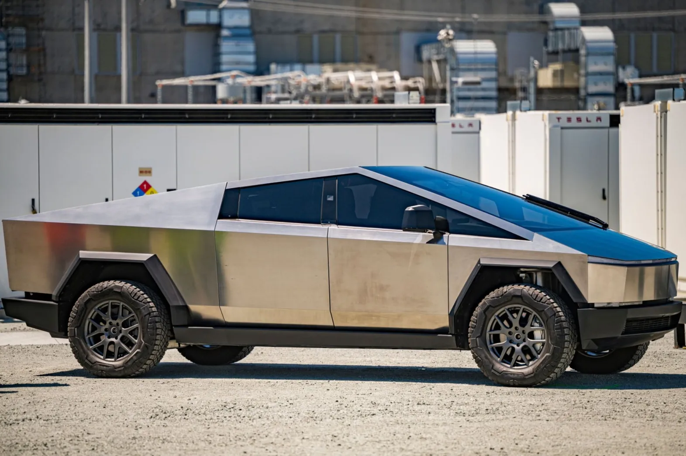

------------------------------------------------------------------------

# **Topic of the Project [🔗](#Topic-of-the-Project)**

------------------------------------------------------------------------

#### **You probably know** [**Elon’s Cybertruck**](https://www.ocregister.com/wp-content/uploads/2023/11/OCR-Z-CYBERTRUCK-1129.jpg?w=1571).

This remarkable ride looks like it’s straight from a post-apocalyptic
era.

#### **However, it’s still way too ugly and edgy 🤮.**

For this **reason**, in this project, we are creating a **Standard
Operating Procedure** or
[**SOP**](https://www.digimojo.de/blog/was-ist-eine-sop-standard-operating-procedure-standardarbeitsanweisung)
**Layout** in **.md format** for Elon, and together we’ll secure his
place in the billionaire’s rank list.
<https://www.bloomberg.com/billionaires/>

------------------------------------------------------------------------

### **No more time for** [**ugly edges and futuristic extravagance !**](https://s1.cdn.autoevolution.com/images/news/elon-musk-suggesting-the-cybertruck-is-bulletproof-is-reckless-and-nothing-new-223201_1.jpg)

##### *“From the improved aerodynamic shape of the body to the overhaul of the autopilot, which previously thought”left” and “right” were merely directional instructions from another galaxy.”*

##### **Each component** / **work part** undergoes a transformation, and we want to create a **separate** [**SOP**](https://www.digimojo.de/blog/was-ist-eine-sop-standard-operating-procedure-standardarbeitsanweisung) for each part as **own** **.md-output !** ⚠️

⇒ **Note:**
`Each row "component" from table 1-3 gets its own .md-output`

This way, we aim to ensure that Elon can once again fully focus on
implementing his mission 🚀 and vision 💫 ✨ – leading humanity into the
vastness of interplanetary space and guiding it to the next stage of
development as an interstellar species.

Moreover, it would be quite delightful if the Cybertruck soon shines not
only in distant worlds but also on Earth.

------------------------------------------------------------------------

#### **So this is how the final SOP-Layout should look alike:**

------------------------------------------------------------------------

------------------------------------------------------------------------

# **Dataset** 📊 [🔗](#Dataset)

------------------------------------------------------------------------

------------------------------------------------------------------------

##### *“The cyber engineers, also known as ‘Tech Pioneers,’ tirelessly combed through every corner of the digital universe day and night, gathering with dedication all pertinent component data.*

##### *The sound of their keyboards became a symphonic anthem 🎙 of innovation .*

##### *Yet, while we speak of their passionate quest and unwavering dedication here, **the next chapter’s** will reveal how you can utilize this data and transform the CyberTruck into a space epic.*”

------------------------------------------------------------------------

**The Dataset contains 3 subfolder:**

-   The [folder **tables**](./Datasets/tables): contains **3 .csv
    tables** 📊, these tables represent **the data** what should be done
    for **each component/ work part**. These tables can be **mergeed to
    one** by the column `#`

-   The [folder
    **codebooks**](https://github.com/Dr-Eberle-Zentrum/Data-projects-with-R-and-GitHub/tree/main/Projects/blubbi90/StandardOperatingProcedureLayout/Datasets/codebooks)
    : contains **7** single **.xlsv table’s**, which containing **all
    informations**, what’s the meaning of the single values in **table
    1-3**.

-   The [folder
    **images**](https://github.com/Dr-Eberle-Zentrum/Data-projects-with-R-and-GitHub/tree/main/Projects/blubbi90/StandardOperatingProcedureLayout/Datasets/images)
    : contains all the **requiered images** for the SOP’s as **.png
    files** 📸.

------------------------------------------------------------------------

##### **Take care**, one cell can contain **more** than one **value !**

→ **Note:** This will be explained in more detail under the section:
[Layout: Table Sequence](###Layout:-Table-Sequence)

------------------------------------------------------------------------

------------------------------------------------------------------------

## **Codebook Structure** ⚠️ [🔗](#Codebook-Structure)

------------------------------------------------------------------------

##### **The** [**codebooks**](https://github.com/Dr-Eberle-Zentrum/Data-projects-with-R-and-GitHub/tree/main/Projects/blubbi90/StandardOperatingProcedureLayout/Datasets/codebooks) **consist of 4 columns:**

------------------------------------------------------------------------

### **Section:** ➡️ [🔗](#Section:)

-   Indicates where the following values should appear in the final
    layout (“Arbeitsschritte X”, “Ablauf”, “Hilfsmittel”).

------------------------------------------------------------------------

### **TextBaustein:** 🔤 [🔗](#TextBaustein:)

-   This part is unique in the **Overview** codebook. As we aim to
    display essential information in the overview, these strings are
    conditional.

    The structure is as follows:

            - [Introtext] is always displayed.

            - [InfoVar1/2]: one of the variants is displayed depending on the column [Stempel] in Tables 1-3.

            - [InfoAddVar1/2]: either none, one, or both are displayed based on columns
              [Handschuhe] &| [if_Gewinde] = True.

------------------------------------------------------------------------

### **Table\_ID:** 📖 [🔗](#Table_ID:)

-   Usually a list of all value labels for a specific column from
    **Tables 1-3**. The associated column is mentioned in the square
    brackets in the header.

-   It can also contain values in square brackets that refer to
    corresponding columns in **Tables 1-3**. The values in the columns
    can be seen as values and/or conditions. These values can consist of
    strings, images, or booleans.

    → **Note:** If the reference to a column value/condition is `false`
    or contains `NA`s or `0`, the corresponding image/string in the
    respective **Section** from the **Codebook** need **not be
    included**.

    → The value `"always"` means the corresponding part (string/image)
    will always be displayed in the **Section** if the corresponding
    **Arbeitsschritt** appears.

    ⇒ **Note:** ⚠️ Through the codebook’s **Table\_ID**, the values from
    **Tables 1-3** can be matched with their corresponding
    strings/images & Section **!**

------------------------------------------------------------------------

### **String:** 📃 [🔗](#String:)

-   Indicates the string/text to be displayed in the corresponding
    **Section**. It may contain values in square brackets for notes,
    which should be taken from the corresponding column in **Tables
    1-3**.

-   If the value is empty (`NA`, `0`), nothing is displayed.

-   **Strings** can also contain regular expressions, e.g., `/n` for a
    line break, `\d{}` for digit removal/addition, etc.

-   If possible, text formatting (font size/style, bold, colored, etc.)
    from the codebooks should be preserved.

    → **Note:** In the **Codebook “7.Verpacken”**, the value
    `[count_total]` appears in square brackets. This needs to be
    generated based on:

          `vp_count_layer_pcs * vp_count_layer + vp_count_layer2`.

------------------------------------------------------------------------

### **Image:** 📷 [🔗](#Image:)

-   Specifies the image file (.png) associated with **Table\_ID** and
    **Section** in the Image folder.
-   Values in \[square brackets\] correspond to *component-specific
    images* and should be taken from the respective column in **Tables
    1-3**.
-   The images should be displayed below their respective strings.

------------------------------------------------------------------------

## **The Table’s:** 📈 [🔗](#The-Table's)

------------------------------------------------------------------------

The **Table 1-3** can contain multiple values per cell, each with
different meanings based on their format:

-   Values separated by “;” are listed in the same “Arbeitsschritte X”.

-   Values separated as ” \[“2. Entgraten”,“3. …”\] ” or ” 2.
    Brennerspuren / (braune) Schlieren, 11. ….” are packed into separate
    “Arbeitsschritte X” & “Arbeitsschritte Y” with their own numbering.

    ⇒ **Note:** The values `undefined` & `null` correspond to NA values.

------------------------------------------------------------------------

# **The Final SOP Layout** ⚠️ [🔗](#The-SOP-Layout)

------------------------------------------------------------------------

##### **The final layout should include:**

-   A headnote containing:

            `"Standard Operating Procedure: Manufacturing" \n
              Article: [Article]/[Article_coupl]`

-   The logo.png in the top-right corner.

-   A header-text: **Manufacturing of Raw Product:**

              `[Article]"/"[Article_coupl] \n
              - Vorbereiten des Arbeitsplatzes! \n
              - Strukturierter Arbeitsablauf, um den Prozess sicherzustellen!`

-   A table of the manufacturing steps (3 columns).

-   A footnote containing: date / name / page.

    → **Note:** `[Article_coupl]` should only be displayed if there is a
    value.

------------------------------------------------------------------------

## **The Table-layout** 📊 [🔗](#The-Table-layout)

------------------------------------------------------------------------

### **Layout: Table Sequence** [🔗](#Layout:-Table-Sequence)

-   The **Overview** section should be generated for **each** work part
    **!** ⚠️

-   The further **sequence** of **“Arbeitsschritte”** can be determined
    based on the **numbering** in the [**Codebook**](#Codebook).

-   **Whether** an “Arbeitsschritt” needs to be **included** in the
    **\#SOP** can be determined either by the presence of the variable
    `Table_ID` entry in **Tables 1-3** or by the corresponding auxiliary
    **variables**:

                   ` "if_Anguss","if_Bearbeiten", etc.)` .

------------------------------------------------------------------------

### **Layout: Table format** [🔗](#Layout:-Table-format)

-   Above each manufacturing step, there should always be a row
    containing the specific sequence of column headers: “Arbeitsschritt
    X; Ablauf; Hilfsmittel”.

    -   The “X” should be a continuous number for each manufacturing
        step, starting with “1” for “Overview”.

-   You can find the input-strings related column headers in the
    **Tables 1-3** under the [Codebook](#Codebook) in the
    **Section**-Part.

-   Make an extra row for each manufacturing step (each Codebook entry)
    with its header row above.

------------------------------------------------------------------------

------------------------------------------------------------------------

**Elon be ready, together we will fix your mistake !**

------------------------------------------------------------------------
