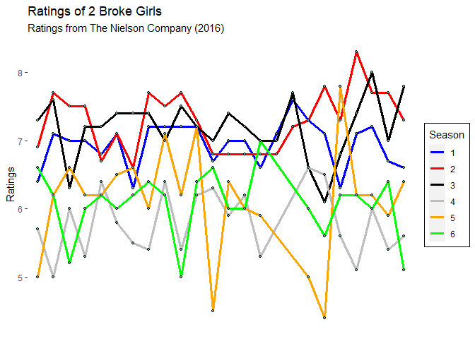

**Cleaning**

    rm (list = ls())
    cat ("\14")



    graphics.off()

**Packages**

    if (!require(ggpubr)) install.packages("ggpubr")

    ## Lade nötiges Paket: ggpubr

    ## Lade nötiges Paket: ggplot2

    library(ggpubr)
    if (!require(dplyr)) install.packages("dplyr")

    ## Lade nötiges Paket: dplyr

    ## 
    ## Attache Paket: 'dplyr'

    ## Die folgenden Objekte sind maskiert von 'package:stats':
    ## 
    ##     filter, lag

    ## Die folgenden Objekte sind maskiert von 'package:base':
    ## 
    ##     intersect, setdiff, setequal, union

    library(dplyr)
    if (!require(tidyverse)) install.packages("tidyverse")

    ## Lade nötiges Paket: tidyverse

    ## ── Attaching core tidyverse packages ──────────────────────── tidyverse 2.0.0 ──
    ## ✔ forcats   1.0.0     ✔ stringr   1.5.0
    ## ✔ lubridate 1.9.2     ✔ tibble    3.1.8
    ## ✔ purrr     1.0.1     ✔ tidyr     1.3.0
    ## ✔ readr     2.1.4     
    ## ── Conflicts ────────────────────────────────────────── tidyverse_conflicts() ──
    ## ✖ dplyr::filter() masks stats::filter()
    ## ✖ dplyr::lag()    masks stats::lag()
    ## ℹ Use the conflicted package (<http://conflicted.r-lib.org/>) to force all conflicts to become errors

    library(tidyverse)

**Insert data (after merging in Excel)**

    setwd ("C:/Users/henni/OneDrive - bwedu/Dokumente/EBPP/Semester_5/Advanced R/Man's Projekt")
    data <- read.csv2 ("Datensatz.csv")

**Prepare dataset**

    names (data) <- c("date", "episode", "title", "viewers_million", "viewers_change", "ratings")
    data <- data[-139, ] # NA-Zeile entfernt
    table (data$ratings) # Sieht gut aus

    ## 
    ## 4.4 4.5   5 5.1 5.2 5.3 5.4 5.5 5.6 5.7 5.8 5.9   6 6.1 6.2 6.3 6.4 6.5 6.6 6.7 
    ##   1   1   4   2   1   2   3   1   3   1   1   3  10   1  14   4   8   2   9   3 
    ## 6.8 6.9   7 7.1 7.2 7.3 7.4 7.5 7.6 7.7 7.8   8 8.3 
    ##   7   1  10   7  11   6   5   4   2   6   3   1   1

**Add column season**

    data$season <- NA
    data$season   [1:24] <- 1
    data$season  [25:48] <- 2
    data$season  [49:72] <- 3
    data$season  [73:94] <- 4
    data$season [95:116] <- 5
    data$season[117:138] <- 6

**Change column episode**

    data$episode   [1:24] <- 1:24
    data$episode  [25:48] <- 1:24
    data$episode  [49:72] <- 1:24
    data$episode  [73:94] <- 1:22
    data$episode [95:116] <- 1:22
    data$episode[117:138] <- 1:22

**Overview about dataset**

    head(data)

    ##       date episode                        title viewers_million viewers_change
    ## 1  9/19/11       1                        Pilot           19.37               
    ## 2  9/26/11       2       And the Break-up Scene           11.75        -64,85%
    ## 3  10/3/11       3      And Strokes of Goodwill           11.42         -2,89%
    ## 4 10/10/11       4 And the Rich People Problems           10.71         -6,22%
    ## 5 10/17/11       5     And the '90s Horse Party           11.47          7,10%
    ## 6 10/24/11       6     And the Disappearing Bed           11.19         -2,44%
    ##   ratings season
    ## 1     6.4      1
    ## 2     6.7      1
    ## 3     7.3      1
    ## 4     7.1      1
    ## 5     6.3      1
    ## 6     7.1      1

    summary(data)

    ##      date             episode             title           viewers_million 
    ##  Length:138         Length:138         Length:138         Min.   : 4.570  
    ##  Class :character   Class :character   Class :character   1st Qu.: 6.522  
    ##  Mode  :character   Mode  :character   Mode  :character   Median : 7.835  
    ##                                                           Mean   : 8.237  
    ##                                                           3rd Qu.: 9.410  
    ##                                                           Max.   :19.370  
    ##  viewers_change        ratings          season     
    ##  Length:138         Min.   :4.400   Min.   :1.000  
    ##  Class :character   1st Qu.:6.200   1st Qu.:2.000  
    ##  Mode  :character   Median :6.600   Median :3.000  
    ##                     Mean   :6.592   Mean   :3.435  
    ##                     3rd Qu.:7.200   3rd Qu.:5.000  
    ##                     Max.   :8.300   Max.   :6.000

**Create plot**

    data %>%
      ggplot(aes(x=episode, y=ratings, group = season)) +
      geom_line(aes(color = factor(season)), linewidth = 1.3) +
      geom_point(aes(colour = factor(season)), shape=21, color="black", fill="#69b3a2", size=1) +
      theme(panel.background = element_blank(),
            axis.title.x=element_blank(),
            axis.text.x=element_blank(),
            axis.ticks.x=element_blank(),
            legend.background = element_rect(fill = "white", colour = "black")) +
      scale_color_manual(values=c("blue", "red", "black", "gray", "orange", "green")) +
      xlab (" ") +
      ylab ("Ratings") + 
      ggtitle("Ratings of 2 Broke Girls",
              subtitle = "Ratings from The Nielson Company (2016)") +
      labs (color = "Season")

