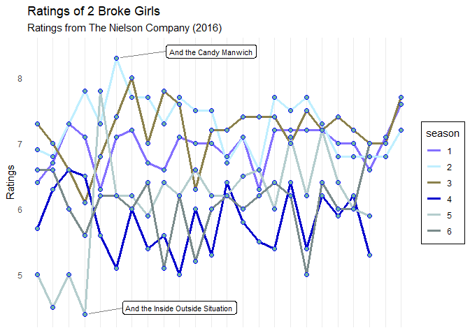

# Man’s project: 2 Broke Girls

## *Final solution made by Henning*

**About 2 Broke Girls**

It is an American sitcom, which aired on CBS(Columbia Broadcasting
System) from 2011 to 2017. It tells a story about two young women
waitressing at a greasy spoon diner strike up an unlikely friendship in
the hopes of launching a successful business - if only they can raise
the cash. For more details see [this
website.](https://www.imdb.com/title/tt1845307/.)

**About the importance for Man**

The reason Man chose this TV sitcom as her project theme is that she has
a lot of feelings for it. It accompanied her throughout high school and
two years of her university life. In the days when she was struggling
alone and her friends were not around, the two girls were the ones who
made me understand that no one’s twenties are easy, everything is full
of difficulties and uncertainties, we just hang in there and one day we
will find a way out. She is glad that she got to see their lives, it
brought her laughter and tears, told her more about New York and taught
her a lot of inappropriate slang :D Unfortunately, the sitcom didn’t
last long, ending in its sixth season, before the next phase of my life.
The story was hastily brought to a close by the writers. Although not
that perfect, despite the criticism of its high start and low end, it
doesn’t matter, *it is still the best sitcom by her side*, nothing can
replace it. The girls’ story is continuing in my mind.

**About the project**

-   plot should show the ratings of all episodes per season in one plot.
-   the episodes with the best ratings are mentioned with their title
-   combine everything in one beautiful and clear plot

**About dataset**

    ## # A tibble: 6 × 4
    ##   season episode title                             ratings
    ##   <chr>  <chr>   <chr>                               <dbl>
    ## 1 6      01      And the Two Openings: Parts 1 & 2     6.6
    ## 2 6      02      <NA>                                  6.6
    ## 3 6      03      And the 80's Movie                    6  
    ## 4 6      04      And the Godmama Drama                 5.6
    ## 5 6      05      And the College Experience            6.2
    ## 6 6      06      And the Rom-Commie                    6.2

**About the solution of the project**

    ## Warning: Use of `a$title` is discouraged.
    ## ℹ Use `title` instead.

