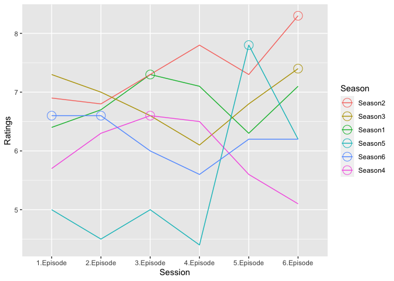

    library(readr)
    library(tidyverse)

    ## ── Attaching packages ─────────────────────────────────────── tidyverse 1.3.2 ──
    ## ✔ ggplot2 3.4.0      ✔ dplyr   1.0.10
    ## ✔ tibble  3.1.8      ✔ stringr 1.5.0 
    ## ✔ tidyr   1.2.1      ✔ forcats 0.5.2 
    ## ✔ purrr   1.0.0      
    ## ── Conflicts ────────────────────────────────────────── tidyverse_conflicts() ──
    ## ✖ dplyr::filter() masks stats::filter()
    ## ✖ dplyr::lag()    masks stats::lag()

    library(dplyr)
    library(ggplot2)
    library(readxl)

    file <- "/Users/huangziyi/Season1-6.xlsx"

    file1 <- read_excel("/Users/huangziyi/Season1-6.xlsx", sheet = "Season1") %>% select("Episode", "Ratings")

    ## New names:
    ## • `` -> `...2`
    ## • `Viewers` -> `Viewers...7`
    ## • `Viewers` -> `Viewers...8`

    file2 <- read_excel("/Users/huangziyi/Season1-6.xlsx", sheet = "Season2") %>%select("Episode", "Ratings")

    ## New names:
    ## • `` -> `...2`
    ## • `Viewers` -> `Viewers...7`
    ## • `Viewers` -> `Viewers...8`

    file3 <- read_excel("/Users/huangziyi/Season1-6.xlsx", sheet = "Season3") %>% select("Episode", "Ratings")

    ## New names:
    ## • `` -> `...2`
    ## • `Viewers` -> `Viewers...7`
    ## • `Viewers` -> `Viewers...8`

    file4 <- read_excel("/Users/huangziyi/Season1-6.xlsx", sheet = "Season4") %>%select("Episode", "Ratings")

    ## New names:
    ## • `` -> `...2`
    ## • `Viewers` -> `Viewers...7`
    ## • `Viewers` -> `Viewers...8`

    file5 <- read_excel("/Users/huangziyi/Season1-6.xlsx", sheet = "Season5") %>%select("Episode", "Ratings")

    ## New names:
    ## • `` -> `...2`
    ## • `Viewers` -> `Viewers...7`
    ## • `Viewers` -> `Viewers...8`

    file6 <- read_excel("/Users/huangziyi/Season1-6.xlsx", sheet = "Season6") %>% select("Episode", "Ratings")

    ## New names:
    ## • `` -> `...2`
    ## • `Viewers` -> `Viewers...7`
    ## • `Viewers` -> `Viewers...8`

    file <- bind_rows(file1, file2, file3, file4, file5, file6) %>%
      mutate (Season=
                case_when(startsWith(Episode, "01-") ~ "Season1",
                          startsWith(Episode, "02-") ~ "Season2",
                          startsWith(Episode, "03-") ~ "Season3",
                          startsWith(Episode, "04-") ~ "Season4",
                          startsWith(Episode, "05-") ~ "Season5",
                          startsWith(Episode, "06-") ~ "Season6")) %>%
      mutate (Session=
                case_when(endsWith(Episode, "-01") ~ "1.Episode",
                          endsWith(Episode, "-02") ~ "2.Episode",
                          endsWith(Episode, "-03") ~ "3.Episode",
                          endsWith(Episode, "-04") ~ "4.Episode",
                          endsWith(Episode, "-05") ~ "5.Episode",
                          endsWith(Episode, "-06") ~ "6.Episode")) %>%
      drop_na() 

    #plot
    Highest<- file%>%group_by(Season)%>%slice_max(Ratings)

    plot <- ggplot(file, aes(x=Session, y=Ratings, group=Season, color=fct_reorder2(Season, Session, Ratings)))+
      geom_line() +
      labs(colour = "Season") +
      geom_point (data = Highest, size=5, shape=21, fill="transparent")

    print(plot)

