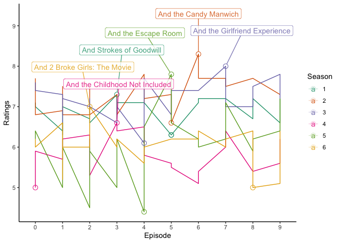

    library(readr)
    library(tidyverse)

    ## ── Attaching packages ─────────────────────────────────────── tidyverse 1.3.2 ──
    ## ✔ ggplot2 3.4.0      ✔ dplyr   1.0.10
    ## ✔ tibble  3.1.8      ✔ stringr 1.5.0 
    ## ✔ tidyr   1.2.1      ✔ forcats 0.5.2 
    ## ✔ purrr   1.0.0      
    ## ── Conflicts ────────────────────────────────────────── tidyverse_conflicts() ──
    ## ✖ dplyr::filter() masks stats::filter()
    ## ✖ dplyr::lag()    masks stats::lag()

    library(dplyr)
    library(ggplot2)
    library(readxl)
    library(ggrepel)

    file <- "/Users/huangziyi/Season1-6.xlsx"

    file1 <- read_excel("/Users/huangziyi/Season1-6.xlsx", sheet = "Season1") %>% select("Episode", "Ratings", "Title")

    ## New names:
    ## • `` -> `...2`
    ## • `Viewers` -> `Viewers...7`
    ## • `Viewers` -> `Viewers...8`

    file2 <- read_excel("/Users/huangziyi/Season1-6.xlsx", sheet = "Season2") %>%select("Episode", "Ratings", "Title")

    ## New names:
    ## • `` -> `...2`
    ## • `Viewers` -> `Viewers...7`
    ## • `Viewers` -> `Viewers...8`

    file3 <- read_excel("/Users/huangziyi/Season1-6.xlsx", sheet = "Season3") %>% select("Episode", "Ratings", "Title")

    ## New names:
    ## • `` -> `...2`
    ## • `Viewers` -> `Viewers...7`
    ## • `Viewers` -> `Viewers...8`

    file4 <- read_excel("/Users/huangziyi/Season1-6.xlsx", sheet = "Season4") %>%select("Episode", "Ratings", "Title")

    ## New names:
    ## • `` -> `...2`
    ## • `Viewers` -> `Viewers...7`
    ## • `Viewers` -> `Viewers...8`

    file5 <- read_excel("/Users/huangziyi/Season1-6.xlsx", sheet = "Season5") %>%select("Episode", "Ratings", "Title")

    ## New names:
    ## • `` -> `...2`
    ## • `Viewers` -> `Viewers...7`
    ## • `Viewers` -> `Viewers...8`

    file6 <- read_excel("/Users/huangziyi/Season1-6.xlsx", sheet = "Season6") %>% select("Episode", "Ratings", "Title")

    ## New names:
    ## • `` -> `...2`
    ## • `Viewers` -> `Viewers...7`
    ## • `Viewers` -> `Viewers...8`

    file <- bind_rows(file1, file2, file3, file4, file5, file6) %>%
      mutate (Season= str_c(str_sub(Episode,start=2,end=2))) %>%
      mutate (Show=str_c(str_sub(Episode,start=5,end=5))) %>%
      drop_na()

    Highest<- file%>%group_by(Season)%>%slice_max(Ratings)
    Lowest<- file%>%group_by(Season)%>%slice_min(Ratings)

    plot <- ggplot(file, aes(x=Show, y=Ratings, group=Season, color=Season))+
      geom_line() +
      labs(colour = "Season", x="Episode") +
      geom_point (data = Highest, size=3, shape=21, fill="transparent") +
      geom_point (data = Lowest, size=3, shape=21, fill="transparent") +
      geom_label_repel(aes(label=(as.character(Highest$Title))),
                       data=Highest,
                       box.padding= 0.35, 
                      point.padding = 0.5,
                      nudge_y = 1, alpha = 0.8) +
      theme_classic() +
      scale_colour_brewer(palette = "Dark2")
                     

    print(plot)

