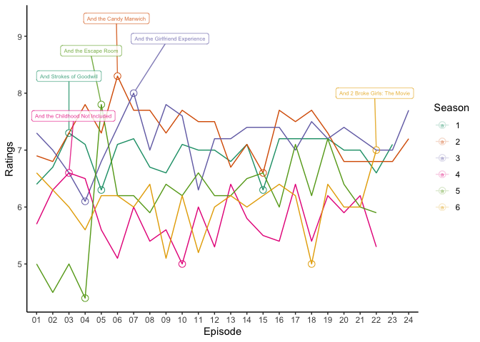

    library(readr)
    library(tidyverse)

    ## ── Attaching packages ─────────────────────────────────────── tidyverse 1.3.2 ──
    ## ✔ ggplot2 3.4.0      ✔ dplyr   1.0.10
    ## ✔ tibble  3.1.8      ✔ stringr 1.5.0 
    ## ✔ tidyr   1.2.1      ✔ forcats 0.5.2 
    ## ✔ purrr   1.0.0      
    ## ── Conflicts ────────────────────────────────────────── tidyverse_conflicts() ──
    ## ✖ dplyr::filter() masks stats::filter()
    ## ✖ dplyr::lag()    masks stats::lag()

    library(dplyr)
    library(ggplot2)
    library(readxl)
    library(ggrepel)

    data <- list()
    for (n in 1:6) {
    data [[n]] <- read_excel("/Users/huangziyi/Season1-6.xlsx", sheet = str_c("Season",n)) %>%select("Episode", "Ratings", "Title")} 

    ## New names:
    ## New names:
    ## New names:
    ## New names:
    ## New names:
    ## New names:
    ## • `` -> `...2`
    ## • `Viewers` -> `Viewers...7`
    ## • `Viewers` -> `Viewers...8`

    file <- bind_rows(data[1:6]) %>%
      mutate (Season= str_c(str_sub(Episode,start=2,end=2))) %>%
      mutate (Show=str_c(str_sub(Episode,start=4,end=5))) %>%
      drop_na()

    Highest<- file%>%group_by(Season)%>%slice_max(Ratings)
    Lowest<- file%>%group_by(Season)%>%slice_min(Ratings)

    plot <- ggplot(file, aes(x=Show, y=Ratings, group=Season, color=Season))+
      geom_line() +
      labs(colour = "Season", x="Episode") +
      geom_point (data = Highest, size=3, shape=21, fill="transparent") +
      geom_point (data = Lowest, size=3, shape=21, fill="transparent") +
      geom_label_repel(aes(label=Title),
                      data=Highest,
                       box.padding= 0.35, 
                       point.padding = 0.5,
                       nudge_y = 1, alpha = 0.8, size=2) +
      theme_classic() +
      scale_colour_brewer(palette = "Dark2")
                     

    print(plot)

