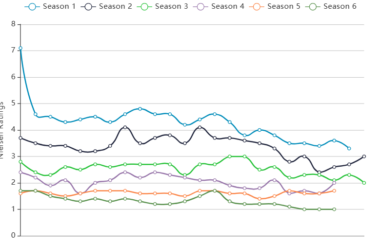

```{r setup, include=FALSE}
knitr::opts_chunk$set(echo = TRUE)
```
## What is 2 Broke Girls?

##### **It** is an American sitcom, which aired on CBS(Columbia Broadcasting System) from 2011 to 2017. It tells a story about two young women waitressing at a greasy spoon diner strike up an unlikely friendship in the hopes of launching a successful business - if only they can raise the cash. For more details see <https://www.imdb.com/title/tt1845307/>.

```{r girls, echo = FALSE}

```


## Why i choose it as my project theme?

##### **The** reason I choose this TV sitcom as my project theme is that I have a lot of feelings for it. It accompanied me throughout my high school and two years of my university life. In the days when I was struggling alone and my friends were not around, the two girls were the ones who made me understand that no one's twenties are easy, everything is full of difficulties and uncertainties, we just hang in there and one day we will find a way out. I'm glad I got to see their lives, it brought me laughter and tears, told me more about New York and taught me a lot of inappropriate slang :D 

##### Unfortunately, the sitcom didn't last long, ending in its sixth season, before the next phase of my life. The story was hastily brought to a close by the writers. Although not that perfect, despite the criticism of its high start and low end, it doesn't matter, it is still the best sitcom by my side, nothing can replace it. The girls' story is continuing in my mind.


## What's the plan?
##### **1.** i want to get the ratings for each episode pro season
##### **2.** the changes from episode to episode pro season. 
##### **3.** I put all the values together in a chart in order to compare the ratings from season 1 to season 6. 
##### **4.** i will label each episode name on it and highlight their highest and lowest rated episode name in each season.
##### **5.** pick the best and worst episodes of each season and make two separate plots with name and time on them

##### One ideal plot is like below:

```{r raings, echo=FALSE}

```


## Source:
Information about the sitcom:

1. https://en.wikipedia.org/wiki/2_Broke_Girls
2. https://www.imdb.com/title/tt1845307/

Data Set and plots are collected from:

1. https://tvseriesfinale.com/tv-show/2-broke-girls-season-six-ratings/
2. https://www.vpnmentor.com/tools/tv-chart/#/result?search=tt1845307

