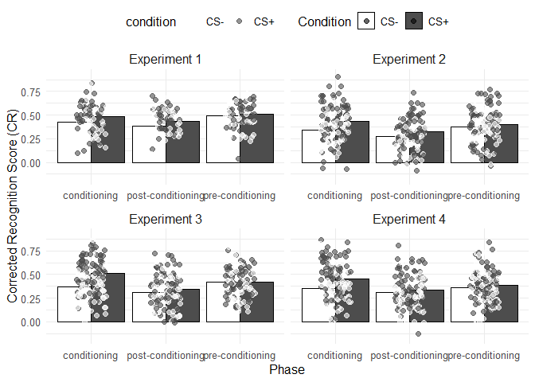

    # Load necessary libraries
    library(tidyverse)

    ## ── Attaching core tidyverse packages ──────────────────────── tidyverse 2.0.0 ──
    ## ✔ dplyr     1.1.4     ✔ readr     2.1.5
    ## ✔ forcats   1.0.0     ✔ stringr   1.5.1
    ## ✔ ggplot2   3.5.1     ✔ tibble    3.2.1
    ## ✔ lubridate 1.9.3     ✔ tidyr     1.3.1
    ## ✔ purrr     1.0.2     
    ## ── Conflicts ────────────────────────────────────────── tidyverse_conflicts() ──
    ## ✖ dplyr::filter() masks stats::filter()
    ## ✖ dplyr::lag()    masks stats::lag()
    ## ℹ Use the conflicted package (<http://conflicted.r-lib.org/>) to force all conflicts to become errors

    # Step 1: Read CSV files and pool the data
    # data_dir <- "/Users/helen/Data-projects-with-R-and-GitHub/Projects/celineony/project-data"
    data_dir <- "project-data"

    # List all CSV files in the directory
    csv_files <- list.files(data_dir, pattern = "\\.csv$", full.names = TRUE)

    # Step 2: Read all CSV files and assign study_id explicitly
    data_list <- lapply(1:length(csv_files), function(i) {
      df <- read_csv(csv_files[i])
      df$study_id <- i  # Assign study_id based on the file index
      return(df)
    })

    ## Rows: 264 Columns: 6
    ## ── Column specification ────────────────────────────────────────────────────────
    ## Delimiter: ","
    ## chr (3): participant_id, phase, condition
    ## dbl (3): study_id, hit, fa
    ## 
    ## ℹ Use `spec()` to retrieve the full column specification for this data.
    ## ℹ Specify the column types or set `show_col_types = FALSE` to quiet this message.
    ## Rows: 480 Columns: 6
    ## ── Column specification ────────────────────────────────────────────────────────
    ## Delimiter: ","
    ## chr (3): participant_id, phase, condition
    ## dbl (3): study_id, hit, fa
    ## 
    ## ℹ Use `spec()` to retrieve the full column specification for this data.
    ## ℹ Specify the column types or set `show_col_types = FALSE` to quiet this message.
    ## Rows: 468 Columns: 6
    ## ── Column specification ────────────────────────────────────────────────────────
    ## Delimiter: ","
    ## chr (3): participant_id, phase, condition
    ## dbl (3): study_id, hit, fa
    ## 
    ## ℹ Use `spec()` to retrieve the full column specification for this data.
    ## ℹ Specify the column types or set `show_col_types = FALSE` to quiet this message.
    ## Rows: 498 Columns: 6
    ## ── Column specification ────────────────────────────────────────────────────────
    ## Delimiter: ","
    ## chr (3): participant_id, phase, condition
    ## dbl (3): study_id, hit, fa
    ## 
    ## ℹ Use `spec()` to retrieve the full column specification for this data.
    ## ℹ Specify the column types or set `show_col_types = FALSE` to quiet this message.

    # Combine all the data frames into one
    data <- bind_rows(data_list)

    # Step 3: Ensure participant_id is continuous across all experiments
    data <- data %>%
      group_by(study_id) %>%
      mutate(participant_id = row_number()) %>%
      ungroup()

    # Step 4: Compute the corrected recognition score (cr)
    data <- data %>%
      mutate(cr = hit - fa)

    # Step 5: Create the plot
    ggplot(data, aes(x = phase, y = cr, fill = condition)) +
      # Grouped bar plot with summary statistic (mean) per phase and condition
      geom_bar(stat = "summary", fun = "mean", position = "dodge", color = "black") +
      # Add individual data points over the bars
      geom_jitter(aes(color = condition), width = 0.2, alpha = 0.6, size = 2) +
      # Facet by study_id (experiment number)
      facet_wrap(~ study_id, labeller = as_labeller(c("1" = "Experiment 1", "2" = "Experiment 2", 
                                                      "3" = "Experiment 3", "4" = "Experiment 4")), 
                 scales = "free_x") +  # Ensure each experiment has its own x-axis scale
      # Labels for axes and legend
      labs(x = "Phase", y = "Corrected Recognition Score (CR)", fill = "Condition") +
      # Change legend labels directly
      scale_fill_manual(values = c("CSp" = "gray30", "CSm" = "white"),
                        labels = c("CSp" = "CS+", "CSm" = "CS-")) +
      scale_color_manual(values = c("CSp" = "gray30", "CSm" = "white"),
                         labels = c("CSp" = "CS+", "CSm" = "CS-")) +
      theme_minimal() +
      theme(legend.position = "top") +  # Place the legend on the top
      theme(strip.text = element_text(size = 12)) +  # Facet labels (Experiment 1, 2...)
      theme(axis.text = element_text(size = 10)) +  # Axis text size
      theme(axis.title = element_text(size = 12)) +  # Axis title size
      theme(legend.title = element_text(size = 12), 
            legend.text = element_text(size = 10)) +  # Legend text size
      # Remove borders around facets and panels
      theme(strip.background = element_blank(),  # Remove background of facet labels
            panel.border = element_blank())  # Remove borders around panels

