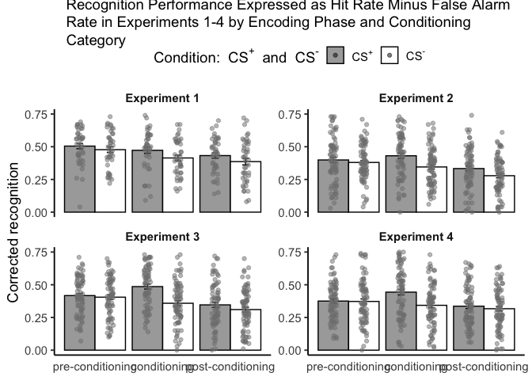

## Introduction

In this analysis, we explore recognition performance expressed as the
hit rate minus the false alarm rate (corrected recognition) across four
experiments. Participants underwent three phases: pre-conditioning,
conditioning, and post-conditioning. The study contrasts two conditions,
CS+ (Conditioned Stimulus Positive) and CS− (Conditioned Stimulus
Negative), to evaluate their influence on recognition performance. The
visualization provides insights into mean corrected recognition and
individual participant variability for each experiment.

## Analysis and Visualization

    ## # A tibble: 6 × 6
    ##   study_id participant_id phase             condition   hit    fa
    ##      <dbl>          <dbl> <chr>             <chr>     <dbl> <dbl>
    ## 1        1              1 conditioning      CSm        0.63  0.21
    ## 2        1              1 conditioning      CSp        0.72  0.14
    ## 3        1              1 post-conditioning CSm        0.6   0.21
    ## 4        1              1 post-conditioning CSp        0.67  0.14
    ## 5        1              1 pre-conditioning  CSm        0.87  0.21
    ## 6        1              1 pre-conditioning  CSp        0.7   0.14

    ## Combined data has been written to 'combined_experiment_data.csv'.

