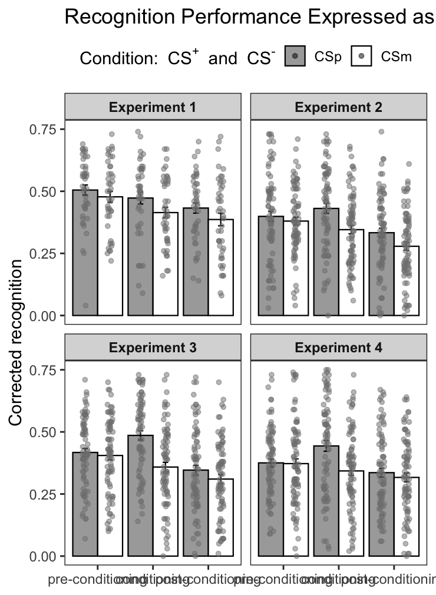

## My solution to Celine’s project

    ## Warning: Removed 42 rows containing non-finite outside the scale range
    ## (`stat_summary()`).
    ## Removed 42 rows containing non-finite outside the scale range
    ## (`stat_summary()`).

    ## Warning: No shared levels found between `names(values)` of the manual scale and the
    ## data's colour values.

    ## Warning: Removed 42 rows containing missing values or values outside the scale range
    ## (`geom_point()`).

