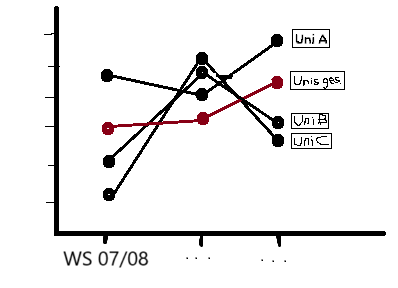
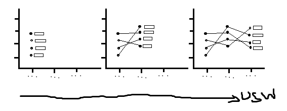

### Charlottes Projektbeschreibung 🐌🐌🐌

🐌**Aufgabe 1: Datenbereinigung**

1.  Datensatz laden (verwendeter Datensatz findet sich hier: <https://www.govdata.de/suche/daten/gasthorer-nach-hochschularten-hochschulen-und-geschlecht-land-wintersemester> )

Der Datensatz ist auch iwie "falschrum", das muss noch gedreht werden

1.  Alle Zeilen in denen keine Angaben zur Anzahl der Gasthörer\*innen (weder Insgesamt, noch männlich, noch weiblich) löschen

2.  Die Zeilen, in denen Angaben zu Insgesamt und zu männlich gemacht wurden, nicht jedoch zu weiblich, mit der entsprechenden Zahl ergänzen (Insgesamt - männlich), das gleiche auch, wenn nur die Angabe für männlich fehlt –\> das ist immer in den zeilen der Fall, in denen es nur Gasthörer\*innen eines geschlechts gab, statt eine 0 hinzuschreiben, wurde ein - reingeschrieben

3.  Drei universitäten aussuchen, in denen so viele Jahre wie möglich vollzählig sind

4.  Nur die Jahre behalten, in denen alle Universitäten angaben gemacht habe

5.  Neue ***`Variable`*** erstellen: Die Summe der Gasthörer\*innen insgesamt der drei Universitäten für ein Wintersemesterf

🐌**Aufgabe 2: Datenvisualisierung**

**`Erster Teil:`**

Die x-Achse sollen die Wintersemester, die y-Achse die Anzahl der Gasthörer\*innen Insgesamt

-   Die drei ausgewählten Universitäten, sowie die erstellte Variable Universitäten insgesamt

-   Die Punkte für die Jahre und Anzahl der Gasthörer\*innen sollten für die Universitäten jeweils durch eine dünne Linie verbunden sein

-   Am Ende der Linie soll der Name der Uni jeweils in einem Kasten mit schwarzer Umrandung stehen

-   Alle Linien und Punkte sollen die gleiche Farbe haben, nur die Linien und Punkte für die Variable Universitäten Insgesamt soll eine eigene Farbe haben

**`Zweiter Teil: das Ganze animieren :)`**

versuche den Graphen mit gganimate() zu animieren. Anfangs sollen nur die Datenpunkte fürs WS 07/08 zu sehen sein, dann die linie zu den nächsten Wintersemester usw. Die Beschriftung der einzelnen Linien läuft mit der Animierung mit.
