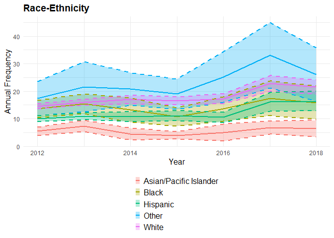
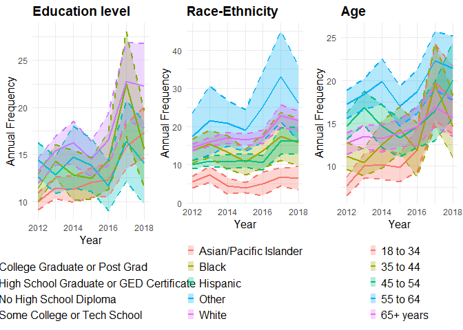

    library(readr)
    library(gridExtra)
    library(tidyverse)

    ## ── Attaching core tidyverse packages ──────────────────────── tidyverse 2.0.0 ──
    ## ✔ dplyr     1.1.4     ✔ purrr     1.0.2
    ## ✔ forcats   1.0.0     ✔ stringr   1.5.1
    ## ✔ ggplot2   3.5.1     ✔ tibble    3.2.1
    ## ✔ lubridate 1.9.3     ✔ tidyr     1.3.1
    ## ── Conflicts ────────────────────────────────────────── tidyverse_conflicts() ──
    ## ✖ dplyr::combine() masks gridExtra::combine()
    ## ✖ dplyr::filter()  masks stats::filter()
    ## ✖ dplyr::lag()     masks stats::lag()
    ## ℹ Use the conflicted package (<http://conflicted.r-lib.org/>) to force all conflicts to become errors

    #### (1) Datensatz laden ####
    setwd("C:/Users/charl/Documents/Uni/5. Semester/Seminar_R und GitHub/")
    data <- read_csv("adult-depression-lghc-indicator-24.csv", na = "NA")

    ## Warning: One or more parsing issues, call `problems()` on your data frame for details,
    ## e.g.:
    ##   dat <- vroom(...)
    ##   problems(dat)

    ## Rows: 161 Columns: 8
    ## ── Column specification ────────────────────────────────────────────────────────
    ## Delimiter: ","
    ## chr (2): Strata, Strata Name
    ## dbl (6): Year, Frequency, Weighted Frequency, Percent, Lower 95% CL, Upper 9...
    ## 
    ## ℹ Use `spec()` to retrieve the full column specification for this data.
    ## ℹ Specify the column types or set `show_col_types = FALSE` to quiet this message.

    ### (2) Datensatz in Teildatensätze unterteilen ####
    data$Strata <- as.character(data$Strata)                # Sicherstellen, dass Strata als Zeichenkette vorliegt
    strata_categories <- unique(data$Strata)                # Liste der eindeutigen Werte in Strata
    split_data <- lapply(strata_categories, function(cat) { # Datensätze nach Kategorie aufteilen
      cat <- as.character(cat)                              # Sicherstellen, dass cat eine Zeichenkette ist
      
      data %>%
        filter(Strata == cat) %>%                          # Filter nach Kategorie
        select(Year, `Strata Name`, Frequency, `Weighted Frequency`, Percent, `Lower 95% CL`, `Upper 95% CL`) %>%    # Relevante Spalten auswählen
        rename_with(~ ifelse(. == "Strata Name", cat, .)) # Spalte umbenennen
    })

    names(split_data) <- strata_categories                 # Datensätze benennen 

    #### (3) Visualisierung

    # Education level
    education_plot <- ggplot(split_data$Education, aes(x = Year, y = Percent, color = Education, group = Education)) +
      geom_ribbon(aes(ymin = `Lower 95% CL`, ymax = `Upper 95% CL`, fill = Education), 
                  alpha = 0.3, color = NA) +
      geom_line(size = 1) +
      geom_line(aes(y = `Lower 95% CL`), linetype = "dashed", size = 0.8) +
      geom_line(aes(y = `Upper 95% CL`), linetype = "dashed", size = 0.8) +
      labs(
        title = "Education level",
        x = "Year",
        y = "Annual Frequency",
        color = NULL,
        fill = NULL
      ) +
      theme_minimal() +
      theme(
        plot.title = element_text(size = 14, face = "bold"),
        axis.title = element_text(size = 12),
        legend.position = "bottom", 
        legend.key.size = unit(0.25, "cm"), 
        legend.key.width = unit(0.25, "cm"), 
        legend.text = element_text(size = 12) 
      ) +
      guides(
        color = guide_legend(ncol = 1),  # Vertikale Legende für Farben
        fill = guide_legend(ncol = 1),   # Vertikale Legende für Füllfarben
      )

    ## Warning: Using `size` aesthetic for lines was deprecated in ggplot2 3.4.0.
    ## ℹ Please use `linewidth` instead.
    ## This warning is displayed once every 8 hours.
    ## Call `lifecycle::last_lifecycle_warnings()` to see where this warning was
    ## generated.

    ### Race-Ethnicity
    race_ethnicity_plot <- ggplot(split_data$`Race-Ethnicity`, aes(x = Year, y = Percent, color = `Race-Ethnicity`, group = `Race-Ethnicity`)) +
      geom_ribbon(aes(ymin = `Lower 95% CL`, ymax = `Upper 95% CL`, fill = `Race-Ethnicity`), 
                  alpha = 0.3, color = NA) +
      geom_line(size = 1) +
      geom_line(aes(y = `Lower 95% CL`), linetype = "dashed", size = 0.8) +
      geom_line(aes(y = `Upper 95% CL`), linetype = "dashed", size = 0.8) +
      labs(
        title = "Race-Ethnicity",
        x = "Year",
        y = "Annual Frequency",
        color = NULL,
        fill = NULL
      ) +
      theme_minimal() +
      theme(
        plot.title = element_text(size = 14, face = "bold"),
        axis.title = element_text(size = 12),
        legend.position = "bottom",
        legend.key.size = unit( 0.25, "cm"), 
        legend.text = element_text(size = 12)
      ) +
      guides(
        color = guide_legend(ncol = 1),
        fill = guide_legend(ncol = 1)
      )
    race_ethnicity_plot

    ### Age
    age_plot <- ggplot(split_data$Age, aes(x = Year, y = Percent, color = Age, group = Age)) +
      geom_ribbon(aes(ymin = `Lower 95% CL`, ymax = `Upper 95% CL`, fill = Age), 
                  alpha = 0.3, color = NA) +
      geom_line(size = 1) +
      geom_line(aes(y = `Lower 95% CL`), linetype = "dashed", size = 0.8) +
      geom_line(aes(y = `Upper 95% CL`), linetype = "dashed", size = 0.8) +
      labs(
        title = "Age",
        x = "Year",
        y = "Annual Frequency",
        color = NULL,
        fill = NULL
      ) +
      theme_minimal() +
      theme(
        plot.title = element_text(size = 14, face = "bold"),
        axis.title = element_text(size = 12),
        legend.position = "bottom",
        legend.key.size = unit( 0.25, "cm"), 
        legend.text = element_text(size = 12),
      ) +
      guides(
        color = guide_legend(ncol = 1),
        fill = guide_legend(ncol = 1)
      )

## My solution to Gulmira´s project

    grid.arrange(
      education_plot, race_ethnicity_plot, age_plot, 
      ncol = 3
    )

#### **What I still have to do (if I find the time until Wednesday):**

-   Create the variable you described (for now, I used the “Percent”
    variable because I didn’t quite understand what you mean by the
    “Annual frequency” variable).

-   Make all the plots and legends the same size (at the moment, it
    looks quite messy because they all have different sizes).

-   “Round” the lines in the plot (I didn’t find how to do this, so I’ll
    have to look into it again).  
