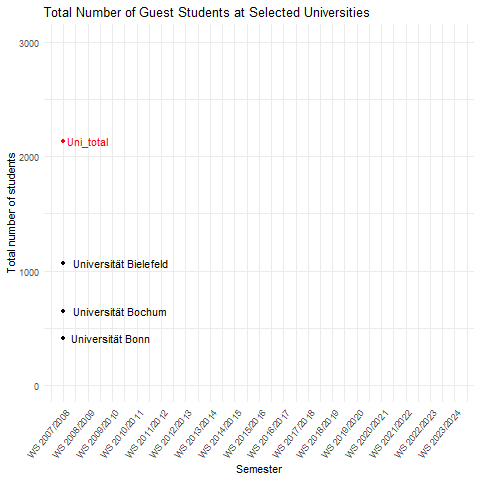

# Luis’ solution of Charlotte’s project

## The Task

The task of this project is to create an animated graph of the total
number of guest students at three universities in North Rhine-Westphalia
over the course of several years. The data is provided in a CSV file by
the website GOVDATA. 

## Data Processing 
The data is read from the provided CSV file and cleaned to ensure consistency and accuracy. We
filter the data for the universities of Bielefeld, Bochum, Bonn and and
then create a summary row for each year. The resulting data used for
visualization looks like the following.

    dt_proc

    ## # A tibble: 68 × 3
    ##    Semester   University            Total
    ##    <chr>      <chr>                 <int>
    ##  1 WS 2007/08 Universität Bielefeld  1068
    ##  2 WS 2007/08 Universität Bochum      650
    ##  3 WS 2007/08 Universität Bonn        415
    ##  4 WS 2007/08 Uni_total              2133
    ##  5 WS 2008/09 Universität Bielefeld  1041
    ##  6 WS 2008/09 Universität Bochum      650
    ##  7 WS 2008/09 Universität Bonn        342
    ##  8 WS 2008/09 Uni_total              2033
    ##  9 WS 2009/10 Universität Bielefeld  1244
    ## 10 WS 2009/10 Universität Bochum      644
    ## # ℹ 58 more rows

## Data visualization / animation

The data is visualized using ggplot2 and gganimate. The graph is
animated to show the development of the total number of guest students
at the selected universities over time. The resulting animation is saved
as a GIF file.

## Results

We can see that the total number of guest students at the universitiy of
Bochum increases over time and even overtakes the university of
Bielefeld in WS 2018. The number of guest students at Bielefeld
decreases in the last years, while the number of guest students at Bonn
remains relatively constant.
