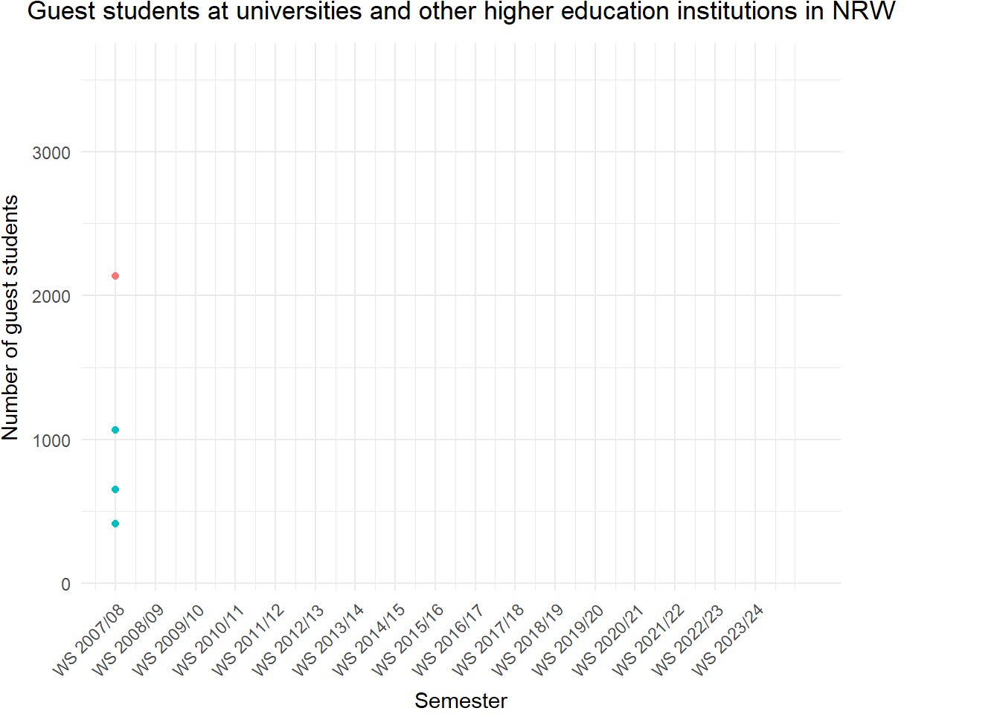

# **Guest students at universities and other higher education institutions in NRW**
**Solution for Charlotte's Project from Silin**

******

## Import Data
******
```{r import, message = FALSE, warning = FALSE}
library(tidyverse)
library(ggplot2)

dt <- read_delim("https://www.landesdatenbank.nrw.de/ldbnrwws/downloader/00/tables/21331-02i_00.csv",
                delim = ";", #Set the delimiter
               locale = locale(encoding = "ISO-8859-1"), #Set the character encoding explicitly
               skip = 6,
               col_names = c("Semester", "University", "Total", "Male", "Female"), #Name the columns
               col_types = cols(Semester = col_character(),
                                University = col_character(),
                                Total = col_integer(), Male = col_integer(), Female = col_integer()),
               trim_ws = FALSE, #keep the whitespaces for hierarchy calculation
               na = c("", "NA", "-")) #replace missing data with NA
print(dt)
```

## Data Cleaning and Manipulation
******
```{r clean, warning = FALSE}

###############cleaning the data#################
dt_clean <- dt %>%
  slice(1:(n()-3)) %>% #Clean the end of the table
  rowwise() %>% # Ensures operations in mutate are applied row by row, not column-wise
  mutate(
    na_count = sum(is.na(c(Total, Male, Female))),
    Total = if_else(na_count > 0 & na_count < 3 & is.na(Total), Male + Female, Total),
    Male = if_else(na_count > 0 & na_count < 3 & is.na(Male), Total - Female, Male),
    Female = if_else(na_count > 0 & na_count < 3 & is.na(Female), Total - Male, Female)
  ) %>% #calculate the missing value
  ungroup() %>% 
  select(-na_count) %>%
  mutate(Hierarchy = (str_count(University, ("\\G ")) / 2),
         University = str_replace_all(University, "\\G ", "")) %>%  #Calculate the hierarchy, Remove the spaces
  filter(University %in% c("Universität Bielefeld", "Universität Bochum", "Universität Bonn"))
print(dt_clean)

############Create Unis_Total##############
dt_plot <- dt_clean %>%
    group_by(Semester) %>%
    summarise(
      University = "Unis_Total",
      Total = sum(Total, na.rm = TRUE),
      Female = sum(Female, na.rm = TRUE),
      Male = sum(Male, na.rm = TRUE),
      Type = "Total", # set the Type for the coloring in ggplot
      .groups = "drop"
    ) %>%
  ungroup() %>%
  bind_rows(
    dt_clean %>% 
      filter(University %in% c("Universität Bielefeld", "Universität Bochum", "Universität Bonn")) %>% 
      mutate(Type = "Uni") #set the Type for the coloring in ggplot
  ) #combine Unis_Total with the three universities
print(dt_plot)
```

## Plotting
******
```{r plot}
dt_plot %>% 
  ggplot(aes(x = as.factor(Semester), y = Total, group = University, color = Type)) +
  geom_point() +
  geom_line() +
  geom_label(
      data = . %>% group_by(University) %>% filter(Semester == max(Semester)),
      aes(label = University), 
      nudge_x = 1.2, 
      nudge_y = 160, 
      color = "black") +
  labs(
    title = "Guest students at universities and other higher education institutions in NRW",
    x = "Semester",
    y = "Number of guest students"
  ) +
  theme_minimal() +
  theme(axis.text.x = element_text(angle = 45, hjust = 1), #visibility of x-axis
        legend.position = "none", #remove the legend
        plot.margin = margin(r = 80, unit = "pt"),
        plot.title = element_text(hjust = 0.5)) + #visibility of the labels
  coord_cartesian(clip = "off") #extend plot boundary, for better visibility of the labels
```

## Animation
******
```{r animation, results = FALSE, message = FALSE, warning = FALSE}
library(gganimate)

#Convert the Semester data on the x-axis to integer format, since the animation requires a numeric variable move along.

dt_year <- dt_plot %>%
  mutate(Year = as.integer(str_extract(Semester, "\\d{4}")))

animation <- ggplot(dt_year, aes(x = Year, y = Total, group = University, color = Type)) +
  geom_point() +
  geom_line() +
  geom_label(data = . %>% group_by(University) %>% filter(Semester == max(Semester)), 
             aes(label = University, x = Year, y = Total), 
             nudge_x = 1.3, 
             nudge_y = 1200, 
             color = "black") +
  labs(
    title = "Guest students at universities and other higher education institutions in NRW",
    x = "Semester",
    y = "Number of guest students"
  ) +
  theme_minimal() +
  theme(axis.text.x = element_text(angle = 45, hjust = 1),
        legend.position = "none",
        plot.margin = margin(r = 80, unit = "pt"),
        plot.title = element_text(hjust = 0.5)) +
  coord_cartesian(clip = "off") +
  scale_x_continuous(
  breaks = seq(min(dt_year$Year), max(dt_year$Year), by = 1),
  labels = dt_year$Semester %>% unique()) +
  transition_reveal(along = Year) +  # Transition along the Semester
  ease_aes("linear")

anim_save("animation.gif", animation = animation)

```
