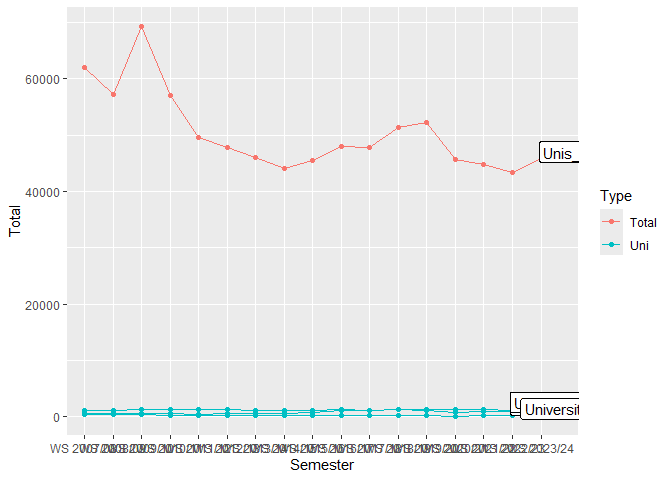

# **Guest students at universities and other higher education institutions in NRW**

**Solution for Charlotte’s Project from Silin**

------------------------------------------------------------------------

## Import Data

------------------------------------------------------------------------

    library(tidyverse)
    library(ggplot2)

    dt <- read_delim("https://www.landesdatenbank.nrw.de/ldbnrwws/downloader/00/tables/21331-02i_00.csv",
                    delim = ";", #Set the delimiter
                   locale = locale(encoding = "ISO-8859-1"), #Set the character encoding explicitly
                   skip = 6,
                   col_names = c("Semester", "University", "Total", "Male", "Female"), #Name the columns
                   col_types = cols(Semester = col_character(),
                                    University = col_character(),
                                    Total = col_integer(), Male = col_integer(), Female = col_integer()),
                   trim_ws = FALSE, #keep the whitespaces for hierarchy calculation
                   na = c("", "NA", "-")) #replace missing data with NA
    print(dt)

    ## # A tibble: 1,805 × 5
    ##    Semester   University                            Total  Male Female
    ##    <chr>      <chr>                                 <int> <int>  <int>
    ##  1 WS 2023/24 "Hochschulen insgesamt"               15259  8464   6795
    ##  2 WS 2023/24 "  Universitäten"                     14690  8247   6443
    ##  3 WS 2023/24 "    Technische Hochschule Aachen"      492   265    227
    ##  4 WS 2023/24 "    Universität Bielefeld"             879   433    446
    ##  5 WS 2023/24 "    Universität Bochum"               1326   700    626
    ##  6 WS 2023/24 "    Universität Bonn"                  172    97     75
    ##  7 WS 2023/24 "    Technische Universität Dortmund"   266    75    191
    ##  8 WS 2023/24 "    Universität Düsseldorf"            661   302    359
    ##  9 WS 2023/24 "    Universität Duisburg-Essen"         69    33     36
    ## 10 WS 2023/24 "    Fernuniversität Hagen"            7617  4714   2903
    ## # ℹ 1,795 more rows

## Data Cleaning and Manipulation

------------------------------------------------------------------------

    ###############cleaning the data#################
    dt_clean <- dt %>%
      slice(1:(n()-3)) %>% #Clean the end of the table
      rowwise() %>% # Ensures operations in mutate are applied row by row, not column-wise
      mutate(
        na_count = sum(is.na(c(Total, Male, Female))),
        Total = if_else(na_count > 0 & na_count < 3 & is.na(Total), Male + Female, Total),
        Male = if_else(na_count > 0 & na_count < 3 & is.na(Male), Total - Female, Male),
        Female = if_else(na_count > 0 & na_count < 3 & is.na(Female), Total - Male, Female)
      ) %>% #calculate the missing value
      ungroup() %>% 
      select(-na_count) %>%
      mutate(Hierarchy = (str_count(University, ("\\G ")) / 2),
             University = str_replace_all(University, "\\G ", "")) %>%  #Calculate the hierarchy, Remove the spaces
      filter(University %in% c("Universität Bielefeld", "Universität Bochum", "Universität Bonn"))
    print(dt_clean)

    ## # A tibble: 51 × 6
    ##    Semester   University            Total  Male Female Hierarchy
    ##    <chr>      <chr>                 <int> <int>  <int>     <dbl>
    ##  1 WS 2023/24 Universität Bielefeld   879   433    446         2
    ##  2 WS 2023/24 Universität Bochum     1326   700    626         2
    ##  3 WS 2023/24 Universität Bonn        172    97     75         2
    ##  4 WS 2022/23 Universität Bielefeld   926   422    504         2
    ##  5 WS 2022/23 Universität Bochum     1131   613    518         2
    ##  6 WS 2022/23 Universität Bonn        149    93     56         2
    ##  7 WS 2021/22 Universität Bielefeld   878   359    519         2
    ##  8 WS 2021/22 Universität Bochum     1291   676    615         2
    ##  9 WS 2021/22 Universität Bonn        157    97     60         2
    ## 10 WS 2020/21 Universität Bielefeld   785   346    439         2
    ## # ℹ 41 more rows

    ############Create Unis_Total##############
    dt_plot <- dt_clean %>%
        group_by(Semester) %>%
        summarise(
          University = "Unis_Total",
          Total = sum(Total, na.rm = TRUE),
          Female = sum(Female, na.rm = TRUE),
          Male = sum(Male, na.rm = TRUE),
          Type = "Total", # set the Type for the coloring in ggplot
          .groups = "drop"
        ) %>%
      ungroup() %>%
      bind_rows(
        dt_clean %>% 
          filter(University %in% c("Universität Bielefeld", "Universität Bochum", "Universität Bonn")) %>% 
          mutate(Type = "Uni") #set the Type for the coloring in ggplot
      ) #combine Unis_Total with the three universities
    print(dt_plot)

    ## # A tibble: 68 × 7
    ##    Semester   University Total Female  Male Type  Hierarchy
    ##    <chr>      <chr>      <int>  <int> <int> <chr>     <dbl>
    ##  1 WS 2007/08 Unis_Total  2133   1146   987 Total        NA
    ##  2 WS 2008/09 Unis_Total  2033   1089   944 Total        NA
    ##  3 WS 2009/10 Unis_Total  2222   1196  1026 Total        NA
    ##  4 WS 2010/11 Unis_Total  2079   1121   958 Total        NA
    ##  5 WS 2011/12 Unis_Total  1917   1022   895 Total        NA
    ##  6 WS 2012/13 Unis_Total  2112   1115   997 Total        NA
    ##  7 WS 2013/14 Unis_Total  2007   1094   913 Total        NA
    ##  8 WS 2014/15 Unis_Total  2034   1028  1006 Total        NA
    ##  9 WS 2015/16 Unis_Total  2214   1122  1092 Total        NA
    ## 10 WS 2016/17 Unis_Total  2502   1156  1346 Total        NA
    ## # ℹ 58 more rows

## Plotting

------------------------------------------------------------------------

    dt_plot %>% 
      ggplot(aes(x = as.factor(Semester), y = Total, group = University, color = Type)) +
      geom_point() +
      geom_line() +
      geom_label(
          data = . %>% group_by(University) %>% filter(Semester == max(Semester)),
          aes(label = University), 
          nudge_x = 1.2, 
          nudge_y = 160, 
          color = "black") +
      labs(
        title = "Guest students at universities and other higher education institutions in NRW",
        x = "Semester",
        y = "Number of guest students"
      ) +
      theme_minimal() +
      theme(axis.text.x = element_text(angle = 45, hjust = 1), #visibility of x-axis
            legend.position = "none", #remove the legend
            plot.margin = margin(r = 80, unit = "pt"),
            plot.title = element_text(hjust = 0.5)) + #visibility of the labels
      coord_cartesian(clip = "off") #extend plot boundary, for better visibility of the labels

## Animation

------------------------------------------------------------------------

    library(gganimate)
    library(gifski)

    #Convert the Semester data on the x-axis to integer format, since the animation requires a numeric variable move along.

    dt_year <- dt_plot %>%
      mutate(Year = as.integer(str_extract(Semester, "\\d{4}")))

    animationPlot <- ggplot(dt_year, aes(x = Year, y = Total, group = University, color = Type)) +
      geom_point() +
      geom_line() +
      geom_label(data = . %>% group_by(University) %>% filter(Semester == max(Semester)), 
                 aes(label = University, x = Year, y = Total), 
                 nudge_x = 1.3, 
                 nudge_y = 1200, 
                 color = "black") +
      labs(
        title = "Guest students at universities and other higher education institutions in NRW",
        x = "Semester",
        y = "Number of guest students"
      ) +
      theme_minimal() +
      theme(axis.text.x = element_text(angle = 45, hjust = 1),
            legend.position = "none",
            plot.margin = margin(r = 80, unit = "pt"),
            plot.title = element_text(hjust = 0.5)) +
      coord_cartesian(clip = "off") +
      scale_x_continuous(
      breaks = seq(min(dt_year$Year), max(dt_year$Year), by = 1),
      labels = dt_year$Semester %>% unique()) +
      transition_reveal(along = Year)
    # +  # Transition along the Semester
    #   ease_aes("linear")

    # animate(animationPlot, nframes = 100, duration = 10, width = 800, height = 600, renderer = gifski_renderer())

    anim_save("animation.gif", animation = animationPlot)

