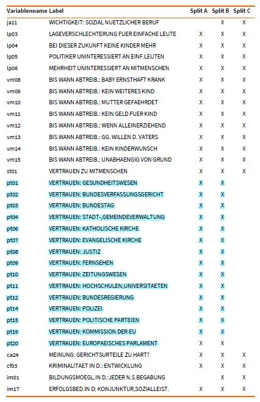
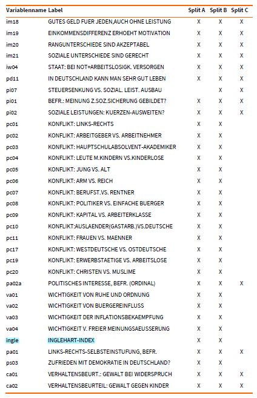
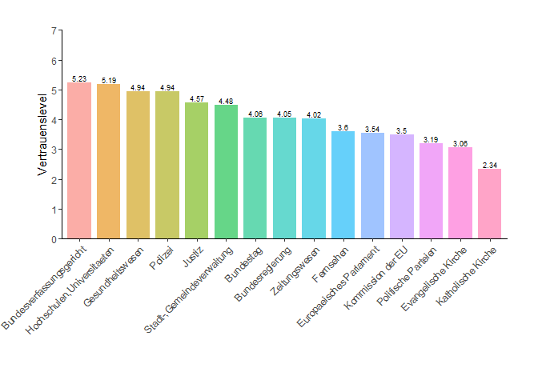
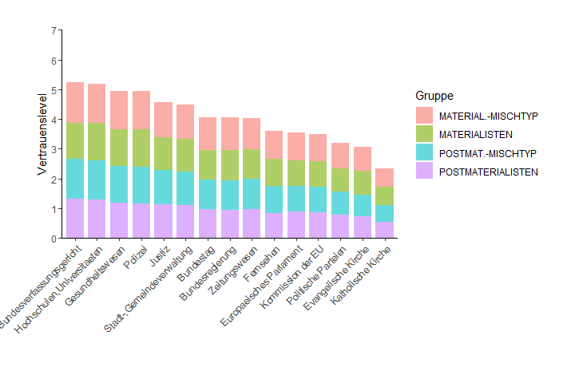
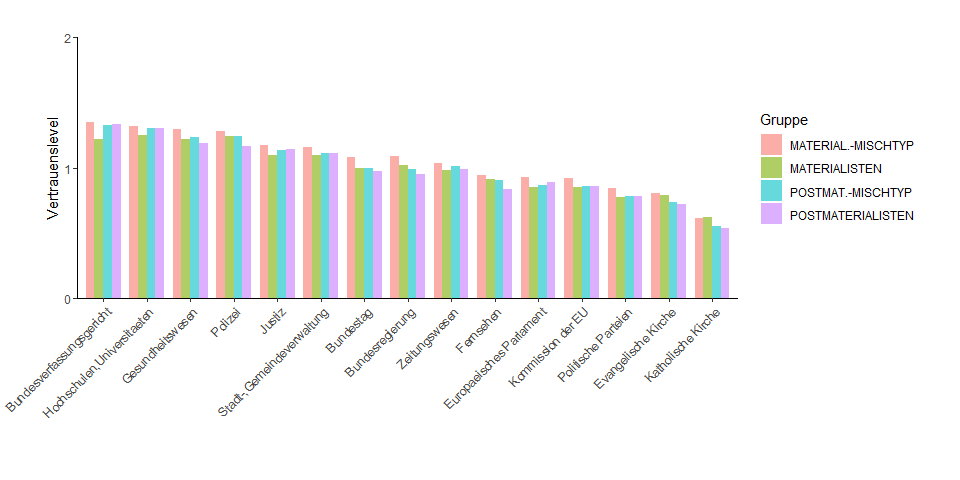
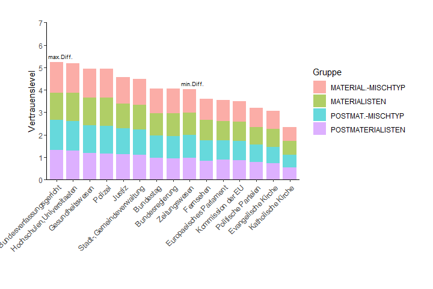
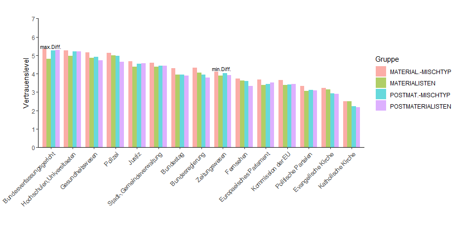

------------------------------------------------------------------------

# Introduction

------------------------------------------------------------------------

In this document, I describe my solution for Christian’s project
[Postmaterialism and political
trust](https://dr-eberle-zentrum.github.io/Advanced-data-processing-with-R/Projects/crudi3/project-description.html)
and how I developed it.

------------------------------------------------------------------------

# Understanding the data set

------------------------------------------------------------------------

First, I checked the structure of the data:

    data <- read_dta( paste0( path ,"/crudi3/ZA5280_v2-0-0.dta"))
    dim( data )

    ## [1] 5342  544

    head( colnames( data ) )

    ## [1] "za_nr"    "doi"      "version"  "respid"   "substudy" "mode"

We see that the data frame contains observations of 544 variables for
5342 participants of the study. Having 544 variables means that we first
need to filter for the relevant columns for our goals Therefore, I
checked the meaning of the abbreviated column names in the supplement of
the “Codebook” (pp.879-895). Based on the following two pages in the
supplement, I assume that the columns with the abbreviation *pt\[xy\]*
encode the the *trust levels* and that the column *ingle* represents the
*materialistic/postmaterialistic value*.

------------------------------------------------------------------------

# Cleaning the data

------------------------------------------------------------------------

We reduced the data frame to the relevant columns and renamed them with
meaningful names.

Afterwards, we took a closer look at the variable labels:

    lapply( df, get_labels, values = "n", drop.na = FALSE)

Apparently, each column contains labelled data with discrete values.
Negative values indicate non-available information for the respective
study participant. The Inglehart index (column “ingle”) has four levels
encoded with the numbers 1 to 4. For the trust levels, there are seven
levels where 1 indicates *no trust* and 7 indicates *high trust*.

We computed the mean trust level for each institution. For this, we had
replaced non-available information (i.e., negative values) with NA
values.

# Tackling the visualization

Firstly, we create a bar plot with one bar per institution and the mean
trust level on the y-axis:

<table class="table table-bordered table-striped" style="margin-left: auto; margin-right: auto;">
<caption>
Table 1: Mean trust levels for institutions.
</caption>
<thead>
<tr>
<th style="text-align:left;">
Institution
</th>
<th style="text-align:right;">
Mean Trust
</th>
</tr>
</thead>
<tbody>
<tr>
<td style="text-align:left;">
Bundesregierung
</td>
<td style="text-align:right;">
4.051450
</td>
</tr>
<tr>
<td style="text-align:left;">
Bundestag
</td>
<td style="text-align:right;">
4.055080
</td>
</tr>
<tr>
<td style="text-align:left;">
Bundesverfassungsgericht
</td>
<td style="text-align:right;">
5.233419
</td>
</tr>
<tr>
<td style="text-align:left;">
Europaeisches Parlament
</td>
<td style="text-align:right;">
3.542484
</td>
</tr>
<tr>
<td style="text-align:left;">
Evangelische Kirche
</td>
<td style="text-align:right;">
3.060737
</td>
</tr>
<tr>
<td style="text-align:left;">
Fernsehen
</td>
<td style="text-align:right;">
3.597112
</td>
</tr>
<tr>
<td style="text-align:left;">
Gesundheitswesen
</td>
<td style="text-align:right;">
4.942906
</td>
</tr>
<tr>
<td style="text-align:left;">
Hochschulen,Universitaeten
</td>
<td style="text-align:right;">
5.188934
</td>
</tr>
<tr>
<td style="text-align:left;">
Justiz
</td>
<td style="text-align:right;">
4.566022
</td>
</tr>
<tr>
<td style="text-align:left;">
Katholische Kirche
</td>
<td style="text-align:right;">
2.340401
</td>
</tr>
<tr>
<td style="text-align:left;">
Kommission der EU
</td>
<td style="text-align:right;">
3.498296
</td>
</tr>
<tr>
<td style="text-align:left;">
Politische Parteien
</td>
<td style="text-align:right;">
3.190381
</td>
</tr>
<tr>
<td style="text-align:left;">
Polizei
</td>
<td style="text-align:right;">
4.939841
</td>
</tr>
<tr>
<td style="text-align:left;">
Stadt-,Gemeindeverwaltung
</td>
<td style="text-align:right;">
4.484442
</td>
</tr>
<tr>
<td style="text-align:left;">
Zeitungswesen
</td>
<td style="text-align:right;">
4.019351
</td>
</tr>
</tbody>
</table>

Secondly, we would like to split the bars by the Inglehart-Index of the
study participants. For this, we group the data by the Inglehart-Index
of the study participants. For simplicity, we omit observations of study
participants with non-available Inglehart-Index. We obtain four groups
which are named by the labels of the Inglehart-Index. For each group, we
compute the **mean trust levels in each group** for all available
institutions:

<table class="table table-bordered table-striped" style="margin-left: auto; margin-right: auto;">
<caption>
Table 2: Mean trust levels in materialistic/postmaterialistic groups
</caption>
<thead>
<tr>
<th style="text-align:left;">
Institution
</th>
<th style="text-align:right;">
POSTMATERIALISTEN
</th>
<th style="text-align:right;">
POSTMAT.-MISCHTYP
</th>
<th style="text-align:right;">
MATERIAL.-MISCHTYP
</th>
<th style="text-align:right;">
MATERIALISTEN
</th>
</tr>
</thead>
<tbody>
<tr>
<td style="text-align:left;">
Bundesregierung
</td>
<td style="text-align:right;">
3.792601
</td>
<td style="text-align:right;">
3.951042
</td>
<td style="text-align:right;">
4.330321
</td>
<td style="text-align:right;">
4.052795
</td>
</tr>
<tr>
<td style="text-align:left;">
Bundestag
</td>
<td style="text-align:right;">
3.891892
</td>
<td style="text-align:right;">
3.960581
</td>
<td style="text-align:right;">
4.306612
</td>
<td style="text-align:right;">
3.955836
</td>
</tr>
<tr>
<td style="text-align:left;">
Bundesverfassungsgericht
</td>
<td style="text-align:right;">
5.278965
</td>
<td style="text-align:right;">
5.252862
</td>
<td style="text-align:right;">
5.358848
</td>
<td style="text-align:right;">
4.818182
</td>
</tr>
<tr>
<td style="text-align:left;">
Europaeisches Parlament
</td>
<td style="text-align:right;">
3.527436
</td>
<td style="text-align:right;">
3.452752
</td>
<td style="text-align:right;">
3.671605
</td>
<td style="text-align:right;">
3.389408
</td>
</tr>
<tr>
<td style="text-align:left;">
Evangelische Kirche
</td>
<td style="text-align:right;">
2.906426
</td>
<td style="text-align:right;">
2.945321
</td>
<td style="text-align:right;">
3.235146
</td>
<td style="text-align:right;">
3.158730
</td>
</tr>
<tr>
<td style="text-align:left;">
Fernsehen
</td>
<td style="text-align:right;">
3.335571
</td>
<td style="text-align:right;">
3.602485
</td>
<td style="text-align:right;">
3.748154
</td>
<td style="text-align:right;">
3.633540
</td>
</tr>
<tr>
<td style="text-align:left;">
Gesundheitswesen
</td>
<td style="text-align:right;">
4.727374
</td>
<td style="text-align:right;">
4.906832
</td>
<td style="text-align:right;">
5.161211
</td>
<td style="text-align:right;">
4.869969
</td>
</tr>
<tr>
<td style="text-align:left;">
Hochschulen,Universitaeten
</td>
<td style="text-align:right;">
5.198653
</td>
<td style="text-align:right;">
5.200000
</td>
<td style="text-align:right;">
5.258765
</td>
<td style="text-align:right;">
4.962264
</td>
</tr>
<tr>
<td style="text-align:left;">
Justiz
</td>
<td style="text-align:right;">
4.565804
</td>
<td style="text-align:right;">
4.531185
</td>
<td style="text-align:right;">
4.688066
</td>
<td style="text-align:right;">
4.380062
</td>
</tr>
<tr>
<td style="text-align:left;">
Katholische Kirche
</td>
<td style="text-align:right;">
2.171717
</td>
<td style="text-align:right;">
2.240876
</td>
<td style="text-align:right;">
2.491272
</td>
<td style="text-align:right;">
2.507987
</td>
</tr>
<tr>
<td style="text-align:left;">
Kommission der EU
</td>
<td style="text-align:right;">
3.432886
</td>
<td style="text-align:right;">
3.414079
</td>
<td style="text-align:right;">
3.656532
</td>
<td style="text-align:right;">
3.388715
</td>
</tr>
<tr>
<td style="text-align:left;">
Politische Parteien
</td>
<td style="text-align:right;">
3.091825
</td>
<td style="text-align:right;">
3.121369
</td>
<td style="text-align:right;">
3.347073
</td>
<td style="text-align:right;">
3.075000
</td>
</tr>
<tr>
<td style="text-align:left;">
Polizei
</td>
<td style="text-align:right;">
4.652174
</td>
<td style="text-align:right;">
4.967842
</td>
<td style="text-align:right;">
5.139095
</td>
<td style="text-align:right;">
4.987421
</td>
</tr>
<tr>
<td style="text-align:left;">
Stadt-,Gemeindeverwaltung
</td>
<td style="text-align:right;">
4.445444
</td>
<td style="text-align:right;">
4.425753
</td>
<td style="text-align:right;">
4.605634
</td>
<td style="text-align:right;">
4.372240
</td>
</tr>
<tr>
<td style="text-align:left;">
Zeitungswesen
</td>
<td style="text-align:right;">
3.922210
</td>
<td style="text-align:right;">
4.018711
</td>
<td style="text-align:right;">
4.124178
</td>
<td style="text-align:right;">
3.896552
</td>
</tr>
</tbody>
</table>

We compute the **proportion of the mean trust level relative to the
other groups for each institution**:

<table class="table table-bordered table-striped" style="margin-left: auto; margin-right: auto;">
<caption>
Table 3: Relative mean trust levels in materialistic/postmaterialistic
groups
</caption>
<thead>
<tr>
<th style="text-align:left;">
Institution
</th>
<th style="text-align:right;">
POSTMATERIALISTEN
</th>
<th style="text-align:right;">
POSTMAT.-MISCHTYP
</th>
<th style="text-align:right;">
MATERIAL.-MISCHTYP
</th>
<th style="text-align:right;">
MATERIALISTEN
</th>
<th style="text-align:right;">
SUM
</th>
</tr>
</thead>
<tbody>
<tr>
<td style="text-align:left;">
Bundesregierung
</td>
<td style="text-align:right;">
0.2351744
</td>
<td style="text-align:right;">
0.2449991
</td>
<td style="text-align:right;">
0.2685177
</td>
<td style="text-align:right;">
0.2513087
</td>
<td style="text-align:right;">
1
</td>
</tr>
<tr>
<td style="text-align:left;">
Bundestag
</td>
<td style="text-align:right;">
0.2415086
</td>
<td style="text-align:right;">
0.2457711
</td>
<td style="text-align:right;">
0.2672437
</td>
<td style="text-align:right;">
0.2454766
</td>
<td style="text-align:right;">
1
</td>
</tr>
<tr>
<td style="text-align:left;">
Bundesverfassungsgericht
</td>
<td style="text-align:right;">
0.2549134
</td>
<td style="text-align:right;">
0.2536529
</td>
<td style="text-align:right;">
0.2587708
</td>
<td style="text-align:right;">
0.2326629
</td>
<td style="text-align:right;">
1
</td>
</tr>
<tr>
<td style="text-align:left;">
Europaeisches Parlament
</td>
<td style="text-align:right;">
0.2512204
</td>
<td style="text-align:right;">
0.2459015
</td>
<td style="text-align:right;">
0.2614880
</td>
<td style="text-align:right;">
0.2413902
</td>
<td style="text-align:right;">
1
</td>
</tr>
<tr>
<td style="text-align:left;">
Evangelische Kirche
</td>
<td style="text-align:right;">
0.2373441
</td>
<td style="text-align:right;">
0.2405203
</td>
<td style="text-align:right;">
0.2641880
</td>
<td style="text-align:right;">
0.2579477
</td>
<td style="text-align:right;">
1
</td>
</tr>
<tr>
<td style="text-align:left;">
Fernsehen
</td>
<td style="text-align:right;">
0.2329350
</td>
<td style="text-align:right;">
0.2515745
</td>
<td style="text-align:right;">
0.2617472
</td>
<td style="text-align:right;">
0.2537433
</td>
<td style="text-align:right;">
1
</td>
</tr>
<tr>
<td style="text-align:left;">
Gesundheitswesen
</td>
<td style="text-align:right;">
0.2403906
</td>
<td style="text-align:right;">
0.2495162
</td>
<td style="text-align:right;">
0.2624515
</td>
<td style="text-align:right;">
0.2476417
</td>
<td style="text-align:right;">
1
</td>
</tr>
<tr>
<td style="text-align:left;">
Hochschulen,Universitaeten
</td>
<td style="text-align:right;">
0.2521209
</td>
<td style="text-align:right;">
0.2521862
</td>
<td style="text-align:right;">
0.2550362
</td>
<td style="text-align:right;">
0.2406567
</td>
<td style="text-align:right;">
1
</td>
</tr>
<tr>
<td style="text-align:left;">
Justiz
</td>
<td style="text-align:right;">
0.2513501
</td>
<td style="text-align:right;">
0.2494443
</td>
<td style="text-align:right;">
0.2580807
</td>
<td style="text-align:right;">
0.2411249
</td>
<td style="text-align:right;">
1
</td>
</tr>
<tr>
<td style="text-align:left;">
Katholische Kirche
</td>
<td style="text-align:right;">
0.2307428
</td>
<td style="text-align:right;">
0.2380909
</td>
<td style="text-align:right;">
0.2646952
</td>
<td style="text-align:right;">
0.2664712
</td>
<td style="text-align:right;">
1
</td>
</tr>
<tr>
<td style="text-align:left;">
Kommission der EU
</td>
<td style="text-align:right;">
0.2471087
</td>
<td style="text-align:right;">
0.2457549
</td>
<td style="text-align:right;">
0.2632074
</td>
<td style="text-align:right;">
0.2439291
</td>
<td style="text-align:right;">
1
</td>
</tr>
<tr>
<td style="text-align:left;">
Politische Parteien
</td>
<td style="text-align:right;">
0.2446980
</td>
<td style="text-align:right;">
0.2470363
</td>
<td style="text-align:right;">
0.2648993
</td>
<td style="text-align:right;">
0.2433664
</td>
<td style="text-align:right;">
1
</td>
</tr>
<tr>
<td style="text-align:left;">
Polizei
</td>
<td style="text-align:right;">
0.2355945
</td>
<td style="text-align:right;">
0.2515805
</td>
<td style="text-align:right;">
0.2602530
</td>
<td style="text-align:right;">
0.2525720
</td>
<td style="text-align:right;">
1
</td>
</tr>
<tr>
<td style="text-align:left;">
Stadt-,Gemeindeverwaltung
</td>
<td style="text-align:right;">
0.2490575
</td>
<td style="text-align:right;">
0.2479542
</td>
<td style="text-align:right;">
0.2580321
</td>
<td style="text-align:right;">
0.2449562
</td>
<td style="text-align:right;">
1
</td>
</tr>
<tr>
<td style="text-align:left;">
Zeitungswesen
</td>
<td style="text-align:right;">
0.2457271
</td>
<td style="text-align:right;">
0.2517729
</td>
<td style="text-align:right;">
0.2583804
</td>
<td style="text-align:right;">
0.2441196
</td>
<td style="text-align:right;">
1
</td>
</tr>
</tbody>
</table>

We would like to split the bars according to the relative mean trust
levels of the groups. For this, we need to multiply the relative
proportion of the mean trust value to the absolute value of mean trust
for this institution.

<table class="table table-bordered table-striped" style="margin-left: auto; margin-right: auto;">
<caption>
Table 4: Mean trust levels in materialistic/postmaterialistic groups
relative to the absolute mean trust value of the respective institution
</caption>
<thead>
<tr>
<th style="text-align:left;">
Institution
</th>
<th style="text-align:right;">
POSTMATERIALISTEN
</th>
<th style="text-align:right;">
POSTMAT.-MISCHTYP
</th>
<th style="text-align:right;">
MATERIAL.-MISCHTYP
</th>
<th style="text-align:right;">
MATERIALISTEN
</th>
<th style="text-align:right;">
SUM
</th>
</tr>
</thead>
<tbody>
<tr>
<td style="text-align:left;">
Bundesregierung
</td>
<td style="text-align:right;">
0.9527973
</td>
<td style="text-align:right;">
0.9926016
</td>
<td style="text-align:right;">
1.0878861
</td>
<td style="text-align:right;">
1.0181647
</td>
<td style="text-align:right;">
4.051450
</td>
</tr>
<tr>
<td style="text-align:left;">
Bundestag
</td>
<td style="text-align:right;">
0.9793367
</td>
<td style="text-align:right;">
0.9966213
</td>
<td style="text-align:right;">
1.0836947
</td>
<td style="text-align:right;">
0.9954273
</td>
<td style="text-align:right;">
4.055080
</td>
</tr>
<tr>
<td style="text-align:left;">
Bundesverfassungsgericht
</td>
<td style="text-align:right;">
1.3340686
</td>
<td style="text-align:right;">
1.3274719
</td>
<td style="text-align:right;">
1.3542561
</td>
<td style="text-align:right;">
1.2176222
</td>
<td style="text-align:right;">
5.233419
</td>
</tr>
<tr>
<td style="text-align:left;">
Europaeisches Parlament
</td>
<td style="text-align:right;">
0.8899441
</td>
<td style="text-align:right;">
0.8711019
</td>
<td style="text-align:right;">
0.9263168
</td>
<td style="text-align:right;">
0.8551208
</td>
<td style="text-align:right;">
3.542484
</td>
</tr>
<tr>
<td style="text-align:left;">
Evangelische Kirche
</td>
<td style="text-align:right;">
0.7264478
</td>
<td style="text-align:right;">
0.7361693
</td>
<td style="text-align:right;">
0.8086099
</td>
<td style="text-align:right;">
0.7895100
</td>
<td style="text-align:right;">
3.060737
</td>
</tr>
<tr>
<td style="text-align:left;">
Fernsehen
</td>
<td style="text-align:right;">
0.8378932
</td>
<td style="text-align:right;">
0.9049418
</td>
<td style="text-align:right;">
0.9415340
</td>
<td style="text-align:right;">
0.9127431
</td>
<td style="text-align:right;">
3.597112
</td>
</tr>
<tr>
<td style="text-align:left;">
Gesundheitswesen
</td>
<td style="text-align:right;">
1.1882281
</td>
<td style="text-align:right;">
1.2333350
</td>
<td style="text-align:right;">
1.2972732
</td>
<td style="text-align:right;">
1.2240694
</td>
<td style="text-align:right;">
4.942906
</td>
</tr>
<tr>
<td style="text-align:left;">
Hochschulen,Universitaeten
</td>
<td style="text-align:right;">
1.3082387
</td>
<td style="text-align:right;">
1.3085776
</td>
<td style="text-align:right;">
1.3233657
</td>
<td style="text-align:right;">
1.2487515
</td>
<td style="text-align:right;">
5.188934
</td>
</tr>
<tr>
<td style="text-align:left;">
Justiz
</td>
<td style="text-align:right;">
1.1476700
</td>
<td style="text-align:right;">
1.1389681
</td>
<td style="text-align:right;">
1.1784020
</td>
<td style="text-align:right;">
1.1009816
</td>
<td style="text-align:right;">
4.566022
</td>
</tr>
<tr>
<td style="text-align:left;">
Katholische Kirche
</td>
<td style="text-align:right;">
0.5400307
</td>
<td style="text-align:right;">
0.5572281
</td>
<td style="text-align:right;">
0.6194929
</td>
<td style="text-align:right;">
0.6236494
</td>
<td style="text-align:right;">
2.340401
</td>
</tr>
<tr>
<td style="text-align:left;">
Kommission der EU
</td>
<td style="text-align:right;">
0.8644594
</td>
<td style="text-align:right;">
0.8597234
</td>
<td style="text-align:right;">
0.9207774
</td>
<td style="text-align:right;">
0.8533363
</td>
<td style="text-align:right;">
3.498296
</td>
</tr>
<tr>
<td style="text-align:left;">
Politische Parteien
</td>
<td style="text-align:right;">
0.7806801
</td>
<td style="text-align:right;">
0.7881399
</td>
<td style="text-align:right;">
0.8451297
</td>
<td style="text-align:right;">
0.7764317
</td>
<td style="text-align:right;">
3.190381
</td>
</tr>
<tr>
<td style="text-align:left;">
Polizei
</td>
<td style="text-align:right;">
1.1637993
</td>
<td style="text-align:right;">
1.2427677
</td>
<td style="text-align:right;">
1.2856086
</td>
<td style="text-align:right;">
1.2476656
</td>
<td style="text-align:right;">
4.939841
</td>
</tr>
<tr>
<td style="text-align:left;">
Stadt-,Gemeindeverwaltung
</td>
<td style="text-align:right;">
1.1168837
</td>
<td style="text-align:right;">
1.1119364
</td>
<td style="text-align:right;">
1.1571301
</td>
<td style="text-align:right;">
1.0984916
</td>
<td style="text-align:right;">
4.484442
</td>
</tr>
<tr>
<td style="text-align:left;">
Zeitungswesen
</td>
<td style="text-align:right;">
0.9876634
</td>
<td style="text-align:right;">
1.0119637
</td>
<td style="text-align:right;">
1.0385216
</td>
<td style="text-align:right;">
0.9812024
</td>
<td style="text-align:right;">
4.019351
</td>
</tr>
</tbody>
</table>

Now, we can split the bars into four groups, each group representing one
level of the Inglehart index. The height of each section in a bar
represents the relative proportion of the mean trust value in comparison
to the other groups.

We can also plot the groups in separate bars next to each other:

To observe the deviation of trust levels, we compute for each
institution the maximum difference within the trust levels of the
groups.

    Diff <- list()
    for( i in 1:nrow(result_subgroups)){
      Diff[[i]] <- max( result_subgroups[ i, 2:5] ) - min( result_subgroups[ i, 2:5])
    }

    index_max <- which.max( Diff )
    index_min <-which.min( Diff )
      
    result_subgroups[ index_max, ]

    ## # A tibble: 1 x 5
    ##   Institution         POSTMATERIALISTEN `POSTMAT.-MISCHTYP` `MATERIAL.-MISCHTYP`
    ##   <chr>                           <dbl>               <dbl>                <dbl>
    ## 1 Bundesverfassungsg~              5.28                5.25                 5.36
    ## # i 1 more variable: MATERIALISTEN <dbl>

    result_subgroups[ index_min, ]

    ## # A tibble: 1 x 5
    ##   Institution   POSTMATERIALISTEN `POSTMAT.-MISCHTYP` `MATERIAL.-MISCHTYP`
    ##   <chr>                     <dbl>               <dbl>                <dbl>
    ## 1 Zeitungswesen              3.92                4.02                 4.12
    ## # i 1 more variable: MATERIALISTEN <dbl>

<table class="table table-bordered table-striped" style="margin-left: auto; margin-right: auto;">
<caption>
Table 5: Maximum difference of mean trust levels between the groups
</caption>
<thead>
<tr>
<th style="text-align:left;">
Institution
</th>
<th style="text-align:left;">
Max. Diff. within the group
</th>
</tr>
</thead>
<tbody>
<tr>
<td style="text-align:left;">
Bundesregierung
</td>
<td style="text-align:left;">
0.5377196
</td>
</tr>
<tr>
<td style="text-align:left;">
Bundestag
</td>
<td style="text-align:left;">
0.4147197
</td>
</tr>
<tr>
<td style="text-align:left;">
Bundesverfassungsgericht
</td>
<td style="text-align:left;">
0.5406659
</td>
</tr>
<tr>
<td style="text-align:left;">
Europaeisches Parlament
</td>
<td style="text-align:left;">
0.2821968
</td>
</tr>
<tr>
<td style="text-align:left;">
Evangelische Kirche
</td>
<td style="text-align:left;">
0.3287203
</td>
</tr>
<tr>
<td style="text-align:left;">
Fernsehen
</td>
<td style="text-align:left;">
0.4125838
</td>
</tr>
<tr>
<td style="text-align:left;">
Gesundheitswesen
</td>
<td style="text-align:left;">
0.4338368
</td>
</tr>
<tr>
<td style="text-align:left;">
Hochschulen,Universitaeten
</td>
<td style="text-align:left;">
0.2965005
</td>
</tr>
<tr>
<td style="text-align:left;">
Justiz
</td>
<td style="text-align:left;">
0.3080035
</td>
</tr>
<tr>
<td style="text-align:left;">
Katholische Kirche
</td>
<td style="text-align:left;">
0.33627
</td>
</tr>
<tr>
<td style="text-align:left;">
Kommission der EU
</td>
<td style="text-align:left;">
0.2678177
</td>
</tr>
<tr>
<td style="text-align:left;">
Politische Parteien
</td>
<td style="text-align:left;">
0.2720734
</td>
</tr>
<tr>
<td style="text-align:left;">
Polizei
</td>
<td style="text-align:left;">
0.4869207
</td>
</tr>
<tr>
<td style="text-align:left;">
Stadt-,Gemeindeverwaltung
</td>
<td style="text-align:left;">
0.2333941
</td>
</tr>
<tr>
<td style="text-align:left;">
Zeitungswesen
</td>
<td style="text-align:left;">
0.2276259
</td>
</tr>
</tbody>
</table>

Apparently, the biggest difference of trust level can be found for the
“Bundesverfassungsgericht” between the “MATERIAL-MISCHTYP” and
“MATERIALISTEN” and the minimum difference can be found for the
“Zeitungswesen”. We annotate the minimum and maximum difference in the
plot:

Let me know if you have further remarks!

Best Julia
