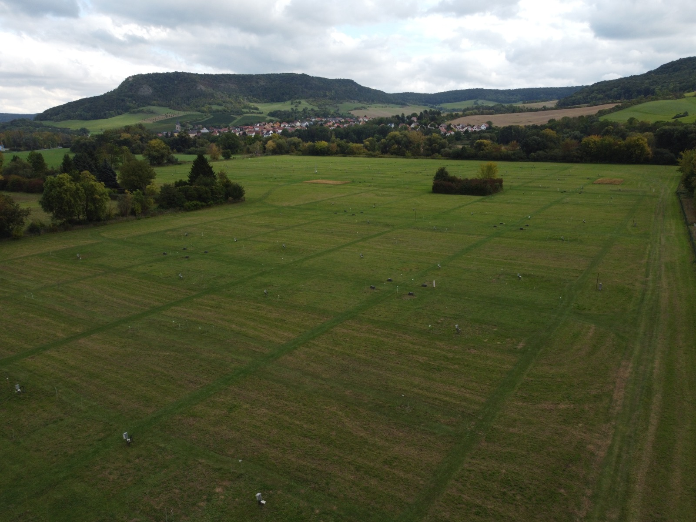
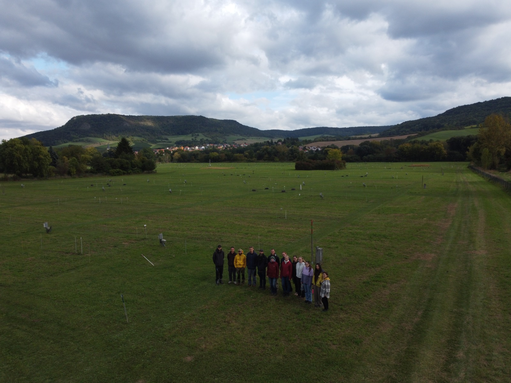

```{r setup, include=FALSE}
knitr::opts_chunk$set(echo = TRUE)
```

# Projekt: Data Wrangling im Jena Experiment (GEO-87)



## 1. Einleitung & Kontext

Dieses Projekt basiert auf Daten, die während der **GEO-87 Exkursion zum
Jena Experiment** (September 2025) erhoben wurden.

### Das Experiment: Warum Biodiversität?

Das [Jena Experiment](http://the-jena-experiment.de/) ist eines der
weltweit am längsten laufenden Biodiversitätsexperimente. Es untersucht
die **Biodiversity-Ecosystem Functioning (BEF)** Beziehung. Die zentrale
Frage lautet: *Funktionieren Ökosysteme mit vielen Arten besser als
solche mit wenigen?*

Ein wichtiger Indikator für diese "Funktion" ist der Stickstoffkreislauf
im Boden.

Hohe Diversität führt oft zu einer besseren Durchwurzelung und
Ressourcennutzung ("Komplementarität"). Wir erwarten daher oft, dass in
diversen Plots weniger ungenutzter Stickstoff (Nmin) im Boden übrig
bleibt, da die Pflanzen ihn effizienter aufnehmen.

**Funktionelle Gruppen** spielen dabei eine Sonderrolle.

Vor allem **Leguminosen** (Hülsenfrüchtler wie Klee) können
Luftstickstoff fixieren und reichern den Boden eher mit Stickstoff an,
was dem allgemeinen Trend entgegenwirken kann.

### Unser Projektziel

Wir haben Bodenproben entnommen, um den **Mineralischen Stickstoff
(Nmin)** ($NO_3^-$ und $NH_4^+$) sowie den **Wassergehalt (SWC)** zu
bestimmen.

Der Fokus dieses Projekts liegt auf **Data Wrangling**: Wir nehmen die
"rohen" Labordaten von 2025, reinigen sie von Fehlern, berechnen
sinnvolle Einheiten (mg/kg) und verknüpfen sie mit dem Versuchsdesign,
um unsere Hypothesen zu testen.



## 2. Leitfragen & Hypothesen

Unsere Analyse wird von folgenden Fragen geleitet, wobei der Vergleich
zum Vorjahr eine zentrale Rolle spielt:

1.  **Hypothese 1 (Diversität):** Variiert der Boden-Nmin (Gesamt-Nmin,
    $NO_3^-$, $NH_4^+$) signifikant mit der ausgesäten Artenvielfalt
    (`sowndiv`)?
2.  **Hypothese 2 (Funktionelle Gruppen):** Hat das Vorhandensein
    bestimmter funktioneller Gruppen, insbesondere Leguminosen
    (`p_legume`), einen Einfluss auf die Nmin-Konzentrationen?
3.  **Vergleichsfrage:** Unterscheiden sich die Nmin-Konzentrationen von
    2025 statistisch oder visuell von den Ergebnissen aus 2024?

## 3. Die Datensätze ("Dirty Data")

Wir arbeiten mit vier Dateien. Die Daten liegen teilweise im Rohformat
vor und müssen bereinigt werden.

-   **1. 2025 Rohdaten Labor (`data_jena_2025.xlsx`):** Dies ist unser
    primärer **"Dirty Dataset"**. Er enthält die Rohgewichte aus der
    SWC- und Nmin-Aufarbeitung (Glasgewichte, Einwaagen etc.).

    -   *Wrangling Issues:* Enthält fehlende Werte (z.B. B3A15, B3A18)
        und problematische Einträge (z.B. bei B2A22 wurden versehentlich
        "zwei Gläser" notiert -\> hier muss eine Entscheidung getroffen
        werden!).

-   **2. 2025 Nmin Konzentrationen (`2025_Nmin_Jena.xlsx`):** Enthält
    die Rohdaten des Photometers in **mg/l**.

    -   *Wrangling Issues:* Diese Werte müssen in **mg/kg** Trockenboden
        umgerechnet werden. Viele $NH_4^+$-Werte sind negativ (unter der
        Nachweisgrenze) und müssen behandelt werden (z.B. Setzen auf 0).

-   **3. Plot Metadaten (`Plot information.xlsx`):** Ein "sauberer"
    Metadaten-Satz. Er verknüpft jeden `plotcode` mit den
    experimentellen Variablen wie `sowndiv` (gesäte Diversität) und
    `leg` (Leguminosen vorhanden ja/nein).

-   **4. 2024 Vergleichsdaten (`Results 2024.xlsx`):** Enthält die
    bereits fertig prozessierten Daten des Vorjahres.

    -   Das Blatt `Nmin_Div` dient als **Vorlage (Target Schema)** für
        unsere 2025er Datenstruktur.
    -   Das Blatt `Concentrations` enthält implizit die
        Umrechnungsfaktoren, falls benötigt.

## 4. Data Wrangling Roadmap

Ziel ist es, die 2025er Rohdaten in einen "Tidy Data Frame" zu
überführen, der exakt so aussieht wie das `Nmin_Div` Blatt aus 2024.

### Schritt 1: Berechnung des Bodenwassergehalts (SWC) 2025

1.  Lade die Labordaten (`data_jena_2025.xlsx`).

<!-- -->

1.  Behandle fehlende Daten und **Duplikate/Fehler**:

    -   *Tipp für B2A22:* Wenn zwei Messwerte für einen Plot vorliegen,
        berechne den Mittelwert, um mit einem einzigen Wert
        weiterzuarbeiten.

<!-- -->

1.  Berechne das Trockengewicht der SWC-Probe (`dry_soil_swc_g`):
    `dry_soil_swc_g = (dry soil + glass [g]) - (glass weight [g])`

2.  Berechne den SWC (als Fraktion):
    `swc = (wet soil [g] - dry_soil_swc_g) / dry_soil_swc_g`

```{r}
library(this.path)
library(readxl)
library(readr)
library(readxl)
library(lubridate)
library(dplyr)
library(ggplot2)
library(tidyverse)
library(stringr)
library(purrr)
library(tidyr)
library(lme4)
library(lmerTest)
library(ggpubr)
library(rstatix)
library(stargazer)
library(ggeffects)
library(kableExtra)
```

```{r}
setwd(this.path::this.dir())

    lab_data <- read_xlsx("data_jena_2025 (1).xlsx") %>%
      mutate(
        `dry soil + glass [g]` = if_else(
          `plot ID` == "B2A22",  # Nutze plot ID statt row number
          as.character(mean(c(86.178, 85.864))),
          `dry soil + glass [g]`
        ),
        `dry soil + glass [g]` = as.numeric(`dry soil + glass [g]`), 
        `glass weight [g]` = as.numeric(`glass weight [g]`),        
        dry_soil_swc_g = `dry soil + glass [g]` - `glass weight [g]`,
        swc = (`wet soil [g]` - dry_soil_swc_g) / dry_soil_swc_g,
        dry_soil_nmin_g = `Nmin wet soil [g]` / (1 + swc)
      )
```

###  Schritt 2: Berechnung Nmin in mg/kg

1.  Berechne mit dem `swc` aus Schritt 1 das Trockengewicht der
    *Nmin-Einwaage*: `dry_soil_nmin_g = (Nmin wet soil [g]) / (1 + swc)`
2.  Lade die Photometer-Daten (`2025_Nmin_Jena.xlsx`).
3.  Bereinige negative $NH_4^+$-Werte (Setzen auf 0 oder `NA`).
4.  Rechne **mg/l** in **mg/kg** um. Der Extraktionsfaktor beträgt 50
    (basierend auf 50ml Extraktionsmittel).
    -   `NO3_mg_kg = (NO3-N [mg/l] * 50) / dry_soil_nmin_g`
    -   `NH4_mg_kg = (NH4-N [mg/l] * 50) / dry_soil_nmin_g`
    -   `Nmin_mg_kg = NO3_mg_kg + NH4_mg_kg`

```{r}

# Load photometer data
nmin_jena <- read_excel("2025_Nmin_Jena.xlsx", 
                       skip = 7, 
                       col_names = TRUE) %>%
  setNames(c("lab_number", "probenbezeichnung", "NO3_N_mg_l", "NH4_N_mg_l")) %>%
  filter(!is.na(lab_number) & !is.na(probenbezeichnung)) %>%  # Beide prüfen
  mutate(across(c(NO3_N_mg_l, NH4_N_mg_l), as.numeric)) %>%

# Nmin Berechnung
  # Negative NH4-Werte auf 0 setzen
  mutate(NH4_N_mg_l = if_else(NH4_N_mg_l < 0, 0, NH4_N_mg_l)) %>%
  # Join mit lab_data
  left_join(lab_data, by = c("probenbezeichnung" = "plot ID")) %>%
  mutate(
    dry_soil_nmin_g = `Nmin wet soil [g]` / (1 + swc),
    NO3_mg_kg = (NO3_N_mg_l * 50) / dry_soil_nmin_g,
    NH4_mg_kg = (NH4_N_mg_l * 50) / dry_soil_nmin_g,
    Nmin_mg_kg = NO3_mg_kg + NH4_mg_kg
  )

```

### Schritt 3: Zusammenfügen und Exportieren

1.  Verbinde (`join`) die berechneten Nmin-Werte mit den Metadaten
    (`Plot information.xlsx`) über den `plotcode`.

```{r}
nmin_2025 <- nmin_jena %>%
  left_join(read_excel("Plot information.xlsx"), 
            by = c("probenbezeichnung" = "plotcode"))
```

1.  Lade die sauberen 2024er Daten (`Results 2024.xlsx`).

```{r}

nmin_2024 <- read_excel("Results 2024.xlsx", sheet = 3, skip = 0) %>%
  rename(
    NO3_mg_kg = NO3,
    NH4_mg_kg = NH4,
    Nmin_mg_kg = Nmin,
    leg = legume
  )

```

1.  Kombiniere beide Datensätze (2024 & 2025) in einen langen Data
    Frame. Füge eine Spalte `Year` hinzu.

```{r}

nmin_combined <- bind_rows(
  nmin_2024 %>% mutate(Year = 2024),
  nmin_2025 %>% 
    rename(Plot_ID = probenbezeichnung) %>%
    mutate(Year = 2025)
)
```

1.  **Export:** Schreibe eine **neue Excel-Datei**
    `Jena_Nmin_Combined.xlsx`.
    -   Diese soll zwei Tabellenblätter enthalten: eines namens "2024"
        und eines namens "2025".
    -   Die Spalte `Year` soll in den einzelnen Blättern *nicht*
        enthalten sein (da durch den Blattnamen impliziert), aber im
        R-Objekt für die Analyse vorhanden bleiben.

```{r}
library(readxl)
library(dplyr)
library(writexl)


# Export
write_xlsx(
  list(
    "2024" = nmin_combined %>% filter(Year == 2024) %>% select(-Year),
    "2025" = nmin_combined %>% filter(Year == 2025) %>% select(-Year)
  ),
  path = "Jena_Nmin_Combined.xlsx"
)
```

## 5. Visualisierung

Wir wollen die Ergebnisse explorativ darstellen. Erstelle folgende
Grafiken mit `ggplot2`:

**Grafik 1: Reproduktion (Nur 2025 Daten)** Erstelle einen Scatterplot:
\* x-Achse: Logarithmierte Diversität (`log2(sowndiv)`) \* y-Achse:
Logarithmiertes Nmin (`log(Nmin)`) \* Farbe: Leguminosen vorhanden
(ja/nein) \* *Ziel:* Sieh dir zum Vergleich die Abbildung aus dem
Vorjahr an (siehe Moodle/Material). Deine Grafik sollte stilistisch
ähnlich aussehen.

**Grafik 2: Der Jahresvergleich (2024 vs. 2025)** Untersuchen wir, ob
sich die Nmin-Werte generell verändert haben. \* Erstelle einen
**Boxplot** (oder Violin-Plot). \* x-Achse: `Year` (als Faktor) \*
y-Achse: `Nmin_mg_kg` \* Nutze `facet_wrap`, um Leguminosen-Plots von
Nicht-Leguminosen-Plots getrennt darzustellen. \* *Frage:* Sind die
Nmin-Werte 2025 generell höher oder niedriger als 2024?

------------------------------------------------------------------------

## 6. Optional: Challenges für Fortgeschrittene

Dieser Teil ist optional für Studierende mit Vorkenntnissen in Statistik
oder Lust auf "Dirty Data Hell".

### Bonus A: Der "Miese" Import

Im File `Results 2024.xlsx` gibt es ein Blatt `Concentrations`. Dies
sind die Rohdaten des Vorjahres, aber extrem schlecht formatiert
(falsche Header, Metadaten in den ersten Zeilen etc.). \* **Aufgabe:**
Versuche, dieses Blatt sauber einzulesen, ohne händisch im Excel etwas
zu löschen. Extrahiere die Spalten für Nitrat und Ammonium und
vergleiche sie mit den sauberen Daten.

### Bonus B: Statistische Analyse (ANOVA)

Überprüfe deine visuellen Befunde statistisch mittels Linear
Mixed-Effects Models (LMM). \* Modell für 2025:
`logNmin ~ sowndiv * legume + (1 | Block)` \* Vergleichsmodell:
`logNmin ~ sowndiv * legume * Year + (1 | Block)` \* Nutze `lmer()` aus
dem `lme4` Paket und interpretiere den Output der `anova()`. Gibt es
eine signifikante Interaktion zwischen Jahr und Diversität?
