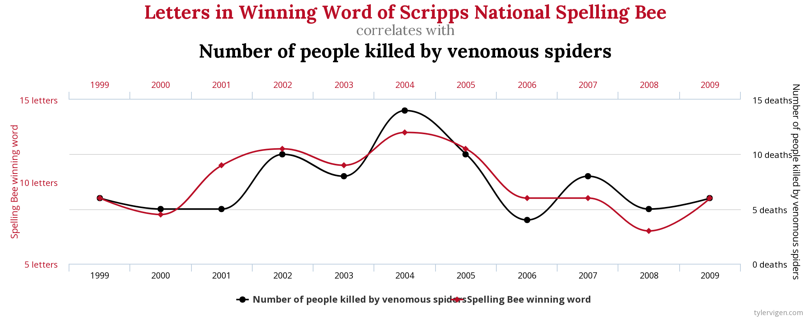
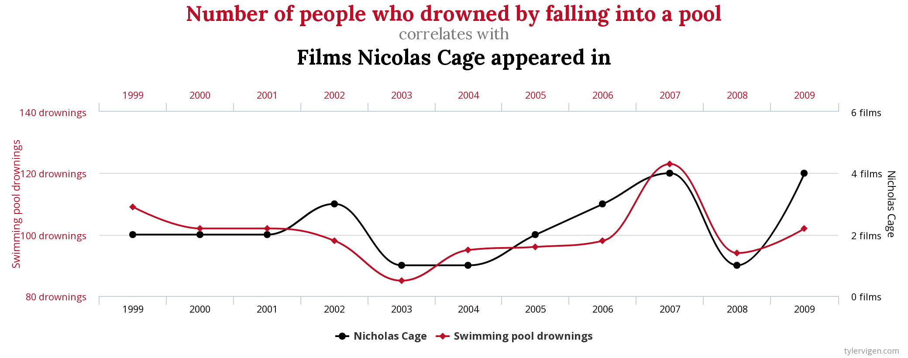
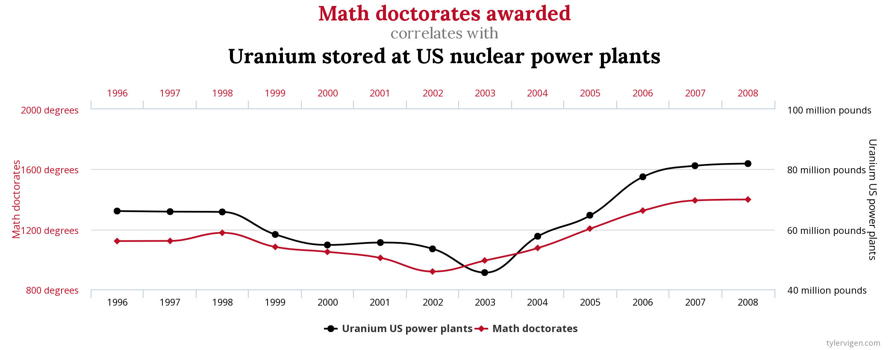

## Unhinged Introduction

 
"There are three kinds of lies: lies, damned lies, and statistics."

-*Mark Twain*

 

In our R class we've been tasked with investigating cars, nycflights, Star Wars, and a whole host of somewhat relevant data sets that can be modeled and analyzed to produce mildly 
meaningful statistical summaries. All I can ask in the face of the overwhelming banality
of the subject matter is: Where is the humanity? 

While it may be useful for us to engage in these exercises, to pretend that we live
in a world dictated by facts, means, and medians, it is not the mode of the modern era
to care about facts. More people read the Daily Mail than the New York Times, for every Süddeutsche Zeitung subscriber there are roughly five Bild consumers,
and every Tuebingen student in a R data science course probably has at least
one insane relative that gets their news from Facebook.

We live in an era where fake news and alternative facts are vastly more popular than
boring old baseline reality. So why should we produce useful charts that will languish,
unread in a dry academic journal or, horror of horrors, a term paper to be graded by
an overworked and underpaid teacher's assistant? Screw authenticity, the truth, and
statistical integrity! Embrace fallacy and let's get our data out there for the world
to see! 

Tyler Vigen is a luminary in the field of bullshit statistics. His website, [Spurrious Correlations](https://tylervigen.com/spurious-correlations), guides card carrying crackpots,
professional nutjobs, and those on the forefront of tinfoil haute couture headgear development, to make claims that reasonable people reject but the vast majority
of humanity can't wait to eat up.

Vigen has combed databases far and wide to bring to light such fascinating conspiracies
as:

 
**The insidious connection between spelling bees and venomous spiders:**

 
**Nicolas Cage's vendetta against anyone in proximity to a pool:**

 
**And how the Math Majors are planning to irradiate the USA:**

## Demented Goals

Now why should Vigen have all the fun and get all the credit? We need to search
for our own covert connections and dark plots hidden amongst the numbers 
that underpin our modern society. Your mission, should you choose to accept it,
is to find your own Spurious Correlation. Maybe it's cheese consumption in Italy
and the rate of cocaine exportation from Columbia. Perhaps a consortium of 
automanufacturers in Europe match their model releases with rainfall in Timbuktu.
For those willing to leave reason behind, the possibilities are endless.

Thus the project seems relatively simple, right? Get two data sources from anywhere
and find some way to relate them that you think your crazy uncle/aunt on facebook
might believe. You can display the data in any way you want, Vigen's format is 
great but if you can think of a way to elevate your manufactured bullshit to true
statistical art, go for it!

This project reveals its bastardly nature when you begin trying to correlate
completely unrelated data. How can you match patterns between two totally different
data sets? You're going to need to think not in terms of what the data represents, 
rather what scales to use, how to mathematically match statistical curves within
some visually acceptable error bar, and how to analyze sections or the entirety
of a dataset in ways that give you information on numerical patterns. 

Now, some might say this is good practice for searching the web for usable data 
and collating it into one project. Others might posit that anyone interested in data science might encounter situations where it is beneficial to look at data from a purely abstract perspective. Hell, there are probably those among us that think this exercise might be an awesome practical warning to not believe every chart we find on the internet. But I say NO! This exercise is designed to help any of us who want to make it big in the world of politics, tabloids, social media or any other truly pointless but quintessentially human endeavor. So go to the dark side of YouTube, watch Fox News, and duct tape your tinfoil hat firmly to your head because we are about to contribute our own shovelful of manure to the compost heap that is the internet.

## Crazed Priorities

-   Find completely unrelated datasets

-   Identify statistical patterns in them

-   Create an algorithm that matches statistical trends in them (Think about the Geometry of a trend line)

-   Display the data in a way that makes it seem correlated

-   Profit??

## Sensational Samples

-   [USA Public Health Data](https://wonder.cdc.gov/)

-   [McDonald's Annual Reports](https://corporate.mcdonalds.com/corpmcd/investors/financial-information.html)

-   [Public Toilet Map of Australia](https://data.gov.au/dataset/ds-dga-553b3049-2b8b-46a2-95e6-640d7986a8c1/details)

-   [California Vanity Licence Plate Requests](https://github.com/veltman/ca-license-plates)

-   [Lists of Obscene Words in Various Languages](https://github.com/LDNOOBW/List-of-Dirty-Naughty-Obscene-and-Otherwise-Bad-Words)

-   [And Many Many More   ](https://github.com/awesomedata/awesome-public-datasets)