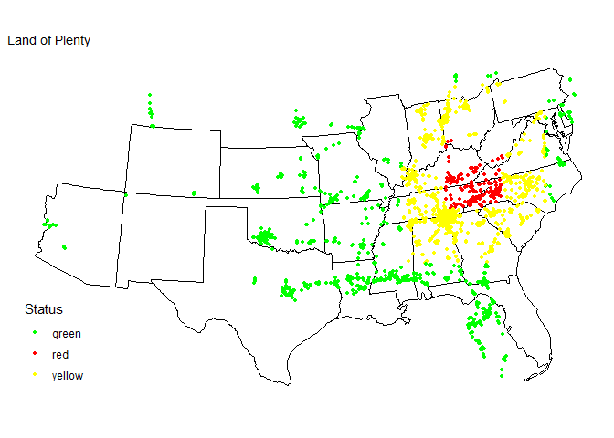

# Solution for the Waffle-disaster project

Hey Edward, 
this is my solution so far, in the following one can see the plot with the simulated disaster zone:


```{r setup, include=FALSE}
knitr::opts_chunk$set(echo = TRUE)

library(rvest)
library(dplyr)
library(tidyr)
library(usmap)
library(tidyverse)

url <- "https://locations.wafflehouse.com" 

page <- read_html(url)
store_data <- 
  page |> 
  html_element("script#__NEXT_DATA__") |> 
  html_text() |> 
  jsonlite::fromJSON() |>
  purrr::pluck("props", "pageProps", "locations") |>
  unnest(addressLines) |>
  unnest(custom) |> 
  as_tibble()|>
  mutate(Status="green") # default green

# center of disaster zone, latitude and longitude
center <- c(36.31316,-82.38821)
# radius for red zone
red_radius <- 2
# radius for yellow zone
yellow_radius <- 5
# assign the colors to the stores
for (i in 1:nrow(store_data)) {
  if (store_data$latitude[i] < center[1] + yellow_radius &&
      store_data$latitude[i] > center[1] - yellow_radius
      && store_data$longitude[i] < center[2] + yellow_radius &&
      store_data$longitude[i] > center[2] - yellow_radius) {
    store_data$Status[i] = "yellow"
    if (store_data$latitude[i] < center[1] + red_radius &&
        store_data$latitude[i] > center[1] - red_radius
        && store_data$longitude[i] < center[2] + red_radius &&
        store_data$longitude[i] > center[2] - red_radius) {
      store_data$Status[i] = "red"
    }
  }
}

# plotting all points of the waffle houses in a custom map
waffle_map <- ggplot(store_data, aes(x = longitude, y = latitude,color=Status)) +
  geom_point(size = 1) +
  scale_color_manual(values = c("green" ,"red", "yellow")) +
  theme_minimal()+
  theme(axis.text = element_blank(),
  axis.title = element_blank(),
  panel.grid = element_blank(),
  legend.position = c(0, 0),
  legend.justification = c(0, 0))

# Plotting waffle-map on a US map
final_map <- plot_usmap(regions = "states", include = store_data$state) +
  labs(title = "Land of Plenty") + 
  # change xmin, etc.?
 # annotation_custom(ggplotGrob(waffle_map),xmin = min(store_data$latitude), xmax = max(store_data$latitude), ymin = min(store_data$longitude), ymax = max(store_data$longitude))
  annotation_custom(ggplotGrob(waffle_map))

final_map
```



