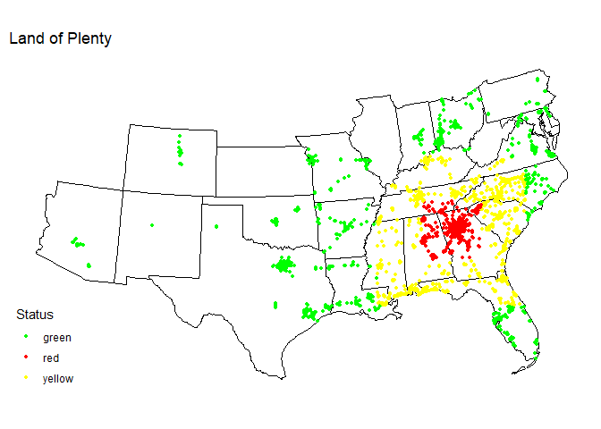

# Solution for the Waffle-disaster project

Hey Edward,

this is my solution for the waffle-disaster project.

First, I’m reading the data and transforming it, thank you for providing
some of the code.

    url <- "https://locations.wafflehouse.com" 

    page <- read_html(url)

    store_data <- 
      page |> 
      html_element("script#__NEXT_DATA__") |> 
      html_text() |> 
      jsonlite::fromJSON() |>
      purrr::pluck("props", "pageProps", "locations") |>
      unnest(addressLines) |>
      unnest(custom) |> 
      as_tibble()|>
      rename( Status = "_status")|>
      rename(x=longitude,y=latitude) |> 
      sf_transform_xy(target_crs = 2163, source_crs=4326) #transforming coordinates for us-map

## Simulating a disaster zone

Waffle Houses use the following status evaluation:

-   Green: Open as normal
-   Yellow: Limited Operation/Opening Hours
-   Red: Closed

For simulating a disaster zone, I picked a location, stored the radii
for the red and the yellow zone. Then I computed which of the waffle
houses are in which zone:

    # center of disaster zone
    center <- list( lat = -1121903.4, long = 1409023.8) 
    # radius for red zone
    red_radius <- 200000.0
    # radius for yellow zone
    yellow_radius <- 500000.0
     
    # store data for simulated disaster
    store_data_disaster <- store_data %>%
      mutate(Status =
               if_else(
                 (abs(y - center$lat) < red_radius) &
                   (abs(x - center$long) < red_radius) ,
                 "C",# in red range
                 if_else((abs(y - center$lat) < yellow_radius) &
                           (abs(x - center$long) < yellow_radius),
                         "CT", # in yellow range
                         Status))) # default: use old value

And finally the plot with the simulated disaster zone:

    final_map <-
      plot_usmap(regions = "states", include = store_data$state) +
      labs(title = "Land of Plenty") + 
      geom_point(data=store_data_disaster,mapping=aes(x = x, y = y,color=Status), size = 1) +
      scale_color_manual(labels =c("green" , "red","yellow"),values = c("green" , "red","yellow")) +
      theme_minimal()+
      theme(axis.text = element_blank(),
      axis.title = element_blank(),
      panel.grid = element_blank(),
      legend.position = c(0, 0),
      legend.justification = c(0, 0))

    final_map

