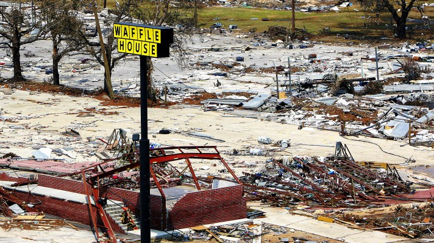
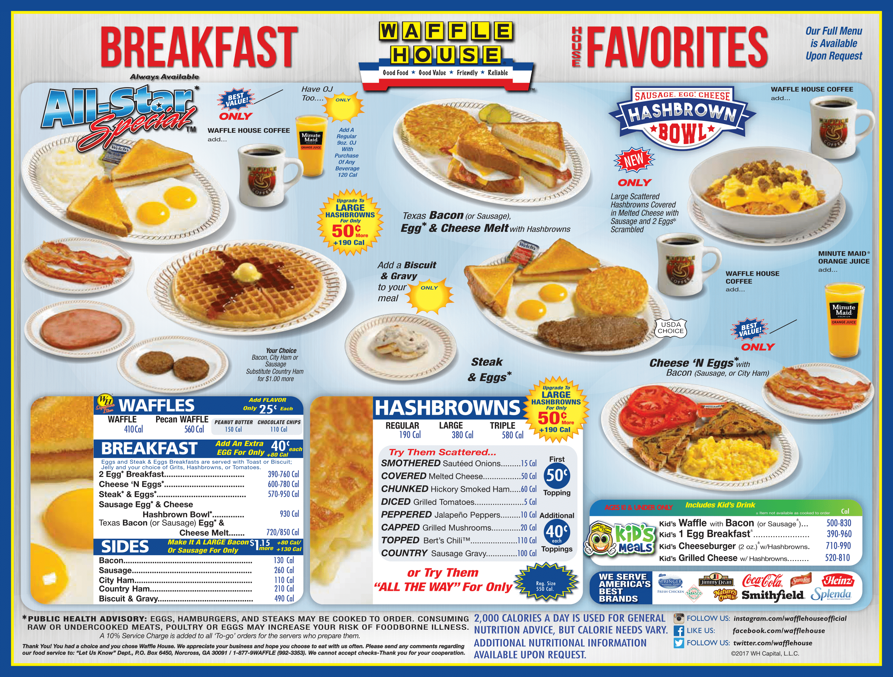
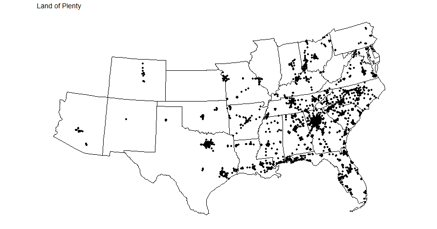
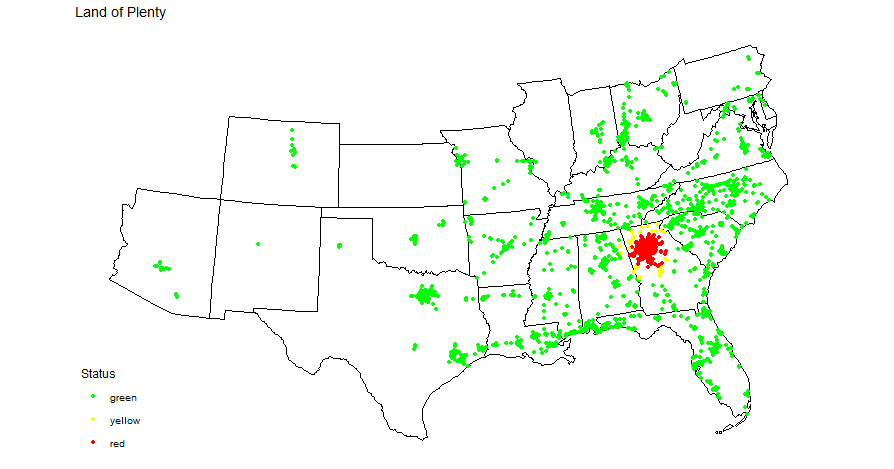
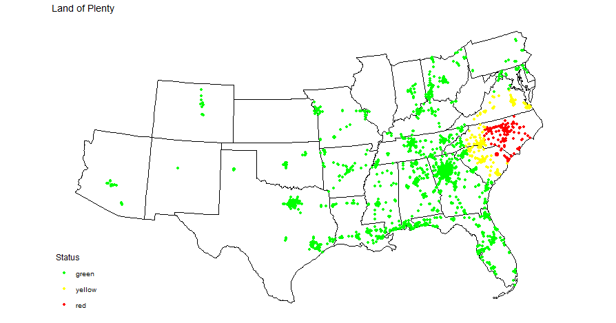

```{r setup, include=FALSE}
knitr::opts_chunk$set(echo = TRUE)
```

## Coffee With a Smile

 <br> "The sooner restaurants, grocery and corner stores, or banks can reopen, the sooner local economies will start generating revenue again---signalling a stronger recovery for that community."

---*Craig Fugate*, former FEMA Administrator

<br>

Welcome to America! Where guns are cheap and healthcare costs an arm and a leg. In an attempt to confirm the world's stereotypes of my country, the Federal Emergency Management Agency (FEMA), decided to use the status of a 24/7 breakfast food chain as a metric for the severity of hurricane damage.

Waffle House, praise be its golden name, has a business plan that would horrify most Germans. As said before, it is open 24 hours a day 7 days a week and that means 24 hours every day, 7 days in all weeks. Waffle house doesn't close for any holiday and whether its 3PM on a Wednesday or 3AM on Christmas, you can find cheap food and unlimited coffee at rock bottom prices. Every American has, at one point or another, washed up under the sickly glow of Waffle house's incandescent lights. Usually at some ungodly hour of the night, so deliriously drunk or horrendously hungover that it seems a miracle that the staff can transform your guttural grunts and a sweaty fistful of crumpled bills into the ambrosia that is the All Star Special.

So why did FEMA decide to use the opening status of Waffle Houses as a metric for the severity of hurricanes in the Southern USA? They don't believe in not selling waffles unless it is physically impossible to keep the store open. There is a three tiered status evaluation for any given waffle house:

Green: Open as normal.

Yellow: Limited Operation/Opening Hours.

Red: Closed.

The reason FEMA took an interest in this company in particular is that Waffle Houses have their own cooking fuel supplies and don't need electricity to make their food. During the Houston Floods only two out of thirty two Waffle Houses closed while the rest cooked on sometimes without lights, air conditioning, or refrigeration.

In effect, if you're in a place where a Waffle House is in Yellow mode, you're likely the survivor of a recent natural disaster. If you're in a Red mode area you're probably dead or might as well be because you can't enjoy bottomless coffee for only a buck twenty five.



## Good Food, Good Value, and Great Plots

We are going to make our own Waffle House Index by using data from the internet plus a bit of imagination as there is no large scale natural disaster currently happening in my homeland.

First you will need to use the code below to generate the Waffle House Master List:

```{r, eval=FALSE}
library(rvest)
library(dplyr)
library(tidyr)

url <- "https://locations.wafflehouse.com" 

page <- read_html(url)
store_data <- 
  page |> 
  html_element("script#__NEXT_DATA__") |> 
  html_text() |> 
  jsonlite::fromJSON() |>
  purrr::pluck("props", "pageProps", "locations") |>
  unnest(addressLines) |>
  unnest(custom) |> 
  as_tibble()
```

If this code scares you don't worry! You do not have to change, edit, or understand what the hell it's doing. It's doing a task called web scraping which I had no idea how to build in R so I stole it from [this Stack Exchange post](https://stackoverflow.com/questions/76940122/rvest-scrape-all-values-from-website-by-specific-class) since the old wafflehouseindex.us website was disabled by the Trump appointed fun hating FEMA director. Web scraping is when you use a program to access a webpage and fetch the HTML data back. That's what the first few lines of code do and the rest is basically ripping apart the nested HTML and making everything fit nicely into a big tibble.

Your first task is to take this data and use it in conjunction with the usmap package to map out the locations of Waffle Houses in the USA:



Next we are going to simulate a natural disaster by choosing a center point and defining different radii for our Yellow and Red zones. Using this information you will need to determine which Waffle Houses are within the different zones and display them correctly. Once you have everything working you should be able to change the radii and move the disaster zone around the plot just by changing a few variable values in your code.

 

## All the Way Priorities

-   Use the included code to scrape the data set from Waffle House's website.

-   Use the usmap package to create a plot of the states that have Waffle Houses.

-   Figure out how to plot the Waffle House locations on the map.

-   Create a radial disaster zone, centered on a longitude, latitude coordinate pair with Closed, Limited Menu, and Open bands

-   Make the bands color coded with Closed = Red, Limited Menu = Yellow, and Open = Green.

-   Check your code by changing the coordinates of the center of the disaster zone and seeing if the plot updates correctly. Also try changing the different band radii.

-   For both this section and the extension, if you get stuck send me a message. Like Julia Childs, I've precooked a finished project and can send advice/code snippets as needed.

## Upgrade to Large Extra Reading for only 50 cents more!

-   [FEMA post on the Waffle House Index](https://www.fema.gov/blog/its-little-piece-normal)

-   [Waffle House Report on the Index](https://www.wafflehouse.com/how-to-measure-a-storms-fury-one-breakfast-at-a-time/)

-   [WayBackMachine Archived FEMA Waffle House Index Page](https://web.archive.org/web/20200401201227/https://wafflehouseindex.us/)

-   [Houston Flooding with Waffle House Information](https://www.npr.org/sections/thetwo-way/2017/08/29/547079242/keep-it-simple-and-stay-open-the-waffle-house-storm-menu)

## What About (optional) Web Apps!?

```{r}
knitr::include_app(url = "https://edwardarchaeology.shinyapps.io/app_testing/")
```

You can order appetizers at Waffle House and the coding world is also obsessed with apps. So if you've got some kind of programmatic masochist complex you can complete this **completely optional** project extension.

R has a super cool package called shiny that allows you to build Graphic User Interfaces or GUIs. In a fit of insanity I decided that the only way this project could truly honor Waffle House is by building an interactive web application to its greatness. You can see the results here if they aren't displaying above:

[Waffle's of Doom](https://edwardarchaeology.shinyapps.io/app_testing/)

Just click anywhere on the map and a radial disaster will appear. You can adjust the radii sliders and the map will update. Click anywhere else on the map to move the center of the disaster.

The fun part about shiny is that it allowed me to develop and publish this app with 0 javascript or HTML, two languages I do not have a lot of experience in. So if you thought the app thingy was cool and you'd like to learn how to build one yourself keep reading. If not, go relax, have a beer, and pat yourself on the shoulder for having enough common sense to leave R in R studio where it belongs.

### So You're Still Here

Right, for those of you willing to go down the rabbit hole, let's begin. First things first, play around with the shiny tutorial [here](https://shiny.posit.co/r/getstarted/shiny-basics/lesson1/index.html). This should get you to the point where you have shiny installed and you can run some examples.

Focus on trying to get an example shiny project working within your own R studio environment. Next, copy and paste the code into a local file structure on your PC and try and get that running. Finally modify the example code to add another button/slider/textbox to figure out how to add/access ui elements.

If you can get through those three objectives (which are a lot, don't worry if it takes a while to figure out how to do R UI coding), you should have a basic idea of the ui and server functions that are the heart of the shiny package.

From here, you're going to need to modify your old Waffle Disaster project code so that it will run under the ui/server syntax. Not everything has to be wrapped in the ui/server functions. Scraping the data/helper functions can and should be done outside of the shiny GUI building code block. Below is a list of steps for successfully getting a Waffle Disaster shiny app working on your PC:

-   Create a function that takes in a longitude, latitude, red radius size, and yellow radius size and outputs a data frame that will be accepted by the plot_usmap() call. Since we are now taking in user data we will need to update the map accordingly anytime they change the disaster origin point or the red/yellow radii. As such we will call this function anytime anything changes.

-   Take your Waffle Disaster code and splice it into a shiny example where you can plot the map. I started with [this one](https://shiny.posit.co/r/getstarted/shiny-basics/lesson1/#Go%20Further)

-   Once you can get your map plotting you should move on to trying to grab the position where a user click event happens. I used the tutorial [here](https://mastering-shiny.org/action-graphics.html#modifying-the-plot) to get a rough understanding of how this works. You can run the example from section 7.1.5 by clicking [here](https://hadley.shinyapps.io/ms-modifying-size/). Focus on figuring out how reactiveVal() works in the server function. For us, we need a reactiveVal() with two inputs for latitude and longitude. And we need to observeEvent() a plot_click and get its x and y values. Those hints will make a lot more sense once you read through the example.

-   Once you've made it this far you're extremely close to finishing. However, you're going to run into a massive problem with the map coordinates when you try and feed the click event's coordinates into your mapping helper function from the first step. This is because the Coordinate Reference System, or CRS, of usmap is number 2163, an Alber's Equal Area Projection, and the distance calculations for your radii are done under CRS number 4326, the Word Geodetic System 1984 Projection. If that meant nothing to you do not panic. Basically usmap uses really big numbers to represent latitudes and longitudes and most other R spatial mapping packages use smaller numbers. This is why you need to call usmap_transform() at some point in your original code. As such, we just need to convert the big numbers from our map's latitude/longitude to the smaller numbers used by most R distance calculation functions. I've included a solution I cobbled together so you don't have to learn a bunch of random geographic projection BS. These are the first 6 lines of my helper function from Step 1.

```{r, eval=FALSE}
albers_coords <- tribble(~x, ~y, mylon, mylat)
  dec_geom_coords <- albers_coords %>% 
    st_as_sf(coords = c("x", "y"), crs = 2163) %>%
    st_transform(crs = 4326)
  dec_df_coords <- do.call(rbind, st_geometry(dec_geom_coords)) %>% 
    as_tibble() %>% setNames(c("lon","lat"))
```

-   With correctly converted coordinates you should now be in a position where you can make your local app update the center of the disaster zone based on where you click. The final step for your local app is adding in two sliders for the different radii. If you're stuck here, just look at the first shiny example from the link above, it uses slider input.

-   Now that the app works locally, you can publish it to the web. You'll need to make a free account on [shinyapps.io](https://www.shinyapps.io/). They'll help you deploy and host your app. Then follow [this tutorial](https://shiny.posit.co/r/articles/share/shinyapps/) to learn how to deploy an app on shinyapps. It's super simple and the deployment step is two lines of code.

-   YAAAAAAAY you've done it! Now you can share your app just by copying the URL of the page it opens on. Send it to your parents to show them you've done something cool in school, post it in your group chats to establish internet dominance in your social circle, heck throw it on a job application to wow your potential employer with your super sick webdev skills, or just upload the link in a .rmd file in our class's project directory so you get credit. Whatever works for you, and thanks for going the extra distance on this project. You've done a lot of coding across a couple different knowledge basis and pushed R to its interactive limit. Great Job! :)
