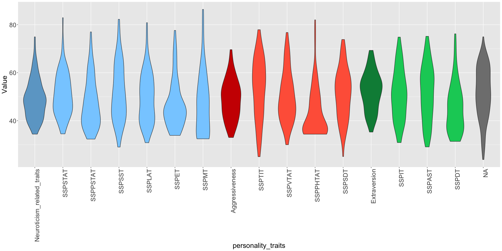
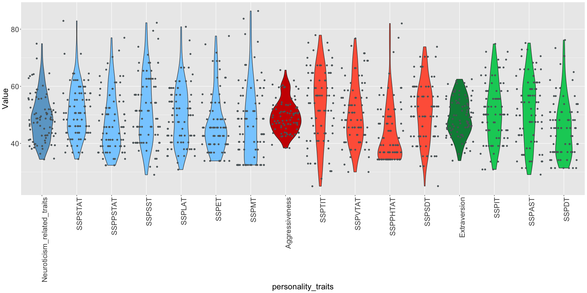
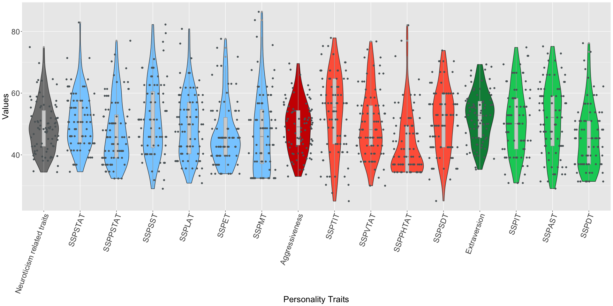

    library(tidyverse)

    ## ── Attaching core tidyverse packages ──────────────────────── tidyverse 2.0.0 ──
    ## ✔ dplyr     1.1.4     ✔ readr     2.1.5
    ## ✔ forcats   1.0.0     ✔ stringr   1.5.1
    ## ✔ ggplot2   3.5.0     ✔ tibble    3.2.1
    ## ✔ lubridate 1.9.3     ✔ tidyr     1.3.1
    ## ✔ purrr     1.0.2     
    ## ── Conflicts ────────────────────────────────────────── tidyverse_conflicts() ──
    ## ✖ dplyr::filter() masks stats::filter()
    ## ✖ dplyr::lag()    masks stats::lag()
    ## ℹ Use the conflicted package (<http://conflicted.r-lib.org/>) to force all conflicts to become errors

    library(readxl)
    survey <- read_excel('/Users/dave/Downloads/Elise.xlsx')

    survey_clean <- survey %>% 
      filter(grepl("^ASMR021_", Subject)) %>% # Filter rows that start with "ASMR021_"
      mutate(Subject = as.integer(gsub("ASMR021_", "", Subject))) %>%  # Extract just the number part
      select(-Sex) %>%  # Remove the Sex column
      drop_na()  # Remove rows with any missing data

    library(dplyr)

    survey_avg <- survey_clean %>%
      select(Subject, starts_with("ssp")) 
     Average <- colMeans(survey_avg)

    #Calculating 3 personality factor scores 

    survey_clean <- survey_clean %>% 
      mutate(Neuroticism_related_traits = rowMeans(select(., SSPSTAT, SSPPSTAT, SSPSST,SSPLAT,SSPET,SSPMT), na.rm = TRUE)) %>%
      mutate(Aggressiveness = rowMeans(select(., SSPTIT, SSPVTAT, SSPPHTAT,SSPSDT), na.rm = TRUE)) %>% #SSPSDT is normal not reversed, could not find the reversed value in the dataset and there is no explanation how to calculate it
      mutate(Extraversion = rowMeans(select(., SSPIT, SSPAST, SSPDT), na.rm = TRUE))  #SSPDT is normal not reversed, could not find the reversed value in the dataset and there is no explanation how to calculate it

    #Data Visualization Goals violin plots
    survey_clean_PT <- survey_clean %>% select(-c(1:113))
    survey_clean_long <- survey_clean_PT %>% 
      pivot_longer(
        cols = everything(), 
        names_to = "personality_traits", 
        values_to = "Value"
      )

    # Create a vector with the desired order of personality traits
    rank <- c("Neuroticism_related_traits", "SSPSTAT", "SSPPSTAT", "SSPSST","SSPLAT","SSPET","SSPMT", 
                          "Aggressiveness", "SSPTIT", "SSPVTAT", "SSPPHTAT","SSPSDT", 
                          "Extraversion", "SSPIT", "SSPAST", "SSPDT")
    survey_clean_long$personality_traits <- factor(survey_clean_long$personality_traits, levels = rank)

    colors <- c("Neuroticism_related_traits" = "skyblue3", 
                "SSPSTAT" = "skyblue1", 
                "SSPPSTAT" = "skyblue1", 
                "SSPSST" = "skyblue1",
                "SSPLAT" = "skyblue1",
                "SSPET" = "skyblue1",
                "SSPMT" = "skyblue1",
                 "Aggressiveness"= "red3",
                 "SSPTIT" = "tomato1", 
                 "SSPVTAT" = "tomato1", 
                 "SSPPHTAT" = "tomato1",
                 "SSPSDT" = "tomato1", 
                   "Extraversion"= "springgreen4", 
                   "SSPIT" = "springgreen3", 
                   "SSPAST" = "springgreen3", 
                   "SSPDT" = "springgreen3")
    rank <- c("Neuroticism_related_traits", "SSPSTAT", "SSPPSTAT", "SSPSST","SSPLAT","SSPET","SSPMT", 
                          "Aggressiveness", "SSPTIT", "SSPVTAT", "SSPPHTAT","SSPSDT", 
                          "Extraversion", "SSPIT", "SSPAST", "SSPDT")
    survey_clean_long$personality_traits <- factor(survey_clean_long$personality_traits, levels = rank)

