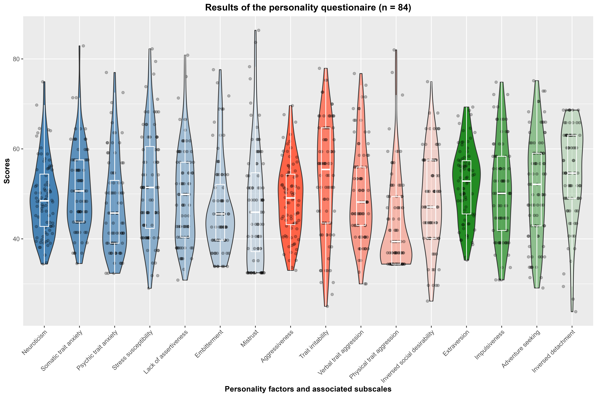

# Questionaire evaluation - Solution by Baptiste

```{r setup, include = F, warning = F, message = F}
# library loading and data import
library(tidyverse)
library(knitr)
knitr::opts_chunk$set(warning = F, message = F)
SSP <- readxl::read_excel("SSP_20231030_EB.xlsx")
```

## Data cleaning

First, I will clean the data by removing the targeted rows:
```{r cleanin_data}
SSP_clean <- 
  SSP |>
  drop_na() |>  # drops the NA
  filter(str_detect(Subject, "^ASMR021_")) |>  # selects Subjects starting with ASMR021_
  mutate(Subject = str_sub(Subject, start = 9)) |>  # removes the first 8 characters (=ASMR021_) in Subjects
  select(-Sex)  # removes column Sex

kable(SSP_clean[1:10, ])
```

## Calculation of the 3 personality factor scores

```{r personality_factor_calulation}
factor.scores.calculation <-
  function(list)

SSP_clean <- 
  SSP_clean |>
  mutate(SSPSDT.I = 100 - SSPSDT,  # inversed value of social desirability
         SSPDT.I = 100 - SSPDT) |>  # inversed value of detachment
  rowwise() |>  # the next operations will be calulated by row (like a group_by() by row)
  mutate(Neuro = mean( c(SSPSTAT, SSPPSTAT, SSPSST, SSPLAT, SSPET, SSPMT) ),
         Aggr = mean( c(SSPTIT, SSPVTAT, SSPPHTAT, SSPSDT.I) ),
         Extr = mean( c(SSPIT, SSPAST, SSPDT.I) )) |>
  ungroup()

kable(SSP_clean[1:5, 114:length(SSP_clean)])
# Only shows the t-values of the traits and the 3 factor scores.
```

## Visualisation

### 1. Preparation

- In order to plot the data, I need to have:
  - One column with all the personality factors and traits: `Factors_Traits`  
  - One column with all data points to be plotted: `Scores`  
To do this, I will keep only the relevant data and the `Subject` number before pivoting the table.  
At the end, I check the levels present in the `Factors_Traits` factor to see if I have indeed all 16 wanted columns:  
```{r data_prep}
#' this will store all the columns we want to remove:
#' all the columns starting with SSP
#' not matching all columns ending with "T" (the t-transformed scores) nor with ".I" (the inverted scores I calculated)
col_to_remove <- 
  names(SSP_clean) |>
  str_match("^SSP.*(?<!\\.I|T)$") |>
  as_tibble() |>
  drop_na() |>
  pull(1)

SSP_plot <- 
  SSP_clean |>
  select(-col_to_remove,
         -SSPSDT, -SSPDT) |> # We also want to remove the traits that were inverted for the factor score calculations
  pivot_longer(cols = -Subject, names_to = "Factors_Traits", values_to = "Scores") |> 
  mutate(Factors_Traits = as_factor(Factors_Traits))

SSP_plot$Factors_Traits |> levels()
```

- Secondly, I need to set the order of the variables for the x-axis.  
I will also prepare the labels of the x-axis.
```{r x-axis}
x_order <- c("Neuro", "SSPSTAT", "SSPPSTAT", "SSPSST", "SSPLAT", "SSPET", "SSPMT",
             "Aggr", "SSPTIT", "SSPVTAT", "SSPPHTAT", "SSPSDT.I",
             "Extr", "SSPIT", "SSPAST", "SSPDT.I")

# The order of the levels in SSP_plot$Factors_Traits can be changed now:
SSP_plot$Factors_Traits <- 
  SSP_plot$Factors_Traits |> 
  factor(x_order)


x_labels <- c("Neuroticism", "Somatic trait anxiety", "Psychic trait anxiety", 
              "Stress susceptibility", "Lack of assertiveness", "Embitterment", "Mistrust",
              "Aggressiveness", "Trait irritability", "Verbal trait aggression", 
              "Physical trait aggression", "Inversed social desirability",
              "Extraversion", "Impulsiveness", "Adventure seeking", "Inversed detachment")
```

- I also want to create a vector that will store the colours for each personality factor or trait. The colours will be plain for the personality factors, and will be lightened down for each of the associated traits using `alpha()`.  
  - Everything associated with *Neuroticism* will be in blue  
  - Everything associated with *Aggressiveness* will be in red  
  - Everything associated with *Extraversion* will be in green  
```{r colour_palette}
#' The following creates the colours and the associated transparency
colours <- 
  tibble(
    colour = c( rep("steelblue", 7), 
                rep("tomato", 5), 
                rep("forestgreen", 4) ),
    alpha = c( seq(1, 0.2, length.out = 7),
                seq(1, 0.2, length.out = 5),
                seq(1, 0.2, length.out = 4) )
  ) |>
  pmap(alpha) |> 
  unlist()

#' I will need a function to write the col_palette vector 
#' because I need the vector to be written as c("category1" = "col1", ...)
create.palette <- 
  function(x, category, col) {
    for (i in seq_along(category)) {
      x[[ category[[i]] ]] = col[[i]]
    }
    return(unlist(x))
  }

#' The vector col_palette finally gets created
col_palette <- 
  c() |>
create.palette(x_order, colours)
```

### 2. Making the plot

```{r plot, }
ggobj <-
  ggplot(SSP_plot, aes(Factors_Traits, Scores)) +
  geom_violin(aes(fill = Factors_Traits)) +
  geom_point(alpha = 0.25, position = position_jitter(0.25)) +
  geom_boxplot(col = "white", alpha = 0, width = 0.25) +
  theme(axis.text.x = element_text(angle = 45, hjust = 1),
        legend.position = "none",
        axis.title = element_text(face = "bold"),
        plot.title = element_text(hjust = 0.5, face = "bold")) +
  scale_x_discrete(labels = x_labels) +
  scale_fill_manual(values = col_palette) +
  labs(x = "Personality factors and associated subscales",
       title = str_c("Results of the personality questionaire (n = ", n_distinct(SSP_plot$Subject), ")"))

ggsave("plot_BS.png", plot = ggobj, width = 300, height = 200, units = "mm", dpi = 600)
```

{#id .class width=100%}
