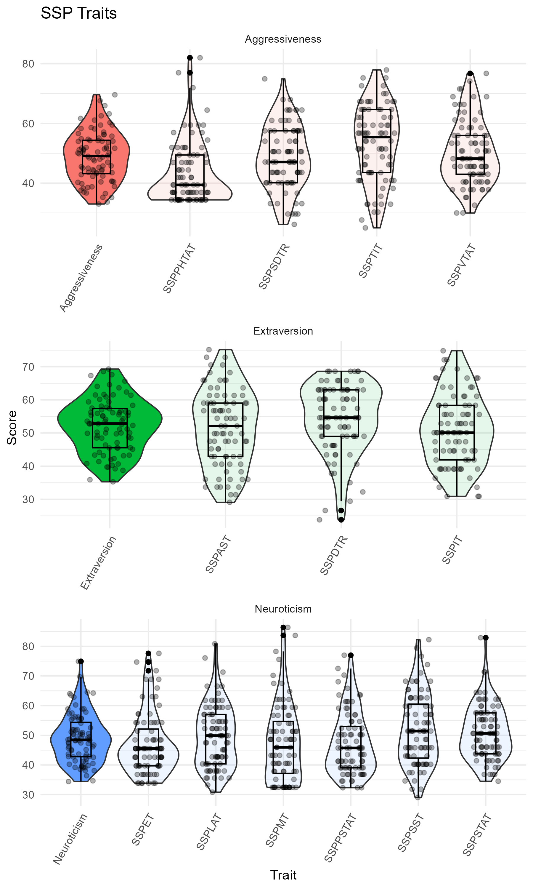

```{r, echo=FALSE}
# silent load of libraries
suppressMessages(library(tidyverse))
suppressMessages(library(readxl))

# set working directory to script location
setwd(dirname(rstudioapi::getSourceEditorContext()$path))
```

# Data import

```{r data.import}
data <-
  # read data
  read_xlsx("SSP_20231030_EB.xlsx") |>
  # preprocessing
  select(-Sex) |>
  filter(str_detect(Subject, "ASMR021")) |>
  mutate(Subject = str_remove(Subject, "ASMR021_")) |>
  drop_na()
```

# Data visualization

```{r data.visualization}
data |>
  # select(-matches("\\d|R$")) |>
  select( Subject, matches( "T$")) |>
#   View()
# data |>
  mutate(
# 1. Neuroticism-related traits:
# - somatic trait anxiety
# - psychic trait anxiety
# - stress susceptibility
# - lack o f assertiveness
# - embitterment
# - mistrust
    Neuroticism = bind_cols(SSPSTAT,
                            # SSPPTAT # ?
                            SSPPSTAT
                            ,SSPSST,SSPLAT,SSPET,SSPMT) |> rowMeans(),
    SSPDTR = -SSPDT + 100,
# 3. Extraversion
# - impulsiveness
# - adventure seeking
# - inversed value of detachment
    Extraversion = rowMeans(cbind(SSPIT,SSPAST,SSPDTR)),
    SSPSDTR = -SSPSDT + 100,
# 2. Aggressiveness
# - trait irritability
# -verbal trait aggression
# - physical trait aggression
# - inversed value of social desirability
    Aggressiveness = rowMeans(cbind(SSPSDTR, SSPTIT,SSPVTAT,SSPPHTAT)),
  ) |>
  select( -SSPDT, -SSPSDT) |>
  pivot_longer(cols = -Subject,
               names_to = "Trait",
               values_to = "Score") |>
  mutate( Group = case_when(
    Trait %in% c("Neuroticism","SSPSTAT","SSPPSTAT","SSPSST","SSPLAT","SSPET","SSPMT") ~ "Neuroticism",
    Trait %in% c("Extraversion","SSPIT","SSPAST","SSPDTR") ~ "Extraversion",
    Trait %in% c("Aggressiveness","SSPSDTR","SSPTIT","SSPVTAT","SSPPHTAT") ~ "Aggressiveness",
    TRUE ~ "Other"
  )) |>
  arrange(Group, Trait) |>
  mutate( Trait = factor(Trait, levels = unique(Trait)) ) |>
  mutate( MainGroup = Trait == Group) |>
  ggplot(aes(x = factor(Trait), y=Score, fill = Group)) +
  geom_violin(aes(alpha=MainGroup)) +
  geom_jitter(width = 0.2, alpha=0.3) +
  #  boxplot without filling
  geom_boxplot(width = 0.3, col="black", fill=NA) +
  theme_minimal() +
  theme(axis.text.x = element_text(angle = 60, hjust = 1)) +
  labs(title = "SSP Traits",
       x = "Trait",
       y = "Score",
       fill = "Group") +
  # hide fill legend
  guides(alpha = "none", fill="none") +
  facet_wrap(~Group, scales = "free", ncol=1) ->
  overallPlot

ggsave("martin.SSP_Traits.png", overallPlot, width = 6, height = 10, dpi = 300)

```



