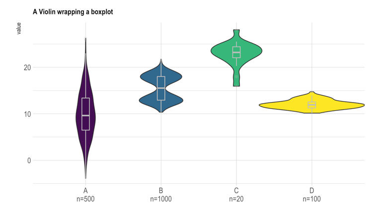

```{r setup, include=FALSE}
knitr::opts_chunk$set(echo = TRUE)
library(tidyverse)
library(readxl)
```
## General Topic of the Task
Subjects filled out a personality questionnaire, called the Swedish Universities Scales of Personality (SSP). It is originally in Swedish and was filled out by Swedish subjects.

The SSP includes 91 items that make up 13 personality scales:

- somatic trait anxiety (SSPSTA)
- psychic trait anxiety (SSPPTA)
- stress susceptibility (SSPSS)
- lack of assertiveness (SSPLA)
- impulsiveness (SSPI)
- adventure seeking (SSPAS)
- detachment (SSPD)
- social desirability (SSPSD)
- embitterment (SSPE)
- trait irritability (SSPTI)
- mistrust (SSPM)
- verbal trait aggression (SSPVTA)
- physical trait aggression (SSPPHTA)

## The Dataset
The dataset ([SSP_20231030_EB.xlsx](SSP_20231030_EB.xlsx)) contains the scores for the 91 items as well as the 13 calculated scales. The data was collected for a Swedish study I am now working on.

Here is a preview of the first few lines of the dataset:
```{r, include = FALSE}
SSP <- read_excel("Projects/elbue/SSP_20231030_EB.xlsx")
```


```{r, echo = FALSE}
knitr::kable(
  SSP[1:10, ],
  caption = "Table: SSP data"
)
```

## The Columns
- `Subject` is the subject number. Only those starting with "ASMR021_" will be needed for the analysis.
- `Sex` is the sex of the subject.
- `SSP01` - `SSP91` are the simple item scores, ranging from 1-4, where 1 equals "does not apply at all" and 4 equals "applies completely".
- some items were reversed, meaning that a 1 corresponds to a 4, a 2 to a 3, etc. These items are called `SSP07R` - `SSP86R`
- `SSPSTA` - `SSPET` are the scores for the 13 scales described in the previous section
- `SSPTSTA` - `SSPTET` are the t-transformed scores for the 13 scales, meaning that the values are transformed to have a mean of 50 and a standard deviation of 10, a common technique to make scores more comparable, even between different personality scales.

## Data Manipulation Goals
### Cleaning up the data
- the dataset should only contain those subjects that start with "ASMR021_"
- the subject name could then be reduced to just the number, without "ASMR021_"
- the sex variable is unnecessary, since all subjects are women
- I would like to have a dataset with only persons that do not have any missing data on any variable. 

### Calculating 3 personality factor scores
The 13 scales can be grouped into three factors. These are
1. Neuroticism-related traits:
  - somatic trait anxiety
  - psychic trait anxiety
  - stress susceptibility
  - lack o f assertiveness
  - embitterment
  - mistrust
2. Aggressiveness
  - trait irritability
  - verbal trait aggression
  - physical trait aggression
  - inversed value of social desirability
3. Extraversion
  - impulsiveness
  - adventure seeking
  - inversed value of detachment

These 3 personality factor scores should be calculated by adding the t-values for the subjective scales and dividing by the number of scales added.

## Data Visualization Goals
I would like a violin plot for all 13 scales plus the three personality factors. It should include a boxplot, somewhat like this: 

- in the end, 16 violin plots should be next to each other
- I would like the personality factor first, and then after that the respective subscales, then the next personality factor, etc.
- it would be nice to have three color schemes, one for each personality factor. For example, the first factor is displayed with a dark red violin plot, and the subscales belonging to the factor are in light red.
- the raw data points could also be included in the plot with jittering
