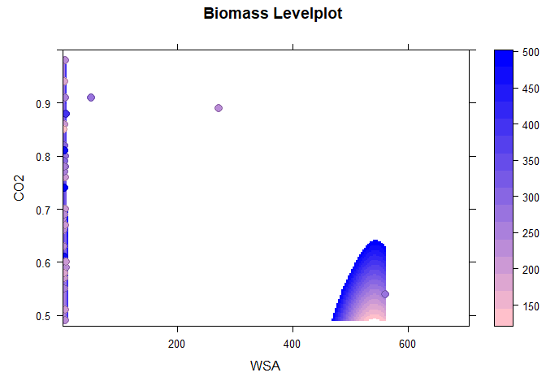

    ## ── Attaching core tidyverse packages ──────────────────────── tidyverse 2.0.0 ──
    ## ✔ dplyr     1.1.1     ✔ readr     2.1.4
    ## ✔ forcats   1.0.0     ✔ stringr   1.5.0
    ## ✔ ggplot2   3.4.1     ✔ tibble    3.2.1
    ## ✔ lubridate 1.9.2     ✔ tidyr     1.3.0
    ## ✔ purrr     1.0.1     
    ## ── Conflicts ────────────────────────────────────────── tidyverse_conflicts() ──
    ## ✖ dplyr::filter() masks stats::filter()
    ## ✖ dplyr::lag()    masks stats::lag()
    ## ℹ Use the conflicted package (<http://conflicted.r-lib.org/>) to force all conflicts to become errors

    ## [1] "C:/Lehre/Advanced-data-processing-with-R/Projects/elizavetashch"

    ## Warning: NAs durch Umwandlung erzeugt

    ## Warning: NAs durch Umwandlung erzeugt

    ## [1] "double"

    ## [1] "double"

    ##  [1]  1  2  3  4  5  6  7  8  9 10 11 12 13 14 15 16 17 18 19 20 21 22 23 24 25
    ## [26] 26 27 28 29 30 31 32 33 34 35 36 37 38 39 40

    ##  [1] 125.80 108.80  87.80  66.50  90.70 141.30 129.00 150.00  96.20  77.50
    ## [11] 104.60  90.40  91.70 115.30 103.40 142.60 137.30 113.50  83.90 125.40
    ## [21] 136.60 101.40 116.30  51.50  94.90  37.80  61.60  70.20  61.10  52.70
    ## [31]  81.03  85.70  81.00  49.90  61.40  51.00 105.20  77.30  58.50

    ## [1] "double"

