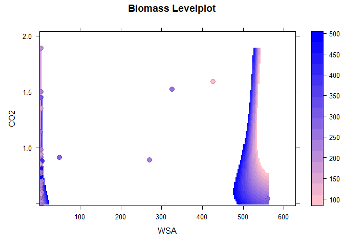

## clean data, add biomass

    dataRaw[dataRaw == ""] <- NA
    data<- dataRaw%>%
      drop_na()%>%
      filter(shape=="Films",
             str_detect(root,"^[0-9.]+$"))%>%
      mutate(root = as.numeric(root),
             CO2=gsub("(\\..*)\\.", "\\.", CO2) %>% as.numeric(gsub("\\.", "", CO2))%>% round(2),
             WSA = gsub("(\\..*)\\.", "\\.", WSA) %>% as.numeric(gsub("\\.", "", .)))%>%
      mutate(biomass=root+shoot)

    print(data)

    ##    shape polymer concentration shoot   root  CO2     WSA biomass
    ## 1  Films      PE           0.1   147 125.80 0.80   4.759  272.80
    ## 2  Films      PE           0.1   140 108.80 0.59   4.838  248.80
    ## 3  Films      PE           0.1   112 115.30 1.50   4.225  227.30
    ## 4  Films      PE           0.1   115  87.80 0.70   5.255  202.80
    ## 5  Films      PE           0.2   133  66.50 0.51   5.138  199.50
    ## 6  Films      PE           0.2   129  90.70 0.49   4.751  219.70
    ## 7  Films      PE           0.2    79 141.30 0.57   3.888  220.30
    ## 8  Films      PE           0.2   101 129.00 0.59   5.705  230.00
    ## 9  Films      PE           0.3   214 150.00 0.82   3.813  364.00
    ## 10 Films      PE           0.3   149  96.20 0.91   4.405  245.20
    ## 11 Films      PE           0.3   129  77.50 0.76   4.619  206.50
    ## 12 Films      PE           0.3   182 104.60 0.78   4.299  286.60
    ## 13 Films      PE           0.4   123  90.40 0.57   3.471  213.40
    ## 14 Films      PE           0.4   138  91.70 0.68   1.047  229.70
    ## 15 Films      PE           0.4   139 115.30 0.60   2.115  254.30
    ## 16 Films      PE           0.4   159 103.40 0.55   2.905  262.40
    ## 17 Films     PET           0.1   336 142.60 0.74   3.931  478.60
    ## 18 Films     PET           0.1   224 137.30 0.58   3.235  361.30
    ## 19 Films     PET           0.1   173 113.50 0.61   3.814  286.50
    ## 20 Films     PET           0.1   378  83.90 0.61   3.853  461.90
    ## 21 Films     PET           0.2   179  34.00 1.89   3.782  213.00
    ## 22 Films     PET           0.2   149 108.30 1.14   3.006  257.30
    ## 23 Films     PET           0.2   173 123.60 1.45   3.889  296.60
    ## 24 Films     PET           0.2    93  55.30 1.35   4.045  148.30
    ## 25 Films     PET           0.3   147 114.30 1.52 325.228  261.30
    ## 26 Films     PET           0.3   143  91.70 0.86   2.119  234.70
    ## 27 Films     PET           0.3   186 125.40 0.98   2.846  311.40
    ## 28 Films     PET           0.3   158 136.60 0.82   3.419  294.60
    ## 29 Films     PET           0.4   123 101.40 0.63   2.558  224.40
    ## 30 Films     PET           0.4   173 116.30 0.79   2.955  289.30
    ## 31 Films     PET           0.4   190  51.50 0.77   2.855  241.50
    ## 32 Films     PET           0.4   138  94.90 0.66   1.765  232.90
    ## 33 Films      PP           0.1   180  37.80 0.98   4.617  217.80
    ## 34 Films      PP           0.1   172  61.60 0.89 271.137  233.60
    ## 35 Films      PP           0.1   145  70.20 0.86   3.936  215.20
    ## 36 Films      PP           0.1   394  61.10 0.81   3.649  455.10
    ## 37 Films      PP           0.2   218  52.70 0.54 561.194  270.70
    ## 38 Films      PP           0.2   306  81.03 0.88   6.608  387.03
    ## 39 Films      PP           0.2   193  85.70 0.91  50.000  278.70
    ## 40 Films      PP           0.2    49  61.00 1.59 426.087  110.00
    ## 41 Films      PP           0.3   134  81.00 0.60   5.699  215.00
    ## 42 Films      PP           0.3   164  49.90 0.67   4.715  213.90
    ## 43 Films      PP           0.3   112  61.40 0.58   3.396  173.40
    ## 44 Films      PP           0.3   187  51.00 0.69   4.018  238.00
    ## 45 Films      PP           0.4   142 105.20 0.78   3.159  247.20
    ## 46 Films      PP           0.4    95  77.30 0.94   3.844  172.30
    ## 47 Films      PP           0.4    86  58.50 0.85   1.609  144.50

## plot

