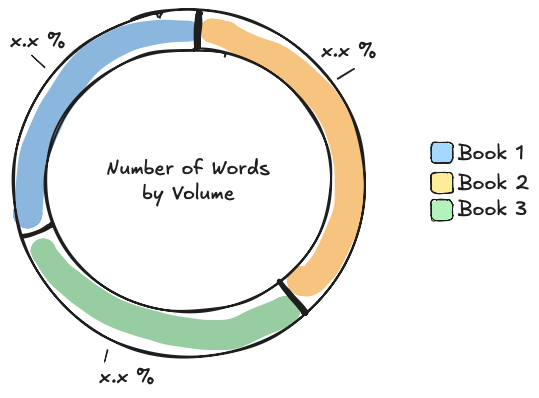
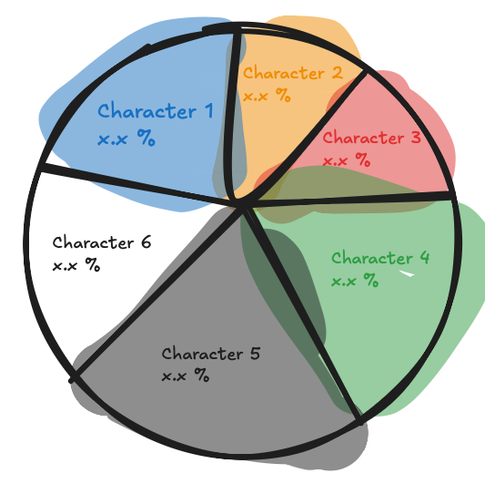
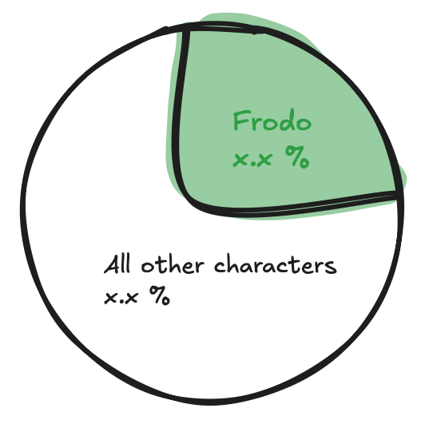
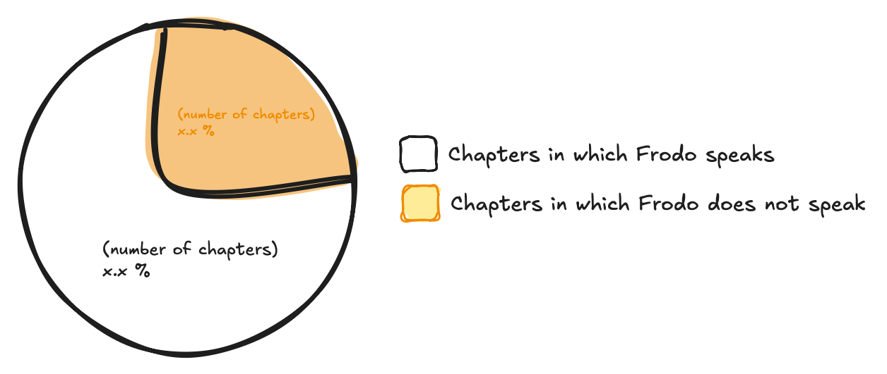
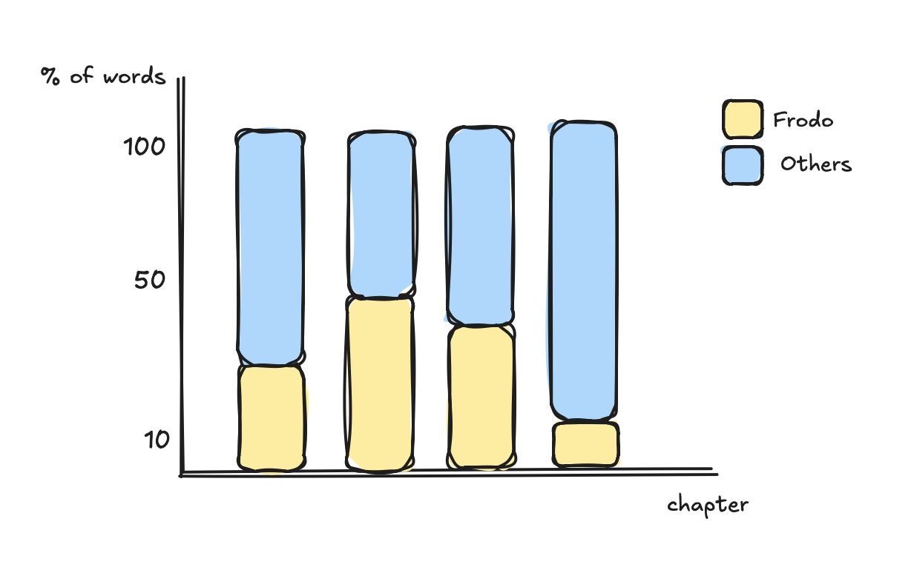
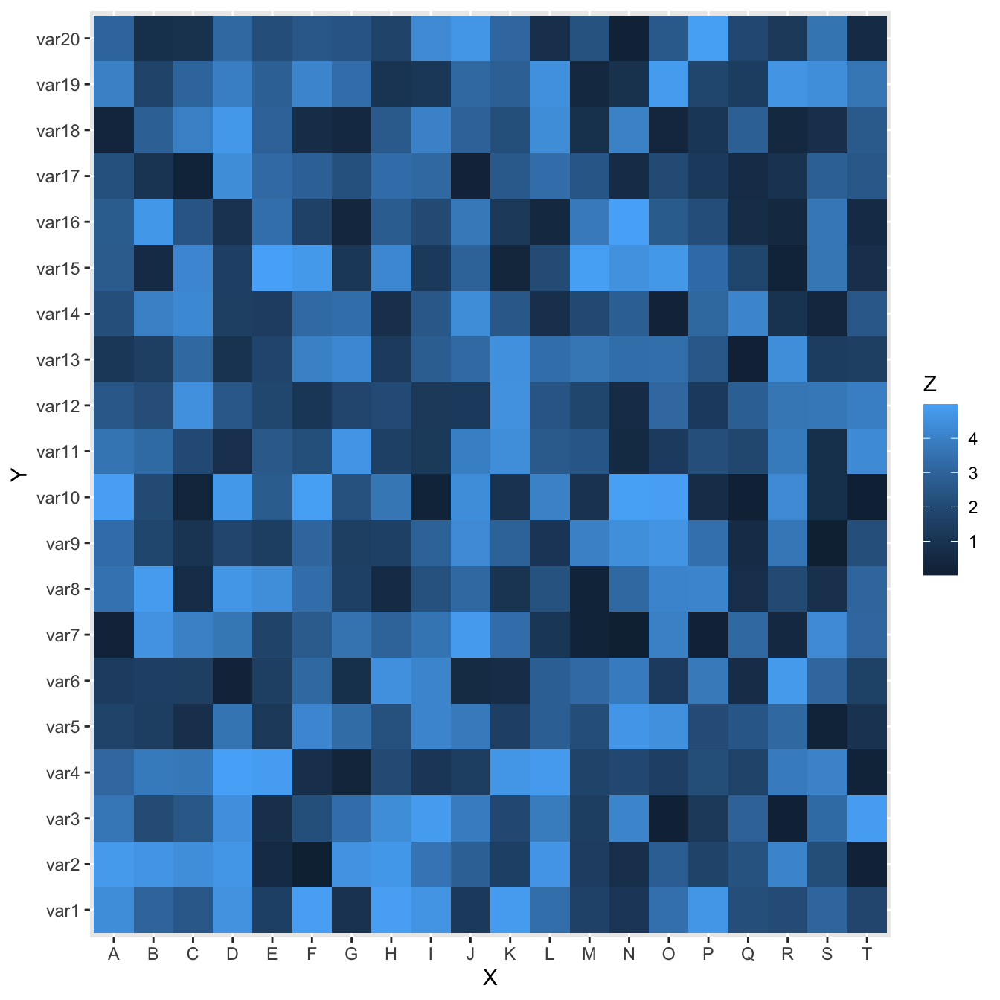

# Distribution of Speakers Time in Lord of the Rings

Lord of the Rings is a fantasy novel trilogy written by J.R.R. Tolkien. Until today, it is one of the most popular and influential works of fantasy literature, and has been adapted into several films, video games, and other media. The story follows a group of characters as they embark on a quest to destroy a powerful ring that has the potential to enslave the world.

In this analysis, we will explore the distribution of speakers time in Lord of the Rings. For that, not the minutes of speaking in the movies, but the number of words spoken by each character in the three books will be used as a proxy for the time spent speaking (with some tweaking to include movie-only characters). This is due to practical reasons (data availability), as well as the fact that the movies are an adaption of the three books, making the novels the source material. We will analyze the amount of time each character spends speaking in the novel, and how it is distributed among the different characters. 

This analysis will help us understand which characters have the most dialogue and how the speaking time is distributed among the characters in the story. We will also explore any patterns or trends in the distribution of speakers time, and how it may relate to the overall narrative of the novel. This also in light of the gender representation in the novel, as the movies are often criticized for their lack of diverse representation, like not passing the [Bechdel-Wallace Test](https://bechdeltest.com).

---

## Data
The data used for this analysis will consist of two datasets. 

### Words by Character
This dataset is concerned with the number of words spoken contains the number of words spoken by each character in all three volumes of Lord of the Rings. The dataset was created by counting the number of words spoken by each character in the novels, and is available in the project folder under the name `WordsByCharacter.csv`. 

The creator of this dataset is **Mukund Raghav Sharma (MokoSan)** (on GitHub). All information about it, as well as the original dataset can be found here: https://github.com/MokoSan/FSharpAdvent/blob/master/Data.

The data is organized in a tabular format, with each row representing a character and the number of words they spoke in a particular chapter of the novel. The columns include the name of the film (book), the chapter, the character's name, race and the number of words spoken by them:

|            Film            |    Chapter   | Character |  Race  | Words |
|:--------------------------:|:------------:|:---------:|:------:|:-----:|
| The Fellowship of the Ring | 01: Prologue |   Bilbo   | Hobbit |   4   |
| The Fellowship of the Ring | 01: Prologue |   Elrond  |   Elf  |   5   |
| The Fellowship of the Ring | 01: Prologue | Galadriel |   Elf  |  460  |

The columns are defined as follows:

- **Film**: The name of the individual novel (The Fellowship of the Ring, The Two Towers, The Return of the King).
- **Chapter**: The chapter of the specified novel in which the character speaks.
- **Character**: The name of the character who speaks.
- **Race**: The race (species) of the specified character.
- **Words**: The number of words spoken by the specified character in the specified chapter within the specified book.

### Character Information
The second dataset contains information about the characters in Lord of the Rings, including their name, race, gender and realm. 

The dataset is available in the project folder under the name `InformationByCharacter.csv`. The creator of this dataset is me, Emily. The data was collected and compiled by me, based on information from the novels and other sources, such as the LOTR-Wiki.

The data is organized in a tabular format, with each row representing a character:

|  Character  |  Race    |  Gender  |  Realm    |
|:-----------:|:--------:|:--------:|:---------:|
|  Aragorn    |  Men     |  Male    | Gondor    |
|  Arwen      |  Elf     |  Female  | Rivendell |
|  Bilbo      |  Hobbit  |  Male    | The Shire |

The columns are defined as follows:

- **Name**: The name of the specified character.
- **Race**: The race (species) of the specified character.
- **Gender**: The gender of the specified character.
- **Realm**: The realm (location) of which the specified character is mainly associated with.

**Disclaimer**: The data used in this analysis is not official data, but rather data that has been collected and compiled by fans of the Lord of the Rings series (and me). Therefore, there may be  inaccuracies or inconsistencies in the data, and it should be interpreted with caution. However, it is still a valuable resource for analyzing the characteristics of speakers time in the novels.

---

# Tasks

## 1. Data import
The first step in the analysis is to import the data from the two datasets into R. As the data is split into two different files, we will need to **import** both datasets and then **merge** them together based on the **character's name**. This will allow us to have all the relevant information about each character in one dataset, which will make it easier to analyze the distribution of speakers time.

Please note, that characters can appear **multiple times** in the `WordsByCharacter` dataset, as they can speak in multiple chapters across the three books. In the `InformationByCharacter` dataset, each character appears only once, as it contains general information about the characters. 

Please check:

- Has every piece of data been imported correctly? Please pay special attention to the `Realm` data, as it contains some special characters (e.g. "Lothlórien").
- Is every data record complete (no missing values)?
  - If not, can the missing values be reasonably filled in (i.e. gender = "Unknown"?).
  - The corresponding rows should **NOT** be removed.
- Are there any inconsistencies in the data (e.g. different spellings of the same character's name)?
  - In the event of a mismatch in the `Character` or `Race` column between the two datasets, the corresponding rows should be merged based on the content of dataset 1 (`WordsByCharacter`).

## 2. Data Analysis & Visualization
Once the data is imported, we can begin analyzing the distribution of speakers time.

### 2.1. Speakers Time by Volume
The first step is to calculate the total number of words spoken in each of the three books. For that, create a new table that includes:

- What is the total number of words spoken?
- Which book has the highest number of words spoken?
- Which book has the lowest number of words spoken?

Please visualize the distribution of the total number of words across the three volumes, using a donut chart similar to this:

### 2.2. Speakers Time by Character

The next step is to calculate the total number of words spoken by each character. This will allow us to analyze which characters have the most speaking time and which characters have the least speaking time. 

#### 2.2.1. Total Speaking Time by Character across all 3 books
At first, we will calculate the total number of words spoken by each character across all three books. For that create a new table that summarizes the total number of words across all volumes spoken by each character. 

Please visualize this distribution using a *pie chart*, similar to the one below. Please only show the *top 9 characters with the most speaking time*, and group all other characters into a single category called *other*. The coloring of the pie chart should be based on the `Gender` of the characters, but each character should have a different shade of the color.

For this please use the `ggplot2` package for the visualization, and the `fct_lump()` function to group the characters with the least speaking time into the "other" category.

_Make sure the percentages are included as labels, because otherwise the pie charts are practically unreadable_

#### 2.2.2. Total Speaking Time by Character for each individual book
Next we will calculate the total number of words spoken by each character for each individual book. This will allow us to analyze how the speaking time of each character is distributed across the three books, and whether there are any changes in the speaking time of characters across the different volumes.

Please visualize this distribution using a *pie chart*, similar to the one from 2.2.1. Please only show the *top 9 characters with the most speaking time*, and group all other characters into a single category called *other*. The coloring of the pie chart should be based on the `Gender` of the characters, but each character should have a different shade of the color.

For this please use the `ggplot2` package for the visualization, and the `fct_lump()` function to group the characters with the least speaking time into the "other" category.

### 2.3. Speakers Time of Frodo
Finally, we can analyze the speaking time of `Frodo`, the main character of the story.

_A quick note on this task: This task has 3 subtasks, however all plots that you are about to create should be generated as *ONE SINGLE COMPOSITE PLOT*_

#### 2.3.1. PIE CHART: Speaking Time of Frodo across all 3 books 
- Calculate the total number of words spoken by Frodo across all three books.
  - Compare his total number of words to the total number of words spoken by all characters.
  - Visualize this in a pie chart, similar to the one below:

#### 2.3.2. PIE CHART: Number of chapters in which Frodo speaks  
- Calculate the number of chapters in which Frodo speaks.
  - Compare the number of chapters in which Frodo speaks to the total number of chapters in the three books.
  - Visualize this in a pie chart, similar to the one below:

#### 2.3.2. STACKED BARPLOT: Number of chapters in which Frodo speaks 
Please create a stacked barplot that shows the percentage of Frodo's words per chapter (on the x-axis).

 

### 2.4. Character Connections (Optional)
For last, we want to analyze the relationships between characters based on their co-occurrence in chapters. 

1) Create a co-appearance dataframe by:
- For each chapter, identify all unique characters who appear
- Generate all possible pairs of characters within each chapter
- Count how many chapters each character pair appears together in

The result should be a dataframe with columns `character1`, `character2`, and `count`

2) Create the heatmap using ggplot2: 
- You can use the `geom_tile()` function from the `ggplot2` package
- Only map pairs with a count > 5 to the heatmap, to avoid overcrowding the graph

The graph should look somewhat close to this:

