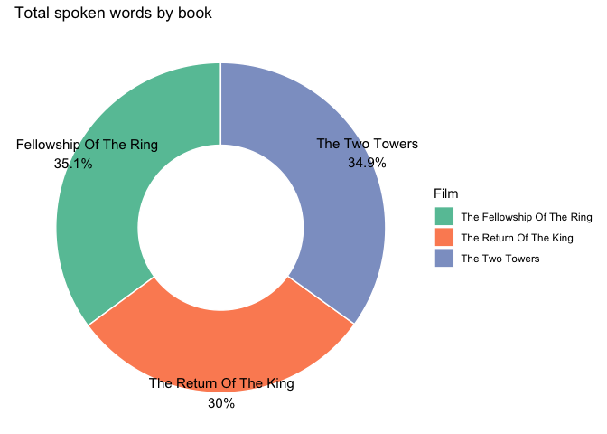
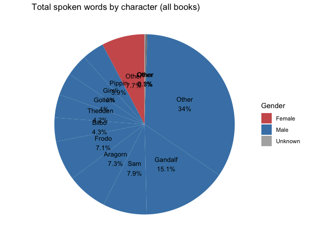
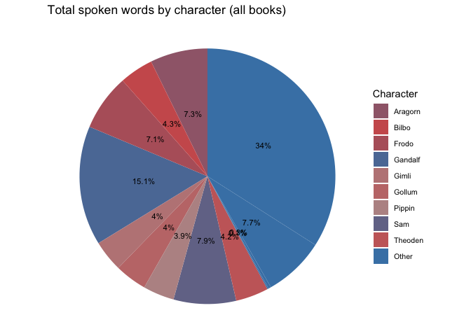
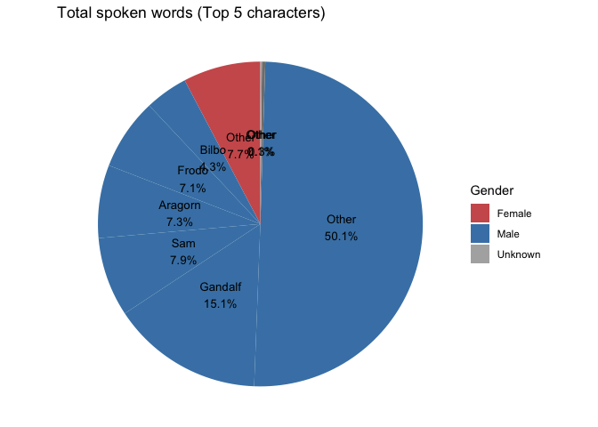
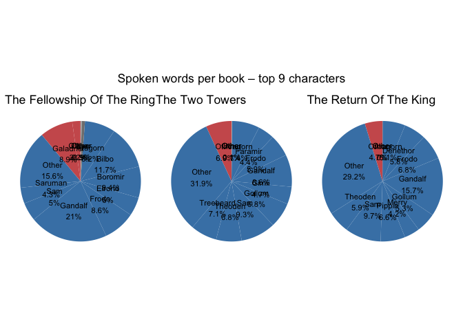
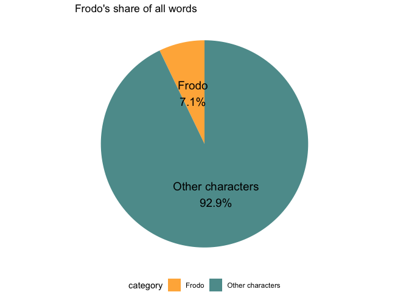
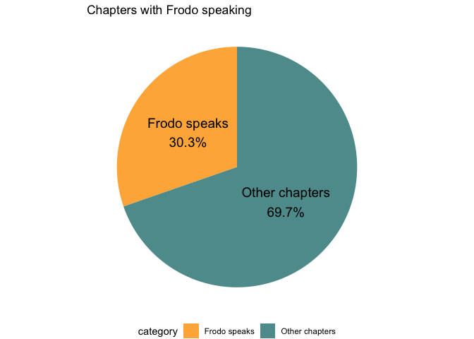
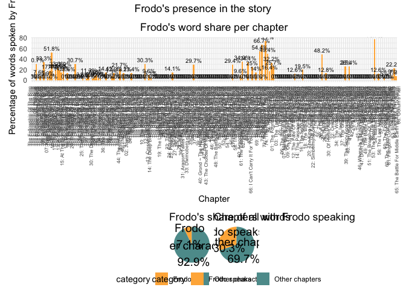
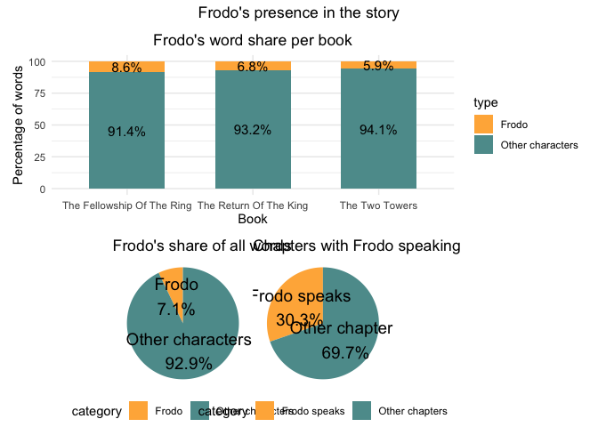
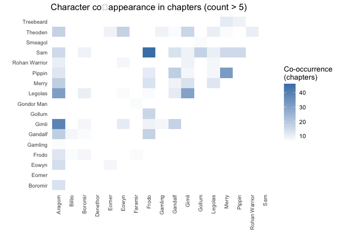

    library(dplyr)

    ## Warning: package 'dplyr' was built under R version 4.4.3

    ## 
    ## Attaching package: 'dplyr'

    ## The following objects are masked from 'package:stats':
    ## 
    ##     filter, lag

    ## The following objects are masked from 'package:base':
    ## 
    ##     intersect, setdiff, setequal, union

    library(tidyr)

    ## Warning: package 'tidyr' was built under R version 4.4.3

    library(stringr)
    library(readr)  

    ## Warning: package 'readr' was built under R version 4.4.3

    library(purrr)

    ## Warning: package 'purrr' was built under R version 4.4.3

    library(tidyverse)

    ## Warning: package 'ggplot2' was built under R version 4.4.3

    ## Warning: package 'tibble' was built under R version 4.4.3

    ## Warning: package 'forcats' was built under R version 4.4.1

    ## Warning: package 'lubridate' was built under R version 4.4.3

    ## ── Attaching core tidyverse packages ──────────────────────── tidyverse 2.0.0 ──
    ## ✔ forcats   1.0.1     ✔ lubridate 1.9.5
    ## ✔ ggplot2   4.0.2     ✔ tibble    3.3.1

    ## ── Conflicts ────────────────────────────────────────── tidyverse_conflicts() ──
    ## ✖ dplyr::filter() masks stats::filter()
    ## ✖ dplyr::lag()    masks stats::lag()
    ## ℹ Use the conflicted package (<http://conflicted.r-lib.org/>) to force all conflicts to become errors

    # 1. Data Import and Cleaning

    # Import datasets
    words <- read_csv("LOTR/WordsByCharacter.csv")

    ## Rows: 731 Columns: 5
    ## ── Column specification ────────────────────────────────────────────────────────
    ## Delimiter: ","
    ## chr (4): Film, Chapter, Character, Race
    ## dbl (1): Words
    ## 
    ## ℹ Use `spec()` to retrieve the full column specification for this data.
    ## ℹ Specify the column types or set `show_col_types = FALSE` to quiet this message.

    info  <- read_csv("LOTR/InformationByCharacter.csv", 
                      locale = locale(encoding = "UTF-8"))

    ## Rows: 74 Columns: 4
    ## ── Column specification ────────────────────────────────────────────────────────
    ## Delimiter: ","
    ## chr (4): Character, Race, Gender, Realm
    ## 
    ## ℹ Use `spec()` to retrieve the full column specification for this data.
    ## ℹ Specify the column types or set `show_col_types = FALSE` to quiet this message.

    # Quick checks
    glimpse(words)

    ## Rows: 731
    ## Columns: 5
    ## $ Film      <chr> "The Fellowship Of The Ring", "The Fellowship Of The Ring", …
    ## $ Chapter   <chr> "01: Prologue", "01: Prologue", "01: Prologue", "01: Prologu…
    ## $ Character <chr> "Bilbo", "Elrond", "Galadriel", "Gollum", "Bilbo", "Bilbo", …
    ## $ Race      <chr> "Hobbit", "Elf", "Elf", "Gollum", "Hobbit", "Hobbit", "Hobbi…
    ## $ Words     <dbl> 4, 5, 460, 20, 214, 70, 128, 197, 10, 12, 339, 64, 8, 326, 3…

    glimpse(info)

    ## Rows: 74
    ## Columns: 4
    ## $ Character <chr> "Aragorn", "Arwen", "Bilbo", "Boromir", "Bosun", "Celeborn",…
    ## $ Race      <chr> "Men", "Elf", "Hobbit", "Men", "Men", "Elf", "Men", "Men", "…
    ## $ Gender    <chr> "Male", "Female", "Male", "Male", "Male", "Male", "Mixed", "…
    ## $ Realm     <chr> "Gondor", "Rivendell", "The Shire", "Gondor", "Gondor", "Lot…

    # Check special characters (sollte "Lothlórien" korrekt anzeigen)
    unique(info$Realm)

    ##  [1] "Gondor"                "Rivendell"             "The Shire"            
    ##  [4] "Lothl\x97rien"         NA                      "Ithilien"             
    ##  [7] "Vales of Anduin"       "Rohan"                 "Valinor"              
    ## [10] "Lonely Mountain"       "Misty Mountains"       "Mordor"               
    ## [13] "Bree"                  "The Paths of the Dead" "Mirkwood"             
    ## [16] "Isengard"              "Fangorn"               "Dunland"

    # zeigt Lothlórien nicht korrekt an.

    # Check missing values
    colSums(is.na(words)) # no missing values 

    ##      Film   Chapter Character      Race     Words 
    ##         0         0         0         0         0

    colSums(is.na(info)) # in "Realm" are 2 missing values. 

    ## Character      Race    Gender     Realm 
    ##         0         0         2         2

    # Fill missing genders with "Unknown"
    info$Gender[is.na(info$Gender)] <- "Unknown"

    # Now I check, if the character names in both datasets match,
    # to ensure we can merge them later if needed.
    # Extract unique character names from both datasets
    words_names <- unique(words$Character)
    info_names  <- unique(info$Character)

    # See which names are in words but not in info
    setdiff(words_names, info_names) # in words is "Boson", which is not in info. 

    ## [1] "Boson"

    # See which are in info but not in words
    setdiff(info_names, words_names) # In info is "Bosun", which is not in words...

    ## [1] "Bosun"

    # Korrektur: "Bosun" in info is changed to "Boson" (like in words)
    info$Character[info$Character == "Bosun"] <- "Boson"

    # Check again
    setdiff(unique(words$Character), unique(info$Character))

    ## character(0)

    # Now there is no mismatch!

    # Now merge Datasets
    lotr_full <- words %>%
      left_join(info, by = c("Character" = "Character"))

    # Check which characters have missing info after merge
    missing_info <- lotr_full %>%
      filter(is.na(Gender)) %>%
      pull(Character) %>%
      unique()
    print(missing_info) # -> No char with missing info.

    ## character(0)

    # create new race variabel "Race_Final" with race from info if available, otherwise from words.
    names(lotr_full)

    ## [1] "Film"      "Chapter"   "Character" "Race.x"    "Words"     "Race.y"   
    ## [7] "Gender"    "Realm"

     # Merge Datasets
    lotr_full <- words %>%
      left_join(info, by = c("Character" = "Character"))

    # Rename race columns for clarity
    lotr_full <- lotr_full %>%
      rename(Race_from_words = Race.x,
             Race_from_info = Race.y) %>%
      mutate(Race_final = if_else(is.na(Race_from_info), Race_from_words, Race_from_info))

    glimpse(lotr_full) # now it will work

    ## Rows: 731
    ## Columns: 9
    ## $ Film            <chr> "The Fellowship Of The Ring", "The Fellowship Of The R…
    ## $ Chapter         <chr> "01: Prologue", "01: Prologue", "01: Prologue", "01: P…
    ## $ Character       <chr> "Bilbo", "Elrond", "Galadriel", "Gollum", "Bilbo", "Bi…
    ## $ Race_from_words <chr> "Hobbit", "Elf", "Elf", "Gollum", "Hobbit", "Hobbit", …
    ## $ Words           <dbl> 4, 5, 460, 20, 214, 70, 128, 197, 10, 12, 339, 64, 8, …
    ## $ Race_from_info  <chr> "Hobbit", "Elf", "Elf", "Hobbit", "Hobbit", "Hobbit", …
    ## $ Gender          <chr> "Male", "Male", "Female", "Male", "Male", "Male", "Mal…
    ## $ Realm           <chr> "The Shire", "Rivendell", "Lothl\x97rien", "Misty Moun…
    ## $ Race_final      <chr> "Hobbit", "Elf", "Elf", "Hobbit", "Hobbit", "Hobbit", …

    n_distinct(lotr_full$Character) # still 74 characters. 

    ## [1] 74

    # Speaker Time Analysis

    library(dplyr)
    library(tidyr)
    library(stringr)
    library(ggplot2)
    library(forcats)   
    library(scales)    

    ## Warning: package 'scales' was built under R version 4.4.1

    ## 
    ## Attaching package: 'scales'
    ## 
    ## The following object is masked from 'package:purrr':
    ## 
    ##     discard
    ## 
    ## The following object is masked from 'package:readr':
    ## 
    ##     col_factor

    # 2.1 Speaker time by volume (book)

    # Calculate total words per book
    words_by_book <- lotr_full %>%
      group_by(Film) %>%
      summarise(total_words = sum(Words, na.rm = TRUE)) %>%
      ungroup()
    print(words_by_book)

    ## # A tibble: 3 × 2
    ##   Film                       total_words
    ##   <chr>                            <dbl>
    ## 1 The Fellowship Of The Ring       11225
    ## 2 The Return Of The King            9575
    ## 3 The Two Towers                   11169

    # Which book has highest / lowest total words?
    cat("Total words per book:\n")

    ## Total words per book:

    print(words_by_book)

    ## # A tibble: 3 × 2
    ##   Film                       total_words
    ##   <chr>                            <dbl>
    ## 1 The Fellowship Of The Ring       11225
    ## 2 The Return Of The King            9575
    ## 3 The Two Towers                   11169

    cat("\nHighest:", words_by_book$Film[which.max(words_by_book$total_words)], "\n")

    ## 
    ## Highest: The Fellowship Of The Ring

    cat("Lowest:", words_by_book$Film[which.min(words_by_book$total_words)], "\n")

    ## Lowest: The Return Of The King

    # Donut chart of total words across books
    # Prepare data for donut: we need a dummy "total" to create the hole
    donut_data <- words_by_book %>%
      mutate(share = total_words / sum(total_words),
             label = paste0(Film, "\n", round(share*100, 1), "%"))

    p_donut <- ggplot(donut_data, aes(x = 2, y = share, fill = Film)) +
      geom_bar(stat = "identity", width = 1, color = "white") +
      coord_polar(theta = "y", start = 0) +
      xlim(0.5, 2.5) +   # creates the hole (donut effect)
      geom_text(aes(x = 2.5, label = label), position = position_stack(vjust = 0.5), size = 4) +
      theme_void() +
      labs(title = "Total spoken words by book") +
      scale_fill_brewer(palette = "Set2") +
      theme(legend.position = "right")

    print(p_donut)

    # 2.2. Speaker time by character

    # 2.2.1 Total across all three books and visualization
    # Sum words per character (across all books)
    char_total <- lotr_full %>%
      group_by(Character, Gender) %>%
      summarise(total_words = sum(Words, na.rm = TRUE), .groups = "drop") %>%
      arrange(desc(total_words))

    # Create "other" category for characters not in top 9
    char_total <- char_total %>%
      mutate(Character_lumped = fct_lump(Character, n = 9, w = total_words, other_level = "Other"))

    # Aggregate the "Other" group
    char_total_agg <- char_total %>%
      group_by(Character_lumped, Gender) %>%
      summarise(total_words = sum(total_words), .groups = "drop") %>%
      arrange(desc(total_words))

    # Assign a base color per gender
    gender_base <- c("Male" = "#2E86AB", "Female" = "#D64933", "Unknown" = "#A0A0A0")

    # For each character, create a slightly modified shade (by adjusting brightness)
    library(scales)

    p_pie_total <- ggplot(char_total_agg, aes(x = "", y = total_words, fill = Gender)) +
      geom_bar(stat = "identity", width = 1) +
      coord_polar(theta = "y") +
      geom_text(aes(label = paste0(Character_lumped, "\n", round(total_words/sum(total_words)*100, 1), "%")),
                position = position_stack(vjust = 0.5), size = 3.5) +
      scale_fill_manual(values = c("Male" = "#4682B4", "Female" = "#CD5C5C", "Unknown" = "#B0B0B0")) +
      theme_void() +
      labs(title = "Total spoken words by character (all books)") +
      theme(legend.position = "right")

    print(p_pie_total) # -> does not look so good. 

    # different method:

    # Pie chart ohne Charakternamen im Chart
    p_pie_legend <- ggplot(char_total_agg, aes(x = "", y = total_words, fill = Character_lumped)) +
      geom_bar(stat = "identity", width = 1) +
      coord_polar(theta = "y") +
      geom_text(aes(label = paste0(round(total_words/sum(total_words)*100, 1), "%")),
                position = position_stack(vjust = 0.5), size = 3) +
      scale_fill_manual(name = "Character", 
                        values = setNames(colorRampPalette(c("#4682B4", "#CD5C5C", "#B0B0B0"))(nrow(char_total_agg)),
                                          char_total_agg$Character_lumped)) +
      theme_void() +
      labs(title = "Total spoken words by character (all books)") +
      theme(legend.position = "right",
            legend.text = element_text(size = 8))

    print(p_pie_legend) # looks better but one pair of numbers is still overlapping. 

    # Just 5 + Other (not Top 9)
    char_total_agg_5 <- char_total %>%
      mutate(Character_lumped = fct_lump(Character, n = 5, w = total_words, other_level = "Other")) %>%
      group_by(Character_lumped, Gender) %>%
      summarise(total_words = sum(total_words), .groups = "drop") %>%
      arrange(desc(total_words))

    p_pie_5 <- ggplot(char_total_agg_5, aes(x = "", y = total_words, fill = Gender)) +
      geom_bar(stat = "identity", width = 1) +
      coord_polar(theta = "y") +
      geom_text(aes(label = paste0(Character_lumped, "\n", 
                                   round(total_words/sum(total_words)*100, 1), "%")),
                position = position_stack(vjust = 0.5), size = 3.5) +
      scale_fill_manual(values = c("Male" = "#4682B4", "Female" = "#CD5C5C", "Unknown" = "#B0B0B0")) +
      theme_void() +
      labs(title = "Total spoken words (Top 5 characters)") +
      theme(legend.position = "right")

    print(p_pie_5) # looks better but still not ideal.

    # 2.2.2 Total speaking time by character for each individual book
    # Create a list of three pie charts (one per book)
    books <- unique(lotr_full$Film)

    pie_list <- list()
    for (b in books) {
    # Subset data for the book
      book_data <- lotr_full %>% filter(Film == b)
      
    # Sum per character in this book
      char_book <- book_data %>%
        group_by(Character, Gender) %>%
        summarise(total_words = sum(Words, na.rm = TRUE), .groups = "drop") %>%
        arrange(desc(total_words)) %>%
        mutate(Character_lumped = fct_lump(Character, n = 9, w = total_words, other_level = "Other"))
      
      char_book_agg <- char_book %>%
        group_by(Character_lumped, Gender) %>%
        summarise(total_words = sum(total_words), .groups = "drop")
      
      # Pie chart
      p <- ggplot(char_book_agg, aes(x = "", y = total_words, fill = Gender)) +
        geom_bar(stat = "identity", width = 1) +
        coord_polar(theta = "y") +
        geom_text(aes(label = paste0(Character_lumped, "\n", round(total_words/sum(total_words)*100, 1), "%")),
                  position = position_stack(vjust = 0.5), size = 3) +
        scale_fill_manual(values = c("Male" = "#4682B4", "Female" = "#CD5C5C", "Unknown" = "#B0B0B0")) +
        theme_void() +
        labs(title = b) +
        theme(legend.position = "none")  # legend would clutter, we show per plot
      
      pie_list[[b]] <- p
    }

    # Arrange the three pie charts side by side
    library(patchwork)

    ## Warning: package 'patchwork' was built under R version 4.4.1

    combined_pies <- wrap_plots(pie_list, ncol = 3) +
      plot_annotation(title = "Spoken words per book – top 9 characters",
                      theme = theme(plot.title = element_text(hjust = 0.5)))
    print(combined_pies)

    # 2.3. Speaker time of Frodo

    # 2.3.1 Frodo's words compared to all others
    total_all <- sum(lotr_full$Words, na.rm = TRUE)
    frodo_words <- lotr_full %>% filter(Character == "Frodo") %>% pull(Words) %>% sum(na.rm = TRUE)
    other_words <- total_all - frodo_words

    frodo_pie <- data.frame(
      category = c("Frodo", "Other characters"),
      words = c(frodo_words, other_words)
    ) %>%
      mutate(percent = words / sum(words) * 100,
             label = paste0(category, "\n", round(percent, 1), "%"))

    print(frodo_pie) # Frodo speaks 2281 words. Other characters speak 29688 words. 

    ##           category words   percent                   label
    ## 1            Frodo  2281  7.135037             Frodo\n7.1%
    ## 2 Other characters 29688 92.864963 Other characters\n92.9%

    p_frodo_words <- ggplot(frodo_pie, aes(x = "", y = words, fill = category)) +
      geom_bar(stat = "identity", width = 1) +
      coord_polar(theta = "y") +
      geom_text(aes(label = label), position = position_stack(vjust = 0.5), size = 5) +
      scale_fill_manual(values = c("Frodo" = "#FFB347", "Other characters" = "#5D9B9B")) +
      theme_void() +
      labs(title = "Frodo's share of all words") +
      theme(legend.position = "bottom")

    print(p_frodo_words) # Pie in relative numbers. Frodo speaks 7.1% of all words.

    # 2.3.2 Pie chart: Number of chapters in which Frodo speaks
    total_chapters <- lotr_full %>%
      distinct(Film, Chapter) %>%
      nrow()

    frodo_chapters <- lotr_full %>%
      filter(Character == "Frodo") %>%
      distinct(Film, Chapter) %>%
      nrow()

    chapter_pie <- data.frame(
      category = c("Frodo speaks", "Other chapters"),
      count = c(frodo_chapters, total_chapters - frodo_chapters)
    ) %>%
      mutate(percent = count / sum(count) * 100,
             label = paste0(category, "\n", round(percent, 1), "%"))

    print(chapter_pie) # Frodo speaks in 57 chapters and speaks not in 131 chapters

    ##         category count  percent                 label
    ## 1   Frodo speaks    57 30.31915   Frodo speaks\n30.3%
    ## 2 Other chapters   131 69.68085 Other chapters\n69.7%

    # So Frodo speaks in 30,3% of all chapters and speaks not in 69,7% of all chapters . 

    p_frodo_chapters <- ggplot(chapter_pie, aes(x = "", y = count, fill = category)) +
      geom_bar(stat = "identity", width = 1) +
      coord_polar(theta = "y") +
      geom_text(aes(label = label), position = position_stack(vjust = 0.5), size = 5) +
      scale_fill_manual(values = c("Frodo speaks" = "#FFB347", "Other chapters" = "#5D9B9B")) +
      theme_void() +
      labs(title = "Chapters with Frodo speaking") +
      theme(legend.position = "bottom")

    print(p_frodo_chapters)

    # 2.3.3 (its 2.3.2 in the task?) Stacked barplot: Percentage of Frodo's words per chapter
    # For each chapter, compute total words and Frodo's words
    chapter_frodo <- lotr_full %>%
      group_by(Film, Chapter) %>%
      summarise(total_chapter = sum(Words, na.rm = TRUE),
                frodo_chapter = sum(Words[Character == "Frodo"], na.rm = TRUE), .groups = "drop") %>%
      mutate(percent_frodo = frodo_chapter / total_chapter * 100,
             chapter_label = paste0(Film, "\n", Chapter))

    print(chapter_frodo) 

    ## # A tibble: 188 × 6
    ##    Film          Chapter total_chapter frodo_chapter percent_frodo chapter_label
    ##    <chr>         <chr>           <dbl>         <dbl>         <dbl> <chr>        
    ##  1 The Fellowsh… 01: Pr…           489             0          0    "The Fellows…
    ##  2 The Fellowsh… 02: Co…           214             0          0    "The Fellows…
    ##  3 The Fellowsh… 03: Th…           417           128         30.7  "The Fellows…
    ##  4 The Fellowsh… 04: Ve…           411             0          0    "The Fellows…
    ##  5 The Fellowsh… 05: A …           423            32          7.57 "The Fellows…
    ##  6 The Fellowsh… 06: Fa…           330             0          0    "The Fellows…
    ##  7 The Fellowsh… 07: Ke…            99            33         33.3  "The Fellows…
    ##  8 The Fellowsh… 08: Th…           124             0          0    "The Fellows…
    ##  9 The Fellowsh… 09: At…           290            17          5.86 "The Fellows…
    ## 10 The Fellowsh… 10: Th…           797           139         17.4  "The Fellows…
    ## # ℹ 178 more rows

    # IN which chapters speaks frodo the most?
    chapter_frodo %>%
      arrange(desc(percent_frodo)) %>%
      head(10) %>%
      select(Film, Chapter, percent_frodo) # -> IN Chapter "Osgiliath" in "The Two Towers" 

    ## # A tibble: 10 × 3
    ##    Film                       Chapter                              percent_frodo
    ##    <chr>                      <chr>                                        <dbl>
    ##  1 The Two Towers             55: Osgiliath                                 76.7
    ##  2 The Return Of The King     75: Homeward Bound                            73.7
    ##  3 The Return Of The King     73: The Fellowship Reunited                   66.7
    ##  4 The Return Of The King     72: The End Of All Things                     54.4
    ##  5 The Fellowship Of The Ring 11: The Passing Of The Elves                  51.8
    ##  6 The Return Of The King     76: The Grey Havens                           49.4
    ##  7 The Two Towers             28: The Forests Of Ithilien                   48.2
    ##  8 The Return Of The King     63: The Land Of Shadow                        34.9
    ##  9 The Return Of The King     66: I Can't Carry It For You… But I…          34.1
    ## 10 The Fellowship Of The Ring 07: Keep It Secret Keep It Safe               33.3

    # Frodo speaks 76.7% of the words which is the most in all chapters.  

    # Create a factor for ordering (by book and chapter number)
    # Extract chapter number from Chapter column (e.g., "01: Prologue" -> numeric)
    chapter_frodo <- chapter_frodo %>%
      mutate(chapter_num = as.numeric(str_extract(Chapter, "^[0-9]+"))) %>%
      arrange(Film, chapter_num) %>%
      mutate(chapter_label = factor(chapter_label, levels = unique(chapter_label)))

    p_stacked <- ggplot(chapter_frodo, aes(x = chapter_label, y = percent_frodo, fill = "Frodo")) +
      geom_bar(stat = "identity", width = 0.8, fill = "#FFB347") +
      geom_text(aes(label = paste0(round(percent_frodo, 1), "%")), vjust = -0.5, size = 2.5) +
      labs(x = "Chapter", y = "Percentage of words spoken by Frodo",
           title = "Frodo's word share per chapter") +
      theme_minimal() +
      theme(axis.text.x = element_text(angle = 90, hjust = 1, vjust = 0.5, size = 6),
            plot.title = element_text(hjust = 0.5))

    # Combine the three plots into one composite plot
    # Layout: two pie charts on bottom row (left and right) and barplot on top row (full width)
    library(patchwork)
    composite_plot <- (p_stacked) /
      (p_frodo_words + p_frodo_chapters) +
      plot_annotation(title = "Frodo's presence in the story",
                      theme = theme(plot.title = element_text(hjust = 0.5)))

    print(composite_plot) # Total mess because of the many chapters. 

    # Try to do it with the 3 books instead of all the chapters: 

    book_frodo <- lotr_full %>%
      group_by(Film) %>%
      summarise(total_book = sum(Words, na.rm = TRUE),
                frodo_book = sum(Words[Character == "Frodo"], na.rm = TRUE), .groups = "drop") %>%
      mutate(percent_frodo = frodo_book / total_book * 100,
             percent_other = 100 - percent_frodo)

    # Prepare data for stacked barplot (two rows per book: Frodo and Other)
    book_stack <- book_frodo %>%
      select(Film, percent_frodo, percent_other) %>%
      pivot_longer(cols = c(percent_frodo, percent_other),
                   names_to = "type",
                   values_to = "percentage") %>%
      mutate(type = if_else(type == "percent_frodo", "Frodo", "Other characters"))

    # Create stacked barplot
    p_stacked <- ggplot(book_stack, aes(x = Film, y = percentage, fill = type)) +
      geom_bar(stat = "identity", position = "stack", width = 0.6) +
      geom_text(aes(label = paste0(round(percentage, 1), "%")),
                position = position_stack(vjust = 0.5), size = 4) +
      scale_fill_manual(values = c("Frodo" = "#FFB347", "Other characters" = "#5D9B9B")) +
      labs(x = "Book", y = "Percentage of words",
           title = "Frodo's word share per book") +
      theme_minimal() +
      theme(plot.title = element_text(hjust = 0.5))

    # The composite plot now uses this new p_stacked
    composite_plot <- (p_stacked) /
      (p_frodo_words + p_frodo_chapters) +
      plot_annotation(title = "Frodo's presence in the story",
                      theme = theme(plot.title = element_text(hjust = 0.5)))

    print(composite_plot) # Looks good now!

    # 2.4: Optional: Character connections (co-occurrence heatmap)

    # For each chapter, get all characters that appear
    # Then generate all pairs of characters within that chapter and count co-occurrences

    # First we need the list of unique chapters with their characters
    chapter_characters <- lotr_full %>%
      select(Film, Chapter, Character) %>%
      distinct()  # each character once per chapter
    print(chapter_characters) # ok looks good.

    ## # A tibble: 731 × 3
    ##    Film                       Chapter                Character  
    ##    <chr>                      <chr>                  <chr>      
    ##  1 The Fellowship Of The Ring 01: Prologue           Bilbo      
    ##  2 The Fellowship Of The Ring 01: Prologue           Elrond     
    ##  3 The Fellowship Of The Ring 01: Prologue           Galadriel  
    ##  4 The Fellowship Of The Ring 01: Prologue           Gollum     
    ##  5 The Fellowship Of The Ring 02: Concerning Hobbits Bilbo      
    ##  6 The Fellowship Of The Ring 03: The Shire          Bilbo      
    ##  7 The Fellowship Of The Ring 03: The Shire          Frodo      
    ##  8 The Fellowship Of The Ring 03: The Shire          Gandalf    
    ##  9 The Fellowship Of The Ring 03: The Shire          Hobbit Kids
    ## 10 The Fellowship Of The Ring 03: The Shire          Hobbits    
    ## # ℹ 721 more rows

    # Function to generate all pairs from a vector of characters
    generate_pairs <- function(chars) {
      if (length(chars) < 2) return(NULL)
      combn(chars, 2, simplify = FALSE)
    }

    print(generate_pairs(c("Frodo", "Sam", "Gandalf"))) # test the function, looks good.

    ## [[1]]
    ## [1] "Frodo" "Sam"  
    ## 
    ## [[2]]
    ## [1] "Frodo"   "Gandalf"
    ## 
    ## [[3]]
    ## [1] "Sam"     "Gandalf"

    # Generate pairs per chapter
    pairs_list <- chapter_characters %>%
      group_by(Film, Chapter) %>%
      summarise(chars = list(Character), .groups = "drop") %>%
      mutate(pairs = map(chars, generate_pairs)) %>%
      unnest(pairs, keep_empty = FALSE) %>%
      mutate(Character1 = map_chr(pairs, 1),
             Character2 = map_chr(pairs, 2)) %>%
      select(Film, Chapter, Character1, Character2)

    print(pairs_list) # looks good, we have pairs of characters per chapter.

    ## # A tibble: 1,501 × 4
    ##    Film                       Chapter       Character1 Character2 
    ##    <chr>                      <chr>         <chr>      <chr>      
    ##  1 The Fellowship Of The Ring 01: Prologue  Bilbo      Elrond     
    ##  2 The Fellowship Of The Ring 01: Prologue  Bilbo      Galadriel  
    ##  3 The Fellowship Of The Ring 01: Prologue  Bilbo      Gollum     
    ##  4 The Fellowship Of The Ring 01: Prologue  Elrond     Galadriel  
    ##  5 The Fellowship Of The Ring 01: Prologue  Elrond     Gollum     
    ##  6 The Fellowship Of The Ring 01: Prologue  Galadriel  Gollum     
    ##  7 The Fellowship Of The Ring 03: The Shire Bilbo      Frodo      
    ##  8 The Fellowship Of The Ring 03: The Shire Bilbo      Gandalf    
    ##  9 The Fellowship Of The Ring 03: The Shire Bilbo      Hobbit Kids
    ## 10 The Fellowship Of The Ring 03: The Shire Bilbo      Hobbits    
    ## # ℹ 1,491 more rows

    # Count co-occurrences across all chapters
    co_occurrence <- pairs_list %>%
      group_by(Character1, Character2) %>%
      summarise(count = n(), .groups = "drop") %>%
      filter(count > 5) %>%   # only keep pairs appearing in >5 chapters to reduce clutter
      mutate(Character1 = factor(Character1),
             Character2 = factor(Character2))

    print(co_occurrence) # looks good!!

    ## # A tibble: 73 × 3
    ##    Character1 Character2 count
    ##    <fct>      <fct>      <int>
    ##  1 Aragorn    Boromir       13
    ##  2 Aragorn    Eomer          6
    ##  3 Aragorn    Eowyn         14
    ##  4 Aragorn    Frodo         12
    ##  5 Aragorn    Gamling        7
    ##  6 Aragorn    Gandalf       18
    ##  7 Aragorn    Gimli         39
    ##  8 Aragorn    Legolas       31
    ##  9 Aragorn    Merry         18
    ## 10 Aragorn    Pippin        12
    ## # ℹ 63 more rows

    # Arargon and Boromir appear in 13 chapters together, Arargon and Eomer in 6 etc. 

    # Create heatmap
    if (nrow(co_occurrence) > 0) {
      p_heatmap <- ggplot(co_occurrence, aes(x = Character1, y = Character2, fill = count)) +
        geom_tile() +
        scale_fill_gradient(low = "white", high = "steelblue", name = "Co-occurrence\n(chapters)") +
        theme_minimal() +
        theme(axis.text.x = element_text(angle = 90, hjust = 1, vjust = 0.5, size = 8),
              axis.text.y = element_text(size = 8),
              panel.grid = element_blank()) +
        labs(x = "", y = "", title = "Character co‑appearance in chapters (count > 5)")
      print(p_heatmap)
    } else {
      cat("No character pairs with co‑occurrence > 5. Try lowering threshold or check data.\n")
    }

    # Frodo and Sam apear in the most chapters togheter. Then comes Arargon and Gimli.

    # In how many chapters Frodo and Sam appear together?
    frodo_sam_chapters <- pairs_list %>%
      filter((Character1 == "Frodo" & Character2 == "Sam") | (Character1 == "Sam" & Character2 == "Frodo")) %>%
      nrow()
    cat("Frodo and Sam appear together in", frodo_sam_chapters, "chapters.\n")

    ## Frodo and Sam appear together in 46 chapters.

    # In 46 chapters!

    # In how many chapters does Frodo appear without Sam?
    frodo_without_sam_chapters <- chapter_characters %>%
      filter(Character == "Frodo") %>%
      anti_join(chapter_characters %>% filter(Character == "Sam"), by = c("Film", "Chapter")) %>%
      nrow()
    cat("Frodo appears without Sam in", frodo_without_sam_chapters, "chapters.\n")

    ## Frodo appears without Sam in 11 chapters.

    # In just 11 chapters Frodo appears without Sam.

    # In how many chapters does Arargon and Gimli appear together?
    aragorn_gimli_chapters <- pairs_list %>%
      filter((Character1 == "Aragorn" & Character2 == "Gimli") | (Character1 == "Gimli" & Character2 == "Aragorn")) %>%
      nrow()
    cat("Aragorn and Gimli appear together in", aragorn_gimli_chapters, "chapters.\n")

    ## Aragorn and Gimli appear together in 39 chapters.

    # In  39 chapters Aragorn and Gimli appear together.

    #In how many chapters does Aragon appear without Gimli?
    aragorn_without_gimli_chapters <- chapter_characters %>%
      filter(Character == "Aragorn") %>%
      anti_join(chapter_characters %>% filter(Character == "Gimli"), by = c("Film", "Chapter")) %>%
      nrow()
    cat("Aragorn appears without Gimli in", aragorn_without_gimli_chapters, "chapters.\n")

    ## Aragorn appears without Gimli in 22 chapters.

    # In 22 chapters Aragorn appears without Gimli... 
